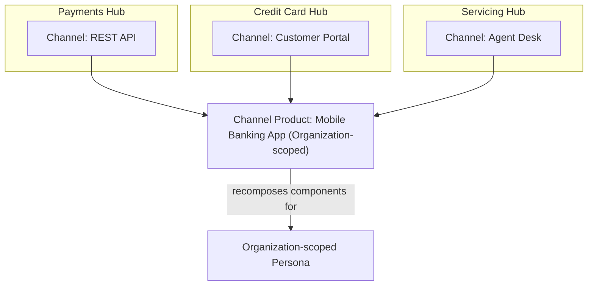

# Modeling Channels

This document covers Channels as comprehensive systems, Channel types and interaction models, Hub-level configuration, Persona and Scenario relationships, identity and access control, the critical distinction between Channel and Channel Product, anti-patterns, and heuristics. Audience: product managers, domain architects, engineers.

---

## 1. Channels as Comprehensive Systems, Not UIs

A **Channel** is not a screen or widget. It is a system embodying identity, authentication, access control, and interaction model nuances. Each Channel is a first-class architectural concern.

| Aspect | What a Channel Embodies |
|--------|-------------------------|
| **Identity** | Who is participating — human user, AI agent, or system |
| **Authentication** | How participants prove identity — SSO, API keys, SPIFFE, OAuth |
| **Access control** | What participants are authorized to do — RBAC, entity/action permissions |
| **Interaction model** | How participants engage — task-oriented, conversational, programmatic, AI-native |

A REST API is a Channel. A voice telephony integration is a Channel. An Agent Desk is a Channel. Each is a full collaboration surface with governance, not a thin UI layer.

### Channels Are Composable

A Channel is not a monolithic system. It is a collection of **composable components** that are interaction-paradigm-specific and technology-specific. The same underlying Hub capability — task presentation, notification delivery, knowledge access, entity navigation, delegation and consent — is realized through paradigm-native components:

| Capability | Web Console | MS Teams | REST API | MCP |
|------------|-------------|----------|----------|-----|
| Task presentation | Card list, forms, queues | Adaptive cards, quick actions | JSON payload, status endpoints | Tool invocation, structured results |
| Notification | In-app alert, badge | Bot message, proactive alert | Webhook callback | Context update, resource notification |
| Knowledge access | Search panel, document viewer | Bot Q&A, inline lookup | Query endpoint | RAG retrieval, prompt context |
| Delegation/consent | Dialog, approval button | Consent card | OAuth flow | Authorization grant |

Because Channels are composed from components rather than built as monoliths, they can be **recomposed**. A Hub composes these components for its domain context. A Channel Product recomposes components from multiple Hubs for the persona's organizational context. This composability is what makes Channel Products possible without rebuilding capabilities from scratch.

When modeling a Hub, treat each Channel as a distinct composition with its own security posture, protocol constraints, and participant expectations.

---

## 2. Channel Types and Interaction Models

Channels vary by interaction paradigm. The choice of Channel type affects how participants engage with Hub Scenarios.

| Channel Type | Description | Interaction Model | Banking Examples |
|--------------|-------------|-------------------|------------------|
| **Web applications (desks, consoles)** | Persona-specific, task-oriented interfaces | Structured workflows, forms, queues, dashboards | Agent Desk for dispute resolution, Supervisor Desk for queue management, Customer Portal for self-serve account management |
| **Chat and collaboration platforms (MS Teams)** | Conversational, embedded in work contexts | Natural language, quick actions, in-flow collaboration | Me_Bot for agents checking tasks between meetings, Ask_Bot for business users querying servicing |
| **Voice and telephony** | Quasi-digital, real-time, human-centric | Spoken interaction, IVR, screen-pop for reps | Contact center inbound calls, IVR for balance inquiry, agent-assisted voice for complex disputes |
| **API channels (REST)** | System-to-system, programmatic | Request-response, batch, webhooks | Partner payment submission, merchant onboarding integration, regulatory filing submission |
| **AI agent channels (MCP)** | AI-native interaction via Model Context Protocol | Tool invocation, context retrieval, real-time updates | AI assistant resolving account inquiries, co-pilot surfacing context for agents, customer's personal AI transacting on their behalf |
| **CLI** | Developer-oriented | Command-line invocation, scripting | SRE operations, developer tooling, administrative tasks |

Different personas use different Channel types. An agent may use a Web Console (Agent Desk) for deep work and MS Teams (Me_Bot) for quick checks. A customer may use a web portal for self-serve and voice for complex issues. A partner system uses REST APIs exclusively. Model each Channel type with its interaction paradigm in mind.

---

## 3. Channels Are Hub-Level

Each Hub configures which Channels are available for its Scenarios. **Channel selection is a domain modeling decision, not a platform default.**

| Hub | Typical Channels | Rationale |
|-----|------------------|-----------|
| **Payments Hub** | REST API, Agent Desk | System integration for partners and merchants; operations staff for exceptions and reconciliation |
| **Customer Servicing Hub** | Web portal, voice, chat, AI agent (MCP), REST API | Multi-channel service delivery — self-serve, assisted, agentic; partners may integrate via API |
| **Credit Card Hub** | Agent Desk, REST API, AI agent (MCP) | Operations for applications and disputes; system integration for lifecycle; AI co-pilot for agents |
| **Compliance Hub** | Supervisor Console, REST API, CLI | Supervisory monitoring; regulatory system integration; administrative operations |

A Hub does not inherit Channels from the platform. Domain experts decide which Channels make sense for the personas who interact with that Hub. A Payments Hub may never need voice — its participants are systems and operations staff. A Customer Servicing Hub almost always needs voice, chat, and web — its participants include customers in varied contexts.

---

## 4. Channel and Persona

Channels are **persona-scoped**. Different personas access the Hub through different Channels with different capabilities. Same underlying Hub capabilities, different interaction surfaces.

| Persona | Typical Channels | Capability Scope |
|---------|------------------|------------------|
| **Customer** | Web portal, mobile app, voice, chat, AI agent | Self-serve inquiries, service requests, dispute filing |
| **Agent** | Agent Desk, MS Teams, MCP | Task execution, customer interaction, knowledge access |
| **Supervisor** | Supervisor Desk, MS Teams, MCP | Queue management, escalation, team oversight |
| **Compliance Officer** | Supervisor Console, REST API | Monitoring, audit, regulatory reporting |
| **Partner System** | REST API | Programmatic integration, batch submission |

In Olympus Hub, **Persona** is a platform-level user archetype with dedicated UX applications, API channels, and notification preferences. Each Persona has a Persona-Channel matrix: which Channels are available, which applications or bots serve them, and which API paths are persona-scoped. A user assigned to the Agent Persona accesses the Agent Desk (web), Me_Bot (MS Teams), and agent-scoped MCP and REST APIs. A user assigned to the Supervisor Persona accesses the Supervisor Desk and supervisor-scoped APIs. The same underlying Hub capabilities are exposed; the Channel determines how.

---

## 5. Channel and Scenario

Collaborators participate in Scenarios (both Stream and Loop) through Channels. **A single Scenario may involve multiple Channels simultaneously** — agent on desk, customer on portal, AI agent via MCP — all in the same work, with appropriate identity and access control for each.

| Scenario | Channels Involved | Participants |
|----------|-------------------|--------------|
| Dispute resolution | Agent Desk, Voice, MCP | Agent on desk, customer on voice call, AI co-pilot via MCP providing transaction analysis |
| Credit card application | Web portal, Agent Desk, REST API | Customer on portal, agent on desk for manual review, partner system via API for income verification |
| Fraud investigation | Agent Desk, Supervisor Console, MCP | Agent on desk, supervisor monitoring via console, AI analyst via MCP |
| Regulatory filing | REST API, Supervisor Console | Partner system submitting via API, compliance officer reviewing via console |

Each participant authenticates through their Channel. Each has access control scoped to their Persona and the Scenario context. The Scenario execution model does not change — it is goal-oriented, agent-resolved — but the Channels through which agents participate vary. Model Scenarios with multi-Channel participation in mind when the work involves multiple persona types.

Teams collaborate through Channels to resolve Scenarios. Channels are the surfaces; Teams are the participants; Machines provide the tools. This triad — who participates (Teams), through what surface (Channels), using what capabilities (Machines) — is the operational foundation of every Scenario.

---

## 6. Identity, Authentication, and Access Control

Each Channel has a security posture. Human and AI participants require different identity and authorization models.

### Human IAM

| Aspect | Description |
|--------|-------------|
| **Authentication** | SSO integration (SAML/OIDC) via Cipher IAM |
| **Access control** | RBAC scoped to Workbenches; Persona determines available Channels and capabilities |
| **Delegation** | Channels can facilitate request-scoped authority delegation — user grants agent authority to act on their behalf |

Human participants authenticate once and access Hub through persona-appropriate Channels. Permissions are scoped to Workbench (Hub) and Persona.

### AI Agent IAM

| Aspect | Description |
|--------|-------------|
| **Identity** | SPIFFE-based deployment identity — proves "this request is from this specific agent deployment" |
| **Authentication** | SPIFFE SVID for infrastructure; OAuth tokens for business-layer authorization |
| **Access control** | Fine-grained entity/action permissions; Agent Persona determines scope |
| **Tool authorization** | OAuth-like consent for agent tool access — user grants authority via Channel; agent receives request-scoped token |

AI agents have two-layer identity: Deployment Identity (SPIFFE) for infrastructure authentication, and Agent Persona for business authorization. When an agent needs to act on behalf of a user, the Channel presents consent UI and captures delegation; the agent receives a Delegation Access Token bound to the request and the agent's SPIFFE ID.

### Channel-Specific Security Posture

| Channel Type | Typical Auth | Typical Access Model |
|--------------|--------------|----------------------|
| Web Console | SSO (SAML/OIDC) | RBAC, Persona-scoped |
| MS Teams | Bot Framework + SSO | Persona-scoped, delegation-capable |
| REST API | OAuth 2.0, API keys, mTLS | Persona-scoped or system-scoped |
| MCP | OAuth 2.0 via MCP Router | Persona-scoped MCP Servers |
| Voice | Telephony provider + SSO for reps | Screen-pop with authenticated agent |
| CLI | Service account, SPIFFE | Operator-scoped |

Each Channel has its own authentication flow, token lifecycle, and authorization checks. Modelers should ensure that Channel selection aligns with the security requirements of the participants and the Scenario.

---

## 7. Channel vs Channel Product (CRITICAL)

This distinction is essential for correct modeling.

### Channel (Hub-Scoped)

A **Channel** is Hub-scoped. It represents one Hub's view of collaboration for a persona. It is part of Hub modeling.

| Attribute | Channel |
|-----------|---------|
| **Scope** | Hub-scoped |
| **Represents** | One domain's view of collaboration for a persona |
| **Modeling concern** | Part of Hub modeling — which Channels does this Hub expose? |
| **Example** | Payments Hub's REST API for partners; Servicing Hub's Agent Desk for agents |

### Channel Product (Organization-Scoped)

A **Channel Product** is Organization-scoped. It composes Channels from multiple Hubs into a cohesive persona experience — navigation structure, interaction paradigm, unified flows. Channel Products are delivered through the Neutrino suite.

| Attribute | Channel Product |
|-----------|-----------------|
| **Scope** | Organization-scoped |
| **Represents** | Composite experience for a persona across multiple Hubs |
| **Modeling concern** | Neutrino concern — how do we deliver a unified experience? |
| **Example** | Customer's mobile banking app; agent's unified servicing desktop |

### Persona Scope

Both Hub Channels and Channel Products are persona-optimized. The difference is **persona scope**.

A Hub Channel serves a **domain-scoped persona** — the customer as the Hub's domain sees them. The Payments Hub sees the customer as a payer. The Credit Card Hub sees the customer as a cardholder. The Servicing Hub sees the agent as a dispute investigator. Each Hub composes Channel components to serve its persona in its domain context.

A Channel Product serves an **organization-scoped persona** — the customer as the organization sees them: a banking-relationship-holder whose needs span payments, credit, servicing, and more. The Channel Product recomposes components from multiple Hubs into an experience optimized for this broader persona.

| Persona Scope | Who Models It | Optimized For |
|---------------|---------------|---------------|
| **Domain-scoped** (Hub Channel) | Domain experts | How this persona interacts with this domain's Streams, Loops, and Scenarios |
| **Organization-scoped** (Channel Product) | Product/UX designers | How this persona experiences their full relationship with the organization |

The persona model itself may differ. A Hub defines domain-scoped personas (Payments Agent, Dispute Investigator). A Channel Product may define organizational personas (Operations Agent, Banking Customer) that don't map one-to-one to any single Hub's persona definitions. Neutrino's job includes bridging this persona scope gap.

### Recomposition

Because Channels are built from composable components (see section 1), Channel Products are not limited to aggregating Hub Channels side by side. They can **recompose** components — selecting, arranging, and combining them in ways optimized for the persona's organizational context rather than any single Hub's domain context.

A Hub Channel for the Credit Card Hub might present card controls, statements, and dispute filing in a task-oriented layout for card management. The same components — card controls, statement data, dispute initiation — appear in the customer's mobile banking Channel Product, but recomposed alongside Payments and Servicing components in a navigation and interaction structure designed for how a customer thinks about their banking relationship, not how the Credit Card Hub organizes its work.

This is not API aggregation. It is genuine recomposition for least friction and maximum delight.

### Comparison Table

| Dimension | Channel | Channel Product |
|-----------|----------|-----------------|
| **Scope** | Hub-scoped | Organization-scoped |
| **Persona scope** | Domain-scoped (customer-as-payer, agent-as-investigator) | Organization-scoped (customer-as-relationship-holder, agent-as-operations-staff) |
| **Represents** | One domain's view of collaboration | Composite experience across domains |
| **Composition** | Composed from paradigm-specific components for one domain | Recomposed from multiple Hubs' components for the persona's organizational context |
| **Modeling** | Part of Hub modeling | Neutrino concern |
| **Example** | Payments Hub REST API; Servicing Hub Agent Desk | Customer mobile app; agent unified desktop |
| **Ownership** | Domain experts model Hub Channels | Product/UX design Channel Products |

When modeling a Hub, focus on Channels — what surfaces does this domain expose for which personas, and what composable components serve them? When designing experiences that span domains, focus on Channel Products — how do we recompose those components into a cohesive experience for the organization-scoped persona?

---

## 8. Channel Anti-Patterns

### The Monolith Channel

**Problem:** One Channel serving all personas, or a Channel built as a single indivisible system.

Different personas have different interaction needs, different access control, different paradigms. A single "unified" Channel that serves customers, agents, supervisors, and partners will either be overloaded (trying to be everything) or will force inappropriate interactions (e.g., customers using an agent desk). A Channel built as a monolith — where components cannot be extracted and recomposed — also qualifies: it blocks Channel Product composition and locks capabilities into one interaction paradigm.

| Sign | What It Indicates |
|------|-------------------|
| Single web app for all users | Personas forced into one interaction model |
| Same API for humans and systems | Confusion between programmatic and interactive use |
| One RBAC policy for all | Overly broad or overly restrictive access |
| Components cannot be used outside the Channel | Monolithic build prevents recomposition into Channel Products |

**Remedy:** Model Channels per persona and per interaction paradigm. Design components for composability — a Channel Product may need to recompose them differently than the Hub does.

### The Backdoor Channel

**Problem:** Interaction surface bypassing identity and authentication.

A Channel that allows participation without proper identity, authentication, or access control is not a Channel — it is a vulnerability. Every Channel must enforce: who is participating, how they proved identity, and what they are authorized to do. "Convenience" endpoints, internal-only APIs with no auth, or unauthenticated webhooks are anti-patterns.

| Sign | What It Indicates |
|------|-------------------|
| Unauthenticated API endpoints | No identity verification |
| Shared credentials across systems | No individual accountability |
| Bypass paths "for internal use" | Erosion of access control |

**Remedy:** Every Channel has a defined authentication flow and authorization model. No exceptions.

### The Orphan Channel

**Problem:** Channel configured in a Hub but not connected to any Scenarios.

A Channel that exists but is not used by any Scenario is overhead with no value. It consumes configuration, security review, and maintenance without enabling any work. If a Channel is configured, it should be the participation surface for at least one Scenario.

| Sign | What It Indicates |
|------|-------------------|
| Channel in config, no Scenario references it | Orphan |
| "We might use it later" | Speculative overhead |
| Legacy Channel never deprecated | Accumulated technical debt |

**Remedy:** Every Channel should be traceable to at least one Scenario. If a Channel has no Scenario, remove it or connect it.

---

## 9. Channel Heuristics

| Heuristic | Application |
|-----------|-------------|
| **Start with the personas who interact with the Hub** | Each persona needs at least one Channel appropriate to their interaction paradigm. List personas first; then assign Channels. |
| **Consider interaction paradigm** | Task-oriented (desk), conversational (chat/voice), programmatic (API), AI-native (MCP). Match Channel type to how the persona works. |
| **If two personas share a Channel, verify they have the same interaction needs** | Sharing is valid when paradigms align (e.g., Agent and Supervisor both use Agent Desk for different views). If needs differ, consider separate Channels. |
| **Channel evolution is often independent of domain evolution** | Adding a new Channel type (e.g., MCP for AI agents) does not change Streams or Loops. Channels are orthogonal to work classification. |
| **Channel Product vs Channel** | When modeling a Hub, model Channels. When designing cross-Hub experiences, model Channel Products. Do not conflate. |
| **Design components for reuse** | A Channel Product may compose components differently than the Hub does. Build paradigm-specific components that can be recomposed for different persona scopes. |
| **Every Channel has a security posture** | Document authentication, authorization, and delegation model for each Channel. |

---

## What Modeling Channels Delivers

Modeling Channels as Hub-level constructs — not standalone UIs — resolves the customer experience problems that banks have tried and failed to fix through front-end redesigns:

**Customer experience becomes fixable.** Channels read from Scenario state in the model, not from independent backends. The customer sees one reality because there is one model, not because plumbing synchronized multiple systems. Channel fragmentation was structural — each channel connecting to different backends with different state. When the state belongs to the Scenario, channels become views into the same operational reality.

**Cross-channel continuity.** The customer who starts a dispute on mobile and continues in the contact center sees the same state, the same progress, the same options. The contact center agent sees the journey the customer just attempted on mobile. This works because the Scenario — not the channel — owns the state.

**Cross-domain composition.** Channel Products assemble the customer's relationship across multiple Hubs — payments, credit cards, servicing — into a unified experience. The customer's mobile banking app provides access to multiple domains not because a single Hub owns everything, but because the Channel Product composes it coherently. The customer stops falling through the seams between domains.

**Channel evolution is independent of domain evolution.** Adding a new Channel type — MCP for AI agents, a partner API, a new branch system — does not change Streams, Loops, or Scenarios. Channels are orthogonal to work classification. The bank can evolve its interaction surfaces without disrupting its operational model.

---

## Summary

A Channel is a comprehensive system — identity, authentication, access control, interaction model — not a UI, and not a monolith. Channels are composed from paradigm-specific, technology-specific components that can be recomposed for different contexts. Channel types include web applications, chat/collaboration, voice, REST API, AI agent (MCP), and CLI. Channels are Hub-level: each Hub configures which Channels are available for its Scenarios. Channels are persona-scoped: different personas access through different Channels with different capabilities. A single Scenario may involve multiple Channels simultaneously. Identity and access control differ for humans (SSO, RBAC) and AI agents (SPIFFE, OAuth-like consent). The critical distinction: Channel is Hub-scoped, serving a domain-scoped persona; Channel Product is Organization-scoped, recomposing components from multiple Hubs to serve an organization-scoped persona (Neutrino). Avoid the Monolith Channel, the Backdoor Channel, and the Orphan Channel. Design components for reuse across Channel Products.

---

## Related Documents

- [Framework and Rationale](01-framework-and-rationale.md) — design principles and scope
- [Modeling Hubs](04-modeling-hubs.md) — Hub boundaries and what a Hub contains
- [Modeling Teams](06-modeling-teams.md) — who participates through Channels
- [Modeling Machines](07-modeling-machines.md) — tools accessed via Channels
- [Ontology Alignment](08-ontology-alignment.md) — Channels and the ontology
- [Implementing in Hub](09-implementing-in-hub.md) — Channel and Channel Product implementation
- [Worked Examples](10-examples.md) — Channel modeling in banking domains
