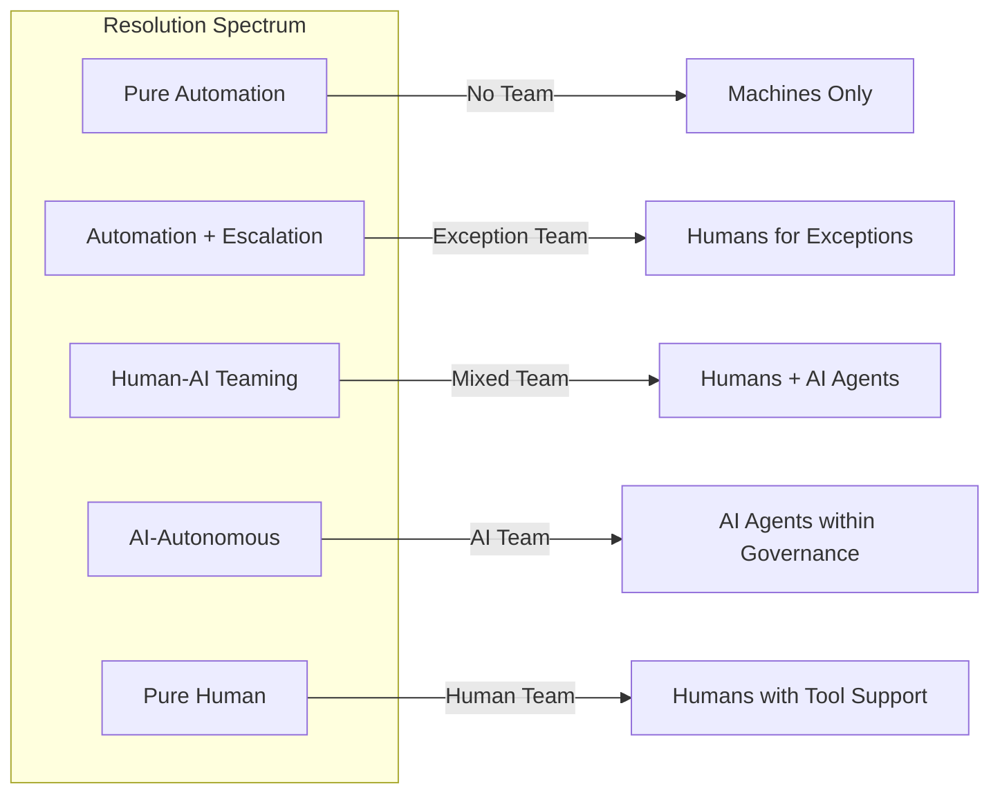
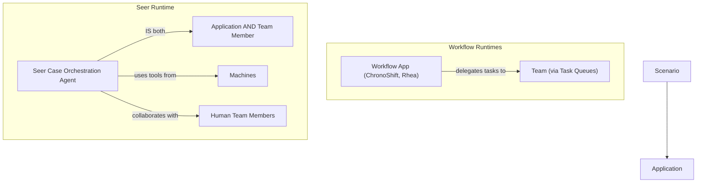

# Modeling Teams

Teams are the human and AI agents enrolled in a Hub to resolve its Scenarios. This document guides product managers and domain architects in identifying, structuring, and assigning Teams within The Hub Way framework. It covers Team composition, their relationship to Streams and Loops, Resolution Models, cross-Hub concerns, and the Application-Agent convergence that emerges when Seer is the runtime. Audience: product managers, domain architects.

---

## 1. Teams as Hub Constituents

A **Team** is the set of human and AI agents enrolled in a Hub to resolve its Scenarios. A Hub without Teams is an empty specification — Streams define commitments, Loops define discipline, Channels define interaction surfaces, but Teams are the "who." Without them, no Scenario is resolved.

Teams are integral to Streams and Loops, not external operators. They do not "use" the Hub from outside; they are constituents of it. When a credit card application arrives, the Team enrolled in the Credit Card Hub resolves it. When a reconciliation Loop fires, the Team enrolled in that Hub's reconciliation discipline resolves it — or the Machines resolve it autonomously if no Team is needed.

| Aspect | What It Means |
|--------|---------------|
| **Enrollment** | Teams are enrolled in a Hub (Workbench). Enrollment is explicit — agents are assigned, not assumed. |
| **Scope** | Teams are Hub-scoped. Each Hub defines its own Teams for its own Scenarios. |
| **Composition** | Teams comprise human agents, AI agents, or both — determined by the Resolution Model. |
| **Integral role** | Teams are the "who" for Streams and Loops, not external consumers of Hub output. |

---

## 2. What a Team Comprises

Teams in The Hub Way follow AOSM's Human-AI Team (HAT) model: shared context across human and AI agents, task interoperability (any capable agent can pick up eligible work), seamless handoff between agent types, and human oversight where governance requires it.

### Human Agent Types

| Agent Type | Role | Banking Example |
|------------|------|-----------------|
| **Operator / Agent** | Resolves Scenarios directly — investigates, decides, acts | Dispute analyst investigating a chargeback; credit officer evaluating an application |
| **Supervisor** | Oversees Team performance, manages escalations, ensures SLA adherence | Queue manager monitoring dispute resolution times; team lead reviewing credit decisions |
| **Process Architect** | Designs and refines how Scenarios are resolved — SOPs, decision criteria, escalation paths | Domain expert defining the dispute investigation procedure; compliance architect designing filing workflows |
| **Developer** | Builds and maintains the automations, tools, and integrations Teams depend on | Engineer building fraud scoring models; developer maintaining reconciliation pipelines |

### AI Agent Types

| Agent Type | Role | Banking Example |
|------------|------|-----------------|
| **Capable AI** | General-purpose AI agent that resolves Scenarios using tools, knowledge, and reasoning | AI agent triaging incoming disputes by analyzing transaction patterns and merchant history |
| **Skilful AI** | Specialized AI agent with domain-specific training or fine-tuning for particular Scenario types | Credit scoring agent trained on institution-specific risk models; compliance agent tuned to regulatory frameworks |
| **Scenario-as-Agent** | An AI agent whose entire purpose is to resolve one specific Scenario type autonomously | Payment authorization agent that evaluates fraud signals, balance, and limits in milliseconds |
| **Persona Twin** | AI agent that represents a specific human persona — learns preferences, handles routine work, escalates exceptions | Agent's AI twin that pre-processes dispute evidence and drafts initial assessments for human review |

### HAT Principles

| HAT Principle | What It Means in Practice |
|---------------|---------------------------|
| **Shared context** | Human and AI agents see the same Scenario state — case history, evidence, decisions, pending actions |
| **Task interoperability** | Work can be assigned to any capable agent. A dispute that starts with AI triage can be handed to a human investigator without context loss. |
| **Seamless handoff** | Agent transitions are invisible to the Scenario. The commitment does not care whether a human or AI resolved it — the resolution quality does. |
| **Human oversight** | Governance structures ensure humans can observe, intervene, and override AI decisions where required by policy or regulation |

---

## 3. Teams in Streams and Loops

Teams are the "who" for each Scenario in a Stream or Loop. The classification of work (Stream vs Loop) does not change how Teams participate — it changes which Teams are needed and why.

### Stream Teams

Stream Scenarios require Teams that can fulfill external commitments. The external party expects resolution; the Team delivers it.

| Stream | Team Required | Why |
|--------|---------------|-----|
| Dispute resolution | Dispute analysts, AI triage agents | Investigation requires judgment, evidence evaluation, and merchant communication |
| Credit card application | Credit officers, credit scoring AI, identity verification agents | Decisioning requires risk assessment, policy evaluation, and compliance checks |
| Merchant onboarding | Onboarding specialists, compliance review agents | Merchant due diligence requires document review and risk assessment |
| Regulatory filing response | Compliance officers, AI document preparation agents | Ad-hoc regulatory requests require domain expertise and accurate reporting |

### Loop Teams

Loop Scenarios may require different Teams — or no Team at all. Internal discipline does not always require human involvement.

| Loop | Team Required | Why |
|------|---------------|-----|
| Daily reconciliation | No Team (Pure Automation), exception reconciliation agents for breaks | Routine matching is automated; breaks require investigation |
| Fraud monitoring | No Team for detection (automated), fraud analysts for investigation | Detection is automated; investigation of flagged patterns requires judgment |
| Compliance monitoring | Compliance analysts, AI policy-checking agents | Continuous monitoring with human review for ambiguous findings |
| Interest computation | No Team (Pure Automation) | Deterministic calculation with no agent involvement |

### The Resolution Model Determines Team Involvement

The Team's composition and involvement level is not arbitrary — it follows from the Resolution Model selected for each Scenario. A Pure Automation Scenario has no Team. A Human-AI Teaming Scenario has a mixed Team. The Resolution Model is the bridge between Scenario design and Team assignment.

---

## 4. Team Assignment and Structure

How agents are assigned to Scenarios within a Team is an operational design concern. The Hub Way provides the vocabulary; the platform provides the mechanisms.

| Assignment Mechanism | Description | When to Use |
|----------------------|-------------|-------------|
| **Skill-based pools** | Agents grouped by capability. Work is routed to agents with matching skills. | When Scenarios require specific expertise — dispute investigation vs. card provisioning |
| **Task queues** | Work items queued and assigned in priority order to available agents | When throughput and SLA management matter — customer service tickets, reconciliation breaks |
| **Escalation matrices** | Defined paths from one agent tier to the next when a Scenario exceeds an agent's authority or capability | When Scenarios have variable complexity — simple disputes resolved by AI, complex ones escalated to senior analysts |
| **Allocation algorithms** | Automated assignment based on workload, skill match, priority, and availability | When volume is high and manual assignment is impractical |

### Olympus Hub Implementation

In Olympus Hub, Team assignment maps to Workbench-level concepts:

| Hub Way Concept | Olympus Hub Implementation |
|-----------------|----------------------------|
| Team enrollment | Agent assignment to Workbench |
| Skill-based pools | Agent capability profiles and routing rules |
| Task queues | Workbench task queues with priority and SLA configuration |
| Escalation | Escalation policies and supervisor notification |

---

## 5. Teams and Resolution Models

The Resolution Model selected for a Scenario determines what kind of Team — if any — is required. Teams are not a constant; they vary across the resolution spectrum.

### Resolution Spectrum

### Resolution Model to Team Mapping

| Resolution Model | Team Composition | Banking Example |
|------------------|------------------|-----------------|
| **Pure Automation** | No Team. Machines resolve entirely. | Payment authorization: fraud scoring, balance check, limit validation — milliseconds, no agent. |
| **Automation with Exception Escalation** | Exception Team — agents engage only when automation cannot resolve. | Daily reconciliation: automated matching for 99% of transactions; reconciliation analysts investigate breaks. |
| **Automation with Checkpoint Approval** | Approval Team — agents review and approve at defined gates. | Large-value wire transfers: automated compliance checks, human approval before release. |
| **Agent-Assisted Automation** | Guidance Team — agents steer automation, review output, correct errors. | Credit card statement generation: automated production, agents review flagged anomalies before distribution. |
| **Human-AI Teaming** | Mixed Team — human and AI agents collaborate throughout. | Dispute resolution: AI triage and evidence gathering, human analyst investigation and decision, AI draft communication. |
| **AI-Autonomous** | AI Team — AI agents operate independently within governance guardrails. | Fraud alert triage: AI agent evaluates signals, makes block/allow decisions within defined risk thresholds, escalates only when confidence is low. |
| **Human-Supervised AI** | AI Team with human gate — AI proposes, humans approve each action. | Regulatory response drafting: AI prepares filing, compliance officer reviews and approves each section before submission. |
| **Pure Human Collaboration** | Human Team — humans collaborate with platform infrastructure support. | Policy design: compliance and legal experts collaborate on new anti-money-laundering procedures. |
| **Human with Tool Support** | Human Team with tool access — humans resolve, Machines provide capabilities on demand. | Complex fraud investigation: senior analyst leads investigation using fraud analytics tools, transaction search, and case management. |

### Application-Agent Convergence

When the runtime is Seer, a fundamental convergence occurs: the **Application IS an AI Agent**. The Seer Case Orchestration Agent is simultaneously a Team member resolving Scenarios and the application orchestrating them. This collapses the traditional separation between "the system that manages work" and "the agent that does work."

| Dimension | Workflow Runtimes (ChronoShift, Rhea) | Seer Runtime |
|-----------|---------------------------------------|--------------|
| **Application role** | Manages work — routes tasks, tracks state, enforces deadlines | Resolves work — reasons about the Scenario, decides next actions, uses tools |
| **Team relationship** | Application delegates to Team via task queues | Application IS a Team member; collaborates alongside humans |
| **Orchestration** | Predetermined flows with conditional branches | Goal-oriented reasoning — the agent determines the path |
| **Tool use** | Application calls integrations on behalf of the process | Agent calls tools on behalf of the Scenario goal |

This convergence means that for Seer-runtime Scenarios, the Team always includes at least one AI agent — the orchestrator itself. Human Team members collaborate with the Seer agent, not through a workflow engine that mediates between them.

---

## 6. Cross-Hub Teams

Teams are **Hub-scoped** — they are enrolled per Workbench. An agent enrolled in the Credit Card Hub's Team is not automatically part of the Payments Hub's Team.

| Aspect | Description |
|--------|-------------|
| **Hub-scoped enrollment** | Teams are defined and managed per Hub (Workbench). Each Hub enrolls the agents it needs. |
| **Individual multi-Hub membership** | A single human or AI agent may be enrolled in multiple Hubs. A compliance officer may participate in both the Credit Card Hub and the Payments Hub — but their role, permissions, and available Scenarios differ per Hub. |
| **Aggregation Hub Teams** | Aggregation Hubs (e.g., Enterprise Compliance, Customer Intelligence) have their own Teams. These Teams specialize in cross-domain analysis and governance, not in the product domains they aggregate. |
| **Cross-Hub Stream collaboration** | When a Stream spans Hubs, each Hub's Team resolves the Scenarios within its boundary. Coordination happens through cross-workbench context sharing, not by merging Teams. |

| Example | What Happens |
|---------|--------------|
| Credit card application spanning Credit Card and Payments Hubs | Credit Card Hub Team handles decisioning. Payments Hub Team handles card provisioning. Shared Stream context ensures continuity. |
| Enterprise Compliance Hub aggregating across product Hubs | Compliance Hub Team (compliance analysts, AI policy agents) runs cross-domain Loops. Product Hub Teams are not involved unless the Compliance Loop triggers an escalation Stream back to a product Hub. |

---

## 7. Anti-Patterns

### The Phantom Team

**Problem:** Scenarios defined without enrolled agents. The Stream specifies a commitment — "we will resolve your dispute" — but no agents are assigned to do the work.

| Sign | What It Indicates |
|------|-------------------|
| Scenarios with no agent pool | Work exists with no one to resolve it |
| Task queues with no consumers | Operational dead letter |
| SLAs defined but no capacity planning | Commitments made without delivery capability |

**Remedy:** Every Scenario should have an identifiable Team (or an explicit Pure Automation designation). If you cannot name who resolves a Scenario, the model is incomplete.

### The Monolith Team

**Problem:** One Team for all Scenarios in a Hub. Dispute investigation, reconciliation, card provisioning, and compliance monitoring all handled by the same agent pool.

| Sign | What It Indicates |
|------|-------------------|
| All Scenarios routed to the same pool | Skills are diluted — agents cannot specialize |
| Conflicting SLAs on the same queue | Urgent disputes compete with routine reconciliation |
| High context-switching cost | Agents juggle unrelated work types |

**Remedy:** Align Teams to Scenario types based on required skills and SLA profiles. A dispute investigation Team and a reconciliation Team can coexist in the same Hub without being the same pool.

### The Invisible Team

**Problem:** Streams and Loops designed in isolation from agent capacity. Work is modeled without considering who resolves it.

| Sign | What It Indicates |
|------|-------------------|
| Stream/Loop models with no Team section | "Who" was never asked |
| Capacity mismatches at launch | Work volume exceeds available agents |
| Resolution Model not selected | How work is resolved was never decided |

**Remedy:** Model Teams alongside Streams and Loops, not after. The "who resolves this?" question should be answered during Scenario design, not during implementation.

### The Siloed Team

**Problem:** No cross-Hub collaboration when Streams span Hub boundaries. Each Hub's Team resolves its portion without awareness of the broader commitment.

| Sign | What It Indicates |
|------|-------------------|
| Cross-Hub Streams with no shared context | Teams work in isolation on a shared commitment |
| Customer receives contradictory updates from different Hubs | No coordination between Teams |
| Escalations loop between Hubs | No clear ownership at commitment level |

**Remedy:** Cross-Hub Streams require cross-workbench context sharing. Teams in each Hub operate within their boundary, but shared Stream context ensures they understand the full commitment.

---

## 8. Heuristics

| Heuristic | Application |
|-----------|-------------|
| **"Every Scenario should answer: who resolves this?"** | If a Scenario has no identifiable Team and no Pure Automation designation, the model is incomplete. The "who" may be a human agent pool, an AI agent, or a combination — but it must be explicit. |
| **"Start with Streams and Loops, then ask who participates"** | Teams follow from work design. Define the commitments (Streams) and disciplines (Loops) first; then determine which agents are needed to resolve them. Teams serve Scenarios, not the other way around. |
| **"Design for gradual automation: today's human team may become tomorrow's AI team"** | Resolution Models evolve. A Scenario that starts as Human with Tool Support may move to Human-AI Teaming, then to AI-Autonomous. The model does not change — Streams, Loops, and Scenarios remain the same. Only the Team composition and Resolution Model change. |
| **"Team changes don't change the model — they change the resolution"** | Replacing a human agent pool with an AI agent, or adding AI co-pilots to a human Team, does not alter the Stream/Loop classification, the Scenario goals, or the Channel configuration. It changes the Resolution Model and the Team composition. The Hub Way accommodates this evolution by design. |

---

## What Modeling Teams Delivers

Teams are where transformation becomes concrete — where the thesis principle "the model must survive when the 'who' changes" is realized:

**Progressive absorption works.** AI joins Teams, absorbs more coordination, more judgment, more routine steps over time. The Streams, Loops, Tool contracts, and governance hold. The dial moves without architectural disruption. Today's Human with Tool Support becomes tomorrow's Human-AI Teaming becomes next year's AI-Autonomous — for each piece of work, at the bank's own pace.

**Engineering shifts from maintenance to evolution.** As Team compositions evolve — AI absorbing routine resolution, humans shifting to higher-judgment work — engineers move from maintaining bespoke plumbing to evolving domain capabilities: modeling new work, refining specifications, expanding AI's role, registering new Tools. The work becomes more interesting and the talent retention problem eases.

**The "who" changes without the model changing.** Replacing a human agent pool with an AI agent, or adding AI co-pilots to a human Team, does not alter the Stream/Loop classification, the Scenario goals, the Tool contracts, or the Channel configuration. It changes the Resolution Model and the Team composition. The operational intelligence — the specifications, the governance, the Tool contracts — survives every transition.

**AI investments compound through Teams.** The 50th agent joins an existing Team within an existing model, using existing Tool contracts and governance. It doesn't need its own integration, its own governance model, its own scope definition. The model provides the context. The platform effect is real because the shared model is real.

---

## Summary

Teams are the human and AI agents enrolled in a Hub to resolve its Scenarios. They are Hub constituents, not external operators. Teams comprise human agent types (Operators, Supervisors, Process Architects, Developers) and AI agent types (Capable AI, Skilful AI, Scenario-as-Agent, Persona Twins), following AOSM's HAT principles of shared context, task interoperability, seamless handoff, and human oversight. The Resolution Model determines Team composition — from no Team (Pure Automation) through mixed Teams (Human-AI Teaming) to human-only Teams (Pure Human). When Seer is the runtime, the Application-Agent convergence means the orchestrator itself is a Team member. Teams are Hub-scoped; cross-Hub Streams coordinate through shared context, not merged Teams. Avoid the Phantom, Monolith, Invisible, and Siloed Team anti-patterns. Design Teams alongside Scenarios, not after — and design for gradual automation, because Team changes do not change the model.

---

## Related Documents

- [Framework and Rationale](01-framework-and-rationale.md) — design principles and scope
- [Modeling Streams](02-modeling-streams.md) — external commitments resolved by Teams
- [Modeling Loops](03-modeling-loops.md) — internal discipline resolved by Teams
- [Modeling Machines](07-modeling-machines.md) — systems and tools Teams use
- [Ontology Alignment](08-ontology-alignment.md) — Teams and the AOSM Agent Model
- [Implementing in Hub](09-implementing-in-hub.md) — agent pools, task queues, enrollment
- [Worked Examples](10-examples.md) — Teams in banking domains
