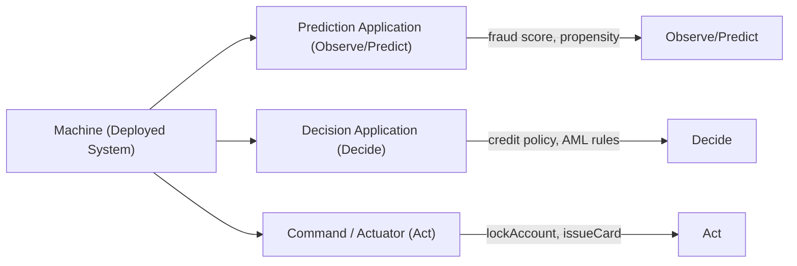
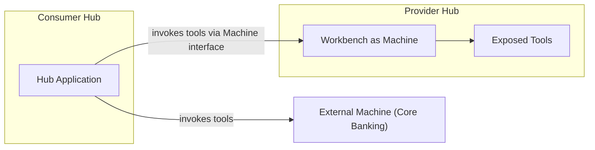

# Modeling Machines

Machines are the deployed compute systems that provide capabilities to the Hub. This document guides product managers, domain architects, and engineers in identifying, registering, and modeling Machines — with emphasis on the Tools they expose and how agents use those Tools to resolve Scenarios. It covers Tool types aligned to the OPD cycle, the Application orchestration layer, Machine scope and registration, system-agnostic integration, Machine behavior in Streams and Loops, the Hub-as-Machine pattern, anti-patterns, and heuristics. Audience: product managers, domain architects, engineers.

---

## 1. Machines as Hub Constituents

A **Machine** is a deployed compute system — application, service, device, external bureau — that provides capabilities to the Hub. Core banking systems, payment switches, fraud engines, ML model services, credit bureaus, notification gateways — all are Machines.

Machines are Hub constituents, not external infrastructure. When a Hub models its work, Machines are the systems it depends on to observe, predict, decide, and act. Without Machines, Teams have no Tools and Scenarios have no computational capability.

| Aspect | What It Means |
|--------|---------------|
| **Deployed system** | A Machine is a running system — not a library, not a concept. It has an address, a contract, and operational characteristics. |
| **Hub-scoped registration** | Each Hub registers the Machines it needs. Registration is explicit — systems are declared, not assumed. |
| **Tool provider** | What matters for Hub Way modeling is the **Tools** a Machine provides: predictions, decisions, and commands that agents invoke to resolve Scenarios. |
| **Signal emitter** | Machines can also emit Signals — events that trigger Streams and Loops. Signal modeling is covered in Stream and Loop trigger modeling; this document focuses on Tools. |

---

## 2. Tools — What Machines Provide

A **Tool** is a discrete capability exposed by a Machine that an agent — human or AI — can invoke during Scenario resolution. Tools align to the OPD (Observe-Predict-Decide-Act) cycle that governs how Scenarios progress from signal to resolution.

### Tool Types

| Tool Type | OPD Phase | What It Does | Banking Examples |
|-----------|-----------|--------------|------------------|
| **Prediction Application** | Observe / Predict | Consumes data and produces a probabilistic or analytical assessment | Fraud risk score, credit propensity model, income estimation, churn prediction |
| **Decision Application** | Decide | Evaluates inputs against rules, policies, or thresholds and produces a deterministic decision | Credit policy engine, AML rule set, limit management, sanction screening |
| **Command / Actuator** | Act | Executes a state-changing operation in a target system | `lockAccount`, `authorizePayment`, `issueCard`, `postTransaction`, `sendNotification` |

### Banking Examples

| Machine | Tool | Tool Type | OPD Phase |
|---------|------|-----------|-----------|
| Fraud scoring engine | `scoreFraudRisk` | Prediction Application | Observe / Predict |
| Credit bureau integration | `fetchCreditScore` | Prediction Application | Observe / Predict |
| ML model service | `predictChurnProbability` | Prediction Application | Observe / Predict |
| Credit policy engine | `evaluateCreditPolicy` | Decision Application | Decide |
| AML rule engine | `screenTransaction` | Decision Application | Decide |
| Limit management service | `checkSpendingLimit` | Decision Application | Decide |
| Core banking system | `postTransaction` | Command / Actuator | Act |
| Card management system | `issueCard` | Command / Actuator | Act |
| Payment switch | `authorizePayment` | Command / Actuator | Act |
| Notification gateway | `sendNotification` | Command / Actuator | Act |

### Tools and OPD Cycle

A single Machine may expose Tools of more than one type. A core banking system may provide both a Decision Application (`checkBalance`) and Commands (`postTransaction`, `lockAccount`). A fraud engine may provide both a Prediction Application (`scoreFraudRisk`) and a Decision Application (`evaluateFraudPolicy`). The Tool type is determined by what the Tool does, not by which Machine hosts it.

---

## 3. Application — The Orchestration Layer

The Hub **Application** orchestrates how a Scenario is resolved — invoking Tools from Machines, coordinating Team activities, managing state, and driving the Scenario toward its resolution goal.

### Application Types

Application types span the Resolution spectrum:

| Application Type | Runtime | Orchestration Style | Banking Example |
|------------------|---------|---------------------|-----------------|
| **Workflow application** | ChronoShift, Rhea | Predetermined flows with conditional branches | Credit card application processing with defined approval gates |
| **Batch application** | Perseus | Scheduled, high-volume data processing | End-of-day reconciliation, interest computation |
| **Custom microservice** | Atlantis | Deterministic logic, event-driven | Payment authorization with sub-millisecond latency |
| **Seer Case Orchestration Agent** | Seer | Goal-oriented reasoning, adaptive resolution | Dispute investigation with AI-driven evidence analysis and decision |

### Application-Agent Convergence

When the runtime is Seer, the Application **IS** an AI Agent. The Seer Case Orchestration Agent is simultaneously a Team member resolving Scenarios and the application orchestrating them. The distinction between "who resolves" and "what orchestrates" collapses.

| Dimension | Workflow Runtimes (ChronoShift, Rhea) | Seer Runtime |
|-----------|---------------------------------------|--------------|
| **Application role** | Manages work — routes tasks, tracks state, enforces deadlines | Resolves work — reasons about the Scenario, decides next actions, uses tools |
| **Tool invocation** | Application calls integrations on behalf of the process | Agent calls tools on behalf of the Scenario goal |
| **Team relationship** | Application delegates to Team via task queues | Application IS a Team member; collaborates alongside humans |
| **Orchestration** | Predetermined flows with conditional branches | Goal-oriented reasoning — the agent determines the path |

This convergence is fundamental: in Seer-runtime Scenarios, the agent reasons about which Tools to invoke, in what order, and with what parameters — driven by the Scenario goal rather than a predefined flow. See [Modeling Teams](06-modeling-teams.md) for the HAT implications and [Implementing in Hub](09-implementing-in-hub.md) for runtime selection guidance.

---

## 4. Machine Scope and Registration

Machines are registered in a **Machine Registry** with inheritance at three levels:

| Scope | What It Means | Example |
|-------|---------------|---------|
| **System** | Available to all tenants and all Hubs. Platform-wide capabilities. | Core notification gateway, enterprise audit service |
| **Tenant** | Available to all Hubs within a tenant. Tenant-specific capabilities. | Tenant's core banking system, tenant's fraud scoring engine |
| **Workbench** | Available only to a specific Hub. Hub-specific capabilities. | Specialized ML model for this Hub's dispute classification |

Registration is a **domain modeling decision**. When designing a Hub, modelers ask: *which Machines does this Hub need to resolve its Scenarios?* The answer determines which systems are registered and at what scope.

| Registration Decision | Guidance |
|-----------------------|----------|
| Which Machines does this Hub need? | List the Tools required by each Scenario; trace each Tool to its providing Machine |
| At what scope should a Machine be registered? | If all Hubs need it → System. If all Hubs in a tenant need it → Tenant. If only this Hub → Workbench. |
| What Tools does each Machine expose? | Enumerate the Prediction Applications, Decision Applications, and Commands relevant to this Hub |

---

## 5. System-Agnostic Integration

The Hub does not care which system provides a capability. What matters is the **Tool contract** — the interface through which a Tool is invoked and the guarantees it provides.

| Principle | What It Means |
|-----------|---------------|
| **Provider-neutral** | Zeta product lines (Tachyon, Neutrino, Electron) are Machines. Third-party systems (credit bureaus, payment networks, core banking platforms) are equally valid Machines. The model treats them identically. |
| **Tool contract is the stable interface** | The contract — input, output, error semantics, SLA — is what the Hub depends on. The system behind the contract can change without changing Streams, Loops, Teams, or Channels. |
| **Swap without model change** | Replace a fraud scoring engine with a different vendor's engine. As long as the Tool contract (`scoreFraudRisk` with defined input/output) is honored, the Hub model does not change. Only the Machine registration is updated. |

This is a deliberate design choice. Banking institutions operate heterogeneous technology estates. A Hub that couples to specific systems rather than Tool contracts becomes brittle and vendor-locked. The Hub Way treats the Tool contract as the integration boundary, making Machine substitution an operational concern rather than a modeling concern.

---

## 6. Machines in Streams and Loops

### Stream Scenarios

Stream Scenarios use Tools to fulfill external commitments. The Team resolves the Scenario; the Machines provide the capabilities the Team needs.

| Stream Scenario | Tools Used | Purpose |
|-----------------|------------|---------|
| Payment authorization | `scoreFraudRisk`, `checkSpendingLimit`, `authorizePayment` | Observe risk, decide against policy, act on the payment |
| Credit card application | `fetchCreditScore`, `evaluateCreditPolicy`, `issueCard` | Observe creditworthiness, decide on application, provision the card |
| Dispute investigation | `fetchTransactionHistory`, `scoreFraudRisk`, `issueProvisionalCredit` | Observe transaction patterns, assess fraud likelihood, act on interim resolution |

### Loop Scenarios

Loop Scenarios use Tools for internal discipline. Many Loop Scenarios are fully automated — the Hub Application invokes Tools without delegating to human Teams.

| Loop Scenario | Tools Used | Purpose |
|---------------|------------|---------|
| Daily reconciliation | `fetchSettlementFile`, `matchTransactions`, `flagBreak` | Observe settlement data, decide on matching, act on discrepancies |
| Interest computation | `fetchAccountBalances`, `computeInterest`, `postTransaction` | Observe balances, compute (decide), post accrued interest |
| Fraud monitoring | `analyzeTransactionPattern`, `scoreFraudRisk`, `lockAccount` | Observe patterns, predict risk, act on high-risk accounts |
| Compliance monitoring | `scanTransactions`, `screenAgainstSanctions`, `generateAlert` | Observe activity, decide against watchlists, act on matches |

Fully automated Loops are entirely Machine-driven. The Application invokes Tools in sequence or in parallel, handles exceptions according to predefined rules, and completes without human involvement. The Team is registered only for exception escalation — or not at all (Pure Automation).

---

## 7. Hub as Machine

A Hub can be exposed as a Machine to other Hubs. This is the **Workbench-as-Machine** pattern in Olympus Hub. The provider Hub exposes selected Tools through its Machine interface; the consumer Hub registers the provider as a Machine and invokes those Tools like any other.

| Concept | Description |
|---------|-------------|
| **Workbench-as-Machine** | A Hub exposes its capabilities as Tools available to other Hubs via the Machine interface |
| **Channel vs Machine** | Both are Hub-relative. A Channel is how collaborators interact with this Hub. A Machine is a system this Hub uses for Tools. Another Hub can be both — a Machine (providing tools) and a Channel source (providing an interaction surface). |
| **Composability** | Hubs compose into larger architectures by providing and consuming Machine interfaces. An Aggregation Hub (e.g., Enterprise Compliance) may register multiple product Hubs as Machines. |

### Hub-as-Machine

From the consumer Hub's perspective, the provider Hub is just another Machine — registered, governed, and invoked through the same Tool contract pattern. Whether a Tool is served by a Zeta product, a third-party system, or another Hub is invisible to the consuming Application.

---

## 8. Anti-Patterns

### The Invisible Machine

**Problem:** Scenarios depend on systems not registered in the Machine Registry. The system is invoked but not declared — no governance, no audit trail, no swap path.

| Sign | What It Indicates |
|------|-------------------|
| Tools referenced in Scenario design but not traceable to a registered Machine | Shadow integration |
| API calls in application code with no corresponding Machine registration | Undeclared dependency |
| No audit trail for external system invocations | Governance gap |

**Remedy:** Every system that provides Tools to a Hub must be registered as a Machine. If a Scenario invokes a capability, there must be a Machine in the registry that owns it. No exceptions.

### The Over-Connected Hub

**Problem:** Too many Machines registered in a single Hub — often a sign that the Hub boundary is too broad (God Hub) or that Machine abstraction is too fine-grained.

| Sign | What It Indicates |
|------|-------------------|
| Hub with 20+ registered Machines | Hub boundary may encompass too many domains |
| Machines registered but used by only one Scenario | Over-granular Machine decomposition |
| Machine registry duplicated across many Hubs | Missing Shared Services Hub |

**Remedy:** Review Hub boundaries. If many Machines serve unrelated Scenarios, the Hub may need splitting. If many Hubs register the same Machines, consider a Shared Services Hub that exposes those capabilities via the Workbench-as-Machine pattern.

### The Unbound Scenario

**Problem:** Scenarios defined without Tool bindings. Agents are expected to resolve goals but have no declared Tools — they must discover or improvise capabilities at runtime.

| Sign | What It Indicates |
|------|-------------------|
| Scenario specifications with no Tool references | Incomplete modeling |
| AI agents resolving Scenarios with undeclared integrations | Ungoverned tool use |
| "The agent will figure it out" | Missing capability design |

**Remedy:** For each Scenario, enumerate the Tools required to Observe, Decide, and Act. Bind each Tool to a registered Machine. This is especially critical for Seer-runtime Scenarios where the AI agent needs an explicit Tool inventory to reason about resolution.

### The Monolith Machine

**Problem:** A single Machine registration with hundreds of commands — no logical grouping, no separation of concerns. A Machine with 200 tools breaks discoverability and governance.

| Sign | What It Indicates |
|------|-------------------|
| Machine with 50+ Tools of mixed types | Insufficient decomposition |
| Tool names that span unrelated domains | Machine represents multiple logical systems |
| Governance rules cannot be applied per capability group | Too coarse a registration |

**Remedy:** Split into logical Machine registrations that align with capability domains. A core banking system may be registered as separate Machines for account management, transaction processing, and reporting — each with its own Tool set and governance profile.

---

## 9. Heuristics

| Heuristic | Application |
|-----------|-------------|
| **"For each Scenario, ask: what Tools does the Team need to Observe, Decide, and Act?"** | This question ensures completeness. If a Scenario has no Tools for one OPD phase, either the phase is handled by human judgment alone (valid) or a Tool is missing from the model (gap). |
| **"The Tool contract is the stable interface — design around contracts, not system identity"** | Machines change. Vendors change. The Tool contract — input, output, error semantics, SLA — should be stable across Machine substitutions. Couple to contracts, not to providers. |
| **"If a Machine serves many Hubs, consider a Shared Services Hub"** | When the same Machine appears in multiple Hub registries, a Shared Services Hub (exposing the Machine via Workbench-as-Machine) simplifies governance and reduces registration duplication. |
| **"Machine changes don't change the model — they change the provider"** | Replacing a Machine with a different system that honors the same Tool contracts does not alter Streams, Loops, Teams, Channels, or Scenarios. The Hub Way accommodates technology evolution by design. |

---

## What Modeling Machines Delivers

Machines and Tool contracts are where the thesis principle "operational intelligence should be declarative, not imperative" becomes concrete:

**Migrations become bounded.** Replacing a Machine means writing a new Tool contract for the new system. The work specifications, governance, Streams, Loops, and Scenarios are unaffected — they were never fused to the old vendor. The bank can run both Machines in parallel during transition, routing work to each and comparing outcomes before committing. Migration risk drops because the operational intelligence is preserved, not rebuilt.

**Integration cost becomes proportional to capabilities, not connections.** A Machine registers its Tools through contracts. Work that needs a capability invokes it through the contract. The cost is proportional to the number of Tools the Machine provides — not the number of other systems in the estate. Adding the 13th Machine is no harder than adding the 3rd. The combinatorial edge explosion that makes modernization self-defeating under the current architecture does not occur.

**Operational intelligence becomes portable.** The knowledge of when and why to request a fraud assessment, a credit decision, or a payment authorization lives in the work specification and the Tool contract — not in bespoke code fused to a specific vendor's API. That knowledge survives vendor changes, can be reused across similar work, can be examined by domain experts, and can be interpreted by AI agents.

**Vendor substitution is a contract change.** The Tool contract — input, output, error semantics, SLA — is the stable interface. Machines are the providers that change. Coupling to contracts rather than to system identity is what makes the architecture reward evolution rather than punish it.

---

## Summary

Machines are the deployed compute systems registered in a Hub to provide Tools — the capabilities agents use to resolve Scenarios. Tools align to the OPD cycle: Prediction Applications (Observe/Predict), Decision Applications (Decide), and Commands/Actuators (Act). The Hub Application orchestrates Tool invocation — through workflow engines, batch processors, custom microservices, or Seer Case Orchestration Agents where the Application-Agent convergence means the orchestrator is itself a Tool-wielding Team member. Machine registration follows System → Tenant → Workbench scope inheritance. The Hub is system-agnostic: the Tool contract is the stable interface, and Machines can be swapped without changing the model. Stream Scenarios use Tools to fulfill commitments; Loop Scenarios use Tools for discipline, often in fully automated configurations. A Hub can itself be a Machine to other Hubs via the Workbench-as-Machine pattern. Avoid the Invisible Machine, Over-Connected Hub, Unbound Scenario, and Monolith Machine anti-patterns. Design around Tool contracts, enumerate Tools per Scenario, and consolidate shared Machines into Shared Services Hubs.

---

## Related Documents

- [Framework and Rationale](01-framework-and-rationale.md) — design principles and scope
- [Modeling Teams](06-modeling-teams.md) — who uses the tools Machines provide
- [Ontology Alignment](08-ontology-alignment.md) — Machines and the AOSM Machine/Tool model
- [Implementing in Hub](09-implementing-in-hub.md) — Machine Registry, Tool Registry, runtime selection
- [Worked Examples](10-examples.md) — Machines in banking domains
