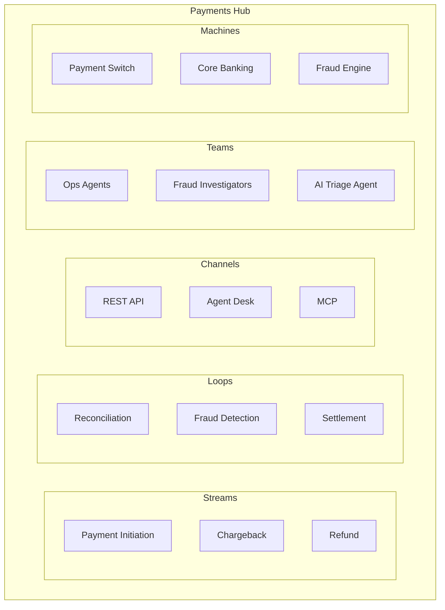
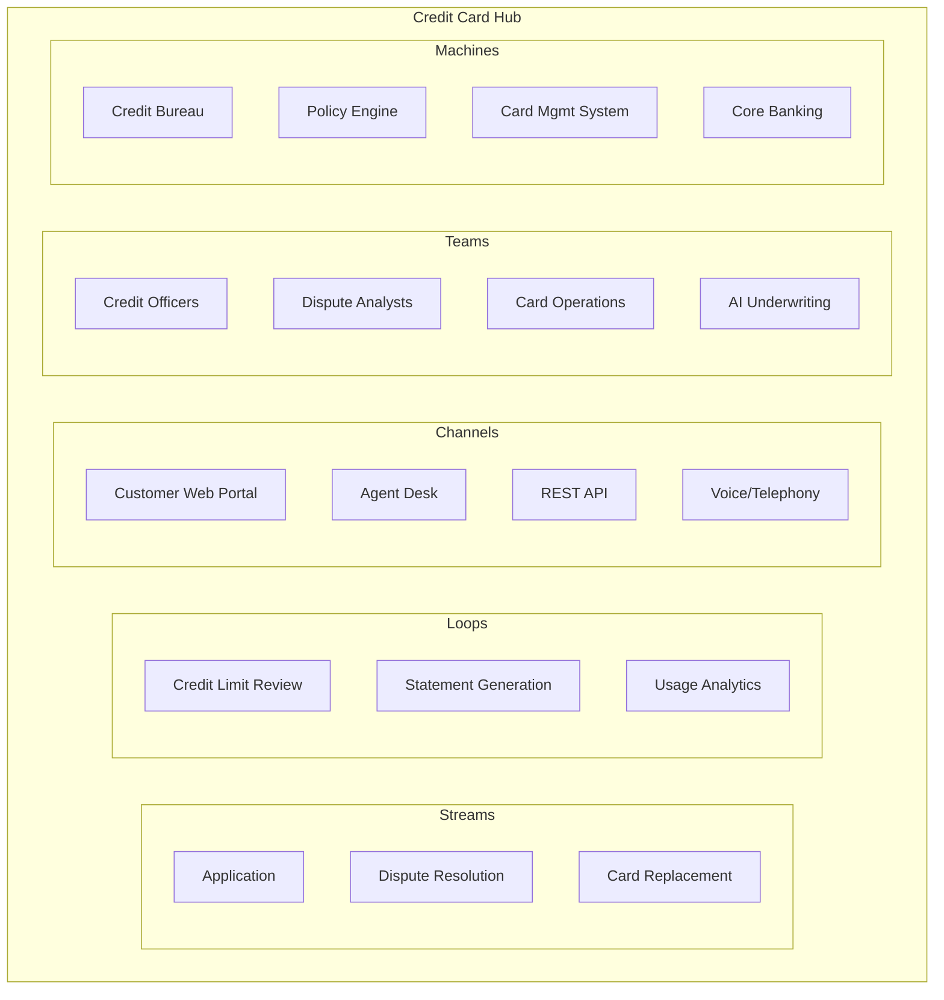
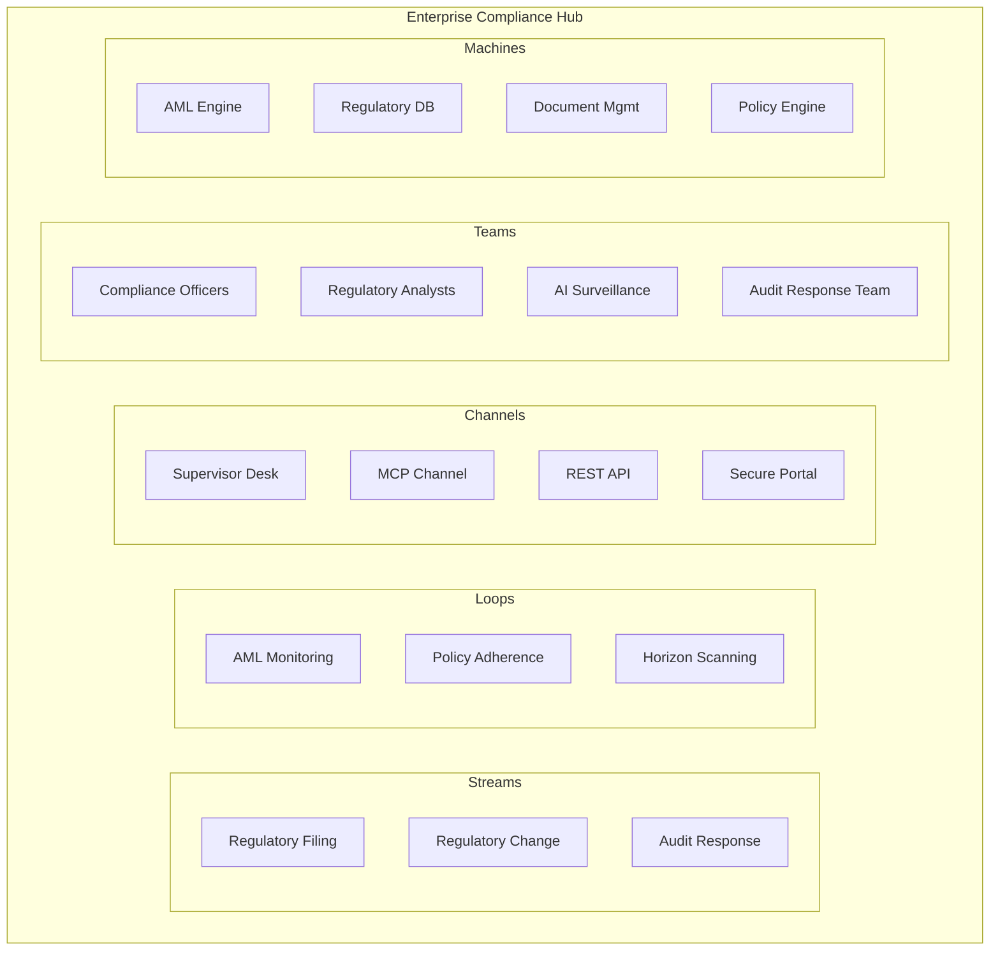

# Worked Examples

This document provides three comprehensive banking domain examples showing The Hub Way modeling end-to-end. Each example demonstrates Hub boundary identification, Stream/Loop classification, Channel selection, Scenario identification with Work Pattern and Resolution Model, trigger mapping, and anti-pattern avoidance. Audience: PMs, architects, engineers.

---

## Example 1: Payments Hub

The Payments Hub is a bounded business domain for payment processing across various rails and instruments. It handles payment initiation, chargebacks, refunds, reconciliation, fraud detection, and settlement. The boundary is defined by the commitment to process payments and related operational discipline.

### Streams

| Stream | Trigger | Key Scenarios | Work Pattern | Resolution Model |
|--------|---------|---------------|--------------|------------------|
| Payment Initiation Stream | Customer or partner initiates payment | Validation, routing, authorization, settlement instruction, confirmation | Event-Driven | Pure Automation (straight-through) / Automation with Exception Escalation (when manual review needed) |
| Chargeback Stream | Merchant or customer disputes a transaction | Intake, investigation, evidence gathering, decision, reversal or confirmation | Case-Based | Human-AI Teaming |
| Refund Stream | Merchant initiates refund | Validation, reversal, confirmation | Queue-Based | Pure Automation |

### Loops

| Loop | Trigger Mechanism | Outputs | Work Pattern | Resolution Model |
|------|-------------------|---------|--------------|------------------|
| Reconciliation Loop | Periodic (end of day) | Discrepancy reports, automated correction entries, exception Streams for unresolvable items | Queue-Based | Automation with Exception Escalation |
| Fraud Detection Loop | Continuous / event-driven (on each transaction) | Active intelligence (alerts), new Stream triggers (freeze + notify customer) | Event-Driven | Human-Supervised AI |
| Settlement Loop | Periodic (scheduled) | Settlement files, reports | Queue-Based | Pure Automation |

### Channels

| Channel Type | Persona | Purpose |
|--------------|---------|---------|
| REST API | Partner systems, merchants | System-to-system integration for payment initiation |
| Agent Desk | Operations staff | Chargeback investigation, exception handling |
| MCP Channel | AI agent | Fraud alert triage |
| Supervisor Desk | Supervisors | Settlement approval, reconciliation oversight |

### Teams

| Team | Agent Types | Serves |
|------|-------------|--------|
| Payment Operations | Human agents | Chargeback investigation, exception handling |
| Fraud Investigators | Human + AI agents | Fraud alert triage, investigation |
| AI Triage Agent | AI agent | Automated fraud alert classification, payment validation |
| Settlement Operations | Human agents | Settlement approval, reconciliation exception review |

### Machines

| Machine | Tool Types | Used By |
|---------|------------|---------|
| Payment Switch | Command (authorizePayment, routePayment) | Payment Initiation Stream |
| Core Banking System | Command (postTransaction, adjustBalance) | All Streams, Reconciliation Loop |
| Fraud Engine | Prediction (fraud risk score, pattern detection) | Fraud Detection Loop, Payment Initiation Stream |
| Settlement System | Command (generateSettlementFile) | Settlement Loop |

### Anti-Pattern Avoidance Notes

- **God Hub risk**: "Payment Processing" would be too broad a name. It could absorb merchant onboarding, acquiring, payment facilitation, and aggregation into one unmanageable domain. The Payments Hub is scoped to payment processing across rails and instruments — a coherent bounded context. Related domains (Merchants, Acquiring, Payment Facilitation) remain separate Hubs.

- **Fraud Detection as Loop, not Stream**: Fraud detection is triggered internally by the Hub's own surveillance discipline — continuous monitoring of transaction patterns. No external party crosses the boundary with a request. The work originates within the Hub. When fraud is detected, the Loop triggers a *new* Stream (customer notification, card freeze) — that Stream has an external commitment.

- **Reconciliation Loop exception escalation**: When the Reconciliation Loop encounters unresolvable discrepancies, it correctly triggers a new Stream. The exception is not "part of" the Loop — it represents work that requires an external commitment (e.g., notify operations, escalate to partner). The Loop produces the trigger; the Stream fulfills the commitment.

### Cross-Hub Patterns

- **Chargeback Stream**: May coordinate with Credit Card Hub (issuer perspective) and Merchant Hub (acquirer perspective) when the dispute spans domains. Cross-workbench context sharing carries dispute context to relevant Hubs.

- **Fraud Detection Loop → Stream**: When fraud is detected, the Loop triggers a Customer Notification Stream. That Stream may be fulfilled by the Customer Servicing Hub or by the Payments Hub depending on how the bank structures its servicing boundaries.

---

## Example 2: Credit Card Hub

The Credit Card Hub is a bounded domain for credit card issuance, lifecycle management, and servicing. It handles applications, disputes, card replacement, credit limit reviews, statement generation, and usage analytics. The boundary is defined by the commitment to issue and service credit card products.

### Streams

| Stream | Trigger | Key Scenarios | Work Pattern | Resolution Model |
|--------|---------|---------------|--------------|------------------|
| Application Stream | Customer applies for credit card | Eligibility check, document collection, credit decisioning, card issuance, welcome communication | Case-Based | Human-AI Teaming (automated decisioning with manual review for edge cases) |
| Dispute Resolution Stream | Cardholder disputes a transaction | Complaint intake, merchant notification, evidence review, provisional credit, final resolution | Case-Based | Human-AI Teaming |
| Card Replacement Stream | Customer reports lost/stolen/damaged card | Request, verification, block old card, issue new card, deliver | Queue-Based | Pure Automation |

### Loops

| Loop | Trigger Mechanism | Outputs | Work Pattern | Resolution Model |
|------|-------------------|---------|--------------|------------------|
| Credit Limit Review Loop | Periodic (monthly) | Limit adjustment recommendations, automated adjustments for low-risk changes | Queue-Based | Automation with Exception Escalation |
| Statement Generation Loop | Periodic (billing cycle) | Statements, notifications | Queue-Based | Pure Automation |
| Usage Analytics Loop | Continuous | Passive intelligence (dashboards, segments), inputs to CLM Hub Loops | Event-Driven | Pure Automation |

### Channels

| Channel Type | Persona | Purpose |
|--------------|---------|---------|
| Customer Web Portal | Customer | Application status, dispute filing, card management |
| Customer Mobile | Customer | Via Channel Product — mobile banking app composing Credit Card + Payments + Servicing Channels |
| Agent Desk | Agent | Application review, dispute investigation |
| REST API | Partner systems, bureaus | Partner integrations, bureau connections |
| Voice/Telephony | Customer, agent | Card blocking for lost/stolen |

### Teams

| Team | Agent Types | Serves |
|------|-------------|--------|
| Credit Officers | Human + AI agents | Application decisioning, limit reviews |
| Dispute Analysts | Human + AI agents | Dispute investigation, evidence review |
| Card Operations | Human agents | Card replacement, lifecycle management |
| AI Underwriting Assistant | AI agent | Automated eligibility checks, risk assessment |

### Machines

| Machine | Tool Types | Used By |
|---------|------------|---------|
| Credit Bureau | Prediction (credit score, history) | Application Stream |
| Credit Policy Engine | Decision (eligibility rules, limit rules) | Application Stream, Credit Limit Review Loop |
| Card Management System | Command (issueCard, blockCard, replaceCard) | Card Replacement Stream |
| Core Banking | Command (postTransaction, adjustCredit) | All Streams |
| Analytics Platform | Prediction (usage patterns, segments) | Usage Analytics Loop |

### Channel Product Example

The bank's mobile banking app is a Channel Product delivered through Neutrino. It composes the Credit Card Hub's customer Channel (card management, spending view), the Payments Hub's customer Channel (payment initiation, transaction history), and the Servicing Hub's customer Channel (support, FAQs) into one cohesive experience. The customer sees one app; under the hood, it is multiple Hub Channels woven together.

### Anti-Pattern Avoidance Notes

- **Application and Dispute as separate Streams**: Different external parties (applicant vs cardholder), different fulfillment criteria (decision + card vs resolution + account adjustment), different lifecycles. One external request, one commitment, one Stream. A customer who applies today and disputes a charge next month has made two distinct requests.

- **Usage Analytics as Loop**: No external commitment. The work is triggered internally by the Hub's discipline to understand usage patterns. Outputs (dashboards, segments) are consumed internally or by other Hubs (e.g., CLM Hub for offers). No external party crosses the boundary with a request for "usage analytics."

### Cross-Hub Patterns

- **Application Stream**: May span Credit Card Hub (decisioning), Payments Hub (provisioning), and Servicing Hub (welcome communications). Application context shared across workbenches.

- **Usage Analytics Loop**: Produces segments and propensity scores consumed by the Customer Lifecycle Management (CLM) Hub for offers and cross-sell. Data flows into CLM Loops; no Stream required for passive intelligence handoff.

---

## Example 3: Enterprise Compliance Hub (Aggregation Hub)

The Enterprise Compliance Hub is an aggregation Hub — it exists specifically to perform cross-domain compliance work that spans multiple product Hubs. It does not own product domains; it aggregates data from them, performs enterprise-level analysis, and fulfills regulatory commitments that require a consolidated view.

### Streams

| Stream | Trigger | Key Scenarios | Work Pattern | Resolution Model |
|--------|---------|---------------|--------------|------------------|
| Regulatory Filing Stream | External regulator requests or mandates a filing | Data collection from product Hubs, report compilation, review, submission, confirmation | Case-Based | Human-AI Teaming |
| Regulatory Change Stream | New regulation or regulatory change arrives | Impact assessment, policy update drafting, stakeholder review, policy distribution to affected Hubs | Case-Based | Human-AI Teaming |
| Audit Response Stream | Auditor requests information or documents | Request intake, evidence gathering, compilation, response, follow-up | Case-Based | Agent-Assisted |

### Loops

| Loop | Trigger Mechanism | Outputs | Work Pattern | Resolution Model |
|------|-------------------|---------|--------------|------------------|
| AML Monitoring Loop | Continuous / event-driven | SAR triggers (new Streams), risk flags, pattern reports | Event-Driven | Human-Supervised AI |
| Policy Adherence Loop | Periodic (quarterly) | Compliance scorecards, remediation Streams for non-compliance | Queue-Based | Automation with Exception Escalation |
| Regulatory Horizon Scanning Loop | Continuous | Early warnings, regulatory change Streams | Event-Driven | Human-AI Teaming |

### Channels

| Channel Type | Persona | Purpose |
|--------------|---------|---------|
| Supervisor Desk | Compliance officers | AML alert review, filing management |
| MCP Channel | AI agent | Regulatory document analysis, horizon scanning |
| REST API | Product Hubs | Data feeds from product Hubs |
| Secure Portal | Regulators | Filing submissions |

### Teams

| Team | Agent Types | Serves |
|------|-------------|--------|
| Compliance Officers | Human agents | AML alert review, filing management, policy assessment |
| Regulatory Analysts | Human + AI agents | Regulatory change analysis, impact assessment |
| AI Surveillance Agent | AI agent | Continuous AML monitoring, horizon scanning |
| Audit Response Team | Human agents | Evidence gathering, audit response compilation |

### Machines

| Machine | Tool Types | Used By |
|---------|------------|---------|
| AML Engine | Prediction (suspicious activity scoring) | AML Monitoring Loop |
| Regulatory Database | Prediction (regulation lookup, change detection) | Horizon Scanning Loop, Regulatory Change Stream |
| Document Management | Command (compileReport, submitFiling) | Regulatory Filing Stream, Audit Response Stream |
| Policy Engine | Decision (adherence rules, compliance scoring) | Policy Adherence Loop |

### Anti-Pattern Avoidance Notes

- **Aggregation Hub, not God Hub**: The Enterprise Compliance Hub does not absorb product domains. It performs cross-cutting analysis spanning Payments, Credit Card, Merchant, and other Hubs. Its Loops consume data from those Hubs via REST API; they do not own or replace product Hub logic. The boundary is "enterprise-level compliance work," not "all compliance everywhere." Product Hubs retain their own compliance Loops (e.g., Payments Hub fraud monitoring); the Enterprise Compliance Hub handles what requires a consolidated view.

- **AML Monitoring as Loop**: AML surveillance is triggered internally by the Compliance Hub's own discipline — continuous monitoring of transaction data. The regulator mandates the work, but the *trigger* is the Hub's schedule and event stream. When the Loop produces a SAR (Suspicious Activity Report), that triggers a new Stream — the regulatory filing commitment. Mandate (regulator requires it) vs trigger (Hub's surveillance runs) — the trigger determines classification.

- **Regulatory change as Stream**: When a new regulation or regulatory change arrives from an external source (regulator, legislative body, industry body), that is an external trigger. The Hub has made a commitment to assess impact and update policy. The work is a Stream. Contrast with the Regulatory Horizon Scanning Loop, which runs continuously and may *discover* regulatory changes — the Loop produces intelligence; when a change is confirmed and requires action, that action may initiate a Regulatory Change Stream.

### Cross-Hub Patterns

- **AML Monitoring Loop**: Consumes transaction data from Payments Hub, Credit Card Hub, Merchant Hub via REST API. Cross-domain surveillance; single aggregation Hub owns the Loop.

- **Policy Adherence Loop**: Verifies that product Hubs comply with policies. Outputs remediation Streams when non-compliance is found — those Streams may be fulfilled by the product Hub or by the Compliance Hub depending on ownership of remediation work.

- **Regulatory Filing Stream**: Aggregates data from multiple product Hubs. Filing request triggers data collection across Hubs; Compliance Hub compiles and submits. Cross-workbench context sharing for filing scope and deadlines.

---

## Summary: Consistent Modeling Checklist

For each Hub, apply this checklist:

| Dimension | Questions to Answer |
|-----------|---------------------|
| **Hub boundary** | What is the bounded domain? Is this a product Hub or an aggregation Hub? |
| **Streams** | What external commitments exist? Who is the external party? What does "fulfilled" look like? |
| **Loops** | What internal discipline exists? What triggers it? What outputs does it produce? |
| **Channels** | Which personas interact? What Channel types serve each? |
| **Teams** | Who resolves? Agent types (human, AI, mixed)? Skills? How does Resolution Model affect team composition? |
| **Machines** | What systems? What Tools (Prediction, Decision, Command)? Registered in Machine Registry? |
| **Work Pattern** | Queue-Based, Case-Based, Event-Driven, or other? |
| **Resolution Model** | Pure Automation through Pure Human Collaboration? |
| **Trigger mapping** | External trigger = Stream. Internal trigger = Loop. |
| **Anti-patterns** | God Hub? Shadow Stream? Inert Loop? Mandate vs trigger confusion? |

---

## Related Documents

- [Framework and Rationale](01-framework-and-rationale.md)
- [Modeling Streams](02-modeling-streams.md)
- [Modeling Loops](03-modeling-loops.md)
- [Modeling Hubs](04-modeling-hubs.md)
- [Modeling Channels](05-modeling-channels.md)
- [Modeling Teams](06-modeling-teams.md)
- [Modeling Machines](07-modeling-machines.md)
- [Ontology Alignment](08-ontology-alignment.md)
- [Implementing in Hub](09-implementing-in-hub.md)
