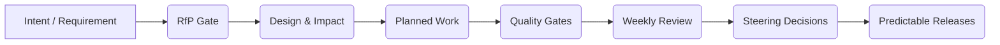

# 10. The Human Contract: Communicating Value, Empathy & Discipline

## Purpose

Shift from mechanics to relationships. This section shows how the Delivery Team (the Studio) communicates, defends, negotiates, and frames delivery discipline to the Customer Team so that governance becomes shared protection, not bureaucracy.

> VP Insight: Discipline is invisible when things go well—and priceless when things go wrong.

---

## 10.1 Why the Process Feels Inconvenient—and Why It Matters

Enterprises feel gated by sign‑offs, reviews, and structure. That friction is real: time is scarce, intent can be misread, and urgency is often genuine.
- What it feels like to customers: “More meetings, more documents, more delays.”
- What it actually provides: auditability, risk reduction, predictable delivery, and fewer expensive re‑works.

From the Field: “A customer once asked, ‘Why do you need so many reviews?’ We showed them how skipping the design/impact check on a card‑authorization change caused a two‑sprint slip and roughly $180k in rework across Fraud, Ledger, and Customer Service teams. They nodded—and asked what stays to prevent a repeat. The answer was our process.”

Caution: Never sell process for its own sake. Sell the avoided regret, the reduced ambiguity, and the preserved credibility.

---

## 10.2 The Customer’s Value Equation

Map each governance step to reduced uncertainty and cost:
- RfP gate: reduces solution ambiguity; prevents scope thrash.
- Design/impact assessment: reveals integration/operational risks early; cheaper fixes.
- Test discipline (Section 7): lowers leakage and MTTR; protects brand.
- Operational rituals (Section 9): turn surprises into managed trade‑offs.

Why This Matters: When leaders see process → fewer escalations, safer launches, faster changes, they support it—even if it feels heavier today.

---

## 10.3 Empathy as Business Literacy

Empathy is not “being nice.” It is listening for the business problem and translating discipline into stakeholder value.

- Start with curiosity: “Help me understand what you need to be confident next month.”
- Reflect the constraint: “I hear the date pressure and limited availability.”
- Reframe with value: “This gate reduces rework risk by clarifying integration behavior before we code.”

Pro Tip: Replace “policy” language with “protection” language. “We added this check to protect your budget and date.”

Practitioner Triad (Customer–Delivery interaction)
- Ideal State: Stakeholders view process as a safety net; objections surface early and are resolved in‑forum.
- Likely Reality: Stakeholders feel the weight during crunch; they question value and ask for exceptions.
- Delivery Team Survival Guide: Hear the objection; show past cost of failure; negotiate a lighter but equivalent control (shorter template, time‑boxed review) rather than removal.

---

## 10.4 Communicating the Value Story (Phrasing Templates)

Use simple scripts; replace jargon with stakeholder outcomes.

- Risk‑to‑Value frame:
  - “The RfP step prevents scope churn later. It trades 60 minutes today for weeks saved in delivery.”
- Cost‑of‑Change frame:
  - “Design notes reduce late integration surprises. A one‑hour review avoids a 40‑hour rework.”
- Deflect‑the‑Bypass frame:
  - “Bypassing this gate increases rework risk. We have two safe options: (1) protect the date by trimming scope, or (2) protect scope by moving the date or adding capacity. Which trade‑off do you prefer?”
- Executive frame:
  - “These are your internal controls for delivery. They reduce operational risk the same way audit reduces financial risk.”

> VP Guidance: Adding capacity is a last resort for short‑term problems. New people slow flow in the near term: onboarding/context time, coordination overhead, and disrupted work streams reduce net throughput for 1–2 sprints. Prefer scope or date trade‑offs first. Add capacity only for sustained demand (multiple sprints), and seat new members on stable streams with clear ownership.

Caution: Don’t preach. Acknowledge the cost, offer choices, and preserve control. “We can shorten the review, but not remove it.”

Practitioner Triad (Customer–Delivery interaction)
- Ideal State: Stakeholders ask for controls because they trust the outcomes.
- Likely Reality: They accept controls while negotiating the effort.
- Delivery Team Survival Guide: Offer two options—full or lighter‑weight—with explicit risk notes; capture decisions in the log.

---

## 10.5 Coaching the Delivery Team Mindset

The Studio must present discipline without defensiveness.
- Move from rules to reasons: “We do this to make next month safe, not to slow this week down.”
- Role‑play objections: “Too much process,” “No time,” “Why can’t we just ship?”
- Normalize trade‑offs: “We’ll either trim scope or increase risk. Which trade‑off do you prefer?”

From the Field: I once coached a PM to say, “We introduced the gating to protect your budget, not waste time.” The tone changed the conversation.

Coaching playbook: real situations and scripts
- Scenario: Fixed date, RfP feels heavy
  - What you say: “We can protect the date by locking definitions now (RfP) so build doesn’t churn. If we skip this, we risk 1–2 sprints of rework when integrations bite. Do you want to lock scope for the date, or widen the date for scope?”
  - Why it works: reframes the gate as schedule protection, not bureaucracy; offers a clear trade‑off.
- Scenario: “Can we skip tests to save time?” (see Section 7)
  - What you say: “Our error budget is low. If we skip tests, we’ll ship faster but spend the next sprint fixing prod regressions. We can either stabilize now and keep future sprints predictable, or ship fast and plan a hardening window.”
  - Why it works: uses the shared SLO/error‑budget language to align on risk appetite.
- Scenario: “Add more people to go faster” (capacity as last resort)
  - What you say: “New people slow flow for 1–2 sprints—onboarding and coordination cut net throughput. If this is a short‑term spike, let’s trim scope or move the date. If demand is sustained, we’ll add capacity and place them on a stable stream.”
  - Why it works: acknowledges urgency while teaching the cost of context and the conditions under which capacity helps.
- Scenario: Middle manager asks for overnight deliverables
  - What you say: “We can do X tonight, or we can do Y tomorrow—not both at quality. Which should we move? I’ll document the trade‑off and we’ll adjust the plan.”
  - Why it works: replaces a “no” with a prioritized choice and records the decision.
- Scenario: Executive asks to bypass impact assessment
  - What you say: “Here are two options with impacts: (1) ship now and accept higher rework risk; (2) run a 60‑minute impact check today and ship tomorrow with lower risk. Which do you prefer?”
  - Why it works: presents options and timelines, not resistance; keeps ownership with the sponsor.

Practice it (team exercise, 15 minutes)
- Pair up and role‑play two scenarios above; swap roles.
- Aim to offer two options with explicit risks in under 30 seconds.
- Debrief: Did we use customer language (budget, date, risk) rather than Studio jargon?

Checklist before a tough conversation
- What trade‑off are we proposing (scope/date/capacity)?
- What evidence are we bringing (leakage, error budget, dependency lead‑time, decision log)?
- What is the smallest lighter‑weight control we can offer instead of removal?
- Who owns the decision and what is the SLA (see Section 9.9/9.10)?
- How will we record the outcome (decision log entry and Jira links)?

---

## 10.6 Handling Behavioral Extremes

Use clarity, data, and escalation paths—never emotion.

Patterns and responses
- Aggressive bypass requests
  - Script: “Let’s anchor on our principles (Section 4). Here are two options and their impacts… Which do you prefer? I’ll record your choice in the decision log.”
  - Why it works: grounds the discussion in agreed principles; shifts from demand to decision.
- Silent resistance
  - Script: “Quick pulse—does this step feel like a blocker or a help? If blocker, we can try a lighter control for two sprints and review.”
  - Why it works: surfaces hidden objections; offers a reversible experiment.
- Leadership changes
  - Script: “Welcome. Here’s how our controls prevented rework last quarter. We can calibrate templates/cadence without removing protections.”
  - Why it works: re‑establishes value with evidence; invites co‑design of lighter controls.

Mini‑playbook (what to do in the moment)
- Slow the tempo: name the decision, the options, and the impacts
- Use the log: write the choice and owner/date while on the call
- Offer reversible experiments: time‑boxed lighter controls with a review date

Checklist before escalation
- Do you have options with quantified impacts?
- Is the principle/threshold being bent explicit?
- Is the Steering forum the right place—or can Weekly Review decide?

---

## 10.7 The Empathy Dividend

Discipline practiced with empathy compounds.

Signals it’s working
- Fewer escalations and “hot” channels
- Shorter Weekly Reviews; fewer Steering decisions required
- Stakeholders start requesting controls (e.g., “Let’s do an RfP check first”)

Timeline (typical)
- Months 0–1: Feels heavy; trust neutral
- Months 2–3: Predictable demos; exceptions are documented and reversible
- Months 4–6: Stakeholders defend the discipline; governance feels “light”

Coach’s script to reinforce gains
- “Notice we haven’t had late surprises in two months—that’s the RfP/design discipline paying off.”
- “We turned two potential escalations into options; thanks for choosing trade‑offs early.”

Checklist to sustain the dividend
- Keep decision papers short and on time
- Decommission stale dashboards; prune metrics quarterly
- Review exceptions monthly; update thresholds if patterns persist

VP Insight: “They don’t thank you for guardrails; they thank you for stability when crises arise.”

---

## 10.8 Executive Framing (Sponsors & Steering)

How to frame governance to executives:
- Anchor to risk and runway: “This keeps delivery within our risk appetite and preserves runway.”
- Speak in options: scope, date, capacity—with costs and secondary impacts.
- Use evidence, not adjectives: show error budgets, dependency funding, and decision backlog age.

Scenarios and scripts
- Sponsor asks, “Why so many checks?”
  - Script: “These are our internal controls for delivery. They keep work within risk appetite. We can adjust cadence/template size, but we need the controls to hold dates and budget.”
- “We need this by quarter‑end—can you skip steps?”
  - Script: “Two options: reduce scope and keep the date, or keep scope and move the date or add funded capacity. If we skip controls, the rework risk rises; here are similar cases from last quarter.”
- “Dashboards feel noisy.”
  - Script: “We’ll focus Steering on three signals: release readiness, top 5 risks with options, and runway/funding. We’ll retire the rest from this forum.”

Executive checklist
- Pre‑wire decision papers 48 hours ahead with 2–3 options and costs
- Ask for a choice, not a debate; record decision and owner/date live
- Set a 3‑business‑day decision SLA; route slippages to next Steering

Pro Tip: Use financial analogies. “You wouldn’t run a company without audit; the same logic applies to delivery controls.”

Practitioner Triad (Customer–Delivery interaction)
- Ideal State: Sponsors ask for the discipline by name; they pre‑wire decisions.
- Likely Reality: Sponsors tolerate governance but want speed.
- Delivery Team Survival Guide: Pre‑wire, present options, and enforce the decision SLA from Section 9.9/9.10.

---

## 10.9 Delivery Manager Guidance: Evaluating Trade‑off (Concession) Proposals

### Overarching guidance and maxims
- Prefer lighter controls over removals; keep intent, reduce form.
- Time‑box and label exceptions; make them reversible with a reversion date.
- Never spend the quality reserve to buy schedule; stabilization trumps speed when error budget is red.
- Tunable defaults: reserve 15–25% capacity for quality/debt; maintain 10–20% debt amortization reserve (adjust per program in Appendix: Thresholds).
- Decision pattern: present 2 options with impacts → assign owner/date → record in decision log → set review date (SLA 3 business days for sponsor decisions per Section 9.9/9.10).

#### Evidence pack (minimum)
- Error‑budget state; %RfP and shelf‑life; DependencyFunding% and readiness; capacity reserve; CR link if billable.

### DPM concessions and coaching

#### What they ask
Delivery Product Managers carry the pressure of dates, stakeholder expectations, and roadmap integrity. Their concessions often sound like “Can we compress RfP?” or “Can we trim AC and firm it up later?” The goal is reasonable: keep momentum without letting ambiguity leak into build.

#### How to decide
First identify which Risk Surfaces are touched and whether the pressure is short‑term (≤ 2 sprints) or sustained. If the item is a low‑risk enhancement and Customer sign‑off is feasible the same day, prefer a lighter control over removal.

#### Preferred lighter controls
- Time‑boxed design addendum (≤ 60 minutes)
- Partial AC with a dated follow‑up to complete
- RfP‑lite for small, well‑bounded enhancements

#### Invariants
- Every Feature entering planning has AC/NFR recorded and signed off (even if partial, with dated follow‑up)
- All concessions are time‑boxed and labeled; decision log entry with owner/date is mandatory
- Tunable defaults apply: keep 15–25% reserve for quality/debt; do not consume reserves to buy schedule

#### Hard no’s
- Net‑new integrations without RfP
- Removing AC on regulatory/compliance items

#### Example (Issuer BIN validation in BFSI)
The DPM pushes to skip a formal RfP on “add BIN range checks.” You confirm it’s contained in Authorization, require a one‑page design addendum (error responses, logging, fraud hooks), set two AC today (valid/invalid ranges), and add a dated follow‑up AC to verify fraud event emission next sprint. Momentum preserved; ambiguity contained.

---

### EM concessions and coaching

#### What they ask
Engineering Managers tend to reach for capacity, parallelism, and squeezing hardening to keep velocity credible when surprises hit.

#### How to decide
Read the quality state first. If the error budget is red, stabilization beats new intake. Check WIP/aging and onboarding overhead (new people reduce net throughput for 1–2 sprints). For short spikes, prefer scope/date trade‑offs. For sustained demand, add capacity onto a stable stream and keep a visible reserve (15–25%) for quality/debt.

#### Preferred lighter controls
- Temporary WIP cap (visible on the board)
- 0.5–1 day mini‑hardening window
- Time‑boxed spike with explicit exit criteria

#### Invariants
- Do not reduce stabilization work when error budget is red
- Capacity additions seat on stable streams with clear ownership and onboarding plan
- Exceptions are ≤ 2 sprints and carry a reversion date and owner

#### Hard no’s
- Adding people for a 1‑sprint spike
- Cutting stability/hardening to hit a date when error budget is depleted

#### Example (Payments API throughput regression)
CI shows critical‑path flake and a perf regression after a dependency update. Instead of adding two engineers for a week, you cap WIP to two items, book a 0.5‑day hardening window, and push one non‑critical story. Throughput recovers next sprint; no onboarding tax paid.

---

### Tech Lead concessions and coaching

#### What they ask
Tech Leads will ask to “skip the impact assessment,” “stub the external interface now and fix later,” or “defer that debt clean‑up” to unblock.

#### How to decide
Verify integration readiness (contracts, credentials, environments) and production blast radius. Prefer contract‑first stubs and targeted impact addenda over skipping analysis. Date debt deferrals and link them to the portfolio for deliberate paydown.

#### Preferred lighter controls
- Contract‑first stub aligned to partner spec
- 60‑minute targeted impact addendum before code freeze
- Dated debt item linked to catch‑up plan

#### Invariants
- Customer‑visible journeys are never shipped without an agreed interface contract or approved contract‑first stub
- All stubs map to a signed (or to‑be‑signed) contract artifact; no ad‑hoc stubs without traceability

#### Hard no’s
- Shipping without agreed contracts on customer‑visible paths

#### Example (Fraud feed v2 fields)
A partner introduces new fraud payload fields mid‑sprint. You approve a contract‑first stub aligned to the partner spec, run a 60‑minute impact addendum to capture mapping and operational alarms, and schedule the full integration behind a feature flag the following sprint.

---

### QA/Test Manager concessions and coaching

#### What they ask
QA leaders often propose to “reduce coverage this sprint,” “skip customer‑service tests,” or “accept flake while we stabilize.”

#### How to decide
Look at critical‑path pass rate, leakage trend, SEV history, and certification environment stability. Keep depth on critical paths; if you must cut, cut breadth. Quarantine flakey tests and add a mini‑hardening window rather than normalizing flake.

#### Preferred lighter controls
- Maintain ≥95% coverage on critical customer journeys; reduce non‑critical breadth
- Quarantine flake and schedule a 0.5‑day hardening window
- Shorten cluster certification scope only with an explicit restoration plan

#### Invariants
- Critical‑path coverage thresholds are maintained; any temporary reduction carries a restoration date
- Unknown leakage is not acceptable for release; leakage trend must be understood and within threshold

#### Hard no’s
- Reducing critical‑path coverage below threshold
- Shipping with unknown leakage

#### Example (Checkout authorization path)
Under date pressure, QA proposes to drop some customer‑service tests. You preserve depth on the “authorize‑capture‑receipt” flow, cut non‑critical UI breadth (e.g., marketing banners), and quarantine two flaky component tests for hardening tomorrow morning. Release goes out; post‑release noise is minimal.

---

### Contract‑ready clauses (for SOW/Appendix)
- Requirement‑to‑Feature decomposition, design addenda, and integration readiness activities are billable under SFM, and counted against funded capacity under TCM. Related Jira items must carry a decomposition label/field and link to the approved Change Request reference (Section 8A: CR lifecycle) or TCM capacity allocation.
- Any process exception must be time‑boxed (≤ 2 sprints), labeled in Jira as a process exception, assigned an owner, and include a reversion plan and date; decisions follow Section 8 decision rights (Studio/CCB within guardrails; Steering for material scope/cost/date/capacity or policy exceptions).
- Temporary capacity increases are permitted only for sustained demand and shall not displace stabilization work when error budgets are depleted; TCM mix/ramp rules apply (Section 8B).
- External integration changes require either a signed interface contract or an approved contract‑first stub before release; customer‑owned dependencies/environments follow Section 8C Exclusions unless assumed in an approved CR or capacity change.
- Critical customer‑journey test coverage thresholds shall not be reduced below agreed levels; any temporary reduction must be time‑boxed with a restoration plan and decision log entry; release gating follows Section 7 quality governance.
- Decisions that alter scope, cost, date, or capacity must be documented in a decision paper and recorded in the decision log; Steering (EO‑owned) decisions carry a 3‑business‑day turnaround SLA (Section 9.10).

### Delivery team vocabulary (add to Glossary)
- Concession: a requested relaxation or replacement of a process/gate to meet a near‑term goal.
- Lighter control: a smaller, faster control that preserves the intent of the original control.
- Exception: a time‑boxed, labeled concession with a reversion date and owner.
- Reversible experiment: a lighter control with explicit rollback on a review date.
- Shelf‑life (RfP): time a signed Feature remains valid before re‑confirmation.
- Decision paper: a 1‑page option/impact memo with owner/date (template in Appendix).
- Process‑exception label: Jira tag to index and review exceptions in governance.

### Exception policy & close‑out (applies to all concessions)
Scope
- Applies to any concession affecting process/gates (RfP, design/impact, testing/cert), scope/date/capacity swaps, integration readiness, and quality/stability controls across all forums (Daily/Weekly/Grooming/Planning/Monthly/Steering).

Non‑exceptable invariants
- No bypass of regulatory/compliance AC and required sign‑offs
- No shipping customer‑visible journeys without signed interface contracts or approved contract‑first stubs
- No reduction of critical‑path coverage below agreed thresholds; no release with unknown leakage
- No removal of stabilization when error budget is red

Procedure
- Time‑box to ≤ 2 sprints; add `process-exception` label and owner/date; capture decision linkages (Jira + decision log)
- Set a review date in Weekly/Monthly; if repeated, propose a policy/threshold update in Steering
- Restore the original control; run a 15‑minute retro on the exception; update thresholds if patterns persist

Enforcement & visibility
- Exceptions must appear on the Program dashboard (Section 9.13) via the `process-exception` index
- Decision SLA (3 business days) applies to executive approvals; overdue items escalate to next Steering
- Security/Compliance/Ops involvement: if a concession touches their Risk Surfaces (e.g., PCI/SOX, SOC controls, on‑call/operability), include their owner in the evidence pack and approval path

### Persona matrix (quick scan)

| **Persona**  | **Common concession**                                   | **Prefer this lighter control**                                                    | **Invariant to respect**                                                  | **Hard no**                                             |
|--------------|--------------------------------------------------------|------------------------------------------------------------------------------------|--------------------------------------------------------------------------|---------------------------------------------------------|
| DPM          | Compress RfP; trim AC; resequence                     | 60‑min design addendum; partial AC with dated follow‑up; RfP‑lite                  | AC/NFR recorded; concessions labeled/time‑boxed; keep 15–25% reserve     | Net‑new integrations without RfP; remove AC on regulatory items           |
| EM           | Add capacity; parallelize; squeeze hardening          | Temporary WIP cap; 0.5–1d hardening; time‑boxed spike                              | No stabilization cuts when error budget red; stable stream onboarding     | Add people for 1‑sprint spike; cut hardening when red                     |
| Tech Lead    | Skip impact; stub without contract; defer debt        | Contract‑first stub; 60‑min impact addendum; dated debt catch‑up                   | No customer path without contract/stub; traceable stub artifacts          | Ship without agreed contract on customer paths                             |
| QA/Test      | Reduce coverage; skip customer‑service tests; accept flake | Maintain ≥95% critical‑path coverage; cut breadth; quarantine flake + 0.5d hardening | No unknown leakage; restore plan dated for any reduction                   | Reduce critical‑path coverage; ship with unknown leakage                   |

### Manager’s one‑page checklist (printable)

Purpose: capture a safe, reversible concession decision in one page.

Practitioner note: Keep this to one page. Decisions slow down as artifacts grow—optimize for clarity over completeness.

*Trigger*
About: Defines the triggers for when this checklist applies.
- [ ] Short‑term pressure (≤ 2 sprints) or sustained demand identified
- [ ] A process/gate, scope/date/capacity, integration readiness, or quality control is impacted

Practitioner note: Use this for exceptions and concessions—not for policy changes. Don’t normalize repeat exceptions; propose a policy update instead.

*Decision frame*
About: How to present trade‑offs and select the decision forum.
- [ ] Trade‑off framed as scope/date/capacity (choose 1–2)
- [ ] Two options listed with impacts (time, cost, risk) and owners/dates
- [ ] Decision forum set (Studio/CCB/Steering) per Section 8 decision rights

Practitioner note: Lead with options and quantified impacts. Avoid “third option” hedges that obscure ownership or risk.

*Inputs to attach (evidence pack)*
About: Minimum evidence required to support the decision.
- [ ] Error‑budget state and critical‑path pass rate (Section 7)
- [ ] %RfP and shelf‑life; design note/addendum link (Section 5)
- [ ] DependencyFunding% and readiness (contracts/creds/env) (Section 5.10)
- [ ] Capacity reserve (15–25%) and amortization reserve (10–20%) status
- [ ] CR/capacity references (SFM/TCM) (Section 8)

Practitioner note: Attach the minimum evidence that proves the state. Prefer stable links/screenshots over raw exports that drift.

*Controls & labels*
About: Operational controls and indexing to keep the exception visible and reversible.
- [ ] Concession is time‑boxed (≤ 2 sprints) with reversion date
- [ ] Jira labels set: `process-exception`, `decomposition` (if applicable)
- [ ] Decision log entry created with owner/date and review date

Practitioner note: Missing labels make exceptions invisible—treat labeling as part of the control, not an afterthought.

*Invariants audit (must pass)*
About: Non‑negotiables that must be true before approval.
- [ ] No bypass of regulatory/compliance AC/sign‑offs
- [ ] No shipping customer paths without signed contracts or approved contract‑first stubs
- [ ] No reduction of critical‑path coverage below threshold; no release with unknown leakage
- [ ] No removal of stabilization when error budget is red

Practitioner note: Don’t tick by habit—tick with evidence. If any invariant fails, the only safe option is to change scope/date.

*Approvals & involvement*
About: Who must approve and when to involve Security/Compliance/Ops.
- [ ] Security/Compliance/Ops owner added if their Risk Surfaces are touched
- [ ] Executive decision SLA (3 business days) acknowledged if Steering approval required

Practitioner note: Pre‑wire approvers with a 3‑minute read and ask for a yes/no choice. Surprises create delays.

*Scheduling & visibility*
About: Where the exception is tracked and when it will be reviewed.
- [ ] Review booked on Weekly/Monthly agenda; escalation path defined
- [ ] Exception visible on Program dashboard via `process-exception` index (Section 9.13)

Practitioner note: If it isn’t on a calendar or dashboard, it doesn’t exist. Visibility keeps exceptions temporary.

*Sign‑offs*
About: Formal signatures to validate and record the exception.
- Requestor: __________  Date: __________
- Delivery Manager: __________  Date: __________
- Customer Product Owner / Exec (if required): __________  Date: __________
- Security/Compliance/Ops (if applicable): __________  Date: __________

Practitioner note: Signatures record decisions, not endorsements. Missing required sign‑off invalidates the exception.

*Links*
About: Pointers to single sources of truth for auditability.
- Jira item(s): __________  CR/Capacity ref: __________  Decision log entry: __________

Practitioner note: Link to the single source of truth; avoid duplicate trackers that fall out of sync.

*Notes (constraints, follow‑ups)*
About: Constraints and follow‑ups that ensure closure.
- ______________________________________________________________________
- ______________________________________________________________________

Practitioner note: Capture constraints and follow‑ups with owners/dates. If it matters, it needs an owner and a date.

---

## Visual Contract (Optional)

> Why This Matters: Making the flow visible turns “process” into a shared contract. It also clarifies where to negotiate lighter controls without removing them.
