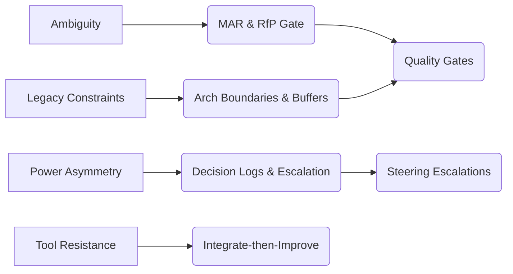

# Understanding the Enterprise Context

*The environment that shapes everything*

## The Reality Check

Enterprise delivery isn't just "agile at scale." It's a fundamentally different game played on a different field with different rules.

Picture this: You're three months into building a real-time payment processing system for a major card issuer. The core payment engine is working, integration with Visa/Mastercard networks is complete, and you're 80% through UAT. Then the client's Chief Risk Officer drops a bombshell: "We need to implement PCI DSS 4.0 controls retroactively, and the new fraud detection rules require us to capture 47 additional data points per transaction, including device fingerprinting and behavioral analytics."

Your current data model supports 12 fields. The new requirements need 59. The existing audit trail captures 8 events; PCI 4.0 requires 23. The fraud detection API you integrated expects JSON; the new rules need XML with specific schema validation. Your go-live date is in 6 weeks, but the compliance team needs 12 weeks to certify the new controls.

This is enterprise delivery. The environment itself becomes your primary constraint.

> **VP Reflection**: "The most dangerous risks weren't code defects. They were approvals with no owner and data we couldn't access in time."

## 2.1 Characteristics of Large Enterprises

Large enterprises operate at a scale that creates unique challenges:

**Scale and Complexity**: Let me explain what this really means. When a customer swipes their credit card at a store, that "simple" transaction actually touches 23 different computer systems:

- **Core Banking System** (COBOL): Where the customer's account balance lives
- **Payment Gateway** (Java): Processes the transaction with Visa/Mastercard
- **Fraud Detection** (Python): Checks if this looks like a stolen card
- **Customer Database** (Oracle): Stores the customer's profile and preferences
- **Transaction Logger** (MongoDB): Records every detail for audit purposes
- **Compliance Reporting** (SAS): Generates reports for regulators
- **Risk Management** (R): Calculates how risky this customer is
- **And 17 more systems** for things like rewards points, insurance, marketing, etc.

Here's the problem: Each system is owned by a different team. The Core Banking team releases updates every 6 months. The Payment Gateway team releases every 2 weeks. The Fraud Detection team releases daily. When you need to add a new feature, you have to coordinate with all 23 teams, and they all have different schedules, different priorities, and different definitions of "urgent."

**Legacy Architecture**: This is where it gets really painful. The core banking system was built in 1994 using COBOL (a programming language that's older than most of your team). It's running on IBM mainframes that cost $2M per year just to keep running. The code is so old that the person who wrote it retired 15 years ago, and no one fully understands how it works.

The customer database uses Oracle 11g (released in 2007) with custom database triggers that were written by someone who left the company in 2010. These triggers do things like automatically calculate interest rates, but no one knows exactly how they work. If you change something, you might break the interest calculation for 2 million customers.

The fraud detection system expects data in a proprietary binary format that predates XML. It's like trying to read a document written in ancient hieroglyphics. Every time you want to add a new feature, you have to reverse-engineer these old systems and build "adapters" that translate between the old format and the new format.

**Audit and Compliance**: This is where enterprise delivery becomes a nightmare. Let's say you want to change one line of code to fix a bug. Here's what happens:

1. **Legal Team**: "Does this change affect any regulatory requirements?" (2 weeks to review)
2. **Security Team**: "Does this change create any security vulnerabilities?" (2 weeks to review)
3. **Risk Team**: "Does this change increase operational risk?" (2 weeks to review)
4. **Compliance Team**: "Does this change affect our SOX compliance?" (2 weeks to review)
5. **Data Privacy Team**: "Does this change affect GDPR compliance?" (2 weeks to review)
6. **Chief Technology Officer**: "Does this change meet our architecture standards?" (2 weeks to review)

That's 12 weeks (3 months) to change one line of code. And here's the kicker: Each team often gives you conflicting requirements. Legal says "you must log everything," Security says "you must encrypt everything," and Compliance says "you must delete everything after 7 years." You can't do all three.

**Siloed Organizations**: This is like having 5 different bosses, each with different priorities:

- **Card Products Team**: "We need new features every month to stay competitive!"
- **Risk Team**: "We need 6 months of testing before we can approve anything!"
- **Compliance Team**: "We need everything documented in our specific format!"
- **IT Operations Team**: "We need zero downtime, no exceptions!"
- **Business Team**: "We need to launch before our competitor launches next week!"

Each team has its own budget, its own success metrics, and its own escalation path. The Card Products team gets bonuses for launching features quickly. The Risk team gets bonuses for preventing losses. The Compliance team gets bonuses for passing audits. They're all working toward different goals, and your delivery team is caught in the middle.

**Political Sensitivity**: This is where it gets really messy, and it's not just about the C-suite. The real battles happen in middle management, where delivery teams spend most of their time.

Here's what really happens: You're trying to get approval for a database upgrade. The IT Operations Manager says "we can't afford downtime, do it during the weekend." The Security Manager says "we need 2 weeks to review the security implications." The Compliance Manager says "we need to update all our documentation first." The Budget Manager says "this wasn't in the quarterly budget, you'll have to wait until next quarter."

Each manager has their own metrics and their own boss to please. The IT Operations Manager gets bonuses for uptime. The Security Manager gets bonuses for preventing breaches. The Compliance Manager gets bonuses for passing audits. The Budget Manager gets bonuses for staying under budget. They're all working toward different goals, and your delivery team is caught in the middle.

Here's a real example: We needed to upgrade our payment processing system to handle more transactions. The IT Operations Manager (John) said "we can do it this weekend, but we need 4 hours of downtime." The Business Manager (Sarah) said "we can't have downtime during peak shopping season, do it next month." The Security Manager (Mike) said "we need to run penetration tests first, that takes 2 weeks." The Compliance Manager (Lisa) said "we need to update our PCI DSS documentation, that takes 3 weeks."

So we had to wait 3 weeks for compliance, then 2 weeks for security testing, then wait for the next non-peak weekend. What should have been a 4-hour upgrade became a 2-month project because of middle management politics.

**Middle Management Conflicts**: This is where the real pain lives. Middle managers are trying to look good to their bosses, and they often have conflicting priorities.

Here's what happens: The Product Manager wants to launch features quickly to hit their quarterly targets. The Quality Manager wants to slow down and test everything thoroughly to avoid defects. The Operations Manager wants to minimize changes to reduce risk. The Budget Manager wants to cut costs wherever possible.

Each manager reports to a different director, and each director has different priorities. The Product Manager's director cares about revenue. The Quality Manager's director cares about customer satisfaction. The Operations Manager's director cares about system stability. The Budget Manager's director cares about cost control.

When you're trying to make a decision, you're not just choosing between technical options. You're choosing between making the Product Manager look good (by shipping fast) or making the Quality Manager look good (by testing thoroughly) or making the Operations Manager look good (by minimizing risk) or making the Budget Manager look good (by cutting costs).

Here's a real example: We were building a new feature that required a database change. The Product Manager said "ship it this week, we need it for the quarterly demo." The Quality Manager said "we need 2 weeks of testing first." The Operations Manager said "we can't change the database during peak hours." The Budget Manager said "we can't afford the extra testing time."

We ended up shipping it without proper testing, it broke in production, and everyone blamed everyone else. The Product Manager blamed the Quality Manager for not catching the bug. The Quality Manager blamed the Product Manager for rushing the release. The Operations Manager blamed both of them for causing the outage. The Budget Manager blamed everyone for the extra costs of fixing it.

**Delivery Implication**: You must design governance, buffers, traceability, and visibility — because the environment is not forgiving of opacity.

> **From the Field**: "We were building a mobile payment app for a European bank. Two weeks before go-live, the Data Protection Officer discovered we weren't logging consent withdrawals properly for GDPR. We had to retrofit 47 different user actions across 12 microservices, implement a new audit trail format, and get it certified by the DPO's external auditor. The 2-week delay cost €2.3M in lost revenue and damaged our relationship with the client's compliance team."

## 2.2 Power & Decision Asymmetry

In enterprise delivery, power is not evenly distributed:

**Customer Control**: Here's the reality check. The customer holds all the cards. They control the money (funding), they control the approvals (sign-off), and they control what changes are allowed (change governance). Your delivery team can't make any major decisions without their approval.

Think of it like this: You're building a house, but the customer owns the land, controls the budget, and decides what materials you can use. You can suggest using better materials, but if they say "no," you're stuck with what they want. You can influence their decisions, but you can't force them.

**Blame Center**: This is the most frustrating part. When things go wrong, guess who gets blamed? The delivery team. Even when the problem was caused by a decision the customer made.

Here's a real example: The customer decided to use a specific database that we warned them was unreliable. We said "this database has known issues and will cause problems." They said "use it anyway, we've already bought the licenses." Six months later, the database crashes every week, causing 4-hour outages. Who gets blamed? The delivery team. "Why didn't you build a more reliable system?"

**Internal Politics**: Enterprise organizations are like soap operas. People form alliances, backstab each other, and change sides constantly. The person who was your biggest supporter last month might be your biggest enemy this month because they got a new boss.

Here's what happens: You're working with Sarah from the Business team. She's been great, always approving your requests quickly. Then Sarah gets promoted and moves to a different department. Her replacement, Mike, doesn't like the previous team's decisions and wants to "start fresh." All the agreements you made with Sarah are now worthless. Mike wants to renegotiate everything.

**Middle Management Power Struggles**: This is where it gets really ugly. Middle managers are constantly jockeying for position, and your delivery team becomes a pawn in their games.

Here's a real example: We were working on a payment processing feature. The Product Manager (Sarah) wanted it built one way. The Technical Manager (Mike) wanted it built differently. The Operations Manager (Lisa) wanted it built a third way. Each manager was trying to prove to their director that they were the most important.

Sarah's director cared about user experience, so Sarah wanted a fancy UI. Mike's director cared about performance, so Mike wanted optimized code. Lisa's director cared about reliability, so Lisa wanted extra error handling. They all had different success metrics, and they were all trying to make their approach look better.

The result? We had to build three different versions and let the managers fight it out in meetings. What should have been a 2-week feature became a 6-week political battle. In the end, we built it Sarah's way, but Mike and Lisa made sure to document all the problems so they could say "I told you so" when it failed.

**Territorial Disputes**: Middle managers are very protective of their domains, and they don't like it when other managers try to tell them what to do.

Here's what happens: The Security Manager thinks the Quality Manager is stepping on their toes by doing security testing. The Operations Manager thinks the Technical Manager is making changes without consulting them. The Budget Manager thinks everyone is spending too much money without approval.

Each manager has their own "turf" and they guard it jealously. If you try to work with one manager, the other managers might sabotage you to protect their territory. It's like a game of musical chairs, but with more backstabbing.

**Decision Ownership**: This is the most dangerous part. The people making the decisions don't have to live with the consequences. The CTO decides to use a new technology that's "cutting edge." If it fails, the CTO doesn't have to fix it at 3 AM. The delivery team does.

Here's a real example: The customer's Chief Risk Officer decides that all data must be encrypted with a specific algorithm that takes 10x longer to process. This will make the system 10x slower. The CRO makes this decision in a meeting and then goes on vacation. The delivery team has to figure out how to make it work. When the system is too slow, who gets blamed? The delivery team.

**Delivery Implication**: Establish documented decision logs, traceability, and escalation paths. Never proceed on verbal consensus.

> **VP Insight**: "When decisions live in email threads, accountability evaporates. Always force a record so no one can accuse you of 'not agreeing' later."

### Executive Turnover & Mandate Resets

Senior leadership changes (CIO/CTO/CRO/CEO) routinely reset mandates mid‑program. A new executive often arrives with different incentives, preferred vendors, or a contrasting philosophy (build vs buy, centralized vs federated, monolith vs platform). What felt “approved” last month can be reopened without anyone saying the prior decision was wrong.

**Typical risks**:
- Budget freezes and re‑prioritization windows (4–8 weeks) that starve in‑flight work
- Architecture pivots that invalidate signed designs and RfP decisions
- Governance resets: new decision forums, new SLAs, different evidence expectations
- Contract reinterpretations and “approved in principle” items reverting to unfunded

**Delivery Implication**: Treat leadership changes as a formal risk event.
- Freeze material scope changes until the new exec re‑affirms or replaces prior decisions in writing.
- Publish a 3–5 page “continuity pack”: current plan, funded scope vs unfunded exposure, top dependencies with evidence, open decisions with options/impacts.
- Re‑validate RfP‑signed Features with a fast confirmation workshop; extend shelf‑life where needed.
- Anchor to the SoW/contract and decision log; avoid “assumed continuity” without records.

> **From the Field**: "A new CIO paused our card‑issuer program for a ‘platform review’. Our continuity pack showed $420k of unfunded exposure and three dependency lead‑times with no commitment. Rather than defend history, we offered options A) de‑scope; B) re‑sequence behind committed dependencies; C) fund gaps and hold the date. The CIO chose B+C. We lost 2 weeks to the pause—not 2 quarters to churn."

## 2.3 Ambiguity, Hidden Dependencies & Unseen Costs

Enterprise requirements are rarely complete:

**Incomplete Specifications**: This is the most common problem in enterprise delivery. The business gives you requirements that sound simple, but they're actually incredibly complex.

Here's a real example: The business says "build a fraud detection system." Sounds simple, right? Wrong. What they actually mean is:

- Real-time scoring using 200+ different variables (customer age, transaction amount, time of day, location, device type, etc.)
- Integration with 5 external data providers (credit bureaus, identity verification services, etc.)
- Machine learning models that retrain themselves every week
- Compliance with 3 different regulatory frameworks (PCI DSS, GDPR, and local banking regulations)
- Real-time alerts for high-risk transactions
- Detailed reporting for compliance audits
- Integration with existing customer service systems

What gets written down in the requirements document? "Detect fraudulent transactions." That's it. One sentence. You're supposed to figure out everything else.

**Hidden Dependencies**: This is where projects go to die. You think you're building one thing, but you're actually building 20 things, and you don't find out until it's too late.

Here's what happened to us: We were building a fraud detection system that needed customer data from the core banking system. Sounds straightforward, right? Wrong. The core banking system was being migrated from Oracle to PostgreSQL. The migration was 6 months behind schedule. The new system used a completely different data model. The fraud team needed the data in a specific format that required a custom ETL (Extract, Transform, Load) process. The ETL process needed approval from 4 different teams. Each approval took 3 weeks. So we had to wait 12 weeks just to get the data we needed to start building.

**Unforeseen Costs**: This is where budgets explode. You estimate the cost of building a feature, but you don't realize how much it costs to run it.

Here's a real example: We built a fraud detection system that needed to process 10 million transactions per day. Our current infrastructure could only handle 1 million transactions per day. To scale up, we needed:

- New servers (€500K)
- New database licenses (€200K per year)
- New monitoring tools (€100K per year)
- New operational procedures (€300K in training and documentation)
- New backup systems (€150K)
- New security systems (€250K)

The total cost was 3x our original estimate. The timeline extended by 8 months because we had to wait for all the new infrastructure to be installed and configured.

**Integration Surprises**: This is where technical assumptions meet reality. You think two systems will work together easily, but they don't.

Here's what happened: Our fraud detection system expected data in JSON format. The core banking system output data in XML format. We needed to build a custom adapter to convert between the two formats. Sounds simple, right? Wrong. The adapter needed to handle 15 different transaction types, each with its own data schema. The schemas changed every month as the business added new features. The adapter needed to be updated every month. Each update required testing, approval, and deployment across 3 different environments (development, testing, and production). What we thought would be a 2-week task became a 6-month maintenance nightmare.

**Delivery Implication**: Always assess for unknowns, charge risk buffers, log "unknowns discovered" items.

> **Caution**: The biggest overruns come not from features, but from emergent dependencies you didn't foresee.

## 2.4 Organizational Momentum & Inertia

Enterprise organizations resist change:

**Process Inertia**: This is where "we've always done it this way" becomes a religion. Middle managers are comfortable with their current processes, and they don't want to change them.

Here's what happens: You want to introduce a new testing process that will catch bugs earlier. The Quality Manager says "we've been using this process for 5 years, why change it?" The Operations Manager says "our team is already trained on the old process, retraining will take too long." The Budget Manager says "we don't have budget for new tools."

Each manager has invested time and effort in learning the current process, and they don't want to admit that it's not working. They're afraid that if they change the process, they might look incompetent or their team might struggle with the new way of doing things.

**Tool Adoption**: This is where middle managers become the biggest obstacle to progress. They're comfortable with their current tools, and they don't want to learn new ones.

Here's a real example: We wanted to introduce a new project management tool that would help us track progress better. The Project Manager said "we're already using Excel spreadsheets, why do we need something else?" The Operations Manager said "our team doesn't have time to learn new software." The Budget Manager said "we can't afford new licenses."

The result? We kept using Excel spreadsheets, which meant we couldn't track progress properly, which meant we couldn't identify problems early, which meant we had more delays and cost overruns. But the managers were happy because they didn't have to change anything.

**Cultural Resistance**: This is where "that's not how we do things here" becomes a weapon. Middle managers use company culture as an excuse to avoid change.

Here's what happens: You want to introduce a new way of working that will make the team more efficient. The Technical Manager says "that's not how we do things here." The Operations Manager says "our culture is about stability, not change." The Quality Manager says "we've always been successful with our current approach."

They're not saying "this won't work." They're saying "this doesn't fit our culture." It's a way of rejecting change without having to give a real reason. It's like saying "I don't like it" but making it sound like a company policy.

**Change Fatigue**: This is where organizations become paralyzed by too much change. Middle managers get overwhelmed and start rejecting everything new.

Here's what happens: The company has been through 3 major reorganizations in the past 2 years. The IT department has changed tools 4 times. The quality process has been updated 6 times. The project management approach has been revised 8 times.

Now, when you want to introduce a new improvement, the managers say "we're tired of changing everything all the time." They're not rejecting your specific idea; they're rejecting the idea of any change at all. They've reached their limit of how much change they can handle.

The result? The organization becomes stuck with outdated processes and tools, but no one wants to change anything because they're afraid of more disruption.

**Delivery Implication**: Start small, deliver quick wins, use champions, emphasize benefits rather than imposition.

> **Pro Tip**: Don't expect everyone to buy in at day one. Use pilot modules and visibility to scale adoption.

## 2.5 Agile Intent vs. Waterfall Expectation

There's a fundamental tension between agile delivery and enterprise expectations:

**Fixed Milestone Expectations**: Clients think in terms of "project phases" and "deliverables," not "working software."

You deliver working software every 2 weeks, but the client wants a "Requirements Document" and "Design Document" before you start coding. They want to know exactly what will be delivered on March 15th and how much each phase will cost.

**Real example**: We were building a mobile banking app. The client said "we need to know exactly what features will be in version 1.0 before we start development." The Studio said "let's build a working prototype first, then refine it." The client said "that's not how we do things here. We need everything planned upfront." 

Result: The Studio spent 3 months writing documents instead of building software. By the time we started coding, everything had changed. The client was happy because they had their documents. The Studio burned through the fixed-price contract budget on documentation instead of building value.

**Progress Measurement**: Clients think progress means "checking off boxes on a list," not "delivering working software."

You show them a working app, but they ask "where's the Requirements Document?" They can't see the working software because they're looking for documents. They want progress in their format, using their metrics.

**Real example**: The Studio delivered a payment processing system that could handle 10,000 transactions per hour. The client said "that's nice, but where's the Requirements Document?" The Studio said "the requirements are in the working software." The client said "that's not how we measure progress. We need documents for our audit process." 

Result: The Studio spent 2 weeks writing a 50-page document describing what the software already did. We couldn't charge for this because it was "documentation," not "development."

**Scope Flexibility**: You want to adapt and improve as you learn. Clients want everything locked down and predictable.

After 2 weeks, you realize the original approach won't work. But the client says "you can't change the scope, we already approved it" and "you can't change the technology, we already bought the licenses" and "you can't change the timeline, we already allocated the budget."

**Real example**: The Studio was building a customer portal. After 4 weeks, we realized the design was confusing. The Studio wanted to redesign it. But the client said "we can't change the design, we already showed it to our CEO" and "we can't change the technology, we already bought the licenses" and "we can't change the timeline, we already allocated the budget."

Result: The Studio built a confusing portal that users hated, but the client was happy because we stuck to their approved plan. The Studio knew we could build something better, but we were constrained by their governance processes. When it failed, the Studio got blamed, not their rigid processes.

**Governance Misalignment**: Your 2-week sprints don't align with their 3-month quarters.

You have daily standups and bi-weekly demos. They have monthly steering committees and quarterly reviews. They want to see "Phase 1: Requirements (50% complete)." You have working software that's 100% complete for the features you've built.

**Real example**: The Studio was building a payment processing system. The client's steering committee wanted to see "progress against the plan." The Studio's plan was "build working software every 2 weeks." They wanted to see "Phase 1: Requirements (50% complete)." But the Studio had working software that was 100% complete for the features we'd built.

Result: The Studio created fake milestone reports that didn't reflect what we were actually doing. We pretended to follow a waterfall process while actually following agile. The client got the reports they needed. The Studio spent billable time creating meaningless documents instead of building software.

**The "Just Make It Work" Scenario**: The client's CEO announces the system will go live on March 15th. No discussion. No planning. Just "it will be ready on March 15th."

You say "we need to cut scope to meet the deadline." The CEO says "I want everything. Make it work." They've already promised their board it will be ready. They can't go back and say "we need more time" without looking incompetent.

**Real example**: The Studio was building a fraud detection system. The client's CEO announced it would go live on December 1st. The Studio said "we need 6 months to build this properly." The client said "you have 3 months. Make it work." The Studio said "we need to test it thoroughly." The client said "test it in production."

Result: The Studio delivered a system that crashed every 2 hours, had a 40% false positive rate, and required 3 people to monitor it 24/7. But it was "delivered on time." The client's CEO was happy because he could tell their board it was done. When it failed, the Studio's reputation took the hit, not their unrealistic expectations.

**Delivery Implication**: You must translate agile increments into stakeholder-understandable milestones. Show value early and often.

> **Why This Matters**: A sprint backlog that never maps to stakeholder milestones becomes invisible; you'll lose influence.

## 2.6 Technical Debt & Architectural Constraints

Legacy systems create invisible constraints:

**Technical Debt**: Clients don't understand that "quick fixes" today become "impossible problems" tomorrow.

You're building on a 10-year-old system. The client says "just make it work, we can clean it up later" and "we don't have time to refactor, just add the new code" and "we can't afford to rewrite anything, just patch it."

Every "quick fix" makes the system harder to change. After 6 months of patches, even simple changes take weeks.

**Real example**: The Studio was building a payment processing system on a 15-year-old database. The client said "just add the new fields to the existing table" and "we don't have time to redesign the schema, just add columns."

Result: The Studio added 50 new columns to a table that was already too big. The database became so slow it took 30 seconds to process a single transaction. The Studio had to spend 3 months rewriting the entire system, but the client was happy because we "delivered on time."

**Monolithic Architecture**: Clients think "if it works, don't fix it," but don't understand that "it works" today doesn't mean "it will work" tomorrow.

You're building a feature that needs to integrate with 5 different systems. The client says "just add it to the existing system, it's easier" and "we don't want to manage multiple systems, just put everything in one place."

Monolithic systems become harder to change over time. Every new feature affects every other feature. Every bug fix might break something else.

**Real example**: The Studio was building a customer portal on a monolithic banking system. The client said "just add the new features to the existing system" and "we don't want to manage multiple systems, just extend the current one."

Result: The Studio added 200 new features to a system that was already too complex. Every change required testing the entire system. Every bug fix took 2 weeks because we had to understand how it affected everything else. The system became so fragile that even small changes caused major outages.

**Performance Constraints**: Clients think "if it works for 100 users, it will work for 1000 users," but performance doesn't scale linearly.

You're building a system that needs to handle 10,000 transactions per day. The client says "the current system can handle 1000 transactions, so it should handle 10,000" and "we don't need to optimize anything, just add more servers."

Performance problems get worse exponentially. Adding more servers doesn't fix fundamental design problems.

**Real example**: The Studio was building a fraud detection system that needed to process 1 million transactions per day. The client said "the current system can handle 10,000 transactions, so it should handle 1 million" and "we don't need to optimize anything, just add more servers."

Result: The Studio added 100 servers, but the system still couldn't handle the load. The database became the bottleneck. The Studio had to spend 6 months rewriting the entire system, but the client was happy because we "delivered on time."

**Integration Complexity**: Clients think integration is "just connecting two systems," but it's actually "making two different systems work together."

You're building a feature that needs to integrate with a legacy system. The client says "just call the API, it's simple" and "we don't want to manage multiple systems, just put everything in one place."

Legacy systems weren't designed for integration. They have different data formats, different error handling, different performance characteristics.

**Real example**: The Studio was building a payment processing system that needed to integrate with a 20-year-old banking system. The client said "just call the API, it's simple" and "we don't want to manage multiple systems, just put everything in one place."

Result: The Studio spent 6 months building adapters to translate between the new system and the legacy system. We had to handle 20 different error codes, 15 different data formats, and 10 different performance characteristics. The integration became the most fragile part of the system.

**Delivery Implication**: Treat technical debt as a first-class concern; factor it into backlog and capacity planning.

> **From the Field**: "We were adding real-time balance updates to a mobile banking app. The feature itself was straightforward: call the core banking API and update the UI. But the core banking system was built in 1998 and only supports batch processing. We had to build a real-time adapter that polls the batch system every 30 seconds, caches the data in Redis, and provides a REST API. The adapter needed to handle 50,000 concurrent users, implement circuit breakers, and maintain data consistency. The 'simple feature' became a 6-month project with 3 different teams."

## 2.7 Resistance to Platform / Tool Adoption

Enterprise organizations resist new tools:

**Entrenched Tools**: Clients have invested years learning their current tools and don't want to start over.

You want to introduce a new project management tool. The client says "we're already using Excel spreadsheets, why do we need something else?" and "our team doesn't have time to learn new software" and "we can't afford new licenses."

They don't understand that Excel can't handle complex project tracking, email can't handle real-time collaboration, and Word documents can't handle version control.

**Real example**: The Studio wanted to introduce Jira for bug tracking. The client said "we're already using Excel spreadsheets, why do we need something else?" and "our team doesn't have time to learn new software" and "we can't afford new licenses."

Result: The Studio kept using Excel spreadsheets. We couldn't track bugs properly, couldn't identify patterns, couldn't prevent similar bugs in the future. But the client was happy because they didn't have to change anything.

**Shadow Tooling**: Teams create their own solutions because the official tools don't work. Clients don't understand why this happens and try to stop it.

The official project management tool takes 5 minutes to load a single page. The official bug tracking system takes 30 minutes to file a single bug. The official documentation system doesn't support modern features.

So teams use Slack for project management, Google Docs for bug tracking, GitHub for documentation. They use tools that actually work, even though they're not "official."

**Real example**: The Studio was using the official project management tool, but it took 10 minutes to load a single page. So the development team started using Trello. The client found out and said "you can't use unofficial tools, we have an official system" and "our team doesn't have time to learn new software" and "we can't afford new licenses."

Result: The Studio had to use the official tool. We couldn't work efficiently, couldn't deliver on time, had to work overtime to catch up. But the client was happy because we were using the "official" system.

**Governance Compliance**: Clients use compliance as an excuse to avoid change. They think "if it's not approved, we can't use it," but compliance is about risk management, not tool selection.

You want to introduce a new tool. The client says "we need to audit this tool before we can use it" and "we need to review the security implications" and "we need to review the terms of service."

They don't understand that their current tools are creating compliance risks. They're using tools that don't have proper audit trails, security controls, or data protection. But they're "approved," so they think they're compliant.

**Real example**: The Studio wanted to introduce a new collaboration tool. The client said "we need to audit this tool before we can use it" and "we need to review the security implications" and "we need to review the terms of service."

Result: The Studio spent 6 months going through the approval process, but the tool was never approved. We had to keep using the old tools, couldn't work efficiently, couldn't deliver on time. But the client was happy because we were "compliant."

**Learning Curve**: Clients think learning new tools is a waste of time, but it's actually an investment in the future.

You want to introduce a new tool. The client says "we don't have time to learn new software" and "our team is already busy, we can't afford to slow down" and "we can't afford to pay for training."

They don't understand that their current tools are slowing them down. They're spending 2 hours a day on tasks that should take 30 minutes. They're making mistakes that could be prevented with better tools.

**Real example**: The Studio wanted to introduce a new testing tool that would help us catch bugs earlier. The client said "we don't have time to learn new software" and "our team is already busy, we can't afford to slow down" and "we can't afford to pay for training."

Result: The Studio kept using the old testing process. We caught bugs later, had to fix them in production, had to work overtime to fix them. But the client was happy because we didn't "waste time" learning new tools.

**Delivery Implication**: Be pragmatic in tool choices. Build bridges; integrate with existing tools when possible.

> **VP Insight**: "Your team is also a customer. The hardest stance is forcing new tools — start with what works."

## 2.8 Synthesis & Implications for Delivery Teams

This enterprise context demands specific delivery approaches:

**Contextual Pressure → Delivery Guardrail**:

- **Ambiguity** → Minimally Acceptable Requirements + gating
  - *Why this matters*: When requirements are vague, you need clear gates to prevent scope creep and ensure quality
  - *Real example*: Instead of "build a fraud detection system," require "detect fraudulent transactions with 95% accuracy using 200+ variables in real-time"

- **Power Asymmetry** → Decision logs + escalation paths
  - *Why this matters*: When decisions are made by people who don't bear the consequences, you need clear records and escalation mechanisms
  - *Real example*: Document every decision with owner, date, rationale, and impact. Escalate when decisions are made without proper analysis

- **Legacy Constraints** → Architectural boundary planning and buffer
  - *Why this matters*: When working with old systems, you need clear boundaries and extra time for integration complexity
  - *Real example*: Plan for 30-50% extra time when integrating with legacy systems. Create adapters and wrappers to isolate new code from old code

- **Tool Resistance** → Integrate-then-improve approach
  - *Why this matters*: When organizations resist new tools, start with what they know and gradually introduce improvements
  - *Real example*: Start with Excel integration, then add Jira integration, then gradually move to more sophisticated tools

- **Waterfall Expectations** → Milestone translation and value demonstration
  - *Why this matters*: When stakeholders think in waterfall terms, translate agile progress into milestone language
  - *Real example*: Instead of "sprint 5 complete," say "Phase 1: Core Features (80% complete, 2 weeks ahead of schedule)"

## Enterprise Context Map

**What this demands**:
- Make risk visible early (dashboards, trends) — evidence over opinion
- Gate work by maturity, not optimism (MAR/RfP)
- Classify and fund trade-offs (Debt Portfolio)
- Align operations to steering cadence; escalate on thresholds, not feelings

The rest of this manual provides the specific practices, tools, and governance mechanisms to navigate this environment successfully. But first, you must understand the terrain.

**Cross-references**: Principles (§4), Requirements (§5), Debt (§6), Quality (§7), Commercial (§8), Operations (§9).