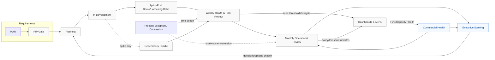

# Appendix F — Governance Flow Map (with Field Notes)

This appendix visualizes the end‑to‑end governance flow and how signals move through forums. Ownership: Steering (EO‑owned); CCB/Operational (Studio‑owned). Use this map during onboarding and when teaching the operating model.

---

## F.1 Governance Flow (Mermaid)

Legend
- EO‑owned: Steering, commercial approvals (decision rights).
- Studio‑owned: operational forums, readiness gates, dashboards.

---

## F.2 Field Notes (how to use the flow)

- MAR → RfP Gate (Section 5)
  - Why: Lock definitions and readiness (design/impact, AC/NFR) before planning commitments.
  - Anti‑pattern: treating planning as discovery; unsigned Features entering sprints.

- Planning → In Development (Sections 5, 9)
  - Why: Only Ready work enters sprints; capacity reserve (15–25%) protects quality/debt.
  - Anti‑pattern: over‑commitment; ignoring repair when error budget is red.

- Sprint‑End → Weekly Review (Section 9)
  - Why: Turn demo gaps, retro actions, and debt roll‑call into owner/date decisions.
  - Anti‑pattern: many retro actions, none completed; hardening skipped.

- Weekly → Monthly (Section 9)
  - Why: Synthesize trends; propose Steering decisions; tune thresholds/policies.
  - Anti‑pattern: bringing slides without options; mixing Steering debates in Monthly.

- Monthly → Steering (Section 9)
  - Why: Make binding trade‑offs on scope/date/capacity/policy; record decisions.
  - Anti‑pattern: unprepared decisions; no release notes to dashboards/policies.

- Exceptions & Concessions (Section 10.9)
  - Rule: Time‑box to ≤ 2 sprints; label `process-exception`; owner + reversion date; review in Monthly; propose policy update if repeated.
  - Anti‑pattern: “temporary” exceptions that persist; removing controls instead of substituting lighter ones.

- Dependencies (Section 5.10; Dependency Huddle)
  - Rule: Evidence‑based (contracts/creds/env, DependencyFunding%); spike‑only cadence; fold back into Weekly.
  - Anti‑pattern: status calls without evidence; no owner/dates.

- Commercial tracks (Section 8)
  - Rule: Use FVS (SFM) / Capacity Health (TCM) bands to trigger Steering; separate delivery vs dependency variance; show unfunded exposure.
  - Anti‑pattern: hiding unfunded work; treating “approved in principle” as funded.

- Dashboards & Alerts (Appendix A; B)
  - Rule: Few, strong signals per audience; quarterly tuning via Appendix T; map every alert to a forum and owner.
  - Anti‑pattern: noisy widgets; alerts with no forum/owner.

- Studio Council Member (SCM) (Section 11)
  - Rule: Track each improvement from discovery → decision → implementation → adoption audit; publish manual versions with release notes.
  - Anti‑pattern: lessons documented but not implemented or audited.
