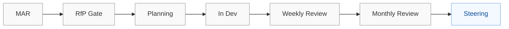

# Appendix K — Diagrams (Mermaid)

Use Mermaid to standardize diagrams across the manual. Keep diagrams readable, annotated, and linked to owning forums and roles. For role names and ownership, see `roles_reference.md`.

Guidelines
- Prefer flowchart and sequence for governance/process; class/er for data relationships where needed.
- Label forum ownership (EO vs Studio) and decision points; annotate with short field notes.
- Keep node names short; add comments near the code; include links below the diagram to sections.

---

## K.1 Governance Flow (reference)

See Appendix F for the full governance flow. Minimal example:



Links
- Appendix F — Governance Flow Map
- Section 9 — Operational Governance

---

## K.2 Requirement → Release Map (high‑level)

```mermaid
flowchart TB
  subgraph Req
    MAR[MAR]
    RFP[RfP (signed Features)]
  end
  subgraph Build
    PLAN[Plan]
    DEV[Dev]
    TEST[Quality Gates]
  end
  subgraph Decide
    WEEKLY[Weekly Review]
    MONTHLY[Monthly Review]
    STEER[Steering]
  end

  MAR --> RFP --> PLAN --> DEV --> TEST --> WEEKLY --> MONTHLY --> STEER

  %% Exceptions
  EXC[Process Exception] -. time‑box/label/owner .-> WEEKLY

  %% Commercial overlay
  FVS[FVS/Capacity Health] -. feeds .-> MONTHLY

  classDef eo fill:#f3f9ff,stroke:#7aa7e8,color:#0b4a99;
  classDef studio fill:#f9f9f9,stroke:#999,color:#333;
  class STEER eo;
  class MAR,RFP,PLAN,DEV,TEST,WEEKLY,MONTHLY,EXC,FVS studio;
```

Notes
- Map is not exhaustive; overlay dashboards/alerts from Appendix A/B and roles from roles_reference for onboarding.

---

## K.3 Mermaid Tips
- Keep diagrams under ~30 nodes for readability; split across sections when needed.
- Use classDef to color EO vs Studio elements consistently.
- Add comments for exceptions/concessions and commercial overlays to aid readers.
- Store diagrams under `the-studio-delivery-manual/` and link from sections; SCM maintains diagram currency per Section 11.
