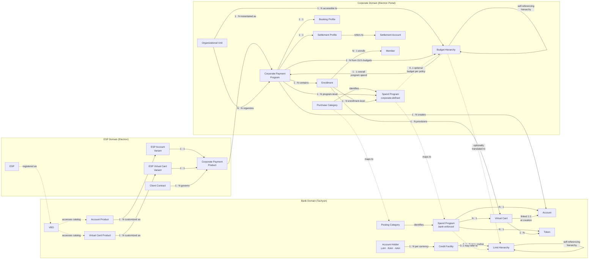

# Three-Domain Entity Relationship Diagram

## Cardinality Notes

**Budget accessibility and assignment:**
- Budgets are hierarchical (mirroring Limit Hierarchy in Bank Domain)
- Budgets are made accessible to OUs
- A Program can only be assigned budgets that belong to the OU it is associated with

**Budget structure per Program:**
- One overall program spend budget (shared across all accounts)
- Optionally, one budget per Spend Program

**Spend Program cascade:**
- Program-level: applies to all enrollments in the program
- Enrollment-level: applies to all virtual cards provisioned for that enrollment
  - Enrollment-level Spend Programs translate to per-Virtual Card Spend Programs in Bank Domain
  - Token-specific rules: expressed as enrollment-level Spend Program with additional token-identifying rule; translates to per-Token Spend Program in Bank Domain

**Token:**
- A Virtual Card can have multiple Tokens
- Spend Programs can be associated with Token (bank-enforced), manifesting from enrollment-level Spend Program with token-specific rules in Corporate Domain

**Purchase Category / Posting Category:**
- Bank provides a set of pre-defined Purchase Categories accessible to corporates
- Corporate and ESP can define additional Purchase Categories using a data dictionary provided by the bank
- Purchase Category (Corporate Domain) maps to Posting Category (Bank Domain) — the bank's grammar may include dimensions not available at the corporate level (e.g., authentication method, authenticating parties)
- At authorization, Posting Category identifies which bank-enforced Spend Programs apply to a transaction
- Each Spend Program has a numeric precedence set by the corporate admin; for booking-limit Spend Programs, highest precedence wins

**Spend Program budget and limit evaluation:**
- Every Spend Program must be associated with a Budget derived from the Credit Facility (bank credit risk protection)
- A Spend Program can additionally reference Spend Program Budgets or static limits for corporate policy enforcement
- For Spend Programs tied to ERP-imported Budgets, the Spend Program can designate that budget as the booking destination (booking-limit Spend Program)
- During authorization, only one booking-limit Spend Program applies per posting (highest precedence wins)
- Non-booking-limit Spend Programs are concurrent usage gates — all applicable ones evaluated together
- Hard constraint: per posting, no more than 3 non-booking, non-CF external limits evaluated; exceeding this declines the transaction (up to 5 limit ledgers updated per posting, excluding ancestor traversal)
