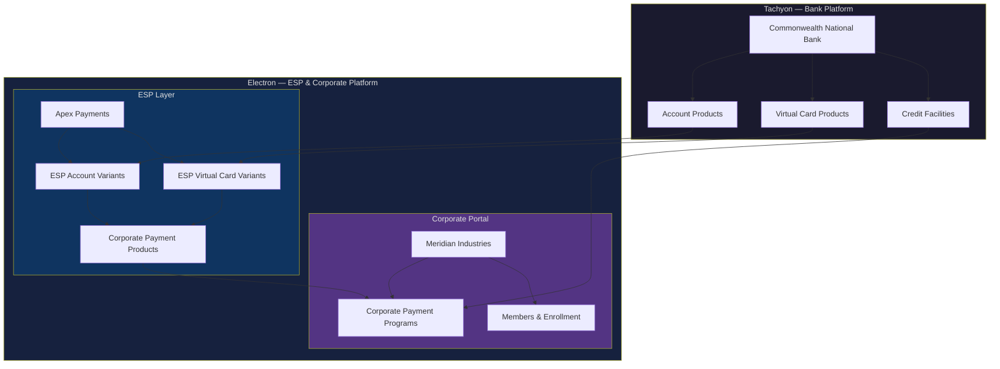
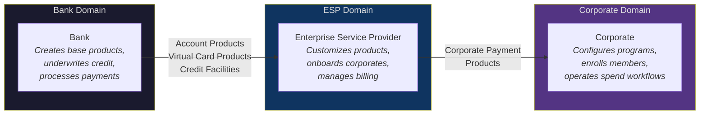

# Purpose, Audience, and Scope

## The Two-Lens Problem

Corporate payments sit at the intersection of two fundamentally different worldviews.

A bank sees products. Account Products, Virtual Card Products, Credit Facilities, billing cycles, delinquency controls, regulatory compliance. The bank underwrites risk against a legal entity, issues cards, processes authorizations, posts transactions, and settles with networks. Every construct in the bank's domain exists to manage credit exposure and payments infrastructure.

A corporate sees workflow controls. Budgets carved by department, spend policies enforced per project, supplier-specific cards tagged for reconciliation, travel programs governed by cost-center attribution. The corporate does not start with "which card product do I want?" It starts with "which spend workflow is broken, who owns it, and what controls are missing?"

Between these two sits an Enterprise Service Provider — the ESP — which translates bank capabilities into corporate-usable payment products. The ESP creates, packages, prices, and distributes Corporate Payment Products. It onboards corporates, manages billing, and provides operational support. The ESP is the commercial partner bridging bank infrastructure and corporate operations.

The same underlying account, card, and credit constructs serve all three actors. But each actor configures, operates, and reasons about those constructs through a different lens. A Credit Facility is a risk position to the bank, a financial resource to the corporate, and a product constraint to the ESP. A card is an authorization instrument to the bank, a spend-control mechanism to the corporate, and a product feature to the ESP.

This dissonance — bank-as-product-provider versus corporate-as-workflow-operator, mediated by the ESP — is the central challenge of corporate payments platform design.

## Purpose

This book exists to give Zeta product managers a unified mental model of corporate payments — one that holds both lenses simultaneously without conflating them.

The book defines the entities, relationships, control models, and lifecycle patterns that constitute the corporate payments domain. It introduces a shared ontology: a precise vocabulary of Credit Facilities, Budgets, Spend Archetypes, Corporate Payment Products, Corporate Payment Programs, Booking Profiles, Settlement Profiles, and the actors who create and operate them. Every entity is defined once, with its domain ownership made explicit — bank-domain, ESP-domain, or corporate-domain.

The ontology is not abstract. A set of fictitious but detailed entities — Meridian Industries, Apex Payments, and Commonwealth National Bank — are used throughout as a running example (see *The Running Example*). Every concept is illustrated with specific configurations, numbers, and decisions drawn from this shared scenario.

A Zeta PM reading this book cover-to-cover gains a progressive understanding of how the three actors interact, what each configures, and where the boundaries of authority lie. A PM returning for reference finds standalone definition blocks, entity state models, and control archetypes that do not depend on surrounding narrative.

## Audience

The primary audience is Zeta product managers building and evolving the platform. The book assumes the reader:

- Has working knowledge of card payments infrastructure — issuing, acquiring, authorization, clearing, settlement
- Understands the four-party network model (issuer, acquirer, network, merchant) and does not need it explained
- Is familiar with basic banking concepts: credit underwriting, KYB/KYC, legal entity structures, billing and collections
- Can read entity-relationship diagrams and mermaid-syntax flowcharts

The book does not assume prior knowledge of:

- How corporates structure their internal spend governance
- How ESPs package and distribute bank-originated payment capabilities
- The specific domain model Zeta uses to represent corporate payments
- The operational differences between Spend Archetypes (supplier payments, employee spend, travel, recurring merchant payments)

## Zeta's Platform: Tachyon and Electron

Zeta provides the technology stack for both the bank and the ESP.

**Tachyon** is Zeta's bank-facing platform. It powers issuing, accounts, card products, credit facilities, authorization processing, transaction posting, settlement, and all compliance-related controls. The bank operates on Tachyon.

**Electron** is Zeta's ESP-and-corporate-facing platform. It powers Corporate Payment Product creation, corporate onboarding, program configuration, member enrollment, card issuance workflows, billing, approval engines, notifications, and reporting. The ESP operates on Electron. The corporate accesses Electron through a portal to configure programs, enroll members, and manage spend operations.

The relationship is compositional: the bank creates base products on Tachyon; the ESP customizes them into variants on Electron; the ESP assembles variants into Corporate Payment Products; the corporate configures Programs against those Products.

Subsequent chapters refer to bank-domain entities, ESP-domain entities, and corporate-domain entities without restating which platform hosts them.

## The Three-Actor Model

Corporate payments involve three distinct actors, each with defined responsibilities and domain boundaries.

**The Bank** creates the foundational building blocks — Account Products, Virtual Card Products, and Credit Facilities. It underwrites credit risk against legal entities, processes authorizations, posts transactions, and enforces all regulatory and compliance controls. The bank does not interact directly with the corporate's internal organizational structure. It sees legal entities, credit exposures, and accounts.

**The ESP** sits between the bank and the corporate. It customizes bank-originated products into variants, assembles those variants into Corporate Payment Products, and distributes them to corporates. The ESP owns the commercial relationship with the corporate: product packaging, pricing, onboarding, billing, and operational support. An ESP may serve dozens of corporates using the same bank's infrastructure.

**The Corporate** configures Corporate Payment Programs — the operational constructs through which it puts a Corporate Payment Product to use for a specific spend workflow. The corporate defines its organizational structure (legal entities, organizational units, members), carves budgets from credit facilities, sets spend policies, defines booking and settlement profiles, enrolls members, and issues cards. The corporate is the operator; the ESP is the supplier; the bank is the infrastructure provider.

The authority model flows in one direction for controls: bank sets the outermost boundary, the ESP tightens within that boundary, the corporate tightens further. No actor can loosen a restriction set by an actor above it in the chain.

## Scope

### What this book covers

- The domain model for corporate payments: entities, relationships, ownership, and state
- The three-actor model: bank, ESP, and corporate — their responsibilities and boundaries
- Spend Archetypes as workflow patterns: Supplier Payments, Employee & Department Spend, Travel & Booking Payments, Central Recurring Merchant Payments
- The ontology: Credit Facility, Budget, Account, Corporate Payment Product, Corporate Payment Program, Spend Policy, Booking Profile, Settlement Profile, Card Profile, Members, Organizational Units
- Control cascades: how spend policies compose across Product, Program, and Card levels
- Per-archetype treatment: control models, card lifecycle patterns, enrollment models, reconciliation approaches
- Program lifecycle: setup, configuration, enrollment, operation, amendment, wind-down
- The bank's foundational role: Account Products, Virtual Card Products, Credit Facilities, and how ESPs customize them

### What this book does not cover

The following topics are adjacent to corporate payments but outside the scope of this book:

- **Bank-to-ESP commercial relationship**: The P&L, revenue-sharing, and commercial terms between the bank and the ESP are business arrangements, not platform constructs. The book covers ESP-to-Corporate commercial terms only.
- **Card network protocol internals**: Authorization message formats, clearing file specifications, network settlement mechanics, and scheme-specific rules are infrastructure concerns handled by Tachyon. The book treats authorization and clearing as capabilities, not protocols.
- **Regulatory specifics per jurisdiction**: Licensing requirements, capital adequacy rules, consumer protection regulations, and jurisdiction-specific compliance obligations vary by market. The book notes where regulatory boundaries exist but does not enumerate them.
- **Fraud management**: Transaction-level fraud detection, risk scoring, fraud rules, and fraud operations are covered in dedicated FRM documentation. The book notes that the bank retains exclusive control over fraud parameters.
- **AML and sanctions screening**: Anti-money-laundering controls, sanctions list screening, suspicious activity reporting, and related compliance workflows are bank-retained functions outside this book's scope.
- **Dispute resolution procedures**: Chargeback flows, representment, arbitration, and network-level dispute mechanisms are operational procedures. The book notes that disputes settle against the account and that refunds inherit booking and settlement profiles, but does not detail the resolution process.

### Assumed knowledge

The four-party network model — issuer, acquirer, network, merchant — is foundational context. The book does not explain it. Readers unfamiliar with this model should consult introductory card payments material before proceeding.

Programs can operate on both open-loop (Visa, Mastercard, Amex) and private-label arrangements. The book's concepts apply to both; differences are noted where relevant.
