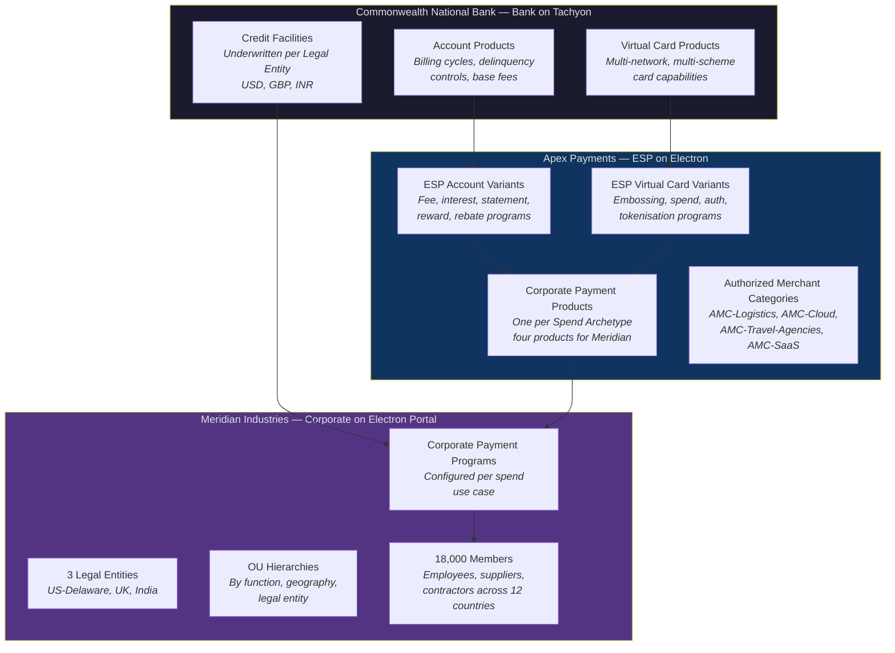
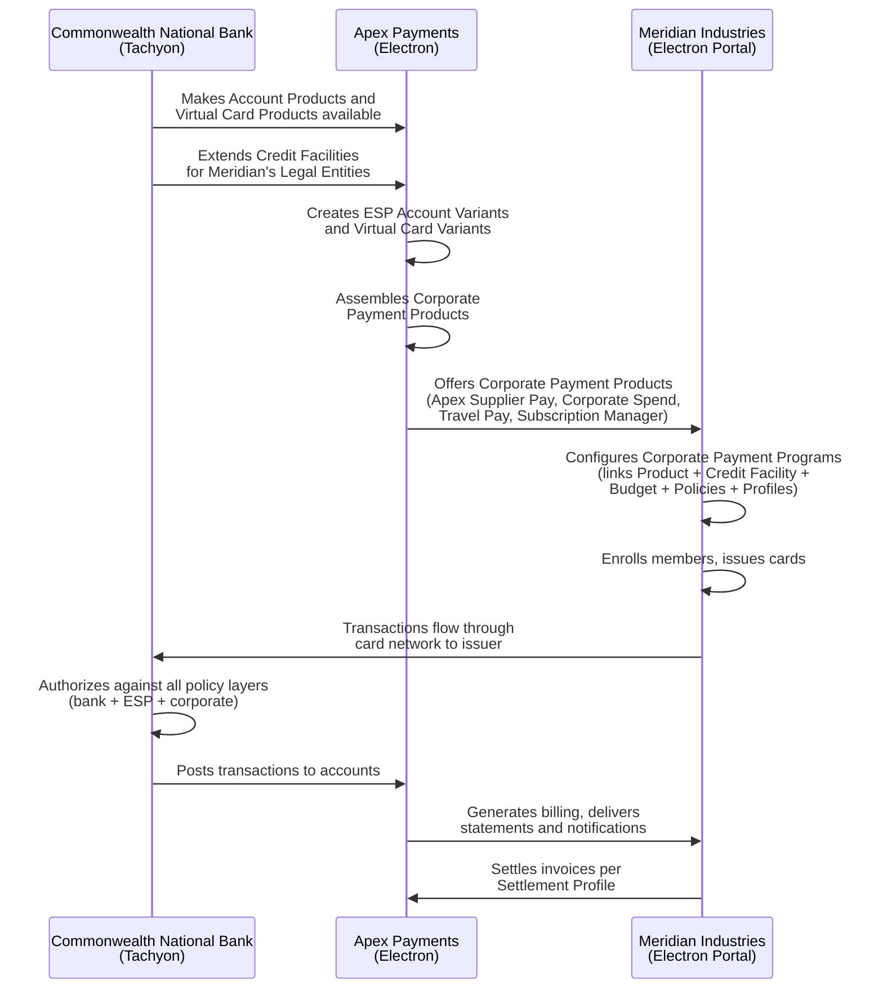

# The Running Example

> All entities in this chapter are fictitious. They are designed to exercise every concept in this book — multiple legal entities, complex organizational unit hierarchies, all four Spend Archetypes, cross-border operations, and multi-currency credit facilities. Subsequent chapters reference Meridian, Apex, and Commonwealth by name when illustrating concepts. Each chapter's examples are drawn from this shared scenario.

---

## The Three Actors

Three fictitious entities appear throughout this book. Each represents one of the three actors in the corporate payments model.

| Actor | Role | Platform |
|-------|------|----------|
| Commonwealth National Bank | Creates Account Products and Virtual Card Products, underwrites Credit Facilities, provides payments infrastructure | Tachyon |
| Apex Payments | Creates Corporate Payment Products, onboards corporates, manages billing and operational support | Electron |
| Meridian Industries | Configures Corporate Payment Programs, enrolls members, operates spend workflows | Electron (corporate portal) |

---

## Meridian Industries — The Corporate

Meridian Industries is a multinational industrial manufacturer headquartered in the United States with operations across North America, Europe, and Asia.

### Legal Entities

Meridian operates through three Legal Entities. Each is independently KYB'd by the bank and serves as the legal anchor for credit, billing, and regulatory relationships.

| Legal Entity | Jurisdiction | Base Currency |
|---|---|---|
| Meridian Industries Inc. | United States — Delaware | USD |
| Meridian UK Ltd | United Kingdom | GBP |
| Meridian India Pvt Ltd | India | INR |

Each Legal Entity holds its own Credit Facility from Commonwealth National Bank. All credit exposure, billing, and settlement are denominated in the Legal Entity's base currency.

### Organizational Structure

Meridian maintains three independent OU (Organizational Unit) hierarchies under a single Corporate entity. These hierarchies are logical groupings — they do not alter legal ownership, which is always anchored to a Legal Entity through the Credit Facility.

**OU tree by function:**
Engineering, Sales, Operations, Finance, Procurement, Marketing. Each functional OU may contain employees from multiple Legal Entities. A "Global Engineering" OU, for instance, spans engineers in Delaware, London, and Bangalore.

**OU tree by geography:**
Americas, EMEA, APAC. Geographic OUs group employees by region, cutting across both function and legal entity.

**OU tree by Legal Entity (default):**
One flat OU per Legal Entity — Meridian Industries Inc., Meridian UK Ltd, Meridian India Pvt Ltd. This default hierarchy is automatically created and maps directly to the Legal Entity structure.

The three OU trees coexist. A single employee belongs to one Legal Entity, one functional OU, and one geographic OU simultaneously. Program eligibility rules, budget associations, and reporting can reference any of the three hierarchies.

### Workforce and Operations

- 18,000 employees across 12 countries
- Manufacturing facilities in the US, UK, and India
- Sales and implementation teams deployed globally
- Centralized treasury function managing credit facilities and settlement

### Four Spend Needs

Meridian's payment operations span all four Spend Archetypes defined in this book.

**Supplier Payments** — Raw materials, logistics providers, and component suppliers. Meridian's Procurement and AP teams manage a vendor base of several hundred active suppliers. Payments are invoice-matched, single-use, and reconciled against purchase orders in the ERP. This is Meridian's highest-volume spend category.

**Employee & Department Spend** — Department-level purchasing for office supplies, equipment, professional services, and ad-hoc operational needs. Budget owners in Engineering, Sales, and Operations issue controlled cards to team members. Each card is MCC-restricted and amount-capped. Employees provide expense coding after each transaction.

**Travel & Booking Payments** — Client implementation teams travel frequently to bank and corporate sites during platform rollouts. Meridian's travel desk books centrally through preferred agencies. Cards are issued per booking or as persistent lodge cards to approved travel management companies.

**Recurring SaaS Subscriptions** — Engineering tools, cloud infrastructure, collaboration software, and design platforms. Merchant-locked cards are issued per vendor, managed by Engineering Operations, and reconciled against subscription contracts.

### Credit Facilities

Meridian's treasury manages three Credit Facilities — one per Legal Entity, each underwritten by Commonwealth National Bank.

| Credit Facility | Legal Entity | Currency | Indicative Limit |
|---|---|---|---|
| CF-US-Meridian | Meridian Industries Inc. | USD | $50M |
| CF-UK-Meridian | Meridian UK Ltd | GBP | £12M |
| CF-IN-Meridian | Meridian India Pvt Ltd | INR | ₹400M |

Each Credit Facility is subdivided into Budgets by Meridian's finance team. Budgets map to departments, projects, and cost centers — not to bank-defined sub-limits. The bank sees facility-level utilization; Meridian manages budget-level governance.

---

## Apex Payments — The ESP

Apex Payments is a fintech company specializing in corporate payment solutions for mid-market and enterprise clients. It operates on Electron.

### Business Profile

Apex serves over 40 corporates, including Meridian Industries. It manages the full commercial relationship with each corporate: product design, pricing, onboarding, billing, and ongoing operational support. Apex does not underwrite credit or process payments — those functions belong to the bank. Apex creates the products that corporates consume.

### Corporate Payment Products

Apex creates Corporate Payment Products across all four Spend Archetypes. Each Product is assembled from one ESP Account Variant and one ESP Virtual Card Variant, both of which customize Commonwealth National Bank's base Account Products and Virtual Card Products.

For Meridian, Apex offers four Products:

| Corporate Payment Product | Spend Archetype | Key Characteristics |
|---|---|---|
| Apex Supplier Pay | Supplier Payments | Single-use cards, invoice-matched, AP-integrated |
| Apex Corporate Spend | Employee & Department Spend | Multi-use cards, MCC-restricted, approval workflows |
| Apex Travel Pay | Travel & Booking Payments | Per-booking and lodge-style cards, agency-integrated |
| Apex Subscription Manager | Central Recurring Merchant Payments | Merchant-locked persistent cards, subscription-tracked |

Each Product carries its own commercial terms — fees, rebates, billing cycles, and service levels — negotiated between Apex and the corporate. Commercial terms are per Product, not per Program; a corporate that operates multiple Programs under the same Product shares one set of commercial terms.

### Authorized Merchant Categories

Apex defines Authorized Merchant Categories (AMCs) to group merchants for use in commercial terms and Spend Policy rules. AMCs are defined using MCCs, merchant IDs, names, and location-based patterns.

| AMC | Purpose | Typical Members |
|---|---|---|
| AMC-Logistics | Shipping, freight, warehousing | FedEx, DHL, Maersk, regional freight carriers |
| AMC-Cloud | Cloud infrastructure and hosting | AWS, Azure, GCP, DigitalOcean |
| AMC-Travel-Agencies | Corporate travel management | BCD Travel, CWT, Amex GBT, regional agencies |
| AMC-SaaS | Software subscriptions | Atlassian, GitHub, Figma, Slack, Salesforce |

AMCs are reusable across Products and across corporates. An AMC defined for one Product can be referenced in Spend Policy rules at the Program level or even at the card level, subject to the cascading restriction model (tighten-only at each level).

---

## Commonwealth National Bank — The Bank

Commonwealth National Bank is a large US-based issuing bank with international capabilities. It operates on Tachyon.

### Role in the Value Chain

Commonwealth provides the foundational infrastructure that Apex and Meridian depend on. Its responsibilities are confined to the bank domain:

- **Account Products**: Commonwealth defines Account Products with billing cycles, delinquency controls, and base fee structures. These are redistributable — multiple ESPs can build on the same Account Product.
- **Virtual Card Products**: Commonwealth defines Virtual Card Products supporting multiple card networks and clearing arrangements. The bank determines which schemes are available and manages network settlement.
- **Credit Facilities**: Commonwealth underwrites Credit Facilities against Meridian's three Legal Entities. Each facility represents a credit risk position tied to a single Legal Entity.
- **Authorization and processing**: Commonwealth processes all authorizations, enforcing every policy layer — bank-level, ESP-level, and corporate-level — inline at authorization time. The bank posts transactions to accounts, generates statements, and handles clearing and settlement with networks.
- **Compliance controls**: Credit risk parameters, AML controls, fraud detection, delinquency management, NPA tracking, and regulatory compliance are exclusively retained by the bank. No ESP or corporate can modify these.

### Relationship with Apex

Commonwealth partners with Apex as its ESP for corporate payment distribution. The partnership works as follows:

1. Commonwealth creates base Account Products and Virtual Card Products on Tachyon
2. Apex customizes these into ESP Account Variants and ESP Virtual Card Variants on Electron — adjusting fees, rewards, rebates, notification templates, spend programs, and branding
3. Apex assembles one Account Variant and one Virtual Card Variant into each Corporate Payment Product
4. Apex distributes these Products to corporates like Meridian

Commonwealth does not interact with Meridian's organizational structure, OU hierarchies, or budget allocations. It sees three Legal Entities, three Credit Facilities, and the accounts created under them.

### Credit Facilities Extended to Meridian

| Facility | Legal Entity | Currency | Underwriting Basis |
|---|---|---|---|
| CF-US-Meridian | Meridian Industries Inc. | USD | US operating revenue, assets |
| CF-UK-Meridian | Meridian UK Ltd | GBP | UK subsidiary financials |
| CF-IN-Meridian | Meridian India Pvt Ltd | INR | India subsidiary financials |

Each facility supports one or more Corporate Payment Programs configured by Meridian. The facility's currency determines the base currency for all accounts and transactions under it. Cross-border transactions incur FX conversion at the network level.

---

## How the Three Actors Interact

The relationship between Commonwealth, Apex, and Meridian follows a layered model. Each actor operates within its domain, and the outputs of one become the inputs of the next.

**Authority flows downward; controls tighten at each level.** Commonwealth sets the outermost boundary (credit limits, compliance controls, base product parameters). Apex tightens within that boundary (product-level spend policies, commercial terms, variant configurations). Meridian tightens further (program-level policies, card-level restrictions, budget allocations). No actor can loosen a restriction set by an actor above it.

**Data flows in both directions.** Transaction data flows from the bank through the ESP to the corporate. Corporate-defined attributes (supplier tags, program metadata, expense codes) flow from the corporate through card profiles to the bank's authorization and posting systems.

---

## Using the Running Example

Chapters following this one reference Meridian, Apex, and Commonwealth by name. The pattern is consistent: a concept is stated as a rule or definition first, then illustrated using these three entities.

Where a chapter introduces a new entity — such as a Booking Profile or a Settlement Profile — the example shows a specific instance from Meridian's operations: concrete numbers, specific configurations, named departments, and identified spend categories. They are designed to make every abstraction tangible.

Meridian's four spend needs (supplier payments, employee spend, travel, SaaS subscriptions) collectively exercise all four Spend Archetypes. Apex's four Corporate Payment Products demonstrate how an ESP packages bank capabilities for different workflow patterns. Commonwealth's three Credit Facilities across three jurisdictions demonstrate multi-entity, multi-currency operations.

A running example that only covered one Spend Archetype or one Legal Entity would leave critical concepts unillustrated.
