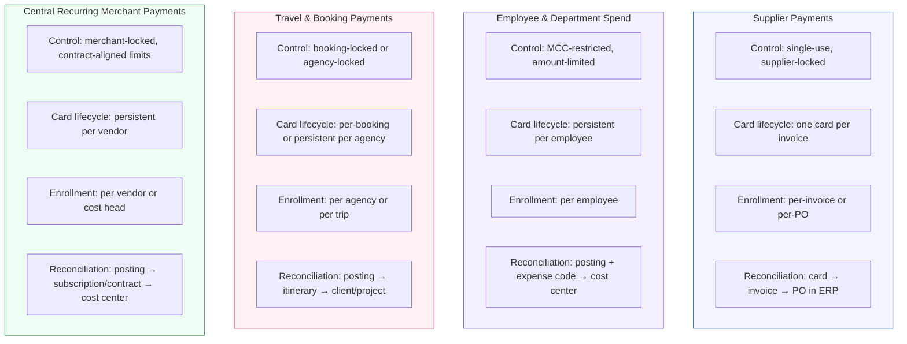

# Chapter 1: The Corporate Payments Problem

Commercial payments exist to serve a deceptively simple set of needs. An enterprise pays suppliers for goods and services. It funds employee purchases across departments. It settles travel bookings. It manages recurring subscriptions and centralized vendor relationships. Every one of these payments must occur under governance — controlled, attributed, reconciled, and auditable.

The difficulty is not in making payments. Banks have solved payment execution. Cards authorize in milliseconds, settle within days, and produce transaction records that flow through well-established network infrastructure. The difficulty is in governing payments across the full breadth of an enterprise's operational reality — and doing so in a way that maps to how the enterprise actually works.

---

## What Corporates Need

A corporate's payment requirements extend well beyond "move money from A to B." For every payment, the enterprise must satisfy a chain of governance obligations:

- **Control** — who can spend, how much, with whom, for what purpose, under which policy, against which budget.
- **Attribution** — every payment must land on a cost center, project code, GL account, client engagement, or other internal structure that the finance function uses to manage the business.
- **Reconciliation** — card transactions must be matched against internal records. Those records differ by workflow: invoices and purchase orders for supplier payments, expense reports for employee spend, itineraries for travel, subscription agreements for recurring charges.
- **Compliance** — internal policy, tax treatment, audit obligations, and legal entity boundaries constrain what is permissible and how it must be documented.

These are not optional layers added for bureaucratic rigor. They are the operating requirements of any enterprise that manages spend across departments, geographies, and legal entities. A payment that cannot be attributed is a payment that cannot be accounted for. A payment that cannot be reconciled is a payment that creates manual work downstream. A payment that bypasses policy is a payment that introduces risk.

---

## Why This Is Hard

Four structural forces make corporate payments governance fundamentally difficult.

### Distributed authority

Payment authority in a large enterprise is not centralized. The AP team authorizes supplier payments. Department heads authorize project spend. A travel desk manages booking settlements. Marketing controls campaign budgets. Procurement governs vendor selection. Finance oversees limits and policy. Each of these actors operates with different mandates, different approval chains, and different accountability structures.

A payment system that assumes a single point of control — or that treats all spend as flowing through one governance model — fails to represent how enterprises actually operate.

### Divergent workflow requirements

Different categories of spend follow fundamentally different operational patterns. A supplier payment originates from an invoice in an ERP system, targets a known vendor, and must reconcile one-to-one against a purchase order. An employee purchase is initiated by an individual, targets a merchant that may or may not be pre-approved, and must be coded to a cost center after the fact. A travel booking is placed by an agency on behalf of a traveler, and must reconcile against an itinerary. A SaaS subscription is a recurring charge against a persistent card number, governed by a contract rather than a per-transaction approval.

Each of these workflows demands a different control model, a different card lifecycle, a different enrollment mechanism, and a different reconciliation approach. Forcing them into a single operating model creates friction, workarounds, and policy leakage.

### Structural mismatch between corporate and bank

The corporate's organizational structure — departments, projects, cost centers, legal entities, geographies — does not map to the bank's account and credit structure. The bank underwrites a credit facility against a legal entity. The bank creates accounts. The bank issues cards. None of these constructs carry meaning about which department initiated the spend, which project it serves, or which budget absorbs it.

A corporate with three legal entities, six departments, forty active projects, and hundreds of cost centers must somehow project its internal governance structure onto a banking infrastructure that recognizes none of it. This translation is where most of the operational burden lives.

### The data language gap

Finance teams need spend data in their own language. They think in cost centers, GL codes, project codes, client engagement identifiers, and budget categories. The bank speaks in accounts, merchant category codes, transaction identifiers, authorization amounts, and settlement dates.

Reconciliation — the process of matching bank-provided transaction data against internal records — is where this gap becomes tangible labor. Every transaction that arrives without the right internal coding, without a match to a source document, or without attribution to the correct organizational unit creates manual work for the finance team.

---

## Meridian Industries: Four Workflows, Four Problems

Meridian Industries is a multinational industrial manufacturer with 18,000 employees across twelve countries, three legal entities, and spend requirements that span every category. Its payment operations illustrate why a single governance model cannot serve the full range of corporate spend.

### Accounts Payable — 200 suppliers

Meridian's AP team pays over 200 suppliers for raw materials, components, logistics, and professional services. Each payment corresponds to an invoice. Each invoice references a purchase order. AP needs one-to-one matching: one card number per invoice, locked to the supplier's merchant identity, with the PO number carried through as Level 2 data. The card is single-use — it exists for one payment and expires after settlement.

The AP team does not think of this as a "virtual card program." It thinks of it as supplier payment automation — a way to eliminate checks, extend payment terms, and get clean reconciliation data into the ERP without manual intervention.

### Engineering — SaaS subscriptions

Meridian's Engineering organization manages subscriptions for cloud infrastructure, developer tools, collaboration platforms, and monitoring services. Each subscription is a recurring charge against a persistent card number assigned to a specific vendor and cost center. The card persists for the duration of the contract. Controls are merchant-locked (one card, one vendor) with monthly limits aligned to the subscription amount.

Engineering does not manage this through expense reports or AP workflows. The subscription is a standing commitment, renewed automatically, governed by a contract and a budget allocation — not by per-transaction approval.

### Travel desk — agency bookings

Meridian's implementation teams travel frequently for client deployments. The travel desk books through a managed agency. Each booking — flight, hotel, ground transport — is settled using a card issued to the agency, not to the individual traveler. The card may be single-use per booking or persistent per agency relationship. Reconciliation matches the card transaction against the booking reference and the traveler's itinerary.

The travel desk needs the payment to carry enough data to attribute costs to the right client engagement and project phase. The traveler never touches the payment instrument. The travel desk, not the traveler, is the accountable party.

### Marketing — campaign spend

Meridian's Marketing VP runs campaign budgets that span digital advertising, event production, print media, and agency fees. Each campaign has a budget. Each budget is allocated to a cost center. Marketing needs cards issued per campaign or per vendor, with spend limits aligned to campaign budgets and merchant restrictions that prevent off-purpose use.

Marketing evaluates success not by interchange economics or card utilization rates, but by whether each charge lands on the right cost center, whether campaign budgets are enforced in real time, and whether the finance team can close the books without chasing down attribution for every transaction.

---

## The Four Workflows Compared

Each of Meridian's four spend workflows exhibits a distinct pattern across the dimensions that matter for governance.

These are not variations on a single theme. They differ in who initiates the payment, how the card is created and governed, what the card is locked to, how long it persists, what data is available for reconciliation, and what the finance team matches the transaction against.

A supplier payment card exists for one invoice and dies after settlement. An employee spend card persists for months and accumulates transactions that must be individually coded. A travel card may be shared across bookings for a single agency. A subscription card persists for years and is governed by a contract, not by per-transaction approval.

---

## The Compounding Effect

The difficulty is not any one of these challenges in isolation. It is their combination. Distributed authority means different people in different departments make spending decisions under different rules. Divergent workflows mean those decisions follow different operational patterns. Structural mismatch means the bank's infrastructure does not reflect the corporate's organizational reality. The data language gap means reconciliation requires translation that is often manual.

For a company like Meridian — with three legal entities, six functional departments, four distinct spend workflows, and a finance team that must consolidate all of it into a coherent picture — the corporate payments problem is not a payment execution problem. It is a governance, attribution, and reconciliation problem that happens to involve payments.

The bank provides the rails. The corporate needs the operating model. The gap between the two is where complexity, cost, and failure accumulate.

