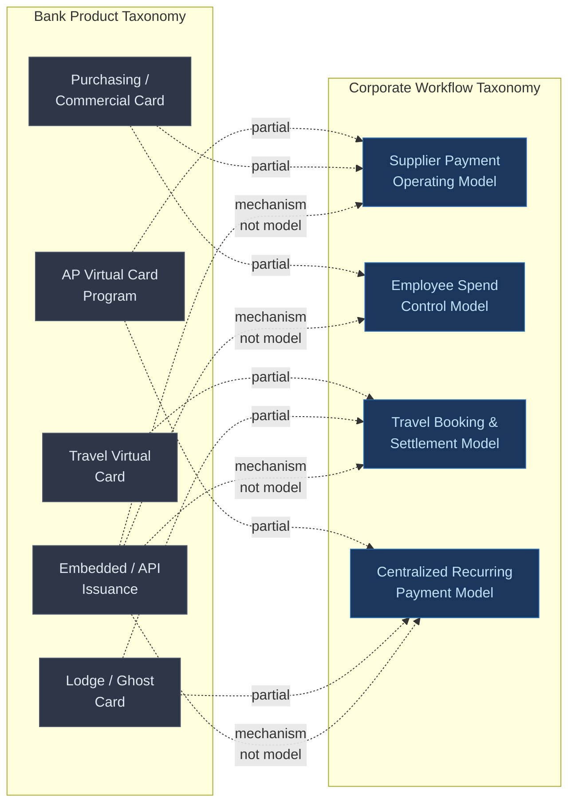

# Existing Solutions and Their Limitations

Commercial card and virtual card products are widely available. Banks, networks, and fintechs each package them differently — organized around the concerns that matter to the seller, not the buyer. This chapter maps what exists today, identifies what works, and locates the structural gap between how products are sold and how corporates need to operate them.

---

## How Banks Package Commercial Card Products

Banks sell commercial card programs as distinct product lines. Each line targets a procurement or finance function, comes with its own sales motion, and sits inside its own operational silo within the bank. A corporate buying across multiple lines deals with separate onboarding, separate controls configuration, and separate reconciliation streams — even when the underlying payment rail is identical.

### AP and Supplier Payment Virtual Card Programs

The largest growth segment in commercial cards is accounts-payable automation through virtual cards. Banks position these programs around three value propositions: working-capital extension, supplier enablement, and invoice-level reconciliation.

**JPMorgan** offers its Virtual Card solution integrated with a network of AP automation partners — Coupa Pay, PaymentWorks, Boost Payment Solutions, Edenred Pay, and Global PayEX — each handling a different slice of the procure-to-pay workflow. The bank's Supplier Experience Program provides dedicated supplier outreach and enrollment services, recognizing that the constraint on AP virtual card adoption is not buyer demand but supplier acceptance. PaymentNet serves as the spend management and reporting layer.

**Citi** packages its AP virtual card capability as **Citi ePayables**, integrated with Coupa's business spend management platform. The integration generates pre-integrated local-currency virtual cards at purchase-order or invoice-approval stage. Citi Working Capital Analytics (CWCA) layers proprietary analytics on top of payment data to identify working-capital improvements across a client's payables portfolio.

**U.S. Bank** offers **Virtual Pay**, a B2B payment automation solution replacing checks and manual AP processes. Virtual Pay assigns unique account numbers scoped to specific suppliers, date ranges, and dollar amounts. The bank provides dedicated supplier-enablement support and positions the product around revenue-share rebate opportunities — interchange economics passed back to the buyer as incentive.

**American Express** takes a different structural approach with **vPayment**. Each transaction receives its own virtual card number with amount, date-range, and merchant-level controls. vPayment requires an existing American Express Corporate Card relationship, tightly coupling the AP automation product to Amex's proprietary network and acceptance footprint.

The pattern across all four is consistent: single-use virtual card numbers, ERP file integration, and supplier onboarding as the critical adoption bottleneck. The differences are in network affiliation, integration partner ecosystem, and working-capital positioning.

### Commercial and Purchasing Cards

Purchasing cards (P-cards) are the oldest virtual card category. They target employee-initiated spend — department purchasing, office supplies, maintenance and repair operations — under centralized policy controls.

Banks configure P-card programs with merchant category code (MCC) restrictions, per-transaction amount limits, daily and monthly velocity controls, and approval hierarchies. **U.S. Bank's One Card** consolidates travel, purchasing, and fleet spend onto a single card product with customizable spending controls and role-based employee profiles.
Citi's commercial card suite managed through **CitiManager** — available in 28 languages across 100+ countries — provides hierarchy-defined access and role-based controls. JPMorgan's commercial card programs integrate with PaymentNet for centralized expense reporting and policy enforcement.

The purchasing-card model works well for high-volume, low-value transactions where the cost of a formal purchase order exceeds the cost of the goods. It breaks down when corporates need to enforce policies that span beyond MCC codes — project-based attribution, budget-period controls, or approval chains that vary by business unit.

### Travel Virtual Cards

Travel virtual cards solve a specific problem: paying for bookings made through travel management companies (TMCs) or online booking tools without exposing a high-limit corporate card number or requiring individual employee cards.

**U.S. Bank's Travel Virtual Pay** generates single-use virtual cards for non-carded travelers, automating corporate travel booking and reconciliation. The card is scoped to the booking — a specific amount, merchant, and date range — and settles centrally.

**Navan** (formerly TripActions) integrates travel booking, virtual card issuance, and expense management into a single platform. Virtual purchase cards generate on demand for travel bookings, with spend limits customizable per trip. Navan Connect allows corporates to retain existing Visa, Mastercard, or Amex card relationships while gaining Navan's booking and reconciliation layer on top.

Travel virtual cards differ from AP virtual cards in a critical dimension: the payment is tied to an itinerary, not an invoice. Reconciliation requires matching the card transaction to a booking record — flight segments, hotel nights, rental-car days — not to a purchase order or supplier invoice. This itinerary-aware reconciliation is what TMC-integrated solutions provide and what standalone bank virtual card programs typically lack.

### Lodge and Ghost Cards

**Lodge cards** are persistent virtual card numbers lodged with a travel agency or TMC. All bookings made through that agency charge against the same card number. **Ghost cards** extend the same concept to non-travel merchants — a persistent virtual account number assigned to a department, cost center, or vendor for recurring charges.

**Mastercard's Central Travel Account** provides airline- and hotel-specific lodge card structures with booking-level data capture. **Pliant** and **Perk** offer smart lodge cards with real-time transaction matching and automated expense-data capture. U.S. Bank's Travel Virtual Pay supports lodge-card configurations alongside single-use issuance.

Lodge and ghost cards trade control granularity for operational simplicity. A single persistent number reduces the integration burden — no per-transaction card generation required — but limits the corporate's ability to enforce per-booking or per-invoice controls. The corporate accepts a coarser control model in exchange for lower operational complexity.

### Single-Use and Multi-Use Card Programs

Single-use and multi-use are not separate product categories. They are control configurations applied across the categories above.

A **single-use** virtual card number is valid for one transaction or one authorization window. Once used or expired, it cannot be charged again. AP virtual cards are almost universally single-use. Travel virtual cards are typically single-use per booking.

A **multi-use** virtual card number persists for repeated transactions with the same merchant or within the same budget period. Ghost cards and subscription-payment cards are multi-use. SaaS subscriptions, media-advertising spend, and approved-vendor relationships all fit the multi-use model.

The distinction matters because it determines the reconciliation model. Single-use cards create a one-to-one mapping between card number and business transaction — ideal for invoice matching. Multi-use cards require the corporate to perform its own attribution, mapping multiple charges on the same card number back to business events.

### Embedded and API-Based Issuance

Embedded issuance is a distribution mechanism, not a product category. It describes how virtual cards are generated — through APIs integrated into ERP systems, procurement platforms, booking tools, or workflow applications — rather than through a bank portal or manual request.

**Brex** provides a Team API that enables programmatic virtual card creation with per-card spend limits, lock-after dates, and automatic expiration. Cards can be created for users or vendors with specified parameters, and spend limits are adjustable in real time.

**Ramp** issues unlimited single-use or recurring virtual cards through its platform, with merchant and category restrictions enforced at the point of creation. Ramp's AP automation layer adds AI-powered invoice processing with OCR, three-way matching, and automated approval routing.

**BILL** (formerly Divvy) offers virtual card creation in seconds through its mobile application, with cards linked to assigned budgets and spend limits that automatically decline over-limit transactions. The platform auto-categorizes transactions and validates receipts through OCR.

**U.S. Bank** offers Corporate Payment API Solutions for embedding virtual card issuance into third-party platforms, alongside Instant Card for pushing virtual cards directly to recipients' mobile wallets.

The fintech platforms — Brex, Ramp, BILL — share a common architectural assumption: the card is issued inside the workflow, not outside it. The card generation, spend control, and reconciliation happen in the same system that manages the business process. Bank API programs provide the card-issuance primitive but leave the workflow integration to the corporate or a middleware partner.

---

## How Networks Frame Virtual Card Capabilities

Visa, Mastercard, and American Express each position virtual cards through a different lens, reflecting their distinct strategic priorities.

### Visa: Payables Automation and Data

Visa frames virtual cards primarily as a **payables automation** tool. Visa B2B Payables allows organizations to send AP files from their ERP system to the issuing bank, with Visa assigning unique 16-digit virtual card accounts per supplier or per transaction. The emphasis is on working-capital extension (up to 55 days of credit from the issuing institution), electronic reconciliation reports for invoice-to-payment matching, and minimal disruption to existing business systems. **Visa Spend Clarity** (formerly IntelliLink) provides the spend-management and reporting layer across corporate, purchasing, and fleet card products. Visa's framing centers on data — transaction-level visibility, automated reconciliation, and spend analytics.

### Mastercard: Embedded Finance and Platform Integration

Mastercard positions virtual cards within an **embedded finance** narrative. The emphasis is on integrating payment automation directly into B2B platforms and business software — not as a standalone financial product but as a capability embedded in the tools corporates already use. Mastercard's **In Control for Commercial Payments** APIs provide configurable spending controls and enhanced data, designed for financial institutions to integrate virtual card capabilities into existing card programs. Mastercard's partnership with Extend demonstrates the model: redirecting employee spend from personal cards back to corporate cards by making virtual card creation frictionless within existing workflows. Mastercard cites increased spend on corporate cards and reduced reconciliation time through this approach.

### American Express: Closed-Loop Control and Buyer Leverage

American Express frames virtual cards around **closed-loop control** and buyer-supplier relationships. vPayment assigns per-transaction virtual card numbers with amount, date-range, and merchant controls, but operates exclusively on the Amex network. This closed-loop model gives Amex direct visibility into both sides of the transaction — buyer and supplier — enabling richer data capture and more granular controls. The trade-off is acceptance: supplier adoption requires Amex merchant acceptance, a narrower footprint than Visa or Mastercard for B2B payments.

### The Network Framing Gap

Each network's framing reveals what it optimizes for. Visa optimizes for data flow and ERP integration. Mastercard optimizes for platform embeddability and developer experience. Amex optimizes for transaction control depth and closed-loop economics. None frames virtual cards from the corporate's operational perspective — as configurable payment instruments that must serve different workflows with different control, reconciliation, and attribution requirements simultaneously.

---

## What Works

Several elements of the current landscape deliver genuine value.

**Card controls are rich.** MCC restrictions, per-transaction limits, velocity controls, merchant locks, date-range expiration, and single-use enforcement are mature capabilities available across all major issuers. The authorization infrastructure evaluates these controls in real time — a declined transaction is declined at the point of sale, not discovered after the fact.

**Authorization is real-time.** Unlike ACH or wire payments, card transactions pass through an authorization network that evaluates controls before the payment is approved. This makes card-based payments inherently more controllable than account-based payment methods for corporate spend.

**Data flows are improving.** Level II and Level III data capture — line-item detail, tax amounts, commodity codes — is increasingly available on commercial card transactions. ERP integrations, whether through bank APIs or middleware platforms, reduce the manual effort required to post card transactions to the general ledger.

**Fintech platforms have raised the bar.** Ramp, Brex, BILL, and Navan have demonstrated that card issuance, spend control, and reconciliation can coexist in a single workflow — not as three separate systems connected by batch files. Their platforms make the card invisible to the user while making the controls visible to finance.

---

## What Does Not Work

The structural limitations of the current landscape are not in the technology. They are in the product architecture.

### Bank Products Organized by Bank Concerns

Banks organize commercial card products by credit risk profile, interchange economics, and account structure — not by corporate workflow. A bank's AP virtual card program, its purchasing card program, its travel card program, and its lodge card program are separate products with separate onboarding, separate controls, separate reporting, and often separate relationship managers.

This organization reflects how the bank manages its own risk and revenue. The AP virtual card program sits in the bank's transaction-banking or treasury-services division. The purchasing card sits in commercial card services. The travel card may sit in a partnership arrangement with a TMC. Each product has its own P&L, its own credit-approval process, and its own operational team.

The corporate does not experience its payments this way. A single supplier may receive AP virtual card payments for invoiced goods and purchasing-card payments for ad-hoc orders. A single employee may use a purchasing card for office supplies, a travel virtual card for a client visit, and an expense card for a team dinner. The bank sees four products. The corporate sees one vendor relationship or one employee's activity.

### Corporates Must Translate Products into Operating Models

A corporate buying a "virtual card program" from a bank receives a payment instrument — a card number with controls — not an operating model. The corporate must build or buy the operating model around it: the workflow for requesting cards, the rules for assigning controls, the process for matching transactions to business events, the reporting structure for budget attribution.

For AP payments, this operating model involves ERP integration, supplier enablement, and invoice-matching logic. For employee spend, it involves policy definition, approval routing, and expense reporting. For travel, it involves TMC integration, itinerary matching, and traveler management. For subscriptions, it involves vendor management, renewal tracking, and cost-center attribution.

The bank provides the same primitive — a virtual card number with controls — for all four workflows. The corporate must build four distinct operating models on top of it. Each model requires different integrations, different processes, and different organizational ownership.

### Reconciliation, Attribution, and Policy Enforcement Are Afterthoughts

Bank-issued commercial card programs treat reconciliation as a downstream reporting function, not as an integral part of the payment workflow. The card transaction happens. The data flows to a reporting platform. The corporate downloads a file or accesses a portal. Finance staff match transactions to business records manually or through middleware.

Attribution — answering "which budget, project, cost center, or business purpose does this transaction belong to?" — is not encoded in the card program. The card number carries merchant data and amount. It does not carry the corporate's internal context: the purchase order, the project code, the traveler's itinerary, or the subscription renewal date.

Policy enforcement happens at authorization time for controls the card network understands (MCC, amount, velocity). It does not happen for policies the corporate cares about but cannot express in card-network terms: "only approved vendors," "only during active project phases," "only for team members assigned to this engagement," "only if the budget still has capacity after accounting for pending transactions."

### The Gap Where Friction Lives

The distance between what banks sell and what corporates need to operate is where friction, adoption failure, and value leakage concentrate.

A bank sells an AP virtual card program. The corporate needs a supplier-payment operating model with ERP integration, three-way matching, supplier enrollment, and dynamic discount capture. The bank provides the card. The corporate must build or buy everything else.

A bank sells a purchasing card with MCC restrictions. The corporate needs an employee-spend model with project-based budgets, manager approval chains, receipt validation, and GL coding. The card restricts where the employee can spend. The corporate must still build the workflow that connects the transaction to the business purpose.

This gap is not a technology problem. The authorization rails, the card controls, and the data capture exist. The gap is a product-architecture problem: bank products are organized around the bank's operational units and risk categories, while corporate needs are organized around spend workflows and business processes.

---

## Meridian's Experience with Fragmented Solutions

Meridian Industries operates across all four spend workflows — supplier payments, employee purchasing, travel, and recurring subscriptions — across three legal entities and twelve countries. Its experience illustrates the structural gap in practice.

Meridian's treasury team selected Commonwealth National Bank's AP virtual card program for supplier payments, attracted by the working-capital extension and rebate economics. The procurement team separately evaluated purchasing-card options for department spend. The travel team negotiated a lodge-card arrangement through their TMC. The IT department set up ghost cards for SaaS subscriptions through a different procurement process.

Each program required its own onboarding. Commonwealth's AP virtual card team configured credit limits, supplier enrollment workflows, and ERP file formats. The purchasing-card team configured MCC restrictions and employee profiles. The travel arrangement involved the TMC, not the bank directly. The SaaS ghost cards were set up through the bank's commercial-card portal.

Meridian now operates four parallel payment programs from the same issuing bank, each with its own control model, its own reconciliation stream, its own reporting portal, and its own relationship contact. The finance team cannot see total supplier exposure across programs without manually aggregating data from four sources. Policy changes — adjusting spending limits for a business unit undergoing restructuring — require four separate configuration updates.

When Meridian UK Ltd expanded its operations, each program required a separate credit-facility extension for the UK entity. The AP virtual card program had a different credit-approval process than the purchasing-card program, even though both drew on the same banking relationship.

The fragmentation is not a failure of any individual product. Each program functions as designed. The failure is architectural: the products were designed as standalone solutions, each serving one banking product line, rather than as composable components of a corporate payment operating model.

---

## The Taxonomy Gap

The core dissonance in corporate payments is a taxonomy mismatch. Banks organize products by payment instrument and credit structure. Corporates organize needs by spend workflow and business process. The two taxonomies do not align.

Every dashed line in this diagram represents integration work, process translation, and operational overhead that the corporate must absorb. No bank product maps cleanly to one corporate workflow. No corporate workflow is fully served by one bank product. Embedded issuance — the API layer — is a delivery mechanism that applies across all four models but does not resolve the mapping problem.

A conceptual framework — **Spend Archetypes** — starts from the corporate workflow taxonomy and works backward to define what the payment infrastructure must provide. The framework does not replace bank products. It provides the missing translation layer between what banks build and what corporates need to operate.
