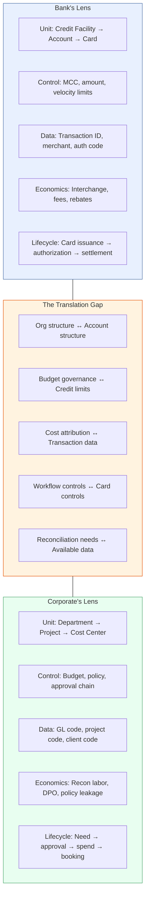

# Chapter 3: Two Lenses — Why the Gap Exists

Banks sell virtual cards as payment products. Corporates adopt them as workflow controls.

This single sentence explains most of the friction in commercial card programs. The bank designs, prices, and packages a product around its own concerns — credit exposure, interchange economics, account structure, network compliance. The corporate evaluates, adopts, and operates the same product around entirely different concerns — workflow governance, cost attribution, reconciliation efficiency, and policy enforcement.

Neither perspective is wrong. Both are internally coherent. The problem is that they describe different things using the same vocabulary, and the gap between them is where adoption friction, operational burden, and value leakage accumulate.

---

## The Dissonance in Practice

Three concrete examples illustrate how the gap manifests between Commonwealth National Bank and Meridian Industries.

### Example 1: The AP Virtual Card Program

Commonwealth packages an "AP Virtual Card Program." The product brief emphasizes interchange economics, single-use card controls, working-capital optimization through extended payment terms, and integration points with major ERP platforms. The pricing model centers on interchange revenue shared as a rebate incentive.

Meridian's AP team asks a different set of questions entirely: How does each payment map to an invoice in the ERP? Can a card be locked to a single supplier and a single PO amount so that reconciliation is automatic? What Level 2 data flows back — and does it include the PO number, the invoice number, or both? How does the AP clerk enroll a new supplier payment without calling the bank?

Commonwealth is describing a financial product. Meridian is describing an operating model for supplier payments. The same "AP virtual card" occupies two different conceptual frames. Commonwealth's product documentation answers what the bank offers. Meridian's procurement team needs to know how their daily workflow changes.

### Example 2: The Commercial Card with MCC Restrictions

Commonwealth offers a "commercial card with MCC restrictions and amount limits." The product is positioned as a modernized purchasing card — controlled spend for employees, configurable merchant category restrictions, real-time authorization with policy enforcement.

Meridian's Marketing VP asks: How does each charge land on the right campaign cost center? Can a card be issued per campaign with a budget ceiling that corresponds to the campaign allocation? If three team members use cards under the same campaign budget, does the system enforce the aggregate limit or only individual limits? How does finance attribute a $4,200 charge at a digital advertising platform to the Q3 brand awareness initiative rather than the Q4 product launch?

Commonwealth is describing card-level controls. Meridian is describing cost center attribution and budget governance. The MCC restriction answers "where can the card be used." It does not answer "how does this charge get booked" or "whose budget absorbs it."

### Example 3: The Pricing Conversation

Commonwealth prices its commercial card products by interchange spread and transaction fees. The sales team presents a rebate schedule tied to volume thresholds, a per-card issuance fee, and a monthly account maintenance charge. The economics are clear, well-structured, and benchmarked against industry norms.

Meridian's treasury evaluates the program on a different axis. The relevant question is not "what is the rebate basis point?" but "how much reconciliation labor does this eliminate?" Treasury models the value of extending DPO by twelve days on $50 million in annual supplier payments. The CFO's office measures policy leakage — the percentage of spend that bypasses intended controls — and the cost of chasing down unattributed transactions at month-end.

Commonwealth measures value delivered in interchange economics. Meridian measures value received in operational efficiency and governance strength. Both are legitimate metrics. They happen to measure different things.

---

## Why the Gap Persists

The dissonance is not a failure of communication or sales execution. It is structural. Banks and corporates operate in different domains with different organizing principles.

**Banks organize around financial risk.** The primary unit is the credit facility, extended to a legal entity, governed by underwriting criteria and regulatory capital requirements. Accounts, cards, and transactions are structured to manage credit exposure, settlement, and compliance. The bank's product catalog reflects these concerns: an account product, a card product, a set of controls, a billing configuration.

**Corporates organize around operational governance.** The primary units are departments, cost centers, projects, and business initiatives. Spend authority flows through an organizational hierarchy that has no counterpart in the bank's entity model. The corporate's adoption criteria reflect these concerns: workflow fit, attribution accuracy, reconciliation ease, policy enforcement strength.

The bank's product is the right product — it provides real-time authorization, programmable controls, rich transaction data, and flexible card issuance. The gap is not in the product's capability but in its framing. The bank frames the product as a payment instrument with controls. The corporate needs to frame it as a governance mechanism embedded in a workflow.

---

## The Three Actors

Bridging the gap requires a third actor that sits between the bank and the corporate, translating between their respective domain concerns.

**Commonwealth National Bank** — the Bank — provides the foundational infrastructure: credit underwriting, account management, card issuance, payment authorization, settlement, and network connectivity. Commonwealth operates on **Tachyon**, the bank-facing platform that manages these capabilities. The bank's concerns are credit exposure, legal entity compliance, transaction processing, and regulatory obligations.

**Apex Payments** — the ESP (Enterprise Service Provider) — is the partner that conducts the corporate payments business on behalf of the bank. Apex creates, packages, prices, and distributes Corporate Payment Products built from Commonwealth's banking capabilities. Apex operates on **Electron**, the ESP-facing platform. Apex sources corporate clients, designs products tailored to specific spend workflows, onboards corporates, and provides operational support. Apex translates bank capability into corporate-usable product.

**Meridian Industries** — the Corporate — configures and operates programs that put Apex's products to work for specific spend use cases. Meridian's finance, procurement, travel, and department teams are the end operators. They configure budgets, set policies, enroll members, issue cards, and reconcile transactions through Electron's corporate portal.

The division of responsibility is clear:

| Actor | Creates | Operates | Platform |
|-------|---------|----------|----------|
| Bank (Commonwealth) | Account Products, Card Products, Credit Facilities | Authorization, settlement, compliance | Tachyon |
| ESP (Apex) | Corporate Payment Products, commercial terms | Product distribution, corporate onboarding, billing | Electron |
| Corporate (Meridian) | Programs, Budgets, Policies, Enrollments | Day-to-day spend governance and reconciliation | Electron (corporate portal) |

The bank does not see Meridian's department structure, cost centers, or project codes. Meridian does not interact with Commonwealth's account products or credit underwriting directly. Apex bridges the two — consuming bank capabilities and presenting them as products that map to corporate workflows.

---

## The Two Perspectives — Where the Gap Lives

The gap between bank and corporate is not a void. It is a translation problem with identifiable dimensions.

Every row in this diagram represents a dimension where the bank and the corporate use different units, different vocabulary, and different success criteria. The ESP's role is to bridge each dimension — but bridging requires more than product packaging. It requires a shared conceptual framework that both sides can reason about.

---

## What Is Needed

The three-actor model — Bank, ESP, Corporate — establishes who does what. It does not yet establish a shared language for describing what they are collectively building.

The bank needs to reason about credit exposure by legal entity, utilization against underwritten limits, and regulatory compliance. The corporate needs to reason about workflow controls by department, budget enforcement by cost center, and reconciliation by spend category. The ESP needs to reason about both simultaneously — consuming bank constructs and presenting them as corporate-usable products.

What is needed is an ontology that bridges both lenses. An ontology that gives the bank what it requires — legal entity association, credit exposure tracking, account-level settlement — while giving the corporate what it requires — workflow-aligned controls, budget governance, cost attribution, and reconciliation patterns that match internal processes.

The ontology lives in the gap. Building it is the purpose of this book.
