# Chapter 4: Spend Archetypes — Four Workflow Patterns

Corporate spend is not uniform. The payment a procurement team makes to a steel supplier follows a different operational pattern than the card a marketing manager uses for a campaign vendor. Travel bookings settle differently than SaaS subscriptions. Treating all commercial card spend as a single workflow — differing only in amount or merchant — misses the structural differences that determine how controls work, how cards are created and retired, how members are enrolled, and how transactions are reconciled.

**A Spend Archetype is a recognized pattern of how corporate payments work, defined by its control model, card lifecycle, enrollment model, and reconciliation approach.**

The names assigned to archetypes are indicative. What matters is the operational pattern — the combination of characteristics that determines how a particular category of spend is initiated, governed, and closed out. The archetype is the pattern. The label is a convenience.

---

## Why Archetypes Matter

Without archetypes, every corporate payment program must be designed from first principles. The program administrator must decide: Should cards be single-use or persistent? Should enrollment target employees, suppliers, agencies, or cost centers? Should reconciliation match against invoices, expense reports, itineraries, or contracts? Should controls lock to a specific merchant or restrict by category?

These are not independent choices. They cluster. Supplier payments naturally produce single-use cards locked to specific merchants with invoice-level reconciliation. Employee spend naturally produces persistent cards with category restrictions and expense-code attribution. The clusters are the archetypes.

Archetypes give the ESP a design vocabulary for creating Corporate Payment Products. They give the corporate a recognition framework for matching products to workflows. They give the platform a classification structure that determines which controls, lifecycles, and reconciliation patterns are relevant.

---

## The Four Archetypes

### 1. Supplier Payments

**The pattern:** An accounts payable team pays known suppliers against approved invoices or purchase orders. Each payment is a discrete financial event tied to a specific obligation.

**Control model:** Single-use cards, each locked to a specific supplier (merchant-locked). The card amount matches the invoice or PO amount. Authorization is constrained to a single transaction at the designated merchant for the designated amount. Deviation from any parameter results in decline.

**Card lifecycle:** A card is created for each invoice or purchase order. It is issued to the supplier (or the supplier's merchant identity is embedded in the card's controls). The card is used once and expires after settlement. If the underlying obligation is a purchase order with multiple deliveries, a multi-use card may be issued, but the dominant pattern is one card per invoice.

**Enrollment model:** Per-invoice or per-PO enrollment. The AP system (or an integrated ERP) initiates card creation when an invoice is approved for payment. The "member" in this archetype is the supplier, not an employee. Each enrollment is a supplier-payment event, not a standing relationship.

**Reconciliation approach:** One-to-one matching. The card is tagged with the supplier identifier at issuance. The posting carries Level 1 data (amount, merchant, date) and Level 2 data (PO number, invoice number, customer reference). The corporate reconciles by matching card-level supplier tags and posting-level merchant data against the invoice record in the ERP. A single account typically backs the entire supplier payments program.

**Meridian example:** Meridian's AP team runs a supplier payments program through Apex. When an invoice from a logistics provider is approved, the ERP triggers card creation through Apex's API. A single-use card is issued, locked to the logistics provider's merchant identity, for the exact invoice amount. The supplier charges the card. The transaction posts with the PO number in the Level 2 data. Meridian's ERP matches the posting to the original invoice and closes the payable — no manual reconciliation required.

---

### 2. Employee & Department Spend

**The pattern:** Employees or department teams make purchases for business operations — office supplies, equipment, project materials, client entertainment, ad-hoc services. Spend authority is distributed across the organization, governed by budgets and policies.

**Control model:** Multi-use cards with merchant category restrictions (MCC-based), per-transaction amount limits, cumulative period limits (daily, weekly, monthly), and optionally velocity limits. Controls may also include geography restrictions and time-of-day windows. An optional data-capture requirement may prompt the cardholder to provide an expense code or business justification at or after the point of spend.

**Card lifecycle:** A persistent card is issued per employee (or per department role). The card remains active for the duration of the employee's enrollment in the program. It accumulates transactions over time. The card is deactivated when the employee leaves the program, changes roles, or when the program is wound down.

**Enrollment model:** Per-employee enrollment. The program administrator enrolls eligible employees, either individually or in bulk. Each enrollment produces a card assigned to that employee. An optional approval workflow may require an approving authority (a manager or cost center owner) to authorize the enrollment or to approve individual transactions above a threshold.

**Reconciliation approach:** Each posting must be attributed to a cost center, project code, or GL account. If the program configuration requires cardholder-provided expense codes, the cardholder supplies attribution data during or after the transaction. If the program is dedicated to a single cost center, the attribution is implicit at the program level. Finance reconciles by matching postings against budget allocations and cost center reports. An account is created per employee.

**Meridian example:** Meridian's Procurement team enrolls 120 employees across Engineering and Operations into a department spend program. Each employee receives a persistent card with MCC restrictions (hardware, electronics, professional services), a $2,500 per-transaction limit, and a $10,000 monthly ceiling. When an engineer purchases monitoring hardware, the transaction posts against the engineer's account. The engineer codes the expense to a project. Finance reconciles by matching the posted transaction, the expense code, and the project budget allocation.

---

### 3. Travel & Booking Payments

**The pattern:** A travel desk or managed travel program settles bookings — flights, hotels, ground transport, conference registrations — using centrally issued cards rather than employee personal cards. The traveler experiences the trip; the payment is handled by the organization.

**Control model:** Cards may be single-use per booking (a unique card for each flight or hotel reservation) or persistent per agency (a lodge-style card shared across bookings with a specific travel management company). Controls are booking-locked or agency-locked. Amount limits may be per-booking or cumulative per period. Merchant restrictions typically limit usage to travel-related categories.

**Card lifecycle:** Two patterns coexist. In the per-booking model, a card is created for each reservation, used for that settlement, and retired. In the per-agency model, a persistent card is issued to the travel agency and used for all bookings over time. The per-agency model is the more common pattern for managed travel programs.

**Enrollment model:** Per-agency or per-trip enrollment, depending on the model. In the persistent-agency model, the agency is enrolled once and a card is issued to it. In the per-booking model, each booking triggers card creation. The traveler is not the enrolled member — the agency or the travel desk is.

**Reconciliation approach:** The posting is matched against the booking reference or itinerary. Level 2 data from the agency or merchant typically includes booking identifiers, traveler names, and itinerary references. The corporate reconciles by matching the posting to the travel itinerary and attributing the cost to a client engagement, project code, or department. The travel desk — not the individual traveler — is the accountable party for reconciliation.

**Meridian example:** Meridian's travel desk issues a persistent lodge card to its managed travel agency for client implementation travel. When a consultant's flight and hotel for a bank deployment are booked, the agency charges the lodge card. The posting carries the booking reference in Level 2 data. The travel desk matches the charge against the itinerary and attributes the cost to the client implementation project. The consultant never handles the payment.

---

### 4. Central Recurring Merchant Payments

**The pattern:** Finance or a shared services function manages ongoing vendor relationships that require recurring payments — SaaS subscriptions, cloud infrastructure, maintenance contracts, advertising platforms, insurance premiums. Spend is centralized under finance rather than distributed to individual cardholders.

**Control model:** Persistent cards, each locked to a specific merchant or a whitelist of merchants associated with a project or cost head. Limits are aligned to the contract value — monthly caps that correspond to the subscription or service agreement amount. Merchant restrictions may use allow-list or block-list configurations depending on whether the spending scope is narrow (one vendor per card) or broader (several vendors serving one function).

**Card lifecycle:** Long-lived. A card is created when the vendor relationship or subscription begins and persists for the duration of the contract — potentially years. The card is retired when the contract ends, the vendor is changed, or the budget is reallocated. There is no per-transaction card creation.

**Enrollment model:** Per-vendor or per-cost-head enrollment. The program administrator creates a card for each vendor-cost-center combination. If multiple vendors serve the same function (e.g., three cloud providers under the same infrastructure budget), multiple cards may share a single budget allocation. The "member" is the cost center or project, not an individual.

**Reconciliation approach:** Each posting is matched against the subscription agreement or contract. The card is tagged at issuance with the vendor identity and the cost center. Because the card is persistent and merchant-locked, every transaction on that card is inherently attributed to the correct vendor and cost center. Reconciliation is straightforward — the posting amount is compared to the expected contract charge, and variances are flagged.

**Meridian example:** Meridian's Engineering organization manages 35 SaaS subscriptions — CI/CD tools, cloud compute, monitoring, collaboration platforms. Each subscription gets a dedicated card locked to the vendor, with a monthly limit matching the contract amount. The card for the CI/CD platform is tagged to the DevOps cost center and the "Engineering Tools" budget. Each month, the vendor charges the card. The posting matches the expected amount. Finance verifies the charge against the contract and books it to the correct GL account without manual intervention.

---

## The Four Archetypes Compared

```mermaid
graph TB
    subgraph Dimensions["Comparison Dimensions"]
        direction LR
        D1["Control Model"]
        D2["Card Lifecycle"]
        D3["Enrollment Model"]
        D4["Reconciliation"]
    end

    subgraph Supplier["Supplier Payments"]
        S1["Single-use,<br/>merchant-locked"]
        S2["One card per<br/>invoice/PO"]
        S3["Per-invoice/<br/>per-PO"]
        S4["Card + L2 data<br/>→ invoice in ERP"]
    end

    subgraph Employee["Employee & Dept Spend"]
        E1["Multi-use, MCC-restricted,<br/>amount-limited"]
        E2["Persistent<br/>per employee"]
        E3["Per<br/>employee"]
        E4["Posting + expense code<br/>→ cost center/budget"]
    end

    subgraph Travel["Travel & Booking"]
        T1["Booking-locked or<br/>agency-locked"]
        T2["Per-booking or<br/>persistent per agency"]
        T3["Per-agency<br/>or per-trip"]
        T4["Posting + booking ref<br/>→ itinerary/project"]
    end

    subgraph Recurring["Central Recurring Merchant"]
        R1["Merchant-locked,<br/>contract-aligned limits"]
        R2["Long-lived,<br/>persistent per vendor"]
        R3["Per-vendor or<br/>per-cost-head"]
        R4["Posting → contract<br/>→ cost center/GL"]
    end

    D1 -.-> S1 & E1 & T1 & R1
    D2 -.-> S2 & E2 & T2 & R2
    D3 -.-> S3 & E3 & T3 & R3
    D4 -.-> S4 & E4 & T4 & R4

    style Dimensions fill:#f5f5f5,stroke:#999
    style Supplier fill:#f0f4ff,stroke:#4a6fa5
    style Employee fill:#f4f0ff,stroke:#6a4fa5
    style Travel fill:#fff0f4,stroke:#a54f6a
    style Recurring fill:#f0fff4,stroke:#4fa56a
```

The structural differences are not superficial. They determine how the ESP designs a Corporate Payment Product (see *ESP Variants and Corporate Payment Product*) and how the corporate configures and operates a Corporate Payment Program (see *Corporate Payment Program*).

---

## What an Archetype Is Not

### Embedded is a delivery mechanism, not an archetype

ERP-native or API-driven card issuance — where a card is created programmatically from within an enterprise system rather than through a portal — is a delivery mechanism. It describes how a card is generated and delivered, not the nature of the spend workflow it serves.

Embedded delivery applies across all four archetypes. A supplier payment card triggered from an ERP approval workflow is embedded delivery serving the Supplier Payments archetype. An employee card provisioned through an HR system integration is embedded delivery serving the Employee & Department Spend archetype. The embedded quality is orthogonal to the archetype.

Every archetype should support embedded delivery through APIs and events. Embedding is an operational capability of the platform, not a classification of spend.

### Archetypes are not rigid categories

The four archetypes described here represent the dominant patterns observed in corporate payments. They are not an exhaustive or closed taxonomy. An enterprise with a spend workflow that does not cleanly fit any of the four — specialized procurement for capital projects, grant disbursements, franchise fee collection — may require a new archetype.

**Archetypes are extensible.** The ESP defines new archetypes in collaboration with Zeta. The bank is not involved in archetype definition. The bank provides the underlying account, card, and control infrastructure. The ESP determines how that infrastructure is assembled into a product that serves a specific workflow pattern. A new archetype is a new way of assembling existing bank capabilities — not a new bank capability.

This extensibility is fundamental to the architecture. The set of corporate spend workflows is open-ended. The platform must accommodate patterns that have not yet been identified without requiring changes to the bank's infrastructure or product catalog.

---

## From Archetype to Product and Program

A Spend Archetype is a conceptual tool. It is not a system entity. It does not appear as a record in a database or an object in an API.

In the product ontology, the archetype is realized as a classification attribute of a **Corporate Payment Product**. Each Product is designed for one archetype. A Product built for supplier payments embodies the supplier payments archetype — single-use cards, merchant-locked controls, per-invoice enrollment, invoice-level reconciliation. A Product built for employee spend embodies a different archetype — persistent cards, MCC restrictions, per-employee enrollment, expense-code attribution.

One archetype maps to one Product. Multi-archetype coverage requires multiple Products. If Meridian needs supplier payments and employee spend, Apex creates two separate Products — each designed for its respective archetype.

The corporate then takes each Product and configures it as a **Corporate Payment Program** — binding the product to a specific credit facility, budget, set of policies, and set of enrolled members. The archetype determines what the product is. The program determines how it is used.

The detailed mechanics of Product design are covered in *ESP Variants and Corporate Payment Product*. The detailed mechanics of Program configuration and operation are covered in *Corporate Payment Program*.

