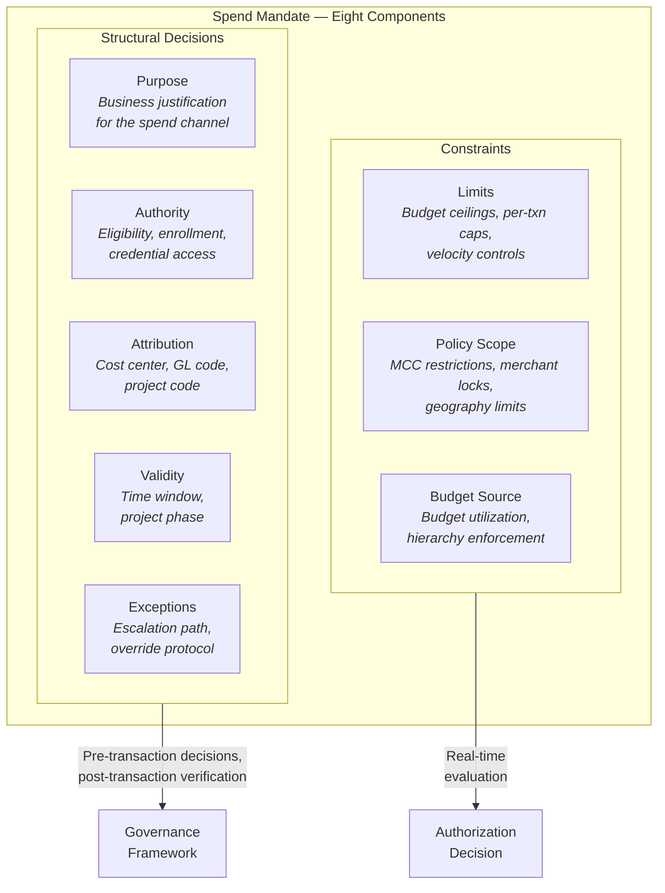

# Chapter 5: Spend Mandates — The Authorization Envelope

Every corporate payment carries an implicit set of assertions. Someone decided this payment was allowed. Someone's authority backs it. A budget absorbs it. A policy governs it. A cost center claims it. A time window bounds it. An exception path exists if something goes wrong.

In most enterprises, these assertions are scattered — partly in approval emails, partly in ERP configurations, partly in policy documents, partly in the head of the person who signed off. The Spend Mandate makes them explicit.

**A Spend Mandate is the governing authorization envelope for spend. It defines why a payment is allowed, who authorized it, whose budget pays for it, which rules apply, how it must be booked, and who is accountable.**

The Spend Mandate is a thinking tool. It is not a system entity, not a database record, not an API object. It is a framework for reasoning about the governance requirements that every corporate payment must satisfy — and for understanding how those requirements distribute across the entities in the product ontology.

---

## Why the Mandate Exists

For any payment made on behalf of an enterprise, the finance function must be able to answer a chain of questions:

- **Why was this allowed?** Every payment exists for a business purpose — project delivery, department operations, client engagement, vendor obligation. A payment without a stated purpose is a payment that cannot be justified in audit.
- **Who authorized it?** Spend authority flows through an organizational hierarchy. Someone — a project manager, a cost center owner, a procurement head, a finance controller — holds the authority that permits this payment.
- **Whose budget paid for it?** Every payment draws from a financial allocation. That allocation belongs to a department, a project, a client engagement, or a functional budget. The payment must decrement the correct allocation.
- **Which rules applied?** The payment operated under a policy regime — procurement policy, travel policy, project spend policy, departmental approval thresholds. The applicable rules determine what was permissible.
- **How should it be booked?** The payment must be recorded in the enterprise's financial system — attributed to a cost center, coded to a GL account, classified as capex or opex, tagged with a project or client code.
- **Who is accountable?** An individual or role bears responsibility for this payment. If it is questioned, disputed, or audited, the accountable party must be identifiable.

These questions are not optional. They are the governance requirements that separate controlled corporate spend from uncontrolled disbursement. The Spend Mandate is the structure that holds the answers.

---

## The Eight Components

A Spend Mandate comprises eight components. Together, they form the complete authorization envelope for a category of spend.

### 1. Purpose

Why this spend exists. The business justification that makes the payment legitimate.

A purpose is not a transaction description. It is the organizational reason the spend category was created. "Project delivery for Bank X implementation." "Department operations for Q3 Engineering." "Client entertainment for the APAC sales pipeline." "Recurring infrastructure for production systems."

Purpose connects the financial event to the business activity it serves.

### 2. Authority

Who is allowed to initiate, approve, or own this spend. Authority defines the chain of permission.

Authority is organizational, not personal. It attaches to roles — project manager, cost center owner, procurement head, travel desk administrator, finance controller. A person holds authority by virtue of their role, not their identity. When the person changes roles, the authority transfers.

Authority may be layered: an employee initiates, a manager approves, a finance controller oversees. The layers and their thresholds are part of the mandate.

### 3. Budget Source

Which budget or funding allocation absorbs the spend. The financial container that this payment decrements.

Budget source connects the payment to the enterprise's financial planning structure. A department budget. A project budget. A client-billable allocation. A capex pool. A discretionary fund. The budget source determines where the financial impact lands and who monitors utilization.

A single budget may fund multiple programs across different Spend Archetypes (see *Spend Archetypes — Four Workflow Patterns*). The budget is the financial container; the program's mandate configuration is the authorization envelope; the archetype determines the operational flow.

### 4. Policy Scope

What policy regime applies to this spend. The rules, restrictions, and thresholds that govern permissible behavior.

Policy scope may include procurement policies (approved vendor lists, competitive bidding thresholds), travel policies (fare class restrictions, per-diem caps, advance booking requirements), project spend policies (phase-gated approvals, client-billable constraints), and general corporate policies (approval thresholds by amount, geography restrictions, time-of-day limits).

Policy scope is not a single policy. It is the set of policies that collectively govern the spend category.

### 5. Limits

The financial ceilings and guardrails. Limits bound the magnitude and velocity of spend.

Limits operate at multiple levels: per-transaction amount, cumulative daily or monthly amount, total budget cap, merchant-specific or category-specific caps, supplier-specific ceilings. Limits may be absolute (hard decline at threshold) or advisory (flag for review at threshold).

Limits are the most directly enforceable component of the mandate. They translate into card-level controls and budget-level enforcement at authorization time.

### 6. Attribution

How the spend is tagged, tracked, and classified for internal accounting. Attribution is the bridge between the payment event and the enterprise's financial reporting structure.

Attribution includes cost center assignment, GL account coding, project or client code tagging, capex/opex classification, tax treatment designation, and any other internal identifier the finance function uses to organize spend data.

Attribution determines where the payment appears in management reports, how it flows into the general ledger, and whether the finance team can close the books without manual reclassification.

### 7. Validity

When and for how long the authorization is in effect. Validity bounds the mandate in time.

A mandate may be valid for a quarter, a project phase, a contract period, a fiscal year, or until explicitly revoked. A one-time mandate expires after a single use. A recurring mandate persists until its validity window closes or the authorizing party revokes it.

Validity prevents stale authorizations from persisting beyond their intended scope. A project mandate that outlives the project creates uncontrolled spend exposure.

### 8. Exceptions

What happens when spend falls outside the norm. The escalation path for non-standard situations.

Exceptions include approval rerouting (who reviews when the normal approver is unavailable), finance review triggers (what amount or category thresholds escalate to finance), procurement overrides (how exceptions to vendor restrictions are handled), temporary extensions (how budget or limit overages are managed), and post-facto justification requirements (what documentation is required after an exception is used).

Exceptions acknowledge that not every payment fits the standard path. A well-defined exception process is part of governance, not a bypass of it.

---

## Two Natures of Governance

The eight components of a Spend Mandate have two fundamentally different natures. Recognizing this divide is essential for understanding how governance requirements distribute across any corporate payments system.

### Constraints — evaluated at authorization

Three components are expressible as rules that accept or reject a transaction in real time. They answer: *is this specific transaction permissible right now?*

- **Limits** — financial ceilings and velocity guardrails. A transaction either falls within the budget's remaining capacity and the card's per-transaction cap, or it does not. The answer is binary, computable at the moment the card is presented.
- **Policy scope** — merchant, geography, currency, and category restrictions. A transaction either occurs at a permitted merchant in a permitted geography, or it does not. These rules evaluate against the transaction's attributes at the point of authorization.
- **Budget source** — the financial allocation that absorbs the spend. A transaction either has a funded budget path through the hierarchy, or it does not. Budget utilization is determined at authorization; adjustments follow at clearing if the final amount differs.

Constraints are the mandate's sharp edge. They produce an immediate, unambiguous outcome — approve or decline — at the speed of a payment network round-trip.

### Structure — decisions that shape the spend channel

Five components are not transaction-level rules. They are governance decisions made *before* any card is swiped — decisions that determine who has access to the spend channel, why it exists, how its activity is recorded, when it is valid, and what happens when something deviates. They shape the *context* in which transactions occur:

- **Purpose** — the business justification for the entire spend category. Purpose is not a property of a transaction; it is a property of the channel through which transactions flow. A program exists because someone decided "we need a way to pay suppliers" or "we need to fund implementation travel." Every transaction inherits that purpose by flowing through that channel.
- **Authority** — the chain of permission that determines who can participate. Authority is established when the spend channel is created (who owns it), when members are made eligible (who qualifies), and when credentials are issued (who receives access). It is not re-evaluated at each swipe — it was settled before the card existed.
- **Attribution** — how each transaction is tagged, classified, and routed in the enterprise's financial systems. Attribution decisions — cost center, GL account, project code, capex/opex classification — are configured when the channel is set up and refined when cards are issued. They may also be enriched after the transaction with cardholder-provided data.
- **Validity** — the temporal boundary of the authorization. A mandate may be valid for a project phase, a fiscal quarter, a contract period, or until revoked. Validity determines when the spend channel is open and when it closes — a structural boundary, not a per-transaction check (though mechanisms like card expiration dates can enforce temporal limits).
- **Exceptions** — the escalation path for non-standard situations. Exception handling is a governance process — approval rerouting, override protocols, post-facto justification — not a real-time authorization decision.

The two natures are complementary. Constraints without structural decisions produce a payment channel that can enforce limits but cannot explain why it exists, who should have access, or how its activity should be recorded. Structural decisions without constraints produce a governance framework that cannot prevent a single unauthorized transaction. Both must be satisfied for every payment — but they operate at fundamentally different timescales and touchpoints. Any platform that models corporate payments must handle both: enforce constraints at authorization speed, and make structural decisions explicit, active, and verifiable rather than implicit in policy documents and approval emails. How the platform achieves this — the specific mechanisms of enforcement — is the subject of *Corporate Payment Program*.

---

## The Mandate as a Thinking Tool

The Spend Mandate is not an entity in the product ontology. There is no "Mandate" record that a corporate creates and attaches to a program. The mandate is a thinking tool — a way of reasoning about the governance requirements of a spend category before those requirements are distributed across concrete system entities.

In the product ontology:

- **Budget source** is realized through the Budget entity and its hierarchical relationship to Credit Facility.
- **Limits** and **policy scope** are realized through Spend Policy and card-level controls within a Corporate Payment Program.
- **Attribution** is realized through the Booking Profile — the internal accounting treatment configured per program.
- **Authority**, **purpose**, **validity**, and **exceptions** are realized through program configuration, enrollment settings, and approval workflows.

No single entity contains the complete mandate. The mandate's components are distributed across the sub-sections of a Corporate Payment Program — Budget, Spend Policy, Booking Profile, and Card Profile. Understanding the mandate as a whole is necessary for understanding why these sub-sections exist and how they compose.

---

## A Mandate in Practice

To make the abstraction concrete, consider a specific mandate within Meridian Industries.

**Archetype:** Travel & Booking Payments
**Mandate:** Client Implementation Travel

| Component | Specification |
|-----------|--------------|
| Purpose | Travel for Bank X implementation project |
| Authority | Engagement manager initiates; delivery head approves |
| Budget source | Client implementation budget (project-level sub-budget under Professional Services) |
| Policy scope | Implementation travel policy — economy class for flights under 6 hours, per-diem caps by city tier, advance booking required for air |
| Limits | $5,000 per booking, $35,000 cumulative per quarter |
| Attribution | Client code: BNK-X-2026. Project code: IMPL-PHASE-2. Cost center: Professional Services — Delivery. GL: 6200-Travel |
| Validity | April – June 2026 (Phase 2 deployment window) |
| Exceptions | CFO delegate approves overages. Post-trip justification required for any booking exceeding per-diem by more than 20% |

This mandate is not entered as a single form or stored as a single record. Its components are distributed: the budget is a Budget entity linked to the Professional Services OU. The limits and policy scope are Spend Policy rules configured in the Corporate Payment Program. The attribution is a Booking Profile. The authority and approval chain are enrollment and workflow configurations. The validity is enforced through card expiration dates and program-level temporal controls.

The mandate is the whole. The system entities are the parts. Understanding the whole is necessary for configuring the parts correctly.

---

## Mandates Across Archetypes

Each Spend Archetype (see *Spend Archetypes — Four Workflow Patterns*) produces mandates with characteristic profiles. Supplier payment mandates emphasize budget source and limits with tight merchant-level controls. Employee spend mandates emphasize attribution and policy scope with distributed authority. Travel mandates emphasize purpose and validity with booking-level controls. Recurring merchant mandates emphasize budget source and limits with long-validity, merchant-locked controls.

The archetype shapes the mandate's emphasis. The mandate shapes the program's configuration. The program's configuration distributes the mandate's components across system entities. This chain — archetype → mandate → program configuration → system entities — is the conceptual path from business need to platform implementation.

The bridge from these conceptual tools to the product ontology's concrete entities is the subject of *From Concepts to Entities*.

---

*See *ESP Variants and Corporate Payment Product* for how archetype-specific mandates inform Product design. See *Corporate Payment Program* for how mandate components are configured within a Program. See *Spend Policy and Controls* for the detailed treatment of enforceable mandate components.*
