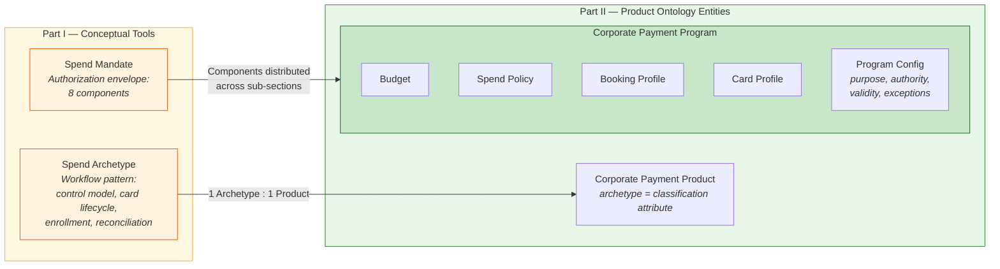

# Bridge: From Concepts to Entities

Part I introduced two conceptual tools — Spend Archetypes and Spend Mandates — to structure how corporates think about payment governance. Archetypes classify spend by workflow pattern. Mandates define the authorization envelope that governs each category of spend. Together, they provide the vocabulary for reasoning about what a corporate needs from a commercial card program before any system entity is introduced.

Part II introduces the product ontology — the concrete entities that the platform uses to represent, configure, and operate corporate payment programs. The ontology includes Corporate Payment Products, Corporate Payment Programs, Budgets, Spend Policies, Booking Profiles, Card Profiles, Accounts, and Cards, among others.

This bridge maps the conceptual tools to the entity model. The mapping is deliberate and asymmetric: neither conceptual tool becomes a standalone entity. Both inform how entities are structured and why they carry the attributes they do.

---

## Spend Archetype → Corporate Payment Product

**A Spend Archetype is realized as a classification attribute of a Corporate Payment Product.**

The archetype is not an entity. It is an attribute — a label that classifies a Product according to the workflow pattern it serves. When the ESP designs a Corporate Payment Product, it designs it for one archetype. The archetype determines the product's control model, card lifecycle, enrollment pattern, and reconciliation approach.

The relationship is one-to-one: one archetype per Product. A Product built for supplier payments embodies the Supplier Payments archetype — single-use cards, merchant-locked controls, per-invoice enrollment. A different Product, built for employee spend, embodies the Employee & Department Spend archetype — persistent cards, MCC restrictions, per-employee enrollment.

Multi-archetype coverage requires multiple Products. If Meridian Industries needs to run supplier payments and employee spend, Apex Payments creates two distinct Corporate Payment Products — each classified under its respective archetype, each carrying the control capabilities, card lifecycle, and reconciliation patterns appropriate to that workflow.

The archetype does not dictate every detail of the Product. Two Products classified under the same archetype may differ in commercial terms, supported controls, settlement mechanics, or merchant specializations. The archetype constrains the structural pattern. The ESP fills in the specifics.

---

## Spend Mandate → Program Sub-Sections

**A Spend Mandate is realized as the composition of Budget, Spend Policy, Booking Profile, and Card Profile sub-sections within a Corporate Payment Program.**

There is no "Mandate" entity. No Mandate record exists in the system. No API creates or returns a Mandate object. The mandate is a conceptual envelope whose components are distributed across the sub-sections of a Corporate Payment Program.

The mapping of mandate components to program sub-sections:

| Mandate Component | Realized In |
|---|---|
| Budget source | **Budget** — the financial allocation drawn from a Credit Facility, associated with an OU, hierarchically enforced |
| Limits | **Spend Policy** — per-transaction limits, cumulative limits, velocity controls; also **Budget** ceiling enforcement through hierarchy |
| Policy scope | **Spend Policy** — MCC restrictions, merchant locks, geography restrictions, amount thresholds |
| Attribution | **Booking Profile** — cost center, GL account, project code, client code, capex/opex classification |
| Purpose | **Program configuration** — the stated business justification for the program's existence |
| Authority | **Enrollment and approval settings** — role-based authority, approval workflows, program admin scope |
| Validity | **Card Profile** and **Program configuration** — card expiration dates, program temporal boundaries |
| Exceptions | **Approval workflows** and **Program configuration** — escalation paths, override protocols |

The mandate's constraint components (limits, policy scope, budget source) translate into controls that the platform evaluates at authorization time. The mandate's structural components (purpose, authority, attribution, validity, exceptions) are enforced through program configuration, issuance, and enrollment — and verified through post-transaction audit.

Understanding the mandate as a whole is necessary for configuring the program's sub-sections correctly. A program administrator who configures a Budget without considering the mandate's purpose may create a financial allocation that is technically correct but organizationally misaligned. A Spend Policy configured without reference to the mandate's authority structure may enforce rules that no one in the organization recognizes as relevant.

The mandate is the design intent. The program sub-sections are the implementation.

---

## The Mapping — Visual Summary

---

## What Carries Forward

Neither Spend Archetypes nor Spend Mandates appear again as standalone concepts in Parts II through V. Their work is done once the mapping is established:

- When Part II defines **Corporate Payment Product**, the archetype is present as a classification attribute that determines the product's structural pattern.
- When Part II defines **Corporate Payment Program**, the mandate's components are present as the program's sub-sections — Budget, Spend Policy, Booking Profile, Card Profile, and configuration settings.
- When Part IV describes how the ESP designs Products (see *ESP Variants and Corporate Payment Product*), the archetype determines the design constraints.
- When Part V describes how the Corporate operates Programs (see *Corporate Payment Program*), the mandate's components determine what must be configured and why.

The conceptual tools are scaffolding. The entities are the structure. The scaffolding explains why the structure is shaped the way it is. With the mapping established, the remaining parts of the book work directly with the entities.

