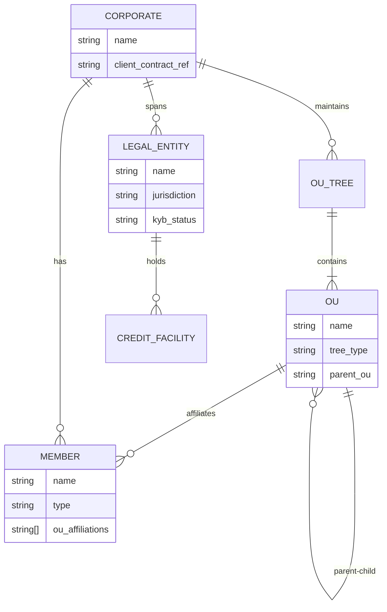
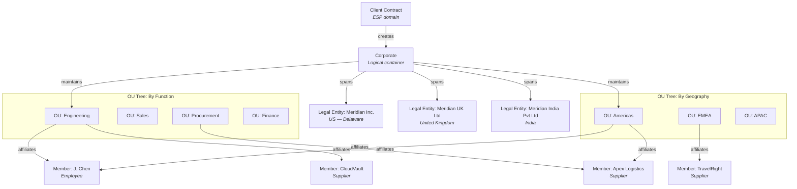

# Chapter 6: Corporate, Legal Entity, Organizational Unit, and Members

## Definitions

**Corporate** is the top-level logical entity in the system — a hosting container for the entire organizational structure of a business, distinct from any single legal registration.

**Legal Entity** is the legally accountable party to the bank — the anchor for all credit, billing, and regulatory relationships.

**Organizational Unit (OU)** is a hierarchical grouping construct within a Corporate, used to model internal structure for budget allocation, policy scoping, and member affiliation.

**Member** is a first-class entity of a Corporate, affiliated to zero or more OUs, representing any individual or organization that participates in the corporate's payment operations.

---

## Corporate

A Corporate is not a Legal Entity. It is a logical entity that sits above the legal structure and hosts everything beneath it: Legal Entities, OU hierarchies, Members, Programs, and Budgets.

A Corporate comes into existence through a **Client Contract** — an ESP-domain entity representing the commercial relationship between the ESP and the real-world business. The Client Contract is signed by one or more Legal Entities corresponding to that Corporate. Through this contract, the Corporate gains legal provenance: it is associated to a Client Contract and thus to a Legal Entity.

A single Corporate can span multiple Legal Entities. Meridian Industries, for example, is one Corporate with three Legal Entities across three jurisdictions.

If a corporate acquires a new Legal Entity mid-operation, the Corporate entity absorbs it. Existing Credit Facilities, Budgets, and Programs remain anchored to their original Legal Entities. The new Legal Entity is onboarded through the bank's KYB process and integrated into the Corporate's OU structure.

---

## Legal Entity

Legal Entity is the foundational unit of legal accountability. The bank performs Know Your Business (KYB) on each Legal Entity. All credit relationships — Credit Facilities, delinquency controls, regulatory reporting — anchor to Legal Entity, not to the Corporate.

A Corporate can contain multiple Legal Entities. Each Legal Entity operates in a specific jurisdiction and currency context. Credit Facilities are extended per Legal Entity by the bank (see *Credit Facility, Budget, and Account*).

**Meridian Industries** operates through three Legal Entities:

| Legal Entity | Jurisdiction | Primary Currency |
|---|---|---|
| Meridian Industries Inc. | US — Delaware | USD |
| Meridian UK Ltd | United Kingdom | GBP |
| Meridian India Pvt Ltd | India | INR |

Each Legal Entity independently holds its own Credit Facility from Commonwealth National Bank. Billing, settlement, and regulatory relationships flow through the Legal Entity, not through the Corporate directly.

---

## Organizational Unit

OUs are the corporate's internal structuring mechanism. They exist for organizational governance — not for legal accountability. A Corporate may create any number of independent OU hierarchies as needed.

### Key properties

- **Hierarchical.** OUs form trees. A parent OU contains child OUs, which may contain further children. There is no depth limit.
- **Multiple independent trees.** A single Corporate can maintain several OU trees simultaneously — by function, by geography, by project, by any dimension the corporate requires.
- **Can span Legal Entities.** An OU is an organizational grouping. A "Global Engineering" OU may contain employees from Meridian Industries Inc. (US), Meridian UK Ltd (UK), and Meridian India Pvt Ltd (India). The OU does not determine legal ownership — that is always anchored to the Legal Entity through the Credit Facility.
- **Default structure.** All Legal Entities are represented by default as a flat OU hierarchy — one OU per Legal Entity — under a "Legal Entities" root node. This default tree coexists with any custom trees the corporate creates.
- **Corporate-administered.** The corporate creates and maintains OU hierarchies, with or without the ESP's assistance. The ESP may also create OUs on behalf of the corporate.

### Budgets and Programs attach to OUs

A Program is always owned by an OU. Budgets are associated with OUs, and the budgets visible during Program setup are those belonging to the owning OU. If the corporate restructures, a Program's Credit Facility cannot move across Legal Entities, but Budgets can change and OU associations can change. All subsequent transactions are governed by the new Budget and reported to the new OU. Card assignments are unaffected — cards are associated to a Program, which carries OU association.

### Meridian's OU structure

Meridian Industries maintains three independent OU trees:

| OU Tree | Purpose | Example Nodes |
|---|---|---|
| By Function | Departmental budgeting and policy | Engineering, Sales, Operations, Finance, Procurement, Marketing |
| By Geography | Regional reporting and controls | Americas, EMEA, APAC |
| By Legal Entity (default) | Legal accountability | Meridian Industries Inc., Meridian UK Ltd, Meridian India Pvt Ltd |

The functional tree serves budget allocation — Engineering has a separate procurement budget from Marketing. The geographic tree serves regional spend reporting. The default Legal Entity tree anchors the legal dimension. These three trees coexist and serve different governance needs simultaneously.

---

## Member

A Member is a first-class entity of a Corporate. Members are affiliated to zero or more OUs — a Member may belong to multiple OUs across different OU trees, or may exist at the Corporate level without any OU affiliation.

### Member types

Four default Member types are recognized:

| Type | Description |
|---|---|
| **Employee** | An individual employed by the corporate. The primary participant in Employee Spend and Travel programs. |
| **Supplier** | A vendor or payee recognized by the corporate. The primary participant in Supplier Payments programs. |
| **Contractor** | An external individual or firm engaged by the corporate. May participate in Employee Spend or Supplier Payments programs depending on corporate policy. |
| **Client** | A customer or client of the corporate. Relevant in scenarios where the corporate issues payment instruments to its own customers. |

A Corporate can define custom attributes for every Member type to map members to its enterprise systems — ERP employee IDs, vendor codes, contractor classifications, or any integration-specific metadata.

### Eligibility and enrollment

Members participate in Corporate Payment Programs through an eligibility-and-enrollment model:

1. A Member is **eligible** for enrollment into a Program based on the program's eligibility rules.
2. An eligible Member is **enrolled** by the Program Admin using UI, file uploads, or APIs.
3. Each enrollment results in a virtual card and optionally account-based constructs, depending on the Spend Archetype.
4. An eligible Member can have **multiple enrollments** into the same Program. Each enrollment represents a new card — this supports single-use cards, ad-hoc short-lived cards, and recurring card issuance patterns.
5. In specific cases, enrollment may require the cardholder to complete KYC steps. This requirement is conditional on the program's configuration.

### Meridian's Members

Meridian Industries has approximately 18,000 employees across 12 countries, distributed across its three Legal Entities. Beyond employees, Meridian maintains several supplier Members:

| Member | Type | OU Affiliation |
|---|---|---|
| Apex Logistics | Supplier | Procurement (functional tree), Americas (geographic tree) |
| CloudVault | Supplier | Engineering (functional tree), Global (geographic tree) |
| TravelRight Agency | Supplier | Operations (functional tree), EMEA (geographic tree) |
| SaaSGrid | Supplier | Engineering (functional tree), Americas (geographic tree) |

Each supplier Member is affiliated to the relevant functional and geographic OUs. When Meridian creates a Supplier Payments Program under the Procurement OU, the eligibility rules determine which supplier Members qualify for enrollment.

---

## Merchant vs. Supplier: Two Domains, Two Entities

Supplier and Merchant are not the same entity. They represent different concepts in different domains and serve different purposes. One should not be confused for the other.

### Supplier — corporate domain

A Supplier is a Member type within the corporate's organizational structure. The corporate defines suppliers in its own terms — vendor name, vendor code, contract relationship, OU affiliation. The corporate uses Supplier information for card issuance, spend governance, and reconciliation.

### Merchant — bank domain

A Merchant is the bank-domain entity representing the party that accepts payment. A Merchant may be:

| Merchant Category | Description |
|---|---|
| **Direct** | A merchant directly affiliated with the bank or acquirer |
| **Aggregated** | A merchant grouped under a payment facilitator or aggregator |
| **Discovered** | A merchant identified through card network transaction data |

Merchants are grouped using **Authorized Merchant Categories (AMCs)**. AMCs are defined by the bank using MIDs, TIDs, MCCs, names, locations, or attribute-based patterns. All commercial terms reference AMCs rather than individual merchants. AMCs are also usable in Spend Policy rules by ESPs and Corporates — a Spend Policy can reference an AMC for allow/block rules (e.g., "allow transactions only at merchants in AMC-Travel").

### The reconciliation bridge

The corporate reconciles Supplier identity from transaction data using two sources: **Card Data** (supplier tags set at card issuance) and **Posting Data** (L1 and L2 data from the merchant, including tax amounts, PO numbers, invoice numbers, and customer reference codes). The correlation between Supplier-as-recognized-by-the-corporate and Merchant-as-recognized-by-the-bank is not guaranteed to be identical. Each domain relies on its own entities and classification schemes.

For the bank-domain treatment of Merchants and AMCs, see *Spend Policy and Controls*.

---

## Entity Relationship Summary

The organizational hierarchy follows a strict containment pattern:

Corporate is the top. Legal Entities provide the legal scaffolding. OU trees provide the organizational scaffolding. Members populate the structure. Programs, Budgets, and Cards operate within this framework — covered in subsequent chapters.
