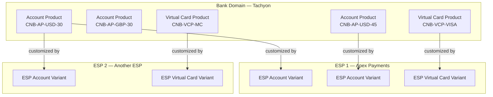

# Chapter 7: Account Product and Virtual Card Product

## Definitions

**Account Product** is a bank-defined, redistributable entity on Tachyon that specifies the billing, delinquency, and fee structure for accounts — the foundational building block from which ESPs construct account-level behavior.

**Virtual Card Product** is a bank-defined, redistributable entity on Tachyon that specifies the card scheme, network arrangements, and settlement obligations for virtual cards — the foundational building block from which ESPs construct card-level behavior.

---

## Account Product

An Account Product is a Tachyon entity. The bank creates it; the bank owns it. It defines the structural and commercial parameters that govern every account created under it.

### What an Account Product defines

| Parameter | Description |
|---|---|
| **Supported billing cycles** | The cadences available for account billing — 30-day, 45-day, weekly, or custom cycles. A specific billing cycle is selected when the ESP creates an Account Variant. |
| **Delinquency controls** | The bank's rules for past-due treatment: grace periods, delinquency thresholds, penalty triggers, NPA classification criteria. These are bank-retained — the ESP cannot override them. |
| **Base fees and charges** | The default fee schedule applicable to accounts under this product: annual fees, maintenance charges, overlimit fees, late payment penalties. The ESP may reduce or override commercial fees via an ESP Account Variant (see *ESP Variants and Corporate Payment Product*). |

### Currency constraint

An Account Product has a currency. That currency must match the currency of the Credit Facility to which an account is associated. However, the Account Product itself does not recognize Credit Facility as a related entity. Credit Facility association happens per Account at account-creation time — the Account Product merely constrains which currency is permissible.

This means a bank that operates in multiple currencies creates separate Account Products per currency. A single Account Product cannot serve both USD and GBP accounts.

### Redistributability

Account Products are redistributable. A single Account Product can be made available to multiple ESPs. The bank maintains a catalog of Account Products that ESPs can browse and select from. ESPs may additionally request custom Account Products from the bank if existing catalog entries do not meet their requirements.

Redistributability is a deliberate design property: the bank creates the building blocks once, and multiple ESPs assemble them into different Corporate Payment Products for different market segments.

### State model

Account Product lifecycle — creation, deprecation, retirement — is a bank-internal concern managed on Tachyon and is not treated further here.

### Commonwealth's Account Products

Commonwealth National Bank creates Account Products based on the billing and currency combinations its ESP partners require:

| Account Product | Billing Cycle | Currency | Available To |
|---|---|---|---|
| CNB-AP-USD-30 | 30-day | USD | All ESPs |
| CNB-AP-GBP-30 | 30-day | GBP | All ESPs |
| CNB-AP-USD-45 | 45-day | USD | All ESPs |

CNB-AP-USD-30 is used for standard US-dollar programs with monthly billing. CNB-AP-GBP-30 serves UK operations. CNB-AP-USD-45 supports programs where corporates negotiate extended payment terms — common in supplier payment arrangements where the corporate's working-capital strategy depends on a longer billing cycle.

All three products are available to Apex Payments and to any other ESP that Commonwealth partners with. Apex does not need to request a custom Account Product unless it requires a billing cycle or fee structure not represented in Commonwealth's catalog.

---

## Virtual Card Product

A Virtual Card Product is a Tachyon entity. The bank creates it; the bank owns it. It defines the card-scheme arrangements, network relationships, and settlement mechanics that govern every card issued under it.

### What a Virtual Card Product defines

| Parameter | Description |
|---|---|
| **Card scheme(s)** | The payment networks available under this product — Visa, Mastercard, private-label, or others. The bank chooses which schemes to make available and which scheme card to issue when a card is requested. |
| **Multi-network and multi-clearing-house support** | A single Virtual Card Product may support transactions presented through multiple payment networks if the bank has such relationships. The product encapsulates these arrangements. |
| **Settlement to networks** | Settlement with card networks is the bank's obligation. The Virtual Card Product defines the bank's settlement mechanics for each supported network. |
| **Dispute resolution** | Dispute resolution with networks and merchants is the bank's obligation. The Virtual Card Product carries the bank's dispute-handling framework. |

### Network selection

The bank — not the ESP, not the corporate — chooses which card scheme to issue when a card is requested under a Virtual Card Product. If a Virtual Card Product supports both Visa and Mastercard, the bank determines which network's card to issue based on its own criteria: network agreements, pricing, geographic coverage, or routing strategy.

Transactions may clear through a different network than the one on which the card was issued, if the bank has multi-network clearing relationships. This is transparent to the ESP and the corporate.

### Redistributability

Virtual Card Products are redistributable, following the same model as Account Products. A single Virtual Card Product can be used by multiple ESPs. The bank's product catalog includes both Account Products and Virtual Card Products.

### State model

Virtual Card Product lifecycle is a bank-internal concern managed on Tachyon and is not treated further here.

### Commonwealth's Virtual Card Products

Commonwealth National Bank creates Virtual Card Products based on the network arrangements it offers:

| Virtual Card Product | Primary Network | Multi-Network Clearing | Available To |
|---|---|---|---|
| CNB-VCP-VISA | Visa | Yes (via Commonwealth's acquirer relationships) | All ESPs |
| CNB-VCP-MC | Mastercard | Yes | All ESPs |

CNB-VCP-VISA is used for programs where Visa-network cards are preferred — often driven by the corporate's existing merchant acceptance footprint or the ESP's commercial arrangement with Visa. CNB-VCP-MC serves programs where Mastercard is the preferred scheme.

Both products support multi-network clearing. A card issued on the Visa network through CNB-VCP-VISA may have its transactions presented and settled through other networks if Commonwealth's acquiring relationships support it.

---

## Account Products and Virtual Card Products as Building Blocks

Account Products and Virtual Card Products are the bank's contribution to the product assembly chain. They are raw building blocks — precise in their technical and regulatory parameters, but deliberately incomplete as commercial offerings.

An Account Product does not know about card issuance, spend policies, or branding. A Virtual Card Product does not know about billing cycles, budgets, or fee overrides. Neither entity is customer-facing on its own.

The ESP takes these building blocks and customizes them through **ESP Account Variants** and **ESP Virtual Card Variants** — layering commercial terms, branding, notification programs, and operational parameters on top of the bank's base products. The Variant is where the ESP exercises its commercial discretion. The assembly of one Account Variant and one Virtual Card Variant produces a **Corporate Payment Product** — the entity that the ESP prices, contracts, and markets to corporates.

This layered architecture is covered in detail in *ESP Variants and Corporate Payment Product*.

The diagram illustrates redistributability: Commonwealth's CNB-AP-USD-30 Account Product is used by both Apex Payments and another ESP. Each ESP creates its own Variants on top of the same base product, customizing fees, interest, statements, rewards, and notifications independently.

---

## The Bank's Catalog

Commonwealth maintains a catalog of Account Products and Virtual Card Products. ESPs interact with this catalog in two ways:

1. **Browse and select.** The ESP reviews the existing catalog and selects products that match its requirements. No bank action is needed beyond initial catalog publication.
2. **Request and create.** If the catalog does not contain a product with the required billing cycle, currency, or network arrangement, the ESP requests a custom product. Commonwealth evaluates the request and, if approved, creates a new product entry.

The catalog model means the bank defines the boundaries of what is possible — billing cycles, delinquency rules, network schemes, settlement mechanics — and the ESP operates within those boundaries. The ESP never creates Account Products or Virtual Card Products directly. The ESP creates Variants, which customize the bank's products within the override model defined in *ESP Variants and Corporate Payment Product*.

---

## Relationship to Other Entities

Account Products and Virtual Card Products connect to the broader entity model at specific points:

- **Credit Facility** (see *Credit Facility, Budget, and Account*): Account Product currency must match Credit Facility currency. The association is made per Account, not per Account Product.
- **ESP Account Variant** (see *ESP Variants and Corporate Payment Product*): An ESP Account Variant customizes exactly one Account Product. Multiple Variants can customize the same Account Product.
- **ESP Virtual Card Variant** (see *ESP Variants and Corporate Payment Product*): An ESP Virtual Card Variant customizes exactly one Virtual Card Product. Multiple Variants can customize the same Virtual Card Product.
- **Corporate Payment Product** (see *ESP Variants and Corporate Payment Product*): Assembled from one ESP Account Variant and one ESP Virtual Card Variant. The bank's base products are two levels removed from the Corporate Payment Product — mediated by the Variants.
