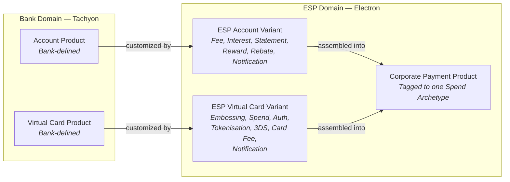
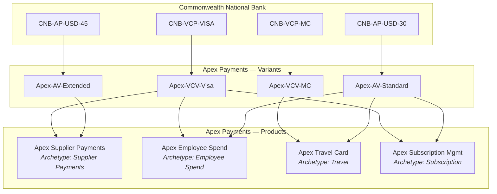

# Chapter 8: ESP Variants and Corporate Payment Product

## Definitions

**ESP Account Variant** is an Electron entity, defined by the ESP, that customizes a bank's Account Product through a set of component programs — layering the ESP's commercial and operational choices on top of the bank's base parameters.

**ESP Virtual Card Variant** is an Electron entity, defined by the ESP, that customizes a bank's Virtual Card Product through a set of component programs — layering the ESP's commercial, operational, and cardholder-experience choices on top of the bank's base parameters.

**Corporate Payment Product** is the ESP-offered construct that combines exactly one ESP Account Variant and one ESP Virtual Card Variant into a single marketable product, tagged to one Spend Archetype — the entity the ESP designs, prices, contracts, and markets to corporates.

---

## ESP Account Variant

An ESP Account Variant takes a bank-defined Account Product (see *Account Product and Virtual Card Product*) and customizes it. The bank provides the structural foundation — billing cycles, delinquency controls, base fees. The ESP layers its commercial choices on top through a set of **component programs**.

### Component programs

| Program | Purpose |
|---|---|
| **Fee Program** | Overrides or adjusts the bank's base fee schedule. The ESP can reduce fees, waive charges, or restructure the fee model for its market segment. |
| **Interest Program** | Configures interest computation parameters — rates, interest-free periods, compounding rules — within the bounds of what the bank's Account Product supports. |
| **Statement Program** | Defines statement generation: format, delivery schedule, content structure, branding, and language. |
| **Reward Program** | Configures account-level reward computation — points, cashback, miles, or statement credits. Computation is performed by Tachyon based on the programs defined in the Variant. |
| **Rebate Program** | Configures account-level rebate computation — spend-based, volume-tier, category-specific, or growth-incentive rebates. Computation is performed by Tachyon. |
| **Notification Program** | Configures account-level notifications. Covered in detail below. |

### Override model

The bank's base programs serve as the fallback. For any parameter the ESP has not explicitly overridden, the bank's default applies. The ESP can make all commercial choices within the scope of programs accessible to it — including reducing fees and charges below the bank's base schedule.

What the bank retains exclusively:

- **Credit risk parameters** — underwriting criteria, exposure limits, utilization thresholds
- **AML controls** — transaction monitoring rules, sanctions screening, suspicious activity reporting
- **Compliance parameters** — regulatory disclosures, jurisdiction-specific requirements, customer servicing obligations

These parameters are not accessible to the ESP. The bank manages them on Tachyon, and they apply regardless of what the ESP configures in the Variant.

### Reusability

An ESP Account Variant is reusable across multiple Corporate Payment Products. Apex Payments may use the same Account Variant in both its Supplier Payments Product and its Employee Spend Product if the billing and fee structure is identical. Alternatively, the ESP may create dedicated Variants for large customers who negotiate custom fee arrangements.

### State model

ESP Account Variants have a state model managed on Electron. The specific states and transitions are in scope for system documentation but are not detailed in this chapter.

---

## ESP Virtual Card Variant

An ESP Virtual Card Variant takes a bank-defined Virtual Card Product (see *Account Product and Virtual Card Product*) and customizes it. The bank provides the network arrangements, settlement obligations, and dispute framework. The ESP layers its card-level operational and commercial choices through a set of **component programs**.

### Component programs

| Program | Purpose |
|---|---|
| **Embossing Program** | Defines the card's visual and data attributes — name display, branding elements, corporate identity, and any printed or digital card-face configuration. |
| **Spend Program** | Also known as Payment Usage Program. Configures transaction-level controls: merchant category restrictions, amount limits, velocity limits, geographic constraints, and time-of-day rules. This is the ESP's baseline Spend Policy — the maximum control envelope. |
| **Authentication Program** | Configures cardholder authentication requirements — PIN, OTP, biometric, or other verification methods required at transaction time. |
| **Tokenisation Program** | Configures token provisioning for digital wallets, in-app payments, and other tokenized payment flows. |
| **3DS Program** | Configures 3-D Secure enrollment and authentication behavior for e-commerce transactions. |
| **Card Fee Program** | Configures card-level fees: issuance fees, replacement fees, FX markup, cross-border surcharges, and transaction-specific charges. |
| **Notification Program** | Configures card-level notifications. Covered in detail below. |

### Override model

The override model mirrors that of the ESP Account Variant. All commercial and operational parameters are available for ESP customization. The bank retains exclusive control over compliance and fraud risk parameters.

One distinction applies at the card level: the bank provides a limited set of **User-Managed Risk parameters** that are shared with the ESP and, in some cases, with the cardholder. These parameters allow the ESP and cardholder to adjust specific fraud-risk thresholds within bounds defined by the bank. The scope and mechanics of User-Managed Risk are covered in FRM documentation and are outside the scope of this book.

### Reusability

ESP Virtual Card Variants are reusable across multiple Corporate Payment Products, following the same pattern as Account Variants. An ESP may share a Virtual Card Variant across products or create dedicated Variants for specific customer requirements — branding, spend controls, authentication policies, or notification preferences.

### State model

ESP Virtual Card Variants have a state model managed on Electron. The specific states and transitions are in scope for system documentation but are not detailed in this chapter.

---

## Notification Programs: Account Variant vs. Virtual Card Variant

Notification Programs exist at two levels, each serving different recipients and covering different event types.

### Account Variant — Notification Program

Account-level notifications cover events related to the account and its financial state:

| Event Category | Examples |
|---|---|
| Billing | Billing cycle start/end, statement generated, statement available for download |
| Utilization | Credit utilization threshold crossed (e.g., 75%, 90%, 100%) |
| Delinquency | Payment past due, delinquency escalation, penalty applied |
| Credit Facility | Facility limit change, facility review notification |

**Recipients** are typically the Corporate Users configured as Program Admins for the Corporate Payment Program to which the account is mapped. For Credit Facility-related notifications, the configured contacts for the Legal Entity receive alerts in addition to program-level contacts.

### Virtual Card Variant — Notification Program

Card-level notifications cover events related to individual cards and cardholder activity:

| Event Category | Examples |
|---|---|
| Transaction | Authorization approved, authorization declined, transaction posted |
| Card lifecycle | Card issued, card expiry reminder, card suspended, card cancelled |
| Security | SMS OTP for 2FA, email OTP for 2FA, fraud alert |

**Recipients** are determined by the Cardholder Profile — the email address and phone number associated with the cardholder. This includes OTP delivery for second-factor authentication, which is functionally a notification routed to the cardholder's registered contact.

### Customization model

The ESP customizes notification templates per Variant: branding, language, content structure, and visual design. The Corporate can further customize at the Program or card level. All notification channels are supported: email, SMS, push notifications, and webhook/API callbacks.

All notification template changes — whether initiated by the ESP or the Corporate — go through review by bank executives before activation.

**Bank-originated notifications are non-suppressible.** Regulatory disclosures, fraud alerts, and compliance-mandated communications originate from the bank. The ESP cannot suppress these notifications. The ESP may suggest templates for bank-originated notifications, but the bank retains final authority over content and delivery.

---

## Corporate Payment Product

A Corporate Payment Product is the entity the ESP designs, prices, contracts, and markets to corporates. It is the "blueprint" — the product definition that precedes any operational deployment.

### Assembly rule

The assembly rule is strict and simple:

> **One ESP Account Variant + One ESP Virtual Card Variant = One Corporate Payment Product.**

A Corporate Payment Product references exactly one ESP Account Variant and exactly one ESP Virtual Card Variant. Multiple Corporate Payment Products can share the same Variant — but each CPP points to exactly one of each.

Each Corporate Payment Product is tagged to exactly **one Spend Archetype**. The relationship is 1:1. A Supplier Payments product is a distinct Corporate Payment Product from an Employee Spend product, even if both share the same underlying Account Variant. The Spend Archetype classification determines the product's control archetype, reconciliation pattern, enrollment model, and operational workflow.

### What the ESP defines at the Product level

Beyond the Variants, the Corporate Payment Product itself carries product-level definitions:

| Attribute | Description |
|---|---|
| **Baseline Spend Policy** | The maximum control envelope — the broadest set of transaction rules. Programs and cards can only narrow this policy, never expand it. |
| **Card Profile template** | The default card structure: tag schema, supplier attributes, cardholder data fields. |
| **Settlement mechanics** | How transactions settle from account to corporate — auto-pay options, settlement timing, payment methods. |
| **Control capabilities** | Which controls are available to corporates for this product — MCC restrictions, amount limits, geographic controls, velocity rules. |
| **Data and reporting** | What data feeds, reports, and analytics the corporate receives. |

### Commercial terms at the Product level

Each Corporate Payment Product carries its own commercial terms. These terms are distinct from relationship-level terms on the Client Contract (see *ESP-Wide Concerns*).

**Fees** at the Product level include:

- Core financing: interest charges, overlimit fees, late payment penalties
- Program fees: setup, annual, card issuance
- Transaction fees: domestic processing, cross-border processing, FX markup
- Archetype-specific fees: supplier enablement, travel data enrichment, reconciliation enhancement
- Settlement fees, controls/risk fees, data/reporting fees

**Rebates** at the Product level include: spend-based, volume-tier, category-specific, and growth-incentive structures.

**Rewards** at the Product level include: points, cashback, miles, and statement credits.

Product-level commercial terms define what the ESP charges and pays for a specific product offering. Relationship-level commercial terms — negotiated per-corporate based on overall volume, strategic value, and multi-product commitments — are scoped to the Client Contract, not to the Product.

### Rewards and rebates computation

Account-level reward and rebate computation is performed by Tachyon based on the programs configured in the ESP Account Variant. This is the mechanism the ESP relies on for product-level rewards and rebates.

Relationship-level reward and rebate computation — spanning multiple products and programs under a single Client Contract — is performed by Electron. The two computation layers are independent: Tachyon handles per-account arithmetic, Electron handles cross-product aggregation.

---

## Apex Payments: Variant Assembly

Apex Payments creates ESP Variants and assembles them into Corporate Payment Products for each of the four Spend Archetypes.

### Apex's Variants

| Variant | Type | Base Product | Key Customizations |
|---|---|---|---|
| Apex-AV-Standard | Account Variant | CNB-AP-USD-30 | Reduced annual fee, 2% cashback rebate, branded monthly statement |
| Apex-AV-Extended | Account Variant | CNB-AP-USD-45 | Extended billing for supplier programs, volume-tier rebate structure |
| Apex-VCV-Visa | Virtual Card Variant | CNB-VCP-VISA | Apex-branded card face, supplier-tag embossing, AMC-based spend controls |
| Apex-VCV-MC | Virtual Card Variant | CNB-VCP-MC | Apex-branded card face, travel-optimized authentication, push notifications |

### Apex's Corporate Payment Products

| Corporate Payment Product | Spend Archetype | Account Variant | Virtual Card Variant |
|---|---|---|---|
| Apex Supplier Payments | Supplier Payments | Apex-AV-Extended | Apex-VCV-Visa |
| Apex Employee Spend | Employee Spend | Apex-AV-Standard | Apex-VCV-Visa |
| Apex Travel Card | Travel | Apex-AV-Standard | Apex-VCV-MC |
| Apex Subscription Management | Subscription / Recurring | Apex-AV-Standard | Apex-VCV-Visa |

Each product maps to exactly one Spend Archetype. Apex Supplier Payments uses the extended-billing Account Variant because supplier payment programs typically require 45-day cycles for working-capital optimization. The other three products share Apex-AV-Standard because 30-day billing aligns with employee and travel expense cycles.

Apex-VCV-Visa is reused across three products. Apex-VCV-MC is used only for the Travel Card product, where Mastercard's travel-specific network features and acceptance footprint provide an advantage.

The diagram traces the full assembly chain: Commonwealth's bank-defined products flow into Apex's Variants, which are assembled into four Corporate Payment Products — one per Spend Archetype. Variants are reused where the commercial and operational requirements align. When Meridian Industries subscribes to Apex's products, the corporate creates Programs under these Corporate Payment Products — a topic covered in subsequent chapters.

---

## Control Boundary Summary

The Variant architecture establishes a clear control boundary between bank and ESP:

| Domain | Controlled By | Examples |
|---|---|---|
| Credit risk | Bank (Tachyon) | Underwriting, exposure limits, utilization enforcement |
| AML and compliance | Bank (Tachyon) | Sanctions screening, regulatory disclosures, NPA tracking |
| Fraud risk | Bank (Tachyon) | Bank-defined fraud rules, network-mandated restrictions |
| Delinquency | Bank (Tachyon) | Past-due treatment, penalty triggers, collections |
| Commercial fees and charges | ESP (Electron) | Fee overrides, waivers, restructured pricing |
| Rewards and rebates | Bank computes (Tachyon), ESP defines (Electron) | Account-level computation per Variant programs |
| Branding | ESP (Electron) | Card face, statements, notifications |
| Spend controls | ESP sets baseline (Electron), Corporate narrows further | MCC restrictions, amount limits, velocity, geography |
| Notifications — commercial | ESP (Electron) | Billing alerts, statement availability, reward summaries |
| Notifications — regulatory/fraud | Bank (Tachyon) | Regulatory disclosures, fraud alerts — non-suppressible |
| User-Managed Risk | Shared (Bank sets bounds) | Limited FRM parameters accessible to ESP and cardholder |

The bank provides the rails. The ESP runs the trains. The corporate buys the tickets.
