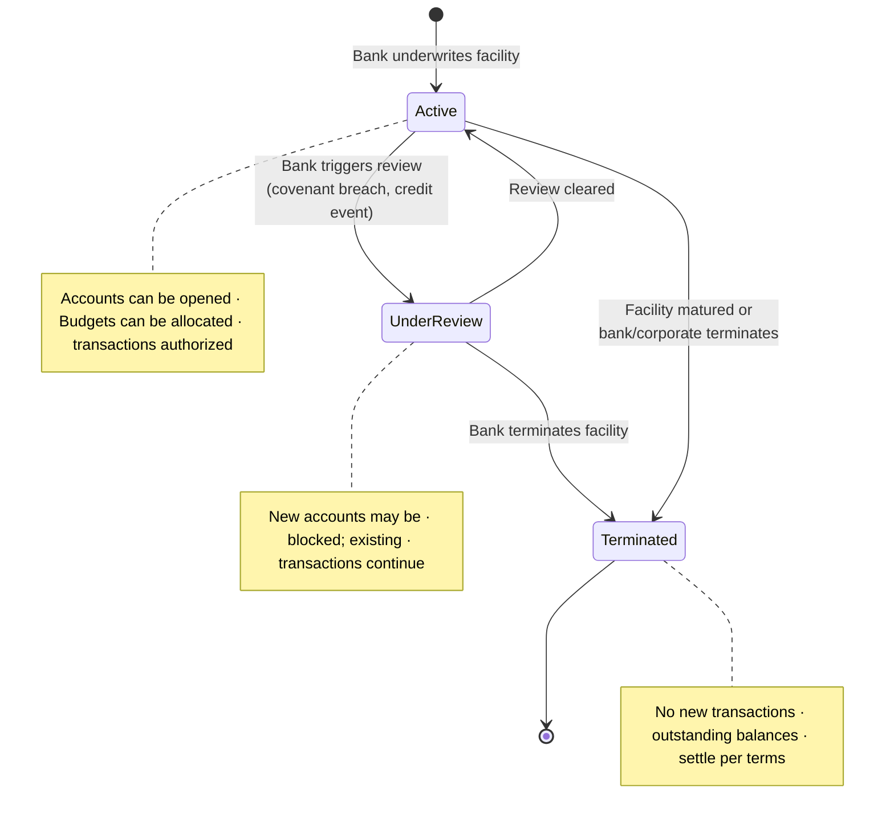
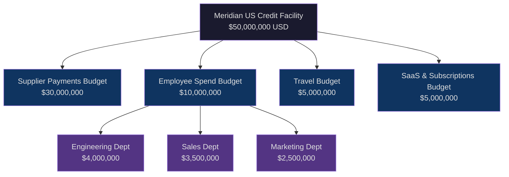
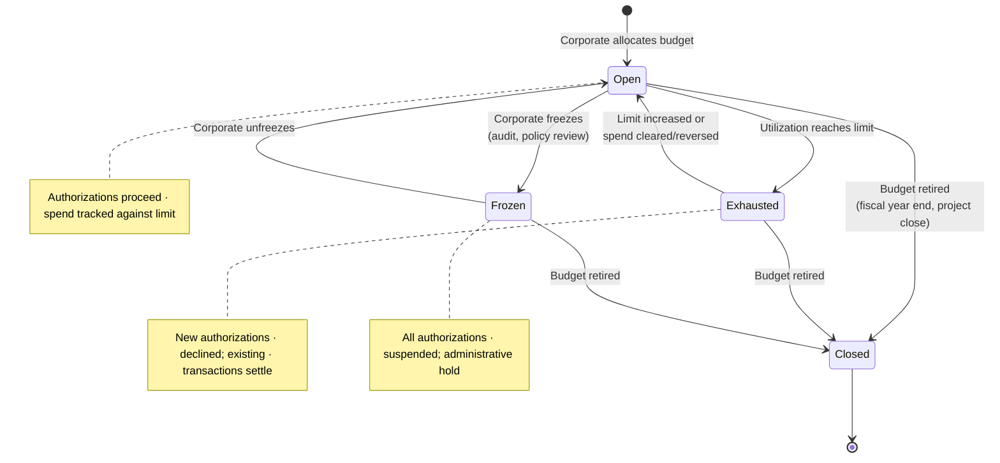
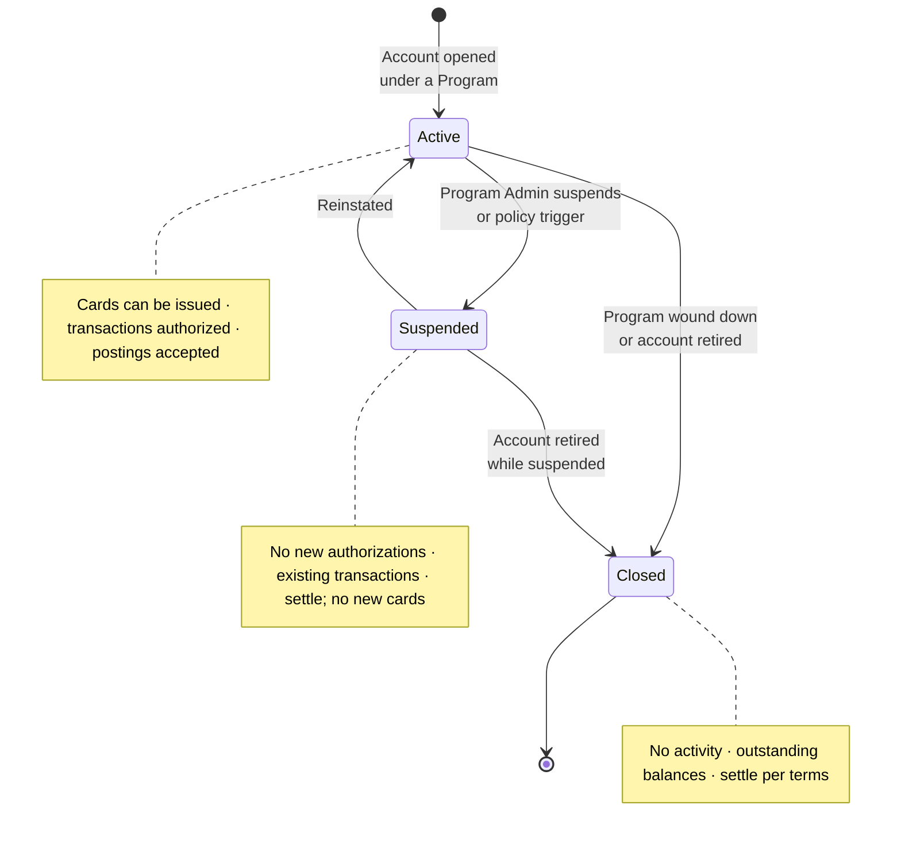
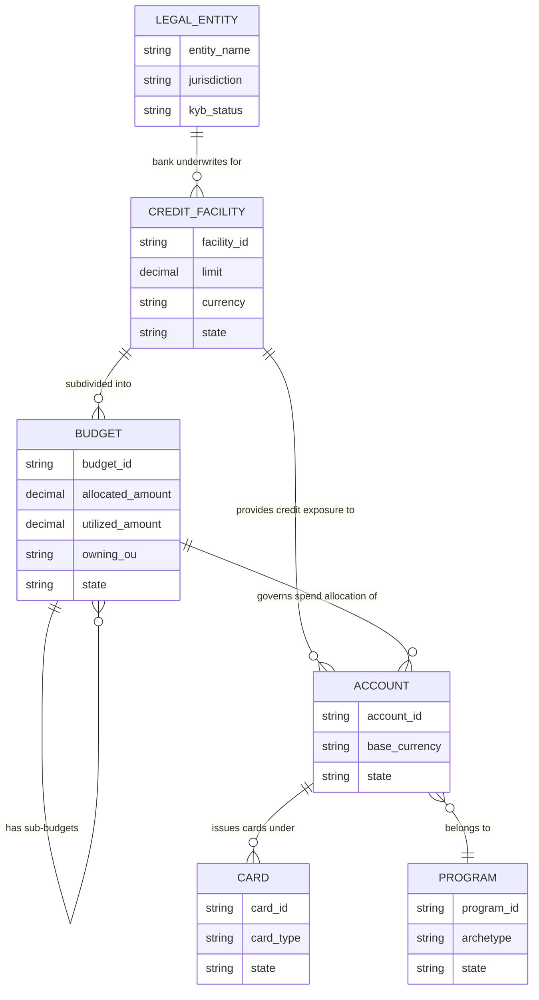

# Credit Facility, Budget, and Account

> **Credit Facility** — A bank-underwritten credit exposure tied to a single legal entity, representing the outermost financial boundary for all corporate payment activity under that entity.

> **Budget** — A hierarchical, corporate-governed allocation of a Credit Facility, carving total credit capacity into purposeful subdivisions mapped to the corporate's organizational and operational structure.

> **Account** — The financial container that binds a Credit Facility (bank concern) to a Budget (corporate concern), always specific to one Corporate Payment Program, and the entity against which all transactions are posted and settled.

---

## Credit Facility

### Bank Perspective

A Credit Facility is the bank's credit exposure against a legal entity. The bank underwrites the facility, assigns a limit, and tracks utilization against that limit for regulatory capital, covenant monitoring, and risk management purposes.

A Credit Facility is always tied to a single legal entity. Every account created under it inherits that legal entity association. The bank does not see or interpret the corporate's internal department, project, or cost-center hierarchy. Sub-limits, if any, are internal risk controls — they do not represent corporate organizational structure.

The bank tracks:

- Facility-level credit exposure
- Utilization against the underwritten limit
- Legal entity identity for regulatory, KYC, and covenant purposes
- Account-to-facility mapping for settlement and billing

The bank does not track:

- Which department or project a Budget represents
- Why the corporate chose a particular Budget allocation
- Internal corporate approval chains tied to Budgets

### Corporate Perspective

A Credit Facility is the total credit capacity the corporate holds from the bank for commercial card spend. Treasury or finance manages it as a financial resource — part of overall credit and liquidity planning.

A Credit Facility is tied to a legal entity for contractual and treasury purposes. The corporate may hold multiple Credit Facilities — from the same bank or across banks — for different programs, geographies, or currencies. The facility ceiling is a constraint the corporate plans around, not merely a bank-imposed cap.

A Credit Facility is currency-specific. Multi-currency operations require separate Credit Facilities, one per currency. Transactions are always posted to accounts in the Credit Facility's base currency. Settlements are also performed in that currency, though the corporate may choose a settlement account denominated in a different currency.

### Meridian Example

Meridian Industries maintains three Credit Facilities through Commonwealth National Bank — one per legal entity, each in local currency:

| Legal Entity | Credit Facility | Currency | Limit |
|---|---|---|---|
| Meridian Industries Inc. (US — Delaware) | Meridian US CF | USD | $50,000,000 |
| Meridian UK Ltd | Meridian UK CF | GBP | £12,000,000 |
| Meridian India Pvt Ltd | Meridian India CF | INR | ₹400,000,000 |

Meridian's treasury manages these as three distinct financial resources, each anchored to its respective legal entity. Commonwealth treats each as a separate credit exposure with independent utilization tracking.

### State Model

---

## Budget

### Purpose and Structure

A Budget is the corporate's mechanism for subdividing a Credit Facility into governed, purposeful allocations. Each Budget maps to a business need — a department, project, cost center, region, or spend category. The corporate assigns ownership, approval authority, and spend policy at the Budget level.

A Budget is hierarchical. A parent Budget can contain sub-Budgets. This nesting allows the corporate to model allocation structures of arbitrary depth — a department budget with project-level sub-budgets underneath, each with its own limits and ownership.

### Over-Allocation and Enforcement

Over-allocation of sub-Budgets is permitted. The sum of sub-Budget allocations may exceed the parent Budget's limit. Enforcement, however, operates through the hierarchy: at authorization time, all ancestor Budgets in the hierarchy are consulted. Overuse of any ancestor is not allowed. Over-allocation is an administrative convenience — it acknowledges that not all sub-Budgets will be fully utilized simultaneously. It is not permission to exceed the aggregate.

### Budget Sharing Across Programs

A Budget can be shared across multiple Corporate Payment Programs. Collectively, the Programs sharing a Budget cannot exceed it. Budget sharing is constrained by Organizational Unit association: Budgets are associated with OUs, and Programs are owned by OUs. A Budget is visible to Programs owned by the OU to which the Budget belongs.

There is no contention resolution mechanism. The Budget acts as a shared pool — whichever Program transacts first consumes from the available balance. If the combined spend across Programs reaches the Budget limit, subsequent authorizations against that Budget are declined.

### Bank Perspective

From the bank's standpoint, a Budget is an administrative subdivision of a Credit Facility. It does not change the legal ownership or the credit risk position. The bank treats Budget-level limits as soft allocations within the facility ceiling. What matters to the bank is facility-level utilization, not Budget-level allocation.

Reporting at Budget level is optional from the bank's perspective. The bank sees Budgets as spend partitions that help the corporate govern itself — they do not introduce new legal entities or new credit exposures.

### Corporate Perspective

From the corporate's standpoint, a Budget is the operational unit of financial governance. The corporate tracks:

- Allocated amount and remaining balance
- Owning department or cost center
- Authorized spenders and approvers
- Applicable spend policy
- GL coding and attribution tags
- Utilization against plan

A Budget sits at the intersection of organizational structure and financial control. It is where the corporate's internal governance meets the bank's credit infrastructure.

### Authorization and Clearing

Budget is consumed at authorization time. Adjustments are made at clearing time. There is no concept of "pending spend" at the Budget level — that concern belongs to the Account. The Budget's balance reflects authorized amounts, adjusted when transactions clear at their final amounts.

### Meridian Example

Meridian's US Credit Facility ($50M) is subdivided into Budgets aligned to its operational structure:

The Employee Spend Budget sub-allocations total $10M ($4M + $3.5M + $2.5M) — exactly matching the parent. If the Marketing department underspends, that capacity is not automatically available to Engineering. The parent Budget ($10M) sets the aggregate ceiling; sub-Budgets partition within it. Had sub-Budgets totaled $11M, over-allocation would be permitted, but the parent's $10M limit would still govern aggregate enforcement.

The Supplier Payments Budget ($30M) is shared across Meridian's supplier payment programs — covering raw materials procurement, logistics providers, and contract manufacturing. Different programs draw from the same Budget, constrained by the OU association that makes this Budget visible to those programs.

### State Model

---

## Account

### Dual Role

An Account is the entity that bridges the bank domain and the corporate domain. It carries two associations simultaneously:

- **Credit Facility association** — The bank's concern. The Account inherits its legal entity ownership, base currency, and credit exposure from the Credit Facility. The bank tracks utilization, posts transactions, generates statements, and manages billing through the Account.
- **Budget association** — The corporate's concern. The Account draws from a specific Budget, connecting every transaction posted to it back to the corporate's governance structure — the owning department, applicable spend policy, and financial allocation.

An Account is a financial container. It is not a payment instrument. Cards are associated with an Account; the Account is not itself swiped, tapped, or presented to a merchant.

### One Account per Program

An Account is always specific to one Corporate Payment Program. The number of Accounts per Program depends on the Spend Archetype:

| Spend Archetype | Account Pattern | Rationale |
|---|---|---|
| Supplier Payments | One Account per Program | Cards are issued to suppliers; the Program Admin manages centrally |
| Employee & Department Spend | One Account per employee | Each employee carries a card tied to their own Account for individual billing and expense tracking |
| Travel & Booking Payments | Varies — one per traveler or one per Program (lodge-style) | Depends on whether the corporate uses per-booking cards or persistent agency cards |
| Central Recurring Merchant Payments | One Account per Program | Cards are issued per project or cost head; centrally managed |

Because a card is tied to one Account and an Account is tied to one Program, a card cannot be used across Programs. An employee who participates in both a travel program and a department spend program carries two separate cards, each tied to a different Account under a different Program.

### Budget Sharing Within a Program

A Budget of a Program can be shared by multiple Accounts within that Program. In an employee-spend program with hundreds of Accounts (one per employee), all Accounts may draw from the same department-level Budget. The Budget is the aggregate financial constraint; individual Account-level limits (if any) provide additional per-cardholder control.

### Account Product Inheritance

An Account is created under an Account Product defined by the bank (see *Account Product and Virtual Card Product*). The Account inherits billing cycles, delinquency controls, base fees, interest programs, and statement configurations from the Account Product. The ESP customizes these through an ESP Account Variant before the Account Product is used in a Corporate Payment Program.

### Statements and Billing

The bank posts all transactions to Accounts. A statement is generated per Account. For programs with many Accounts (e.g., employee-spend programs with one Account per employee), the ESP system generates a master statement by compiling individual account-level statements.

Billing is at the Account level, submitted to the corporate with the Legal Entity (to which the Account's Credit Facility belongs) as the payer. The billing cycle, payment due date, interest-free period, and penalties are determined by the billing configuration at the ESP layer.

### Meridian Example

Meridian's "US Supplier Payments Program" has a single Account:

- Account tied to Meridian US Credit Facility ($50M, USD)
- Draws from Supplier Payments Budget ($30M)
- All supplier-issued cards under this Program are associated with this one Account
- Statements generated monthly at Account level
- Settlement via Meridian's designated treasury account

Meridian's "Engineering Department Spend Program" has multiple Accounts — one per engineer enrolled in the program:

- Each Account tied to Meridian US Credit Facility
- Each draws from the Engineering Dept sub-Budget ($4M)
- Each engineer's card is tied to their individual Account
- Individual statements plus a master statement at the Program level

### State Model

---

## Entity Relationships

The following diagram shows the containment and association hierarchy from Credit Facility down to Card.

The hierarchy reads: a Legal Entity anchors one or more Credit Facilities. Each Credit Facility is subdivided into Budgets (which can nest). Accounts carry both a Credit Facility association and a Budget association. Each Account belongs to exactly one Program. Cards are issued under an Account.

---

## Bank-Domain vs. Corporate-Domain Mapping

The same constructs serve different purposes depending on the actor's perspective.

| Entity | Bank Domain | Corporate Domain |
|---|---|---|
| **Credit Facility** | Credit exposure underwritten against a legal entity; risk position with utilization tracking and regulatory treatment | Total credit capacity from the bank; a financial resource to be allocated across business needs |
| **Budget** | Administrative subdivision of a facility; soft allocation within the credit ceiling; does not change risk position | Purposeful governance allocation — by department, project, or cost center — with ownership, policy, and spend tracking |
| **Account** | Ledger entity for posting transactions, generating statements, tracking delinquency, and managing billing | Financial container carrying the Program's credit and budget; the entity through which spend is executed and reported |
| **Utilization** | Aggregate credit exposure against the facility limit | Spend consumed against Budget allocation |
| **Legal Entity** | Legally liable party; anchor for KYC/KYB, covenants, and regulatory reporting | Contractual counterparty to the bank; treasury and legal anchor for the corporate |

The Credit Facility is the shared anchor between the two views. The bank structures around credit risk and legal entity. The corporate structures around business purpose, ownership, and policy. Both objectives are served through the same entity hierarchy without contradiction.

---

## Cross-References

- **Account Products and Virtual Card Products** are defined in *Account Product and Virtual Card Product*. An Account inherits its billing, delinquency, and fee configuration from the Account Product it is created under.
- **Corporate Payment Program** (see *Corporate Payment Program*) binds one Account (or many, depending on archetype) to a Product and a Credit Facility. The Program is the operational context; the Account is the financial container within it.
- **Card Profile** (see *Card Profile*) defines the full configuration attached to a card at issuance. Each card is associated with exactly one Account.
- **Spend Policy** (see *Spend Policy and Controls*) is a sub-entity of the Spend Mandate within a Program. Spend Policy controls are enforced at authorization time against the Account's Credit Facility and Budget.
- **Organizational Units** and their relationship to Budgets and Programs are defined in *Corporate, Legal Entity, Organizational Unit, and Members*. Budget visibility to Programs is governed by OU association.
