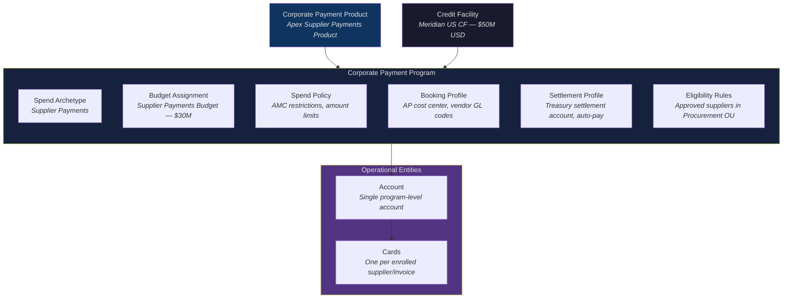

# Corporate Payment Program

> **Corporate Payment Program** — The corporate-configured operating construct through which a corporate puts a Corporate Payment Product to use for a specific spend workflow, binding a Product, a Credit Facility, a Budget, Spend Policies, a Booking Profile, and a Settlement Profile into a single governed unit of operation.

---

## From Product to Program

If a Corporate Payment Product is a blueprint, a Corporate Payment Program is a building.

A Product defines what is possible — the payment capabilities, control surfaces, commercial terms, and settlement mechanics that the ESP has packaged. A Program defines what is actually done — the specific use case, the budget drawn upon, the members enrolled, the policies enforced, and the accounting treatment applied.

Every Program is bound to exactly one Corporate Payment Product and exactly one Credit Facility. The Product determines the Spend Archetype and the available control capabilities. The Credit Facility determines the legal entity, the credit ceiling, and the currency. The corporate configures everything else.

### Product vs. Program

| Dimension | Corporate Payment Product | Corporate Payment Program |
|---|---|---|
| **Created by** | ESP (Apex Payments) | Corporate (Meridian Industries) |
| **Represents** | Blueprint — a payment offering for enterprise use | Instance — a configured usage of that offering for a specific spend workflow |
| **Scope** | Defines capabilities, control surfaces, commercial terms, settlement model | Exercises capabilities within constraints; defines who, why, how much, and how it is booked |
| **Spend Archetype** | Tagged to one archetype (Supplier Payments, Employee Spend, Travel, Recurring) | Inherits the archetype from its bound Product |
| **Cardinality** | One Product serves many Programs across many corporates | One Program uses exactly one Product |
| **Commercial terms** | Defined at the Product level by the ESP | Not renegotiated per Program — Programs are operational, not commercial |
| **Control baseline** | Sets the broadest permissible policy envelope | Can only tighten within the Product's envelope |

A corporate that needs supplier payment capability and employee spend capability requires two Products — and therefore two Programs. Each Product maps to one Spend Archetype; multi-archetype coverage requires multiple Products (see *ESP Variants and Corporate Payment Product* for Product composition).

---

## What a Program Encapsulates

A Program is the composition of several sub-structures, each serving a distinct governance purpose:

### Spend Archetype

Inherited from the bound Product. Determines the operational pattern — how payments are initiated, who the payer and payee are, what reconciliation model applies, and what card lifecycle pattern is used. The four archetypes are defined in *Spend Archetypes*.

### Budget Assignment

The Program draws its financial allocation from a Budget (see *Credit Facility, Budget, and Account*). The Budget connects the Program to the Credit Facility's credit capacity and to the corporate's internal governance — owning OU, allocation limits, and utilization tracking.

A Budget can be shared across multiple Programs. The corporate assigns the Budget during Program setup based on the OU that owns the Program and the Budgets visible to that OU.

### Spend Policy

The Program-level Spend Policy defines enforceable controls within the bounds set by the Product. The Product establishes the broadest permissible envelope; the Program tightens it. Merchant category restrictions, amount limits, velocity controls, currency restrictions, and geographic restrictions are all configurable at the Program level — but only in the direction of further restriction, never loosening.

Spend Policy is a sub-entity of the Spend Mandate. It is detailed in *Spend Policy and Controls*.

### Booking Profile

The Booking Profile defines how transactions under this Program are recorded in the corporate's financial and management systems — the cost center, GL account, project code, capex/opex classification, and tax treatment. The Booking Profile can contain rules for dynamic attribution: a transaction's cost-center allocation may vary based on the card's tags, the merchant category, or data provided by the cardholder after the transaction.

The Booking Profile also defines a default allocation for unmatched credits (e.g., refunds that cannot be matched to an original posting).

### Settlement Profile

The Settlement Profile defines how the corporate settles invoices received from the ESP for this Program — the settlement account, auto-pay configuration, and payment-date preferences. Each Program has exactly one Settlement Account. If a corporate needs different settlement accounts for different regions or legal entities, it creates separate Programs.

Settlement is performed by the corporate against bills generated by the ESP. The billing configuration (cycle, due date, interest-free period, penalties) is determined at the ESP layer through the Account Variant.

### Eligibility Rules

The Program defines which Members are eligible for enrollment based on OU membership, member type, and member attributes. Eligibility does not mean enrollment — enrollment is always explicit, performed by the Program Admin.

The eligibility model varies by archetype:

- **Supplier Payments** — eligibility is defined by payee (which suppliers are eligible to receive card payments)
- **Employee & Department Spend** — eligibility is defined by payer (which employees are eligible to spend)
- **Travel & Booking Payments** — depends on pattern: payer (which travelers) for per-booking cards; payee (which agencies) for lodge-style persistent cards
- **Central Recurring Merchant Payments** — eligibility is defined by payee (which merchants are approved for recurring charges)

---

## Program Structure

---

## Account and Card Binding

Each Program has at least one Account. The Account pattern depends on the archetype (see *Credit Facility, Budget, and Account* for details). Cards are issued under the Account. Each card is associated with exactly one Account, and each Account belongs to exactly one Program. This binding is immutable — a card cannot migrate between Programs or Accounts.

Each Program also has one Settlement Account, configured in the Settlement Profile. The Settlement Account is the corporate's bank account used for repayment — distinct from the program Account(s) that hold card transactions.

---

## Program Ownership

A Program is always owned by an Organizational Unit, regardless of which Members are eligible or enrolled. The owning OU determines Budget visibility — only Budgets associated with the owning OU are available during Program setup.

The **Program Admin** is the corporate user who manages the Program day-to-day. Responsibilities include:

- Enrolling eligible Members into the Program
- Issuing cards (or triggering card issuance workflows)
- Managing card-level controls and overrides
- Monitoring spend against Budget
- Handling exceptions and escalations

In supplier payment programs, the Program Admin is typically the default cardholder on supplier-issued cards. The Card Profile carries supplier-specific tags regardless of the cardholder assignment (see *Card Profile*).

Program Admins are Users — corporate personnel authorized to create and operate Payment Programs with scope-limited access to specific programs, products, budgets, and OUs. Users are distinct from Members: a User administers; a Member participates. The same person can be a User in one context (administering a program) and a Member in another (enrolled as a spender in a different program).

---

## State Model

```mermaid
stateDiagram-v2
    [*] --> Draft : Corporate initiates\nprogram setup
    Draft --> Active : Configuration complete;\nall bindings validated
    Active --> Suspended : Corporate suspends\n(policy review, budget freeze,\ncompliance hold)
    Suspended --> Active : Corporate reactivates
    Active --> Closed : Corporate winds down\nprogram
    Suspended --> Closed : Program retired\nwhile suspended
    Draft --> Closed : Setup abandoned
    Closed --> [*]

    note right of Draft : Product and CF bound;\nBudget assigned;\npolicies configured;\nno cards issued yet
    note right of Active : Members can be enrolled;\ncards issued;\ntransactions authorized;\nspend tracked
    note right of Suspended : No new enrollments;\nno new authorizations;\nexisting transactions\nsettle normally
    note right of Closed : No activity;\nall cards cancelled;\noutstanding balances\nsettle per terms
```

### State Transitions

| From | To | Trigger |
|---|---|---|
| Draft | Active | Corporate completes configuration: Product binding, Credit Facility binding, Budget assignment, Spend Policy, Booking Profile, Settlement Profile, eligibility rules all validated |
| Draft | Closed | Corporate abandons setup before activation |
| Active | Suspended | Corporate suspends — reasons include budget freeze, policy review, compliance investigation, or organizational restructuring |
| Suspended | Active | Corporate lifts the suspension; all bindings revalidated |
| Active | Closed | Corporate winds down the program — fiscal year change, project completion, organizational restructuring, or product migration |
| Suspended | Closed | Program retired without reactivation |

When a Program moves to Closed, all associated cards are cancelled. Outstanding transactions (authorized but uncleared) settle normally. Account balances settle per the Credit Facility's repayment terms.

---

## Meridian Example

Meridian Industries configures four Programs under its US legal entity, each bound to a different Apex product and drawing from its Meridian US Credit Facility:

| Program | Product (Apex) | Budget | Archetype | Account Pattern |
|---|---|---|---|---|
| Meridian US Supplier Payments | Apex Supplier Payments Product | Supplier Payments ($30M) | Supplier Payments | One account for the program |
| Meridian Engineering Spend | Apex Employee Spend Product | Engineering Dept ($4M) | Employee & Dept Spend | One account per engineer |
| Meridian Client Travel | Apex Travel Product | Travel ($5M) | Travel & Booking | One account per traveler |
| Meridian SaaS Subscriptions | Apex Recurring Payments Product | SaaS & Subscriptions ($5M) | Central Recurring | One account for the program |

The **Meridian US Supplier Payments Program** illustrates a typical configuration:

- Bound to Apex's Supplier Payments Product (Spend Archetype: Supplier Payments)
- Bound to Meridian US Credit Facility ($50M, USD)
- Budget: Supplier Payments Budget ($30M), owned by Procurement OU
- Spend Policy: transactions restricted to AMC-Logistics and AMC-Cloud; per-transaction limit $500,000; monthly aggregate limit $5M
- Booking Profile: AP cost center, vendor-specific GL codes, opex classification; rules-based attribution using card-level supplier tags and L2 invoice data
- Settlement Profile: auto-pay from Meridian's US treasury account, 30-day billing cycle
- Eligibility: suppliers registered in Meridian's Procurement OU, approved by Procurement Director
- Program Admin: AP Manager in Meridian's Procurement team

Each enrolled supplier receives a card (single-use or multi-use depending on the engagement model). The Program Admin is the default cardholder; the Card Profile carries supplier-specific tags for reconciliation.

---

## Cross-References

- **Corporate Payment Product** — the ESP-defined blueprint that a Program instantiates — is defined in *ESP Variants and Corporate Payment Product*. Product composition, variant assembly, and commercial terms are covered there.
- **Credit Facility, Budget, and Account** (see *Credit Facility, Budget, and Account*) defines the financial entities that a Program binds to. Account patterns per archetype are detailed there.
- **Spend Policy and Controls** (see *Spend Policy and Controls*) details the cascading restriction model from Product to Program to Card.
- **Card Profile** (see *Card Profile*) defines the full configuration attached to each card issued under a Program.
- **Spend Archetypes** — the workflow patterns that determine a Program's operational behavior — are defined in *Spend Archetypes*.
- **Members and Enrollment** — eligibility rules, enrollment mechanics, and member types — are covered in *Members, Eligibility, and Enrollment*.
