# Card Profile

> **Card Profile** — The full configuration attached to a card at issuance, comprising a Cardholder Profile, a Spend Policy, Fee Overrides, and Tags — the bridge between corporate domain context and card behavior at point of sale.

---

## Structure

A Card Profile is not a single flat record. It comprises four distinct sub-sections, each serving a different purpose in the lifecycle of the card.

```mermaid
graph TB
    subgraph CardProfile ["Card Profile"]
        direction TB
        CP["Cardholder Profile<br/><i>Identity, KYC, contact,<br/>corporate domain linkage</i>"]
        SP["Spend Policy<br/><i>Per-card controls —<br/>tighten-only within Program bounds</i>"]
        FO["Fee Overrides<br/><i>Card-level fee adjustments<br/>within Product/Program bounds</i>"]
        Tags["Tags<br/><i>Key-value attribution:<br/>cost center, GL code, PO,<br/>supplier ID, project</i>"]
    end

    subgraph CardholderDetail ["Cardholder Profile Detail"]
        direction TB
        Name["Name on Card"]
        Address["Address"]
        Contact["Email, Phone<br/><i>ACS / notifications</i>"]
        CustomAttr["Custom Attributes<br/><i>CorporateMemberType,<br/>CorporateMemberID</i>"]
    end

    subgraph SpendDetail ["Spend Policy Detail"]
        direction TB
        Velocity["Velocity / Volume Limits<br/><i>Daily, weekly, monthly,<br/>quarterly, annual windows</i>"]
        MerchantScope["Merchant Scope<br/><i>AMC-based allow/block</i>"]
        AmountLimits["Amount Limits<br/><i>Per-transaction, lifetime</i>"]
        Restrictions["Authorization Restrictions<br/><i>Currency, geography, time</i>"]
    end

    subgraph TagDetail ["Tag Structure"]
        direction TB
        CorpInfo["Corporate Program Info<br/><i>Corporate ID, Program ID,<br/>Member ID, Membership ID</i>"]
        SupplierInfo["Intended Supplier Info<br/><i>Supplier ID, supplier name,<br/>contract reference</i>"]
        ReconInfo["Reconciliation Tracking<br/><i>PO number, invoice ref,<br/>project code, GL code</i>"]
    end

    CP --> CardholderDetail
    SP --> SpendDetail
    Tags --> TagDetail

    style CardProfile fill:#16213e,color:#e0e0e0
    style CardholderDetail fill:#0f3460,color:#e0e0e0
    style SpendDetail fill:#533483,color:#e0e0e0
    style TagDetail fill:#1a1a2e,color:#e0e0e0
```

---

## Cardholder Profile

The Cardholder Profile captures the identity and contact information of the person or role associated with the card.

**Core attributes:**

- Name on card
- Address
- Email and phone number — used for ACS (Access Control Server) second-factor authentication challenges and notification delivery (transaction alerts, decline notifications, card expiry reminders)

**Corporate domain linkage:**

- CorporateMemberType — maps the cardholder to a member type in the corporate's domain (Employee, Supplier contact, Contractor)
- CorporateMemberID — maps the cardholder to a specific Member entity in the corporate's organizational structure

These custom attributes connect the card to the corporate's internal identity model. The bank sees a cardholder; the corporate sees a Member within an OU hierarchy.

### Cardholder Assignment by Archetype

Not every card has a traditional cardholder. The assignment pattern varies by Spend Archetype:

| Archetype | Cardholder | Notes |
|---|---|---|
| Supplier Payments | Program Admin (default) | The supplier receives and uses the card, but the Program Admin is the named cardholder. If ACS is enabled and the supplier must respond to second-factor challenges, an authorized contact from the supplier is designated as cardholder. |
| Employee & Department Spend | The employee | Full Cardholder Profile with employee identity, contact info, and corporate domain linkage |
| Travel & Booking Payments | Traveler or agency contact | Depends on whether the card is per-booking (traveler) or lodge-style (agency) |
| Central Recurring Merchant Payments | Program Admin or designated operator | Centrally managed; cardholder is the corporate person responsible for the recurring relationship |

In all cases involving supplier-issued cards, supplier information is carried in the Tags section regardless of the Cardholder Profile assignment.

---

## Spend Policy (Card-Level)

The card-level Spend Policy defines enforceable controls specific to this card. It operates within a cascading restriction model: the Product sets the broadest envelope, the Program tightens within it, and the card-level Spend Policy tightens further. Each level can only restrict; no level can loosen a constraint set above it.

The card-level Spend Policy is detailed in *Spend Policy and Controls*. In the context of the Card Profile, the key controls include:

- **Velocity and volume limits** — configured using tumbling windows: daily, weekly, monthly, quarterly, annual. Each window defines a maximum transaction count, maximum aggregate amount, or both.
- **Merchant scope** — allow or block rules based on Authorized Merchant Categories (AMCs). A card may be restricted to transactions at merchants within AMC-Logistics only, even if the Program-level policy permits AMC-Logistics and AMC-Cloud.
- **Amount limits** — per-transaction ceiling, life-to-date ceiling, or both.
- **Authorization restrictions** — rules based on attributes in the authorization request: currency, geographic origin, time-of-day, day-of-week.

Tag data can also be referenced in Spend Policy rules. A card tagged with a specific supplier ID might have its Spend Policy automatically scoped to that supplier's expected transaction patterns.

---

## Fee Overrides

Fee Overrides allow per-card adjustments to the fees assessed on transactions and card operations. These overrides operate within the bounds set by the Product and Program — the card-level override can reduce or waive a fee but cannot introduce fees not defined at higher levels.

Use cases include:

- Waiving transaction fees for high-volume supplier cards
- Adjusting FX markup for cross-border travel cards
- Applying different fee tiers for premium vs. standard employee cards

Fee Overrides are an operational lever. The commercial terms of the Corporate Payment Product set the contractual ceiling; Fee Overrides allow the corporate (or the ESP on behalf of the corporate) to differentiate treatment at the individual card level.

---

## Tags

Tags are structured key-value extensions attached to the card. They carry corporate domain context that the card itself — as a bank-domain instrument — does not natively understand. Tags are serialized in URI format per tag type.

Tags serve three primary use cases:

### Corporate Program Information

- Corporate ID
- Program ID
- Member ID
- Membership ID

These tags link the card back to its Program and the enrolled Member, enabling the ESP and corporate systems to associate any transaction on this card with the correct program context.

### Intended Supplier Information

- Supplier ID (corporate's internal identifier)
- Supplier name
- Contract reference or engagement reference

These tags are critical in the Supplier Payments archetype, where each card is issued for a specific supplier or invoice. The supplier information on the card is the corporate's primary reconciliation anchor — matching the corporate's Supplier entity to the bank's Merchant entity at transaction time (see *Spend Policy and Controls* for the Supplier/Merchant distinction).

### Reconciliation Tracking Information

- PO number
- Invoice reference
- Project code
- Cost center code
- GL code

These tags embed the corporate's accounting and attribution data directly on the card. When a transaction posts, the card's tags are available alongside the L1 and L2 merchant data, enabling straight-through reconciliation without manual matching.

Tag data can be referenced in Spend Policy rules. A card tagged with a specific PO number can have its Spend Policy locked to the PO amount. A card tagged with a project code can have its transactions automatically attributed to that project in the Booking Profile.

---

## Card Types

### Physical and Virtual

"Virtual" in the corporate payments context does not denote a form factor. It denotes that the card is decoupled from the financial obligation — the obligation resides in the Account, not in the card itself. This is an industry term distinguishing the majority of card systems (where card and account are tightly coupled) from the corporate payments model (where they are not).

A card issued as a digital card can be converted to a physical card. Both forms reference the same Account, the same Card Profile, and the same controls. The physical/digital distinction is a delivery concern, not a domain model concern.

### Single-Use and Multi-Use

| Characteristic | Single-Use Card | Multi-Use Card |
|---|---|---|
| **Transaction count** | One authorization, then card is deactivated | Multiple authorizations over the card's lifetime |
| **Typical archetype** | Supplier Payments (one card per invoice), Travel (one card per booking) | Employee Spend, Central Recurring, Travel (lodge-style) |
| **Reconciliation** | One card = one transaction = one reconciliation record | One card = many transactions; reconciliation relies on posting-level data and tags |
| **Control model** | Amount-locked, merchant-locked, time-limited | Velocity limits, AMC restrictions, cumulative ceilings |
| **Enrollment model** | Each enrollment or issuance request creates a new card | One enrollment creates one persistent card |

An eligible Member can have multiple enrollments into the same Program, each producing a new card. This supports single-use card patterns, ad-hoc cards, and short-lived cards without requiring a new Member entity for each issuance.

### Card-Account Association

Every card is associated with exactly one Account. An Account can have many cards. Because the Account belongs to one Program, the card inherits its Program context — archetype, Budget, Spend Policy baseline, Booking Profile, and Settlement Profile — through the Account.

---

## Meridian Examples

### Supplier Card (Single-Use)

Meridian issues a single-use card for a logistics invoice under the US Supplier Payments Program:

| Card Profile Element | Configuration |
|---|---|
| **Cardholder Profile** | Program Admin (AP Manager); email and phone for notifications only (no ACS — supplier does not need to authenticate) |
| **Spend Policy** | Per-transaction limit: $47,500 (matches invoice amount); single-use; AMC restricted to AMC-Logistics |
| **Fee Overrides** | Transaction fee waived (high-volume supplier arrangement) |
| **Tags** | Supplier ID: SUP-2847 (Meridian's internal ID for the logistics provider); PO: PO-2026-04821; Invoice: INV-38291; Cost center: PROC-LOGISTICS; GL: 5210-AP |

The card is issued, the supplier uses it for one payment matching the invoice, and the card deactivates. The PO number and invoice reference on the card's tags enable straight-through reconciliation: the posting carries the card's tags plus L2 data from the merchant (invoice number, tax amount), and the Booking Profile maps it to the correct AP ledger entry.

### Employee Card (Multi-Use)

Meridian issues a multi-use card to a software engineer under the Engineering Department Spend Program:

| Card Profile Element | Configuration |
|---|---|
| **Cardholder Profile** | Engineer's full name, office address, corporate email, mobile phone (ACS enabled for second-factor authentication on high-value transactions); CorporateMemberType: Employee; CorporateMemberID: EMP-11492 |
| **Spend Policy** | Per-transaction limit: $2,000; monthly aggregate limit: $5,000; AMC restricted to AMC-SaaS and AMC-Cloud; blocked for AMC-Travel and AMC-Entertainment |
| **Fee Overrides** | None — standard Product/Program fee schedule applies |
| **Tags** | Cost center: ENG-PLATFORM; Project: PROJ-ATLAS; GL: 6340-TOOLS |

The card persists for the duration of the engineer's enrollment. Each transaction is posted to the engineer's individual Account, enriched with the card's tags and L1/L2 merchant data. The engineer may provide additional transaction-level data (expense purpose, specific sub-project) through a data-capture workflow; the Booking Profile uses this combined data for cost-center attribution.

---

## Cross-References

- **Spend Policy and Controls** (see *Spend Policy and Controls*) details the cascading restriction model and the full catalog of constraint and structural controls. The card-level Spend Policy in the Card Profile is the innermost layer of this cascade.
- **Credit Facility, Budget, and Account** (see *Credit Facility, Budget, and Account*) defines the Account to which every card is bound. Card transactions post to the Account and consume from the Account's associated Budget.
- **Corporate Payment Program** (see *Corporate Payment Program*) defines the Program under which cards are issued. The Program's Spend Policy, Booking Profile, Settlement Profile, and eligibility rules govern all cards issued within it.
- **Members and Enrollment** — the enrollment process that triggers card issuance and Card Profile configuration — is covered in *Members, Eligibility, and Enrollment*.
