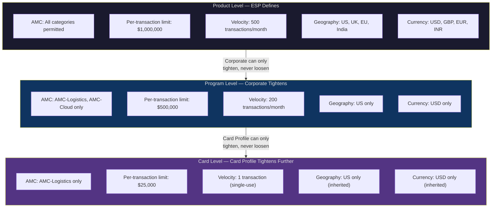
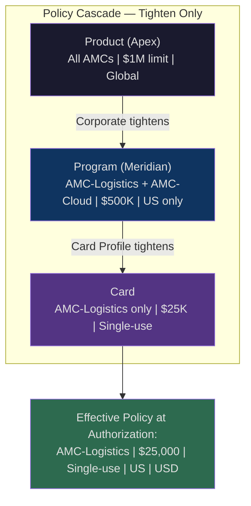

# Spend Policy and Controls

> **Spend Policy** — A sub-entity of the Spend Mandate that defines the enforceable restrictions on card-based spend, configured at three cascading levels — Product, Program, and Card — where each level can only tighten constraints set by the level above, never loosen them.

> **Authorized Merchant Category (AMC)** — A business-meaningful grouping of merchants defined by the ESP, used in Spend Policy rules to scope where cards can transact — distinct from the network-level Merchant Category Code (MCC), which is a classification standard, not a policy construct.

---

## The Cascading Restriction Model

Spend Policy operates through a three-level cascade. Each level inherits the constraints of the level above and may only add further restrictions. No level can remove or weaken a restriction set at a higher level.

### Level 1: Product (ESP-Defined)

The ESP defines the broadest permissible policy envelope when creating the Corporate Payment Product. This establishes the outer boundary — the maximum set of merchant categories, the highest transaction limits, the widest geographic scope, and the most permissive velocity allowances that any Program or card under this Product can ever have.

The ESP cannot set controls that violate the bank's own restrictions. The bank enforces regulatory limits, network-mandated restrictions, and risk thresholds at the Account Product and Virtual Card Product level. The ESP's Product-level policy operates within those bank-set boundaries, though the bank's constraints are infrastructure-level and not visible as "Spend Policy" in the corporate domain.

### Level 2: Program (Corporate-Configured)

The corporate configures the Program-level Spend Policy during Program setup. The corporate sees the Product-level policy as the available envelope and selects which subset to exercise. Every control at the Program level must be equal to or more restrictive than the Product-level default.

A Program that operates under a Product permitting all AMCs might restrict itself to AMC-Logistics and AMC-Cloud. A Product permitting per-transaction limits up to $1M might have a Program that sets its limit at $500K. The corporate cannot expand the envelope — it can only shrink it.

### Level 3: Card (Card Profile Override)

The card-level Spend Policy — configured as part of the Card Profile (see *Card Profile*) — further tightens within the Program's bounds. Individual cards can have per-transaction limits lower than the Program's, more restrictive AMC scope, tighter velocity controls, or narrower geographic permissions.

Card-level policies are set at issuance time and can be modified during the card's lifecycle by the Program Admin, subject to the same tighten-only constraint. A card-level policy cannot exceed the Program-level policy at the time the modification is applied.

---

## Authorized Merchant Categories (AMCs)

### Definition and Purpose

An AMC is a grouping of merchants defined by the ESP (or by the bank on behalf of ESPs). AMCs provide business-meaningful categorization — unlike MCCs, which are network-assigned classification codes that may not align with how corporates think about their suppliers and spend categories.

The bank may define AMCs using MIDs (Merchant IDs), TIDs (Terminal IDs), MCCs, merchant names, geographic locations, or pattern-based rules combining these attributes. The resulting AMC is a policy-usable construct — referenced in Spend Policy rules by ESPs, corporates, and at the card level.

### AMC vs. MCC

| Dimension | MCC (Merchant Category Code) | AMC (Authorized Merchant Category) |
|---|---|---|
| **Defined by** | Card networks (Visa, Mastercard) | ESP (or bank, on behalf of ESPs) |
| **Granularity** | ~800 standardized codes | Custom — can be narrow (one merchant) or broad (an entire supply chain segment) |
| **Purpose** | Network-level classification for interchange, reporting | Business-meaningful grouping for spend policy, controls, commercial terms |
| **Stability** | Standardized, rarely changes | Configurable, can be created or modified by ESP request |
| **Example** | MCC 4214 (Motor Freight Carriers), MCC 7372 (Computer Programming) | AMC-Logistics (may include MCCs 4214, 4215, 4731, plus specific MIDs), AMC-Cloud (may include MCC 7372 plus named cloud providers) |

### Custom AMCs

ESPs and corporates may request custom AMCs. A corporate with a specific set of approved logistics providers can request an AMC that includes only those providers' MIDs. A custom AMC can be as narrow as a single merchant or as broad as an industry vertical.

Custom AMCs are defined by the ESP (with Zeta's assistance) and made available for use in Spend Policy rules at the Product, Program, and Card levels.

### Standard AMC Examples

| AMC | Description | Typical MCC/MID Basis |
|---|---|---|
| AMC-Logistics | Freight carriers, shipping, warehousing, customs brokerage | MCCs 4214, 4215, 4731, plus named logistics providers |
| AMC-Cloud | Cloud infrastructure and SaaS providers | MCCs 7372, 5734, plus named providers (AWS, Azure, GCP) |
| AMC-Travel-Agencies | Travel management companies and online travel agencies | MCCs 4722, 4723, plus named TMCs |
| AMC-SaaS | Software subscription services | MCCs 5817, 5818, plus named SaaS vendors |

---

## Enforceable Controls vs. Auditable Controls

The Spend Mandate — realized as the composition of Budget, Spend Policy, Booking Profile, and Card Profile within a Program — has two distinct halves. One half is enforceable by the bank at authorization time. The other half is auditable by the corporate after the transaction.

### Enforceable Controls

These controls are evaluated and enforced by the bank at the moment of authorization. A transaction that violates any enforceable control is declined.

| Control | Description | Scope |
|---|---|---|
| **Merchant category restrictions** | Allow or block transactions based on AMC membership | Product, Program, Card |
| **Per-transaction amount limit** | Maximum amount for a single authorization | Product, Program, Card |
| **Daily aggregate limit** | Maximum total spend within a calendar day | Program, Card |
| **Monthly aggregate limit** | Maximum total spend within a billing month | Program, Card |
| **Lifetime (life-to-date) limit** | Maximum total spend over the card's entire lifetime | Card |
| **Currency restrictions** | Allowed transaction currencies | Product, Program, Card |
| **Geographic restrictions** | Allowed merchant countries or regions | Product, Program, Card |
| **Time-of-day / day-of-week** | Allowed transaction windows | Program, Card |
| **Velocity limits** | Maximum transaction count within a tumbling window (daily, weekly, monthly, quarterly, annual) | Program, Card |
| **Budget limits** | Available balance in the Budget hierarchy; all ancestor Budgets consulted | Program (via Budget hierarchy) |
| **Single-use enforcement** | Card deactivates after one successful authorization | Card |

Budget enforcement cascades through the hierarchy. When a transaction is authorized, the system checks the card's Budget, the Budget's parent, and every ancestor up to the Credit Facility. If any ancestor's available balance is insufficient, the authorization is declined. Budget is consumed at authorization time; adjustments occur at clearing.

### Auditable Controls

These controls cannot be evaluated at the point of authorization. They represent corporate governance objectives that are enforced through post-transaction review, reporting, and accountability workflows.

| Control | Description | Enforcement Mechanism |
|---|---|---|
| **Business purpose** | Why this spend exists (project delivery, department operations, client engagement) | Post-transaction review; cardholder provides justification |
| **Accountability** | Who is responsible for this spend; who approved it | Approval workflow records; audit trail |
| **Compliance with procurement policy** | Whether the spend followed internal procurement rules (preferred suppliers, competitive bidding) | Post-transaction audit; exception reporting |
| **Cost-center attribution** | Whether the spend is booked to the correct cost center and GL account | Booking Profile rules; manual correction if needed |

The line between enforceable and auditable is not arbitrary. Enforceable controls depend on data available in the authorization request — amount, merchant identity, currency, geography, time. Auditable controls depend on data that only the cardholder or the corporate can provide — business purpose, project justification, procurement compliance.

Some enforceable controls serve as proxies for auditable intent. Restricting a card to AMC-Logistics does not prove the spend was for a legitimate logistics need, but it narrows the field to merchants the corporate deems relevant. The enforceable control is a guardrail; the auditable control is the accountability.

```mermaid
graph LR
    subgraph Enforceable ["Enforceable at Authorization"]
        E1["Merchant category (AMC)"]
        E2["Amount limits"]
        E3["Currency restrictions"]
        E4["Geographic restrictions"]
        E5["Velocity limits"]
        E6["Time-of-day / day-of-week"]
        E7["Budget hierarchy"]
        E8["Single-use enforcement"]
    end

    subgraph Auditable ["Auditable Post-Transaction"]
        A1["Business purpose"]
        A2["Accountability"]
        A3["Procurement compliance"]
        A4["Cost-center attribution"]
    end

    Auth["Authorization<br/>Request"] --> Enforceable
    Enforceable -->|"Decline if violated"| Decision["Authorize /<br/>Decline"]
    Decision -->|"If authorized"| Posting["Transaction<br/>Posted"]
    Posting --> Auditable
    Auditable -->|"Review, report,<br/>correct"| Governance["Corporate<br/>Governance"]

    style Enforceable fill:#0f3460,color:#e0e0e0
    style Auditable fill:#533483,color:#e0e0e0
```

---

## Authorization Enforcement

The bank enforces all enforceable Spend Policies at authorization time — including policies set at the ESP level (Product) and the corporate level (Program and Card). The bank does not distinguish between policy layers; it evaluates the effective policy — the intersection of all applicable restrictions — as a single set of rules.

The ESP and the corporate both have an option to participate in authorization processing. If the bank's built-in controls are insufficient for a particular use case, the ESP or corporate can intercept the authorization flow (via webhook or co-processing) to apply additional logic. This is optional; the default is bank-only enforcement.

Beyond Spend Policy, the bank enforces its own controls at the Account and Credit Facility level:

- Regulatory limits and compliance checks
- Credit Facility utilization and delinquency controls
- Fraud detection and risk scoring (exclusively bank-managed)
- Network-mandated restrictions

These bank-level controls are not configurable by the ESP or corporate. They are infrastructure guardrails, enforced independently of the Spend Policy cascade.

---

## Merchant vs. Supplier

The Spend Policy operates on the bank-domain concept of Merchant. The corporate's domain concept of Supplier is a distinct entity that cannot be directly mapped to Merchant.

**Merchant (bank domain):** A party in the payment network — directly affiliated, discovered through acquirer networks, or aggregated. The bank identifies merchants by MID, TID, MCC, name, and location. Merchants are grouped into AMCs for policy and commercial purposes.

**Supplier (corporate domain):** A Member type within the corporate's OU hierarchy. The corporate defines suppliers in its own organizational terms — supplier ID, contract reference, commodity classification, procurement category.

These two entities exist in different domains and serve different purposes. A corporate's "Supplier-2847" may transact through several MIDs across different acquirers, or through an aggregator whose MID does not correspond to the supplier at all. The correlation between the two is established at reconciliation time through the combination of card-level Tags (supplier ID, PO number) and posting-level data (L1 merchant information, L2 invoice data).

Spend Policy rules reference AMCs — the bank-side grouping — not Supplier IDs. A card restricted to AMC-Logistics will accept transactions from any merchant in that category, regardless of whether the merchant is the intended supplier. The card's Tags carry the intended supplier identity; the Spend Policy enforces the merchant category boundary.

---

## Meridian Example: Policy Cascade

The following traces the cascading restriction from Apex's Product to Meridian's Program to a specific supplier card.

### Product Level (Apex Supplier Payments Product)

Apex defines the broadest envelope for all corporates using this Product:

- AMC: all Apex-defined AMCs permitted
- Per-transaction limit: $1,000,000
- Monthly aggregate: unlimited (governed by Credit Facility)
- Velocity: 500 transactions/month per card
- Geography: all countries where Commonwealth operates
- Currency: all currencies supported by Commonwealth

### Program Level (Meridian US Supplier Payments Program)

Meridian tightens the policy for its supplier payments use case:

- AMC: restricted to AMC-Logistics and AMC-Cloud
- Per-transaction limit: $500,000
- Monthly aggregate: $5,000,000 per card
- Velocity: 50 transactions/month per card
- Geography: US only
- Currency: USD only

### Card Level (Specific Logistics Supplier Card)

The Program Admin issues a single-use card for a specific logistics invoice:

- AMC: restricted to AMC-Logistics only (AMC-Cloud removed)
- Per-transaction limit: $25,000 (matches the invoice amount)
- Velocity: 1 transaction (single-use)
- Geography: US only (inherited from Program)
- Currency: USD only (inherited from Program)

When this card is presented at a logistics merchant in the US for a $25,000 USD transaction, the bank evaluates the effective policy — the intersection of all three levels — and authorizes. A $30,000 transaction at the same merchant is declined (exceeds card-level limit). A $25,000 transaction at a cloud provider is declined (AMC-Cloud is permitted at the Program level but blocked at the card level). A second transaction on the same card — regardless of amount or merchant — is declined (single-use enforcement).

---

## Spend Policy Configuration Authority

| Level | Configured By | Can Reference | Constraint |
|---|---|---|---|
| **Product** | ESP (Apex) | All bank-defined AMCs; bank-imposed limits as ceiling | Cannot exceed bank's Account Product / Virtual Card Product restrictions |
| **Program** | Corporate (Meridian) | AMCs permitted by the Product; Product limits as ceiling | Can only tighten within Product envelope |
| **Card** | Corporate (Program Admin) | AMCs permitted by the Program; Program limits as ceiling | Can only tighten within Program envelope |

The ESP configures the Product-level policy once. The corporate configures the Program-level policy at Program setup and the card-level policy at issuance (or via modification during the card's lifecycle). Modifications at any level are subject to the tighten-only constraint relative to the level above at the time of modification.

---

## Cross-References

- **Card Profile** (see *Card Profile*) contains the card-level Spend Policy as one of its four sub-sections. The relationship between Tags, Spend Policy rules, and merchant identity is covered there.
- **Corporate Payment Program** (see *Corporate Payment Program*) is where the Program-level Spend Policy is configured as part of the Spend Mandate. Budget assignment, Booking Profile, and Settlement Profile — the other components of the Mandate — are defined there.
- **Credit Facility, Budget, and Account** (see *Credit Facility, Budget, and Account*) defines Budget enforcement, which operates alongside Spend Policy enforcement at authorization time. The Budget hierarchy cascade is independent of but complementary to the Spend Policy cascade.
- **Corporate Payment Product** defines the Product-level Spend Policy baseline as part of the ESP's product configuration.
- **Spend Archetypes** define the per-archetype control patterns — which controls are natural to each workflow and how enforceable and auditable controls map to each archetype's operational model.
