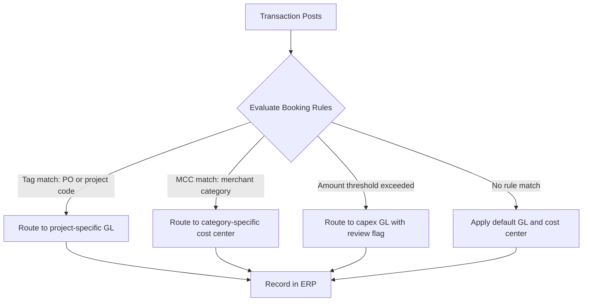
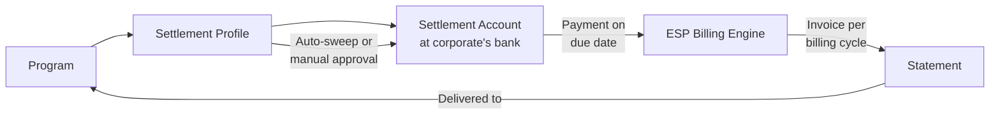

# Chapter 13: Booking Profile and Settlement Profile

## Definitions

**A Booking Profile defines the internal accounting and attribution treatment for every transaction within a Corporate Payment Program — the rules that determine which cost center, GL code, and project receives each charge.**

**A Settlement Profile defines how the corporate settles invoices received from the ESP — specifying the repayment account, payment method, and settlement timing for a Program.**

---

## Booking Profile

Every transaction that posts to an account must be recorded in the corporate's financial systems. The Booking Profile provides the instructions for that recording. It is not a static label. It is a rules engine that resolves attribution at transaction time.

### What a Booking Profile covers

A Booking Profile specifies the following attribution dimensions for each transaction:

- **Legal Entity** — which entity carries the accounting obligation
- **Cost center / department** — the internal unit charged
- **Project or client code** — attribution to a specific initiative, engagement, or customer
- **GL / ERP account** — the general ledger account where the transaction is recorded
- **Capex vs. Opex classification** — capital expenditure or operating expenditure
- **Tax treatment** — applicable tax code, withholding, or exemption status
- **Accrual / reporting classification** — period assignment and reporting bucket
- **Internal chargeback or allocation rules** — cross-departmental cost redistribution

These dimensions compose the full internal booking instruction for a transaction. Without a Booking Profile, a transaction has no home in the corporate's financial architecture.

### Static defaults and dynamic rules

A Booking Profile can be simple or sophisticated.

**Static rules** assign a fixed attribution to every transaction in the program. A program dedicated to a single cost center — such as a SaaS subscription program for the Engineering department — may book every transaction to the same GL code and cost center with no further logic.

**Dynamic rules** evaluate transaction attributes at posting time and route the transaction accordingly. The Booking Profile acts as a template with runtime resolution: static defaults plus rule-driven overrides based on transaction data, card-level tags, or payer-provided attributes.

Dynamic attribution rules can reference:

- **Merchant Category Code (MCC)** — route transactions to different GL codes based on merchant type
- **Card-level tags** — supplier identity, project code, or program metadata embedded in the card at issuance
- **Transaction amount thresholds** — flag transactions above a threshold for a different accounting treatment
- **Payer-provided data** — expense codes, project references, or purpose annotations submitted by the cardholder after the transaction (see *Transaction Posting and Data*)

The resolution order is deterministic. The system evaluates the most specific matching rule first and falls through to the default if no rule matches.

### Default allocation for unmatched credits

Refunds and reversals are attributed back to the original transaction's booking coordinates when the original context is available. The dispute resolution process at the bank produces credits against the Account associated with the Program. When the original posting can be identified, the refund inherits the Booking Profile attribution of that original transaction.

However, some credits arrive without sufficient context to trace them to a specific original posting. A refund from a merchant that references a transaction outside the current billing cycle, or a network-initiated reversal with incomplete reference data, may lack the linkage needed for automatic re-attribution.

For these cases, the Booking Profile defines a **default allocation** — a fallback GL code and cost center where unmatched credits are recorded. This prevents unresolved credits from blocking reconciliation. The corporate's finance team reviews the default allocation periodically and manually re-attributes credits where possible.

The default allocation is a safety mechanism. A well-configured program with clean card-level tagging and rich L2 data (see *Transaction Posting and Data*) generates few unmatched credits.

### Booking Profile and the Spend Mandate

The Booking Profile is one of the sub-sections composing a Corporate Payment Program. It works alongside the Budget (which governs financial capacity), the Spend Policy (which governs what is permitted), and the Settlement Profile (which governs repayment). Together, these sub-sections realize the Spend Mandate — the governing authorization envelope for spend (see *Corporate Payment Program*).

The Spend Mandate answers "should this spend be allowed." The Booking Profile answers "how should this spend be recorded."

### Data-capture forms as Booking Profile inputs

In the Employee and Department Spend archetype, cardholders may be required to provide additional transaction context — an expense code, a project reference, or a business-purpose annotation — after each transaction. This data capture is configured at program setup.

The Booking Profile references these payer-provided fields in its dynamic rules. An employee who enters project code "Apollo-7" triggers a Booking Profile rule that routes the transaction to the Apollo project GL, cost center 4402, and client code HDFC-01 — rather than the default departmental allocation.

The form is a metaphor. The actual interface could be the Electron portal, a mobile app, or an API call from a third-party expense system. The Booking Profile does not depend on the interface — it depends on the data fields being populated against the posting.

---

## Settlement Profile

Settlement is the act of paying the ESP for billed charges. The Settlement Profile governs how that payment happens for a given Program.

### What a Settlement Profile covers

A Settlement Profile specifies:

- **Settlement Account** — the bank account from which the corporate pays its statement balance
- **Billing entity / liable entity** — the Legal Entity responsible for settlement, determined by the Credit Facility anchoring the Program
- **Settlement method** — automatic sweep (auto-debit on due date) or manual approval (corporate treasury initiates payment)
- **Payment timing** — configured relative to the billing cycle and statement due date
- **Treasury ownership** — which treasury function or officer is responsible for settlement execution

### One Settlement Account per Program

The system supports exactly one Settlement Account in a Settlement Profile per Program. This is a structural constraint, not a configuration choice. If a corporate requires different settlement accounts — by region, by Legal Entity, or by business unit — it creates separate Programs. Each Program carries its own Settlement Profile with its own Settlement Account.

This constraint simplifies the settlement-to-billing reconciliation. Every invoice for a Program is settled from a single, known account. There is no splitting, no routing logic, and no ambiguity in the payment source.

### Billing and settlement are distinct operations

Billing is performed by the ESP. The ESP's billing configuration determines the billing cycle (monthly, weekly), payment due date, interest-free period, and late-payment penalties. Billing is at the account level and is submitted to the corporate with the Legal Entity — to which the corresponding Credit Facility is extended — as the payer.

Settlement is performed by the corporate against invoices received from the ESP. The Settlement Profile in the Payment Program governs how the corporate responds to those invoices. The corporate configures whether settlement is automatic or manual, and on what schedule.

The Booking Profile answers "how should this spend be recorded." The Settlement Profile answers "how should this spend be repaid."

### Auto-sweep vs. manual settlement

**Auto-sweep** — the Settlement Account is debited automatically on the statement due date. No manual intervention is required. This is the default for high-volume programs where predictable settlement is more important than payment-by-payment review.

**Manual settlement** — corporate treasury reviews the invoice and initiates payment. This is common for large-value programs or situations where the corporate wants to review charges before settling. Manual settlement introduces the risk of late payment and the associated penalty charges defined in the ESP's billing configuration.

Programs can also combine approaches: auto-sweep for routine settlement with manual override capability for disputed invoices.

### Settlement currency

Transactions post to the account in the account's base currency, which matches the Credit Facility's currency. Settlement is also performed in this currency. However, the Settlement Account itself could be denominated in a different currency — the corporate bears the FX risk on that conversion if currencies differ. Multi-currency mechanics are detailed in *Multi-Currency, Residency, and Cross-Border*.

---

## Disputes and refunds in the Booking and Settlement context

Disputes are resolved at the bank level against the Account associated with the Program. When a dispute results in a credit, that credit is attributed to the original posting. The credit inherits the Booking Profile attribution of the original transaction — the same GL code, cost center, and project code are reversed.

Refund settlement follows the Settlement Profile automatically. Because the Settlement Profile is scoped to the Program and the Account is specific to the Program, refund credits flow through the same settlement mechanics as the original charges. There is no ambiguity about which Settlement Account a refund affects.

The Booking Profile's default allocation handles the edge case where a credit cannot be matched to its original posting. This is rare when card-level tags and L2 data provide sufficient reconciliation context.

---

## Meridian Industries — Booking and Settlement in practice

### Supplier Payments Program: Raw Materials

Meridian's AP Director configures the Raw Materials Supplier Payments Program under the Procurement OU.

**Booking Profile:**

| Dimension | Default | Dynamic override |
|---|---|---|
| GL code | AP-RawMaterials (GL 5100) | If card tag contains PO with project prefix "MFG-", route to project-specific GL under Manufacturing |
| Cost center | Procurement Central (CC-3000) | If supplier is in AMC-Logistics, route to Logistics cost center (CC-3200) |
| Capex / Opex | Opex | If transaction amount exceeds $50,000, flag as potential Capex for review |
| Default allocation | AP-Unmatched-Credits (GL 5199) | — |

Most transactions in this program are single-use virtual cards issued per invoice, tagged with the supplier identity and PO number at issuance. The Booking Profile's tag-match rules route 90%+ of transactions to the correct GL code without manual intervention. Refunds from suppliers that reference the original PO inherit the original booking. Refunds without PO context land in GL 5199 for manual review by the AP team.

**Settlement Profile:**

| Attribute | Configuration |
|---|---|
| Settlement Account | Meridian Industries Inc. operating account at Wells Fargo |
| Settlement method | Auto-sweep on statement due date |
| Billing entity | Meridian Industries Inc. (US — Delaware) |
| Credit Facility | US CF — $10M facility from Commonwealth National Bank |

Settlement is automatic. Apex Payments bills Meridian monthly. On the statement due date, the full balance is swept from the Wells Fargo operating account. Treasury reviews the settlement retrospectively through reconciliation reports — not prospectively through payment approvals.

### Employee Spend Program: Engineering Tools

Meridian's Engineering VP manages a program for department-level SaaS and hardware purchases.

**Booking Profile:**

| Dimension | Default | Dynamic override |
|---|---|---|
| GL code | Engineering-OpEx (GL 6300) | If employee enters project code at data capture, route to project GL |
| Cost center | Engineering General (CC-2000) | If employee's OU is "Platform Engineering," route to CC-2010 |
| Capex / Opex | Opex | If MCC indicates hardware vendor and amount exceeds $2,500, classify as Capex |
| Default allocation | Engineering-Misc (GL 6399) | — |

Employees in this program submit an expense code after each transaction through the Electron portal. The Booking Profile evaluates the submitted code against its rules and assigns the transaction to the appropriate project and cost center. Without a submitted code, the default Engineering-OpEx GL applies.

**Settlement Profile:**

| Attribute | Configuration |
|---|---|
| Settlement Account | Meridian Industries Inc. treasury account at JPMorgan Chase |
| Settlement method | Manual — treasury reviews monthly statement before initiating payment |
| Billing entity | Meridian Industries Inc. (US — Delaware) |
| Credit Facility | US CF — $10M facility from Commonwealth National Bank |

Treasury reviews this program's statement manually. Engineering spend is variable and occasionally includes flagged Capex items requiring accounting review before settlement.

---

## Key relationships

The Booking Profile and Settlement Profile are two of the sub-sections composing a Corporate Payment Program. Their relationships to other entities:

- **Account** — the Account inherits the Booking Profile and Settlement Profile of its Program. Because an Account is always specific to one Program, there is no ambiguity about which profiles apply at posting time.
- **Credit Facility** — the Settlement Profile's Settlement Account settles invoices against charges drawn on the Credit Facility. The Legal Entity anchoring the Credit Facility is the billing entity.
- **Budget** — the Budget governs financial capacity. The Booking Profile governs financial recording. They operate on different dimensions of the same transaction: the Budget constrains the transaction at authorization; the Booking Profile classifies it at posting.
- **Spend Policy** — the Spend Policy determines whether a transaction is permitted. The Booking Profile determines how a permitted transaction is recorded. The Booking Profile never overrides a Spend Policy decision.

The clean separation: the Spend Mandate asks "should this happen." The Booking Profile asks "how is it recorded." The Settlement Profile asks "how is it repaid." Three independent concerns, configured independently, operating on the same transaction at different stages of its lifecycle.
