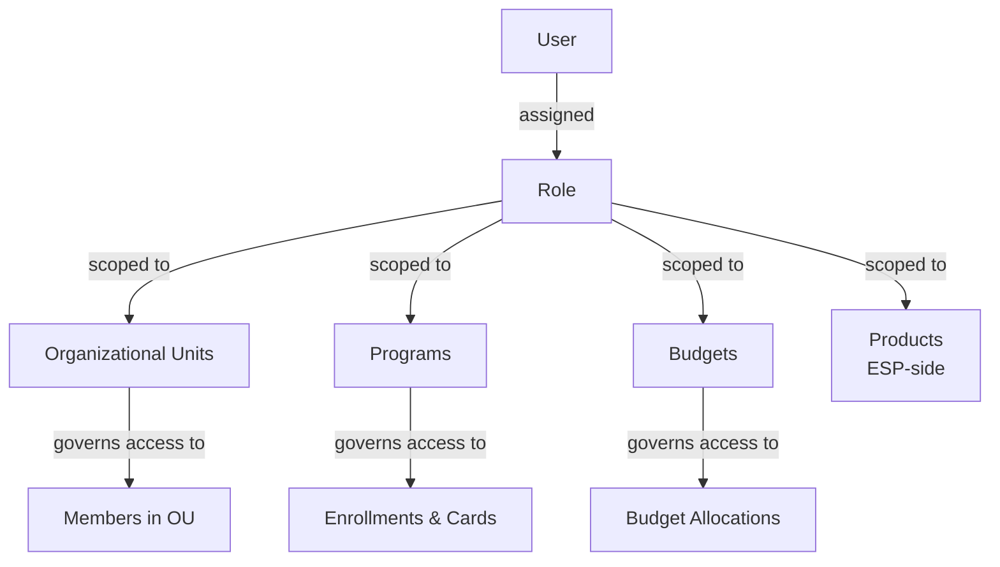

# Chapter 14: Users and Roles

## Definitions

**A User is a corporate employee who operates the payment platform — creating, configuring, and managing Programs, Budgets, OUs, and Members — but is not, by that capacity, a participant in spend.**

**A Role is a named set of permissions that defines which entities (OUs, Programs, Budgets, Products) a User can access and what operations the User can perform on them.**

---

## Users operate the system

Users belong to the administration and operations domain. They are the people who configure Corporate Payment Programs, manage Budgets, define OU hierarchies, set eligibility rules, enroll Members, and review settlement. They are not the people swiping cards or receiving payments.

A User does not need to hold a corporate card. A User does not need to be a Member of any Program. The User entity exists to control who can do what within the corporate's payment operations platform.

Users interact with the system through Electron's corporate portal. Their access is governed by the Roles assigned to them. Without a Role, a User can authenticate but cannot perform any operations.

---

## Users and Members are distinct populations

Users and Members are entities in different domains. This distinction is fundamental.

- **Users** exist in the administration domain. They create Programs, manage Budgets, approve enrollments, configure Booking Profiles, and monitor settlement.
- **Members** exist in the program-participation domain. They are enrolled into Programs, receive cards, and generate spend (see *Members, Eligibility, and Enrollment*).

A person can be both a User and a Member. Meridian's CFO, for instance, manages the corporate's payment operations as a Super Admin (User) and holds a corporate travel card as an enrolled cardholder (Member). These are separate system identities. The User identity governs administrative access. The Member identity governs program participation and card issuance. Neither inherits permissions or attributes from the other.

If the CFO's User account is suspended, the CFO's travel card continues to function — the Member enrollment is unaffected. If the CFO's travel card is cancelled, the CFO's administrative access remains intact.

---

## Roles

Roles define the scope and nature of a User's access. Each Role is scoped to specific entity types — OUs, Programs, Products, and Budgets — and grants permissions within that scope.

### Program Admin

The Program Admin manages a specific Corporate Payment Program's lifecycle and operations.

Permissions include:

- Configure program parameters — Spend Policy, Booking Profile, Settlement Profile, eligibility rules
- Enroll eligible Members into the program (via UI, file upload, or API)
- Approve or reject enrollment requests when the program's approval workflow requires it
- Issue cards to enrolled Members
- Manage card lifecycle — suspend, reactivate, cancel cards within the program
- Review program-level spend reports and transaction data
- Configure the data-capture form for archetypes that require payer-provided information

A Program Admin's scope is limited to the Programs assigned to the Role. A User with Program Admin for "Raw Materials Supplier Payments" cannot access or modify "Engineering SaaS Subscriptions" unless separately granted.

### Finance Admin

The Finance Admin manages the financial infrastructure underlying payment programs.

Permissions include:

- Configure and manage Settlement Accounts and Settlement Profiles
- Define and modify Booking Profile rules — GL mappings, cost center assignments, default allocations
- Review and reconcile billing statements from the ESP
- Monitor Credit Facility utilization and Budget consumption
- Generate and export financial reports for ERP integration

Finance Admin is typically scoped to one or more Programs or across all Programs associated with specific OUs.

### OU Admin

The OU Admin manages the organizational hierarchy and member affiliation.

Permissions include:

- Create, modify, and restructure OU hierarchies
- Assign Members to OUs and manage member attributes
- Associate Budgets with OUs
- Define custom member attributes for member types within the OU

OU Admin scope is limited to specific OU subtrees. A User with OU Admin for the "Engineering" OU can manage Engineering and its child OUs but cannot modify the "Sales" OU or its children.

### Super Admin

The Super Admin holds corporate-wide access across all entities.

Permissions include:

- All permissions of Program Admin, Finance Admin, and OU Admin across all scopes
- Create new Programs and associate them with OUs, Budgets, and Credit Facilities
- Manage User accounts — create Users, assign Roles, modify Role scopes
- Configure corporate-wide settings and defaults
- Access all reporting and audit data across the corporate

Super Admin is not scoped to specific entities. It operates across the entire Corporate.

---

## Role-based access scoping

Roles are not global grants. Each Role assignment is scoped to specific entity instances.

A single User can hold multiple Role assignments. An AP Director might hold Program Admin for all Supplier Payment Programs and Finance Admin for the Procurement OU's Budgets. Each assignment independently defines a scope.

Scope follows the OU hierarchy. A Role scoped to a parent OU implicitly includes all child OUs beneath it, unless explicitly restricted. A Role scoped to the "Americas" OU includes access to "Americas-East" and "Americas-West" sub-OUs.

---

## Meridian Industries — Users and Roles in practice

| Person | User Role(s) | Scope | Member enrollment |
|---|---|---|---|
| CFO | Super Admin | Corporate-wide | Travel program (personal travel card) |
| AP Director | Program Admin | Supplier Payments programs (all) | None |
| AP Director | Finance Admin | Procurement OU Budgets | None |
| Travel Desk Manager | Program Admin | Travel & Booking programs (all) | None |
| Engineering VP | Program Admin | Engineering SaaS Subscriptions program | Employee Spend program (department purchasing card) |
| Regional Finance Controller (UK) | Finance Admin | All programs under Meridian UK Ltd Legal Entity | None |

The CFO operates as Super Admin, with visibility and control across Meridian's entire payment operations. The CFO also holds a corporate travel card — a Member enrollment in the Travel program, entirely separate from the Super Admin User identity.

The AP Director holds two Role assignments: Program Admin for all supplier programs (managing enrollment, card issuance, and eligibility) and Finance Admin for Procurement's Budgets (managing GL mappings and reconciliation). The AP Director does not carry a corporate card and is not enrolled as a Member in any program.

The Travel Desk Manager is a Program Admin for travel programs. The Travel Desk Manager enrolls travelers, configures agency-specific card parameters, and manages the approval workflow for travel card requests. The Travel Desk Manager does not personally travel on corporate cards.

The Engineering VP holds Program Admin for the SaaS subscriptions program and is also enrolled as a Member in the Employee Spend program — managing one program while participating as a cardholder in another.

---

## Relationship to other entities

- **Corporate** — Users exist within a Corporate. A User cannot span multiple Corporates.
- **Programs** — Users operate Programs through their Roles. The Program is owned by an OU, and the User's Role must be scoped to include that OU or that Program to operate it.
- **Members** — Users manage Members through enrollment operations. A User who is also a Member holds two separate entity instances. Administrative actions on Members (enrollment, card issuance) require the appropriate Role. Being a Member does not grant any administrative capability.
- **Budgets** — Budget management (allocation, monitoring, reallocation) is a Finance Admin or Super Admin function. Budget visibility during Program setup is determined by the OU that owns the Program (see *Credit Facility, Budget, and Account*).
