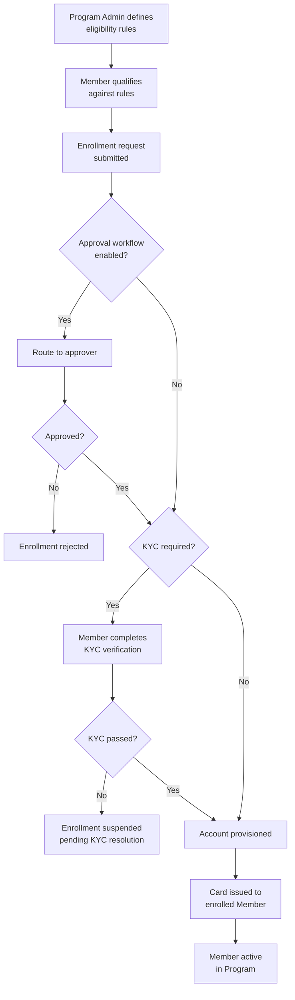

# Chapter 15: Members, Eligibility, and Enrollment

## Definitions

**A Member is a first-class entity of a Corporate, affiliated to zero or more OUs, representing any individual or organization that participates in the corporate's payment operations — as a cardholder, a payee, or both.**

**Eligibility is the set of rules, defined per Program by the Program Admin, that determine which Members qualify to participate in a given Corporate Payment Program.**

**Enrollment is the explicit act of associating an eligible Member with a Program and provisioning the payment instruments — cards, accounts, or both — that enable the Member to transact.**

---

## Members

Members are the participants. They are the people and organizations that hold cards, receive payments, and generate the transactions that flow through Programs.

A Member is distinct from a User. Users operate the system (see *Users and Roles*). Members participate in Programs. The two populations occupy different domains. A person may hold both identities simultaneously — an Engineering VP who manages a SaaS subscription program as a User and carries a department purchasing card as a Member — but these are separate system entities with separate lifecycle, attributes, and permissions.

### Member types

The system defines four default Member types:

| Member type | Description |
|---|---|
| **Employee** | An individual employed by the Corporate. Participates as a payer — holding cards for department spend, travel, or project-based purchasing. |
| **Supplier** | An external organization that receives payments from the Corporate. Participates as a payee — receiving single-use or multi-use virtual cards for invoice settlement. |
| **Contractor** | An external individual or firm engaged by the Corporate. Participates as either payer or payee depending on the program archetype. |
| **Client** | A customer of the Corporate. Participates as a payee in specific program configurations where the Corporate issues payments to its own customers (rebates, refunds, incentive payments). |

A Corporate can define custom attributes for every Member type as needed for mapping Members to its enterprise systems — employee ID, supplier code, contractor classification, client tier, or any business-specific dimension.

### Member affiliation to OUs

A Member is affiliated to zero or more OUs. An employee in Meridian's Platform Engineering team may be affiliated to:

- "Engineering" (functional OU)
- "Americas" (geographic OU)
- "Meridian Industries Inc." (Legal Entity OU)

These affiliations determine the Member's visibility to Programs and eligibility rules. A Program whose eligibility rules reference the Engineering OU will see this employee as a potential participant.

A Member with zero OU affiliations exists in the Corporate but is not visible to any OU-scoped eligibility rule. Such a Member can only be enrolled through manual list-based eligibility.

---

## Eligibility

Eligibility is not enrollment. Eligibility defines who may be enrolled. Enrollment is the act of associating an eligible Member with a Program. A Member can be eligible for a Program without being enrolled — eligibility is necessary but not sufficient.

### Eligibility rules

The Program Admin defines eligibility rules at program setup. Rules determine which Members from the Corporate's member population qualify for the Program. Rules can use one or more of the following criteria:

- **OU-based** — all Members affiliated to a specific OU or OU subtree qualify. "All Members of the Engineering OU" makes every engineer, regardless of geography or Legal Entity, eligible for the Engineering SaaS Subscriptions program.
- **Member-type-based** — all Members of a specific type qualify. "All Suppliers" makes every supplier in the Corporate eligible for a supplier payments program.
- **Attribute-based** — Members matching specific custom attribute values qualify. "All Employees with title 'Director' or above" or "All Suppliers with category 'Logistics'."
- **Manual list** — the Program Admin explicitly designates individual Members as eligible, bypassing rule-based criteria.
- **Combination** — multiple criteria combined. "All Employees in the Engineering OU with title 'Senior Engineer' or above" narrows eligibility to a specific intersection.

### Payer vs. payee eligibility by archetype

The meaning of eligibility depends on the Spend Archetype the Program serves:

| Spend Archetype | Eligibility defined by | Meaning |
|---|---|---|
| Supplier Payments | Payee (Supplier) | Which suppliers are eligible to receive card-based payments |
| Employee & Department Spend | Payer (Employee) | Which employees are eligible to carry spending cards |
| Travel & Booking Payments | Payer or Payee | Per-booking: which travelers are eligible. Lodge-style: which agencies are enrolled |
| Central Recurring Merchant Payments | Payee (Merchant/Supplier) | Which merchants are approved for recurring charges |

This distinction is important. In the Supplier Payments archetype, the corporate does not enroll employees as cardholders — it enrolls suppliers as payees. The Program Admin is typically the cardholder. The card carries supplier identity in its tags, and the supplier receives payment through the card without necessarily holding or knowing the card number.

---

## Enrollment

Enrollment is always explicit. No Member is automatically enrolled into a Program by virtue of being eligible. The Program Admin initiates enrollment — individually, in bulk via file upload, or programmatically via API.

### Enrollment process

The enrollment process follows a defined sequence. The specifics vary by archetype and program configuration, but the structural flow is consistent:

1. **Eligibility verification** — the system confirms the Member satisfies the Program's eligibility rules
2. **Enrollment request** — the Program Admin (or an automated system via API) submits an enrollment request for the eligible Member
3. **Approval workflow** — if the Program's approval workflow is enabled, the request is routed to the designated approver(s) for review
4. **KYC verification** — if required by the Program's KYC configuration, the enrolling Member completes identity verification steps
5. **Account provisioning** — an Account is created (or an existing Account is associated) for the enrolled Member, depending on the archetype's account model
6. **Card issuance** — a virtual card is generated and associated with the Account, carrying the Card Profile configured for the Program

### Approval workflow

At program setup, the Program Admin configures the approval workflow:

- **Approving authority per member** — a specific User designated as the approver for each enrolling Member (e.g., the employee's direct manager for an Employee Spend program)
- **Nominated approval groups** — a group of Users, any one of whom can approve enrollment requests for the Program

The approval workflow is optional. Programs with low-risk enrollment — such as supplier onboarding where the AP team has already verified the supplier through procurement processes — may skip approval entirely. Programs with higher governance requirements — such as employee spend cards with material limits — typically require managerial approval.

The approval engine handles routing, notification, escalation, and outcome recording. The corporate can also integrate its own approval systems via API if it prefers existing infrastructure.

### KYC during enrollment

Enrollment may require the Member to complete Know Your Customer (KYC) steps before card issuance. The level of KYC is configurable per Program and varies by archetype:

- **Supplier Payments** — minimal KYC. The corporate has already verified the supplier through its procurement and vendor-management processes. The supplier's identity is established outside the payment platform. KYC in this context may be limited to verifying the supplier's banking details or contact information.
- **Employee & Department Spend** — standard KYC. The employee's identity is verified through HR records and corporate directory integration. The employee may need to confirm personal details, address, and contact information for the Card Profile.
- **Travel & Booking Payments** — standard to enhanced KYC, depending on the program model. Lodge-style agency cards require verification of the agency's authorization. Per-traveler cards require individual traveler verification.

KYC is conditional. The Program Admin defines at setup whether KYC is required and which steps apply. For programs where Members have already been verified through other corporate processes, KYC can be skipped entirely.

### Multiple enrollments per Member per Program

A single Member can be enrolled into the same Program multiple times. Each enrollment represents a new card issuance.

This supports several operational patterns:

- **Single-use cards** — a supplier enrolled once per invoice, each enrollment generating a single-use virtual card locked to that invoice's amount and merchant
- **Ad-hoc cards** — an employee enrolled for a specific project or trip, receiving a purpose-specific card with a limited validity period
- **Card replacement** — a new enrollment generates a replacement card when the original is compromised or expired

Each enrollment is independent. Cancelling one enrollment (and its associated card) does not affect other active enrollments for the same Member in the same Program.

---

## Card issuance as the culmination of enrollment

Enrollment culminates in card issuance. Each enrollment results in a virtual card associated with an Account in the Program.

The card inherits the Program's Card Profile configuration:

- **Cardholder Profile** — name, address, contact details for notification and authentication
- **Spend Policy / Payment Usage Policy** — velocity limits, MCC restrictions, amount caps (subject to the cascading restriction model from Product → Program → Card)
- **Tags** — structured metadata embedding corporate context: supplier identity, PO number, project code, program reference, reconciliation tracking information
- **Fee overrides** — card-specific fee adjustments, if any

### Physical and virtual form factors

A "virtual card" in this system does not refer exclusively to a digital-only card. The term "virtual" indicates that the card does not carry a financial obligation itself — the obligation resides with the Account. A virtual card can be:

- **Digital** — exists only as a card number, expiry, and CVV, used for online or API-initiated payments
- **Physical** — a plastic card with the same card number, produced through an embossing process and mailed to the cardholder

A card initiated as digital can be converted to physical if the Program and Card Product support it. The form factor is an issuance decision, not a structural one. The card's relationship to its Account, Program, and Booking/Settlement Profiles is identical regardless of form factor.

In practice, supplier payments use digital cards almost exclusively (single-use, API-issued). Employee spend programs may use either or both. Travel programs vary: per-booking cards are digital; persistent agency cards may be physical.

---

## Meridian Industries — Eligibility and enrollment in practice

### Supplier enrollment: Raw Materials program

The AP Director (Program Admin) manages enrollment for the Raw Materials Supplier Payments Program.

**Eligibility:** All Members of type "Supplier" affiliated to the AMC-Logistics OU and the AMC-RawMaterials custom supplier category.

**Enrollment process:**

1. The AP team identifies a supplier invoice for payment (e.g., PO-2847 from LogiCorp International)
2. The AP Director enrolls LogiCorp International into the program via the Electron portal — one enrollment per invoice
3. No approval workflow — the AP Director has full authority for supplier enrollments in this program
4. Minimal KYC — LogiCorp is already an approved vendor in Meridian's procurement system. Contact verification only.
5. A single-use virtual card is issued, tagged with:
   - Supplier: LogiCorp International
   - PO: PO-2847
   - Invoice: INV-9921
   - Amount: locked to invoice total ($47,250)
   - Merchant: locked to LogiCorp's merchant ID
6. The card number is transmitted to LogiCorp via Meridian's AP system (or the ESP's remittance notification)

LogiCorp charges the card. The transaction posts with full L1-L3 data. The Booking Profile matches the PO tag and routes the charge to the appropriate GL code. The card expires after use.

### Employee enrollment: Engineering Tools program

The Engineering VP (Program Admin) manages enrollment for the Engineering SaaS Subscriptions Program.

**Eligibility:** All Members of type "Employee" affiliated to the Engineering OU, with title "Senior Engineer" or above.

**Enrollment process:**

1. A new Senior Engineer joins the Platform Engineering team and is added to the Engineering OU by the OU Admin
2. The employee becomes eligible automatically (OU-based + attribute-based rule match)
3. The Engineering VP submits an enrollment request through the Electron portal
4. Approval workflow routes the request to the Engineering VP's manager (the CTO) for review — required because the program carries a $5,000 monthly per-card limit
5. CTO approves
6. Standard KYC — employee confirms personal details sourced from HR records
7. A multi-use virtual card is issued with:
   - Cardholder: employee name
   - MCC restrictions: software, cloud services, electronics (allowlist)
   - Monthly velocity limit: $5,000
   - Tags: Employee ID, Engineering OU, cost center CC-2000

The employee uses the card for software subscriptions and hardware purchases. After each transaction, the employee submits an expense code through the data-capture form. The Booking Profile evaluates the code and routes the charge to the appropriate project GL.

---

## Key relationships

- **Corporate** — Members exist within a Corporate. Eligibility and enrollment are corporate-scoped operations.
- **OUs** — Member affiliation to OUs drives OU-based eligibility rules. OU structure determines which Members a Program can see.
- **Programs** — Enrollment connects a Member to a Program. Each enrollment produces a card. The Program's configuration (Card Profile, Spend Policy, Booking Profile) flows through to the issued card.
- **Accounts** — Enrollment provisions an Account (or associates an existing one) depending on the archetype. Employee Spend creates one Account per employee. Supplier Payments typically uses one Account per Program.
- **Users** — Program Admins (Users) manage enrollment. Users and Members are separate entities. A User enrolls Members; a User does not become a Member by enrolling others.
- **Cards** — Card issuance is the operational output of enrollment. The card is the instrument through which the enrolled Member transacts within the Program.
