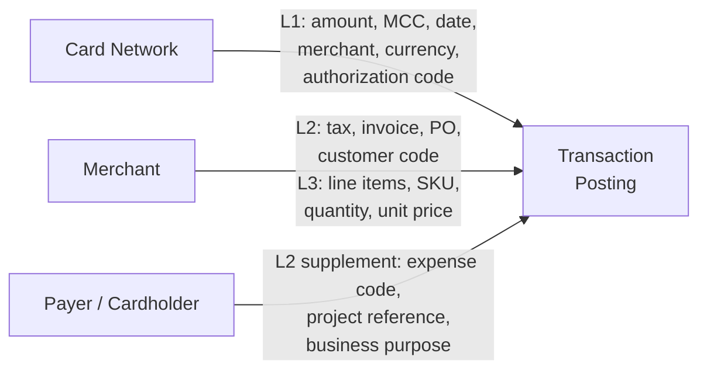

# Chapter 16: Transaction Posting and Data

## Definitions

**Transaction Posting is the process by which a completed card transaction is recorded against an Account — capturing the transaction amount, merchant information, and associated data at up to three levels of detail.**

**L1, L2, and L3 data are the three tiers of transaction information captured at posting: L1 provides core transaction facts from the network, L2 adds tax and reference data from the merchant or payer, and L3 adds line-item detail from the merchant.**

---

## Transaction posting

Every card transaction that clears the network is posted to the Account associated with the card. Because every Account is specific to a Corporate Payment Program, the posting inherits the Program's full context — Booking Profile, Settlement Profile, Spend Policy, and all card-level attributes.

Posting is the moment where transaction data enters the corporate's financial visibility. Before posting, the transaction exists only as an authorization (a hold on credit capacity). After posting, it becomes a recorded financial event with accounting, attribution, and reconciliation implications.

All posting data is made available as transactions clear — near real-time. The corporate does not wait for end-of-cycle statements to see transaction activity. Real-time event streams and API access provide immediate visibility. Statements consolidate the same data into periodic billing documents.

---

## The three data tiers

Transaction data is structured in three progressive tiers. Each tier adds detail. Not every transaction carries all three tiers — data availability depends on the merchant, the card network, and the Spend Archetype.

### L1 — Core transaction data

L1 data is present on every transaction. It is the baseline information transmitted through the card network at authorization and clearing.

| Field | Source | Description |
|---|---|---|
| Transaction amount | Network | The charged amount in the transaction currency |
| Merchant Category Code (MCC) | Network | Four-digit code classifying the merchant's business type |
| Transaction date/time | Network | When the transaction was initiated |
| Merchant name | Network | The merchant's registered name as it appears on the network |
| Merchant identifier | Network | The merchant ID (MID) assigned by the acquirer |
| Currency | Network | The currency in which the transaction was initiated |
| Authorization code | Network | The approval code returned at authorization |

L1 data is authoritative. It comes directly from the card network's authorization and clearing messages. The corporate does not provide or modify L1 data.

### L2 — Tax and reference data

L2 data adds structured reference information beyond the core transaction. It can come from two sources: the merchant and the payer.

| Field | Source | Description |
|---|---|---|
| Tax amount | Merchant | Total tax charged on the transaction |
| Tax indicator / tax rate | Merchant | Tax classification or rate applied |
| PO number | Merchant or Payer | Purchase order reference linking the transaction to a procurement record |
| Invoice number | Merchant | The merchant's invoice identifier for the transaction |
| Customer code / corporate reference | Merchant or Payer | A reference code identifying the corporate or the corporate's account with the merchant |
| Order / reference IDs | Merchant | Additional identifiers passed by the merchant or payment gateway |

L2 data is not universally available. It depends on the merchant's payment infrastructure, the acquirer's data-passing capabilities, and whether the card network supports enhanced data for the merchant's MCC. Large merchants and B2B payment processors typically provide L2 data. Small retail merchants often do not.

The payer can also contribute L2 data. In the Employee and Department Spend archetype, the cardholder submits PO numbers, project codes, or expense references after the transaction. These payer-provided fields are attached to the posting as L2-equivalent data, supplementing or overriding merchant-provided references.

### L3 — Line-item detail

L3 data provides the most granular view of a transaction: individual line items with quantities, unit prices, descriptions, and commodity codes.

| Field | Source | Description |
|---|---|---|
| Line-item description | Merchant | Description of each purchased item or service |
| Quantity | Merchant | Number of units per line item |
| Unit price | Merchant | Price per unit |
| Item-level tax | Merchant | Tax amount applicable to each line item |
| Item-level discount | Merchant | Discount applied to each line item |
| Product / commodity code | Merchant | Standard classification code (UNSPSC, commodity code) for each item |

L3 data comes exclusively from the merchant. The corporate cannot provide or generate L3 data — it reflects the merchant's itemized record of what was sold.

L3 data availability is concentrated in the Supplier Payments archetype. Large suppliers with sophisticated invoicing and payment infrastructure can transmit L3 data through acquirer-supported enhanced data programs. L3 data enables line-item-level reconciliation against purchase orders and is relevant for tax compliance in jurisdictions that require itemized transaction records.

If provided by the merchant, L3 data is made available to the corporate through data extracts. It is not universally present and should not be assumed.

---

## The three-source model

Transaction data does not come from a single source. Every posting draws from up to three contributors:

**Source 1: Card Network** — provides L1 data on every transaction. This is the authoritative record of what happened: how much, where, when, and from whom.

**Source 2: Merchant** — provides L2 and L3 data where the merchant's infrastructure supports it. This is the merchant's record of what was sold and under what commercial terms.

**Source 3: Payer / Cardholder** — provides supplemental L2 data through data-capture mechanisms configured at the Program level. This is the corporate's record of why the purchase was made and how it should be attributed internally.

In addition to these three sources, the **card itself** carries corporate-set attributes: tags encoding supplier identity, PO reference, program metadata, and reconciliation tracking information (see *Members, Eligibility, and Enrollment*). These card-level tags are attached to the posting alongside the L1-L3 data, providing the corporate's own context for the transaction.

---

## Data richness by Spend Archetype

The completeness of transaction data varies systematically across the four Spend Archetypes. This variation is not random — it reflects the nature of each archetype's transaction workflow and merchant ecosystem.

### Supplier Payments — richest data

Supplier Payments transactions carry the most complete data profile. The supplier is a known counterparty, the transaction is invoice-linked, and the corporate has tagged the card with PO and supplier references at issuance.

Typical data availability:
- **L1**: always present
- **L2**: PO number, invoice number, tax amount — provided by the supplier or embedded in card tags
- **L3**: line-item detail — available from suppliers with enhanced data capabilities, enabling reconciliation at the SKU level
- **Card tags**: supplier identity, PO number, invoice reference, program metadata

Reconciliation path: card tags (supplier, PO) + L1 (amount, merchant) + L2 (invoice number) + L3 (line items) matched against AP invoice and purchase order in the corporate's ERP.

### Employee and Department Spend — moderate data

Employee Spend transactions carry L1 universally and L2 where the merchant provides it. L3 is rare — most employee purchases are at retail or SaaS merchants that do not transmit line-item data.

Typical data availability:
- **L1**: always present
- **L2**: varies by merchant; payer-provided data (expense code, project reference) supplements merchant data
- **L3**: uncommon
- **Card tags**: employee ID, cost center, program reference

Reconciliation path: card tags (employee, cost center) + L1 (amount, merchant, MCC) + payer-provided expense code matched against budget and cost center in the Booking Profile. If the program is dedicated to a single cost head, no per-transaction input is needed — the program-level attribution is sufficient.

### Travel and Booking Payments — specialized data

Travel transactions carry standard L1 data plus travel-specific L2 information provided by agencies and booking platforms.

Typical data availability:
- **L1**: always present
- **L2**: booking reference, itinerary identifiers, traveler name — provided by the travel agency or booking platform
- **L3**: uncommon in travel transactions
- **Card tags**: traveler identity, trip reference, agency identifier

Reconciliation path: card tags (traveler, agency) + L2 (booking reference, itinerary) matched against travel management system records.

### Central Recurring Merchant Payments — predictable data

Recurring payments carry consistent L1 data against known merchants. L2 may include subscription or contract identifiers.

Typical data availability:
- **L1**: always present
- **L2**: subscription ID, contract reference — where the merchant provides it
- **L3**: uncommon
- **Card tags**: project or cost head, merchant/vendor identifier

Reconciliation path: card tags (project, vendor) + L1 (amount, merchant) + L2 (subscription ID) matched against subscription or contract records.

---

## Card-level corporate attributes

Beyond L1-L3 data, every posting includes the attributes set on the card by the corporate at issuance. These are structured as **tags** — key-value pairs serialized in a defined format.

Common tag types:

- **Corporate Program Information** — Corporate ID, Program ID, Member ID, Membership ID
- **Intended Supplier Information** — supplier name, supplier code, supplier category
- **Reconciliation Tracking Information** — PO number, invoice reference, project code, cost center override

Tag data is available in real-time transaction events, in statement data, and in CSV data extracts. Tags are referenced by the Booking Profile's dynamic rules for attribution decisions (see *Booking Profile and Settlement Profile*). Tags can also be referenced in Spend Policy / Payment Usage Policy rules for authorization-time controls (see *Spend Policy and Controls Cascade*).

---

## Statements

### Account-level statements

The issuer generates a statement per Account per billing cycle. The statement consolidates all postings to the Account during the cycle — charges, credits, fees, and adjustments.

Each posting in a statement carries all associated data:
- Account-level attributes
- Card-level attributes (including tags)
- Posting-level attributes (L1, L2, L3 where available)
- All fees attributed to the transaction

### Master statements

Programs with multiple Accounts — such as Employee Spend programs with one Account per employee — generate many individual Account-level statements. For these programs, Electron compiles a **master statement**: a program-level consolidation of all Account-level statements received from the bank.

The master statement provides the corporate with a single view of all program activity across all Accounts. It aggregates totals, preserves posting-level detail, and serves as the billing basis for the Program's settlement.

The master statement is an Electron artifact, not a bank artifact. The bank generates Account-level statements. Electron compiles and delivers the master statement to the corporate.

### Data extracts

All posting data is available in data-extract format. The most common format is CSV, compatible with ERP import. Extracts include the full data profile of every posting — L1, L2, L3 (where available), card tags, and account attributes.

---

## Meridian Industries — Transaction data in practice

### Supplier transaction: LogiCorp International (full L1-L3)

LogiCorp charges the single-use virtual card issued for PO-2847, invoice INV-9921.

**L1 data (from network):**

| Field | Value |
|---|---|
| Amount | $47,250.00 |
| MCC | 5085 — Industrial Supplies |
| Date | 2026-03-15 |
| Merchant name | LOGICORP INTL |
| Currency | USD |
| Authorization code | A7829X |

**L2 data (from LogiCorp):**

| Field | Value |
|---|---|
| Tax amount | $3,780.00 |
| PO number | PO-2847 |
| Invoice number | INV-9921 |
| Customer code | MERIDIAN-001 |

**L3 data (from LogiCorp — 3 line items):**

| Line | Description | Qty | Unit price | Tax | Commodity code |
|---|---|---|---|---|---|
| 1 | Steel alloy sheets, Grade 304 | 500 | $62.00 | $2,480.00 | 11101700 |
| 2 | Fastener assembly kit, M10 | 200 | $34.25 | $548.00 | 31161500 |
| 3 | Shipping — freight, overland | 1 | $5,400.00 | $752.00 | 78101800 |

**Card tags:**

| Tag | Value |
|---|---|
| Supplier | LogiCorp International |
| PO | PO-2847 |
| Invoice | INV-9921 |
| Program | Raw Materials Supplier Payments |

The Booking Profile matches the PO tag, finds the "MFG-" prefix absent, and applies the default GL code: AP-RawMaterials (GL 5100), cost center Procurement Central (CC-3000). The full L1-L3 data flows to Meridian's ERP via CSV extract, enabling three-way matching: PO → invoice → payment.

### Employee transaction: SaaS subscription renewal (L1 + L2 only)

A Senior Engineer in Platform Engineering renews an annual cloud monitoring subscription.

**L1 data (from network):**

| Field | Value |
|---|---|
| Amount | $2,400.00 |
| MCC | 5734 — Computer Software Stores |
| Date | 2026-03-18 |
| Merchant name | DATADOG INC |
| Currency | USD |
| Authorization code | B4412K |

**L2 data (from merchant):**

| Field | Value |
|---|---|
| Tax amount | $0.00 (exempt) |
| Invoice number | DD-887741 |
| Customer code | MERID-ENG-042 |

**L3 data:** Not provided. SaaS merchants typically do not transmit line-item detail.

**Card tags:**

| Tag | Value |
|---|---|
| Employee ID | EMP-4488 |
| Cost center | CC-2000 (Engineering General) |
| Program | Engineering SaaS Subscriptions |

**Payer-provided data (submitted via data-capture form):**

| Field | Value |
|---|---|
| Project code | PLAT-OBSERVABILITY |
| Business purpose | Annual renewal, Datadog Pro plan |

The Booking Profile evaluates the payer-provided project code. The rule "if project code starts with PLAT-, route to Platform Engineering GL" matches. The transaction is booked to GL 6310 (Platform Engineering OpEx), cost center CC-2010 (Platform Engineering), project PLAT-OBSERVABILITY. Without the payer-provided project code, the default Engineering-OpEx GL (6300) and Engineering General cost center (CC-2000) would have applied.

---

## Key relationships

- **Account** — postings are recorded against Accounts. Every posting inherits the Account's Program context — Booking Profile, Settlement Profile, Budget.
- **Card** — the card identifies which Account receives the posting. Card-level tags provide corporate context for each transaction.
- **Booking Profile** — the Booking Profile reads posting data (L1, L2, payer-provided, card tags) to determine internal attribution. Richer data enables more precise attribution. See *Booking Profile and Settlement Profile*.
- **Reconciliation** — transaction data is the raw material for reconciliation. Each Spend Archetype has a different reconciliation profile based on the data sources typically available. See the per-archetype treatment above.
- **Statements** — statements consolidate posting data into billing documents. Master statements aggregate across multiple Accounts within a Program.
- **Budget** — Budget utilization is updated at authorization (credit hold) and adjusted at clearing (final posted amount). Posting data confirms the financial impact on the Budget.
