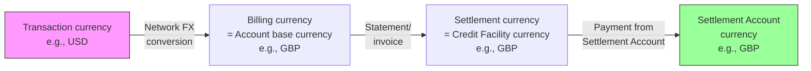

# Chapter 17: Multi-Currency, Residency, and Cross-Border

## Definitions

**Multi-currency operation is the ability of a corporate to maintain Credit Facilities, Accounts, and Programs across multiple currencies — each denominated in the local currency of the Legal Entity to which the Credit Facility is extended.**

**Residency is the jurisdictional anchor of a Corporate Payment Program, determined by the Legal Entity and Credit Facility backing the Program — governing regulatory requirements, card scheme availability, and settlement mechanics.**

---

## Currency architecture

Currency in the corporate payments system is not a free-floating attribute. It is structurally determined by the Credit Facility, and that determination cascades through every entity beneath it.

### Credit Facility currency

A Credit Facility is extended by the bank to a Legal Entity. The Credit Facility is denominated in the local currency of that Legal Entity's jurisdiction. A USD Credit Facility for a US Legal Entity. A GBP Credit Facility for a UK Legal Entity. An INR Credit Facility for an Indian Legal Entity.

This is not a configurational choice. It is a structural reality of how banks extend credit: against a legal entity, in that entity's functional currency, governed by that jurisdiction's regulatory framework.

A corporate that operates across multiple currencies requires multiple Credit Facilities — one per Legal Entity, each in the respective local currency. There is no single "multi-currency Credit Facility" that spans jurisdictions. Multi-currency capability is achieved through the composition of multiple single-currency Credit Facilities.

### Account Product currency

An Account Product (defined by the bank on Tachyon) specifies a currency. The Account Product currency must match the Credit Facility currency of any Account created under that Product. This is a structural constraint: when an Account is created for a Program, the Credit Facility associated with the Account determines the currency, and the Account Product must support that currency.

The Account Product does not directly reference a Credit Facility — the Credit Facility is associated per Account at creation time. But the currency alignment is enforced: an Account cannot be created under a USD Account Product against a GBP Credit Facility.

### Account base currency

Every Account has a base currency, inherited from its Credit Facility. All transactions are posted to the Account in this base currency. If a transaction occurs in a foreign currency, the network converts it to the Account's base currency before posting (see *Cross-border payments* below).

---

## Three currencies in a transaction

A cross-border transaction involves up to three distinct currencies.

### Transaction currency

The currency in which the cardholder transacts at the point of sale. If a Meridian UK employee purchases software from a US vendor, the transaction currency is USD — the price is quoted and charged in dollars.

### Billing currency

The currency in which the transaction is posted to the Account and appears on the statement. The billing currency equals the Account's base currency, which equals the Credit Facility's currency. For the Meridian UK employee, the billing currency is GBP — the USD transaction is converted to GBP and posted to the employee's GBP Account.

### Settlement currency

The currency in which the corporate pays the ESP's invoice. Settlement is performed in the Credit Facility's currency — the same as the billing currency. The Settlement Account configured in the Settlement Profile (see *Booking Profile and Settlement Profile*) may be denominated in a different currency, but the invoice itself is in the Credit Facility's currency. If currencies differ between the Settlement Account and the invoice, the corporate bears the FX risk on that leg.

In the simplest case — a domestic transaction — all three currencies are the same. A UK employee purchasing from a UK vendor in GBP: transaction currency GBP, billing currency GBP, settlement currency GBP. No conversion occurs.

---

## FX mechanics

### Where conversion happens

Foreign exchange conversion for card transactions happens at the card network level. When a cardholder transacts in a currency different from the Account's base currency, the card network (Visa, Mastercard, or private-label network) performs the conversion at its prevailing exchange rate at the time of clearing.

The bank does not perform the conversion. The ESP does not perform the conversion. The corporate does not choose the conversion rate. The network applies its rate, which includes the network's own margin.

### Who bears the FX risk

The corporate bears the FX risk. The network's conversion rate is applied at clearing time, which may differ from the rate at authorization time. The spread between the rate at authorization and the rate at clearing represents an FX exposure.

Additionally, the network's conversion rate includes a markup (spread) over the wholesale interbank rate. This markup is defined at the network level and may be passed through in the commercial terms of the Corporate Payment Product (see *Corporate Payment Product and Corporate Payment Program*). Some programs negotiate a reduced FX markup as part of the ESP's commercial terms.

### FX and the Credit Facility

The converted amount — in the Credit Facility's currency — is posted to the Account and utilizes the Credit Facility. A GBP Credit Facility with a £5M limit is utilized in GBP, regardless of the original transaction currency. A $10,000 USD transaction by a UK cardholder utilizes approximately £7,900 of the GBP facility (at a hypothetical rate), not $10,000 of any USD allocation.

There is no separate FX reserve or currency-specific sub-limit within a Credit Facility. The facility operates in its denominated currency. All utilization is in that currency.

---

## Residency

### Program residency

A Corporate Payment Program's residency is determined by the Credit Facility associated with the Program. The Credit Facility is tied to a Legal Entity. The Legal Entity is registered in a specific jurisdiction. That jurisdiction is the Program's residency.

Residency determines:

- **Regulatory requirements** — KYC/KYB standards, data residency rules, reporting obligations, sanctions screening requirements applicable to the Program
- **Card scheme availability** — which card networks are available for card issuance. Some jurisdictions restrict or prefer specific networks. The bank's Card Product determines available schemes.
- **Settlement mechanics** — billing cycles, payment methods, auto-debit capabilities, and settlement timing governed by local banking practices and regulatory constraints

### Members can span residencies

Program residency does not restrict member geography. The members of a program — whether payers or payees — can be from any Legal Entity, any OU, any location within the corporate, as long as the bank's jurisdiction and product terms are not violated.

A Supplier Payments program with residency in the US (pinned by a USD Credit Facility under Meridian Industries Inc.) can enroll suppliers located in the UK, India, or any other jurisdiction. The program's financial operations — billing, settlement, Credit Facility utilization — run through the US Legal Entity. The supplier's location is a member attribute, not a program constraint.

Similarly, an Employee Spend program under the UK Legal Entity (GBP Credit Facility, UK residency) can issue cards to Meridian employees traveling globally. The employees transact in local currencies wherever they travel. The network converts those transactions to GBP. The GBP Account absorbs the posting. The UK program's residency governs the regulatory and settlement context.

### Residency and multiple programs

A corporate with operations across jurisdictions typically operates separate Programs per Legal Entity — not because of member geography, but because of Credit Facility currency and regulatory requirements.

Meridian operates:

| Legal Entity | Credit Facility | Currency | Residency | Programs |
|---|---|---|---|---|
| Meridian Industries Inc. | US CF — $50M | USD | US — Delaware | Supplier Payments (US vendors), Employee Spend (US engineers), Travel (Americas team) |
| Meridian UK Ltd | UK CF — £12M | GBP | United Kingdom | Supplier Payments (UK/EU vendors), Employee Spend (UK engineers), Travel (EMEA team) |
| Meridian India Pvt Ltd | India CF — ₹400M | INR | India | Employee Spend (India engineers), Central Recurring (India SaaS subscriptions) |

Each Program is pinned to one Credit Facility and one Legal Entity. A UK engineer on the EMEA Travel program transacts globally but settles through the GBP Credit Facility. An Indian engineer on the India Employee Spend program transacts at US SaaS vendors in USD, with network conversion to INR for posting and settlement.

---

## Cross-border payments

A cross-border payment occurs when a cardholder transacts in a currency different from the Account's base currency. The mechanics are straightforward but carry financial implications.

### The cross-border flow

1. **Cardholder transacts** in foreign currency (e.g., a Meridian UK employee purchases from a US vendor for $5,000 USD)
2. **Authorization** — the card network converts the USD amount to GBP at the prevailing authorization rate and checks the GBP Credit Facility for available capacity
3. **Clearing** — the network settles the transaction at the clearing rate (which may differ from the authorization rate) and transmits the final GBP amount
4. **Posting** — the GBP amount is posted to the cardholder's GBP Account. The posting carries both the original transaction currency (USD) and the converted billing currency (GBP) along with the applied exchange rate
5. **Settlement** — the GBP charge appears on the program's statement. Settlement occurs from the GBP Settlement Account per the Settlement Profile

### Markup and fees

Cross-border transactions incur:

- **Network FX markup** — the spread applied by the card network over the wholesale rate. For example, 1–3 % depending on the network and the card product configuration.
- **Cross-border transaction fee** — an additional fee charged per cross-border transaction, defined in the Corporate Payment Product's commercial terms. This fee is separate from the FX markup.

Both charges are visible in the posting data as separate fee line items attributed to the transaction.

### Private-label cards

Programs can operate on private-label cards, where the issuer and acquirer may be the same entity. In private-label networks, FX conversion mechanics differ — the issuing bank handles conversion directly rather than relying on a third-party network. The corporate's exposure to FX risk remains, but the conversion pathway is shorter.

Private-label cards are relevant for corporates with concentrated spend at specific merchant networks or for programs where the bank offers proprietary payment rails.

---

## Meridian Industries — Multi-currency in practice

### Scenario: UK employee purchasing from US vendor

**Context:** Sarah, a Project Manager at Meridian UK Ltd, purchases project management software from a US-based vendor.

| Step | Detail |
|---|---|
| Transaction | $1,200 USD charged to Sarah's GBP virtual card |
| Network conversion | Visa converts at 1 USD = 0.7892 GBP (clearing rate) |
| Posting | £946.98 posted to Sarah's GBP Account |
| FX markup | 1.5% network markup included in conversion rate |
| Cross-border fee | £4.73 (0.5% of converted amount, per Apex commercial terms) |
| Credit Facility impact | £951.71 total utilization against Meridian UK Ltd's GBP CF |
| Statement | Appears on Meridian UK Ltd's program statement in GBP |
| Settlement | Settled from Meridian UK Ltd's GBP Settlement Account at Barclays |

The Booking Profile routes this transaction to the UK Engineering cost center, project management tools GL code. The original USD amount, the conversion rate, and the GBP posted amount are all captured in the posting data for reconciliation.

### Scenario: cross-entity visibility without cross-entity settlement

Meridian's CFO (Super Admin) can view transaction activity across all three Legal Entities — US, UK, and India — through Electron's corporate portal. However, each program settles independently through its own Settlement Profile and Settlement Account. There is no cross-entity netting or consolidated settlement.

| Legal Entity | Sees transactions from | Settles through |
|---|---|---|
| Meridian Industries Inc. | US programs only | USD Settlement Account at Wells Fargo |
| Meridian UK Ltd | UK programs only | GBP Settlement Account at Barclays |
| Meridian India Pvt Ltd | India programs only | INR Settlement Account at HDFC Bank |

If Meridian wanted to consolidate settlement across entities, it would need to structure that outside the payment platform — through intercompany treasury operations. The platform settles per Program, per Credit Facility, per Legal Entity.

---

## Key relationships

- **Credit Facility** — the Credit Facility's currency determines the Account base currency, the billing currency, and the settlement currency. Multi-currency operations require multiple Credit Facilities. See *Credit Facility, Budget, and Account*.
- **Legal Entity** — the Legal Entity anchoring the Credit Facility determines the Program's residency and regulatory context. See *Corporate, Legal Entity, Organizational Unit, and Members*.
- **Account Product** — the Account Product's currency must match the Credit Facility's currency. This is enforced at Account creation.
- **Settlement Profile** — the Settlement Account may be in any currency, but the invoice is in the Credit Facility's currency. Currency mismatch between the Settlement Account and the invoice introduces FX risk on the settlement leg. See *Booking Profile and Settlement Profile*.
- **Card Network** — the network performs FX conversion for cross-border transactions. The conversion rate and markup are network-determined. The corporate has no direct control over the rate but may negotiate markup terms through the ESP's commercial terms.
- **Members** — Members can be located in any jurisdiction regardless of the Program's residency. Program residency constrains financial operations (billing, settlement, regulatory compliance), not member geography.
