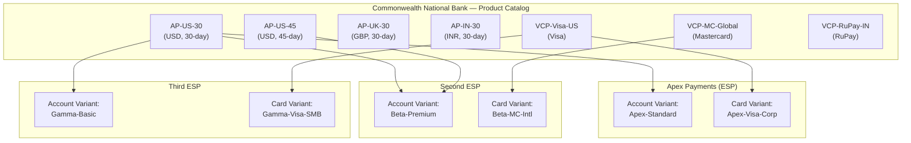
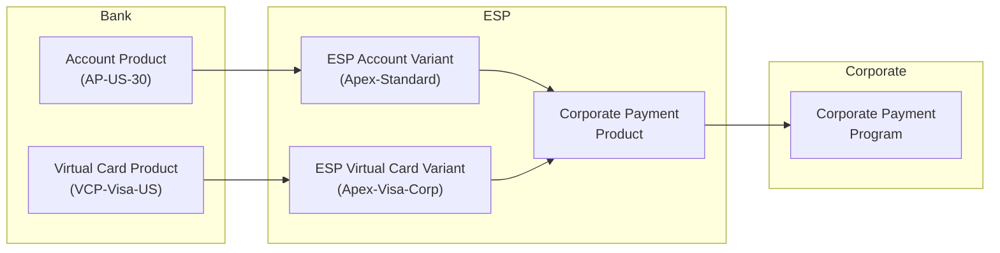

# Chapter 18: Account Products and Virtual Card Products — The Bank's Building Blocks

The bank is the foundational actor in corporate payments. Before any ESP can offer a product, before any corporate can configure a program, the bank must create the building blocks: **Account Products** and **Virtual Card Products**. These are Tachyon entities — bank-domain constructs that define the baseline capabilities, constraints, and controls under which all downstream activity operates.

Entity definitions are in *Account Product and Virtual Card Product*.

---

## Why Banks Create Product Catalogs

A bank does not create an Account Product or Virtual Card Product for each corporate. It creates a finite catalog of products, each representing a standardized combination of parameters. Four forces drive this catalog approach.

**Standardization.** A product catalog establishes uniform behavior across all accounts and cards created under it. Billing cycles, fee calculations, delinquency triggers, and card scheme rules behave identically for every account or card issued under the same product. This uniformity simplifies operations, testing, and audit.

**Regulatory compliance.** Each product configuration carries regulatory implications — disclosure requirements, interest calculation methods, delinquency reporting obligations, consumer protection rules (where applicable). By pre-certifying a finite set of products, the bank ensures every account and card operates within a pre-approved regulatory envelope. A bespoke product per corporate would make compliance verification intractable.

**Risk management.** The bank prices credit risk at the product level. An Account Product with a 30-day billing cycle and aggressive delinquency controls carries a different risk profile than one with a 60-day cycle and lenient grace periods. The catalog allows the bank's risk function to model, monitor, and stress-test exposures at the product level rather than at the individual account level.

**Operational efficiency.** A finite catalog bounds the operational surface area. Settlement processing, statement generation, dispute handling, and network reconciliation all operate against known product configurations. Each new product requires integration testing, operational runbooks, and monitoring dashboards. Catalog discipline prevents uncontrolled growth.

---

## Account Product Design Decisions

An **Account Product** is the bank's account-level construct. It defines the financial behavior of every account created under it.

The bank makes several design decisions when creating an Account Product:

### Billing cycle length

The billing cycle determines the period over which transactions accumulate before a statement is generated and payment becomes due. Common configurations:

| Billing Cycle | Use Case |
|---|---|
| 30-day | Standard commercial card billing; aligns with monthly close |
| 45-day | Extended terms for corporates with longer procurement cycles |
| 60-day | Maximum extension; typically reserved for high-creditworthy corporates with negotiated terms |

The billing cycle is fixed at the Account Product level. All accounts created under a given Account Product share the same cycle length.

### Delinquency controls

The Account Product defines the bank's delinquency management framework:

- **Grace period** — the number of days after the statement date before a payment is considered overdue. Typically 15–25 days for commercial accounts.
- **Penalty APR triggers** — the conditions under which a higher interest rate applies to outstanding balances.
- **Write-off triggers** — the delinquency thresholds (typically measured in days past due) at which the bank initiates write-off procedures.
- **NPA classification rules** — the criteria for classifying an account as a Non-Performing Asset, driven by regulatory requirements in the bank's jurisdiction.

These controls are non-negotiable. The ESP cannot relax delinquency parameters defined by the Account Product.

### Base fee structures

The Account Product defines the bank's base fee schedule — account maintenance fees, overlimit fees, late payment fees, and any other account-level charges. These base fees serve as the floor. The ESP can reduce fees through its Account Variant configuration (see *ESP Variants and Corporate Payment Product*), but cannot introduce charges that exceed the bank's base schedule without a separate arrangement.

### Currency denomination

Each Account Product is denominated in a single currency. The currency of the Account Product must match the currency of the Credit Facility to which accounts are linked. An Account Product denominated in USD can only serve accounts backed by USD-denominated Credit Facilities.

The Account Product itself does not reference a specific Credit Facility. The Credit Facility association happens at the individual account level, at account-creation time.

---

## Virtual Card Product Design Decisions

A **Virtual Card Product** is the bank's card-level construct. It defines the card scheme, network relationships, and processing characteristics for every card issued under it.

### Card scheme and network selection

The bank determines which card schemes (Visa, Mastercard, RuPay, or others) a Virtual Card Product supports. A single Virtual Card Product may support multi-network and multi-clearing-house arrangements — the bank decides which scheme card to issue when a card is requested.

Irrespective of the scheme to which a card belongs, transactions may be presented through multiple payment networks if the bank maintains such relationships. The bank manages these network routing decisions; neither the ESP nor the corporate participates in scheme selection.

### BIN ranges

The bank assigns Bank Identification Number (BIN) ranges to each Virtual Card Product. BIN ranges determine how the card is identified and routed across payment networks. The bank manages BIN allocation in coordination with the card schemes.

### Settlement and disputes

Settlement to payment networks is the bank's obligation. The bank reconciles with each network, manages settlement timing, handles chargebacks, and resolves disputes. These responsibilities are inherent to the Virtual Card Product and cannot be delegated to the ESP or corporate.

---

## The Product Catalog

The bank maintains a browsable catalog of Account Products and Virtual Card Products. ESPs interact with this catalog in two ways:

1. **Browse and select.** The ESP reviews the bank's existing catalog and selects products that match its intended Corporate Payment Product configurations.
2. **Request custom products.** If no existing product meets the ESP's requirements, the ESP can request that the bank create a new Account Product or Virtual Card Product with specific parameters.

Both paths result in the same outcome: a bank-defined, bank-owned product that the ESP can use as a building block.

### Commonwealth's product catalog

Commonwealth National Bank maintains the following catalog for its corporate payments business:

**Account Products:**

| Account Product | Currency | Billing Cycle | Delinquency Grace Period |
|---|---|---|---|
| AP-US-30 | USD | 30-day | 21 days |
| AP-US-45 | USD | 45-day | 25 days |
| AP-UK-30 | GBP | 30-day | 21 days |
| AP-IN-30 | INR | 30-day | 15 days |

**Virtual Card Products:**

| Virtual Card Product | Primary Scheme | Multi-Network | Clearing |
|---|---|---|---|
| VCP-Visa-US | Visa | Yes (Visa + domestic) | VisaNet |
| VCP-MC-Global | Mastercard | Yes (Mastercard + local networks) | Banknet |
| VCP-RuPay-IN | RuPay | No (domestic only) | NPCI |

This is a finite catalog. Commonwealth does not create a new Account Product for each corporate or each ESP. The same AP-US-30 product may underpin accounts for dozens of corporates across multiple ESPs.

---

## Redistributability

Account Products and Virtual Card Products are **redistributable**. A single product can serve multiple ESPs simultaneously.

Commonwealth's AP-US-30 product, for example, can underpin:
- Apex Payments' USD-denominated Corporate Payment Products
- A second ESP's supplier payment offerings
- A third ESP's employee spend products

The bank does not customize Account Products or Virtual Card Products per ESP. The product defines the bank's terms — billing, delinquency, fees, scheme, settlement. If different ESPs need different commercial terms, they achieve that differentiation through ESP Variants (see *ESP Variants and Corporate Payment Product*), not by requesting different base products.

The redistribution model separates two concerns:

| Concern | Owner | Mechanism |
|---|---|---|
| Base financial and operational parameters | Bank | Account Product / Virtual Card Product |
| Commercial customization (fees, rewards, branding) | ESP | ESP Account Variant / ESP Virtual Card Variant |

---

## What the Bank Retains vs. What It Exposes

The boundary between bank-retained and ESP-accessible parameters is a first-order architectural decision.

### Bank-retained (non-accessible to ESP)

These parameters are managed exclusively by the bank. The ESP cannot view, modify, or override them:

- **Credit risk parameters** — underwriting criteria, exposure limits, risk ratings, provisioning rules
- **AML controls** — transaction monitoring rules, suspicious activity thresholds, reporting triggers
- **Sanctions screening** — real-time and batch screening against OFAC, EU, UN, and other sanctions lists
- **Delinquency management** — grace period enforcement, penalty APR application, write-off procedures, NPA classification
- **Regulatory compliance** — jurisdiction-specific disclosures, reporting obligations, consumer protection rules
- **Fraud detection** — bank-defined fraud models, velocity checks, anomaly detection (limited User-Managed-Risk parameters are shared with the ESP)

### ESP-accessible (customizable via Variants)

The ESP can customize these parameters through ESP Account Variants and ESP Virtual Card Variants:

- **Fee schedules** — the ESP can reduce or waive fees within the bank's base schedule
- **Interest programs** — rate structures and calculation methods
- **Statement programs** — statement format, delivery cadence, branding
- **Reward programs** — earn structures, point accrual rules
- **Rebate programs** — spend-based rebates, volume tiers, category-specific incentives
- **Notification programs** — alert thresholds, templates, channels, branding
- **Card personalization** — embossing, design, branding elements
- **Spend programs** — payment usage configurations
- **Authentication and tokenization** — 3DS enrollment, token provisioning

The override model is additive: the bank's base programs serve as the fallback for any parameters the ESP does not explicitly override. The ESP makes commercial choices within the scope of programs accessible to it.

---

## State Models

State models for Account Products and Virtual Card Products (e.g., Active, Deprecated, Retired) are bank-internal operational concerns. They govern how the bank manages product lifecycle — when a product can accept new accounts, when it enters sunset, and when it is fully retired. These state models are not treated further here.

State models for ESP Account Variants and ESP Virtual Card Variants are ESP-domain concerns and are discussed in *ESP Variants and Corporate Payment Product*.

---

## Commonwealth's Catalog in Action

The relationship chain from bank product to corporate program illustrates how these building blocks flow through the system:

Commonwealth creates AP-US-30 and VCP-Visa-US. Apex Payments customizes them into Account Variant "Apex-Standard" (with reduced fees, Apex-branded statements, and a rewards program) and Virtual Card Variant "Apex-Visa-Corp" (with Apex branding on cards and custom transaction alerts). Apex assembles these two variants into a Corporate Payment Product — say, "Apex Supplier Payments Product." Meridian Industries then configures a Corporate Payment Program using that product.

At no point does Commonwealth customize AP-US-30 for Apex specifically. The same AP-US-30 serves any ESP that needs a USD, 30-day billing cycle Account Product. Differentiation happens at the Variant layer, not at the bank product layer.
