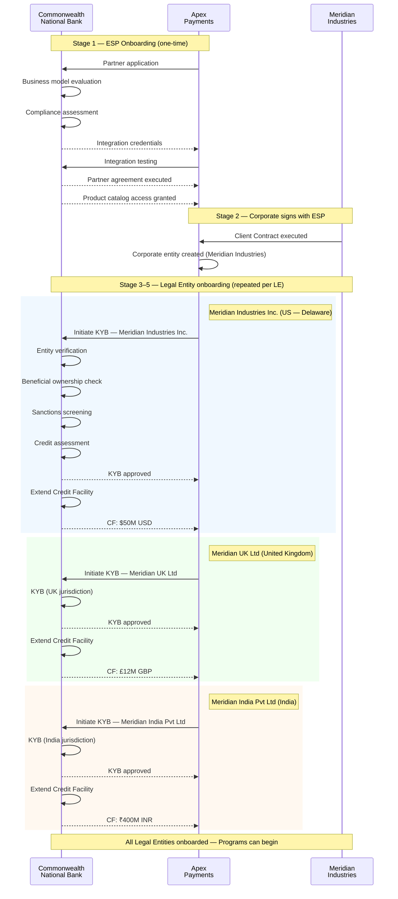

# Chapter 19: Onboarding — ESP and Corporate Legal Entities

Two onboarding journeys establish the bank's relationships in corporate payments. The first brings an ESP into the bank's ecosystem as a distribution partner. The second brings a corporate's Legal Entities under the bank's credit and compliance umbrella. Both must complete before any Corporate Payment Program can operate. The entities involved — Legal Entity, Credit Facility, Client Contract — are defined in *Corporate, Legal Entity, Organizational Units, and Members* and *Credit Facility, Budget, and Account*.

---

## ESP Onboarding

ESP onboarding is a one-time setup that establishes the partnership between the bank and the ESP. The bank evaluates the ESP across four dimensions before granting access.

### Business model evaluation

The bank assesses the ESP's target market, revenue model, projected transaction volumes, and growth trajectory. A corporate payments ESP serving mid-market manufacturers carries a different risk profile than one serving gig-economy platforms. The bank's evaluation determines whether the ESP's business model aligns with the bank's risk appetite and regulatory posture.

### Compliance assessment

The bank verifies the ESP's compliance infrastructure — AML programs, sanctions screening capabilities, data security certifications, and regulatory licenses where applicable. The ESP will initiate KYB on behalf of corporates and handle sensitive payment data. The bank must confirm the ESP operates within acceptable compliance standards.

### Technology integration

The bank and ESP establish the technical integration layer. The ESP connects to the bank's platform (Tachyon) through APIs for account creation, card issuance, authorization participation, and settlement. Integration testing validates that the ESP can correctly interact with Account Products and Virtual Card Products, process authorization callbacks, and handle settlement files.

### Partner agreement execution

The bank and ESP execute a formal partner agreement covering commercial terms (revenue share, fee structures, volume commitments), operational responsibilities (support escalation, incident management, dispute handling), and compliance obligations (regulatory reporting, audit rights, data handling).

### Product catalog access

Upon completion, the bank grants the ESP access to its product catalog. The ESP can browse available Account Products and Virtual Card Products and begin creating ESP Variants (see *Account Products and Virtual Card Products — The Bank's Building Blocks* and *ESP Variants and Corporate Payment Product*).

### Settlement infrastructure

The bank establishes settlement accounts and processes for the ESP. This includes the mechanics by which the bank settles with payment networks and how the ESP's commercial terms (fees, rebates) are computed and disbursed.

---

## Corporate Legal Entity Onboarding (KYB)

When a corporate wants to use an ESP's Corporate Payment Product, the bank must independently verify and onboard each of the corporate's Legal Entities. The ESP initiates this process on behalf of the corporate, but the bank performs the verification.

### KYB process

Know Your Business (KYB) is the bank's due diligence on each Legal Entity. It covers:

- **Entity verification** — confirmation that the Legal Entity is a valid, registered business in its jurisdiction. Registration documents, articles of incorporation, and government registry checks.
- **Beneficial ownership** — identification of individuals who ultimately own or control the Legal Entity, typically using a 25% ownership threshold (jurisdiction-dependent).
- **Sanctions screening** — screening the Legal Entity, its beneficial owners, and its directors against OFAC, EU, UN, and other applicable sanctions lists.
- **Credit assessment** — evaluation of the Legal Entity's financial health, including financial statements, credit bureau data, payment history, and industry risk factors. This assessment determines whether the bank extends credit and at what level.

KYB is performed per Legal Entity, not per Corporate. A Corporate with three Legal Entities requires three independent KYB processes. Each Legal Entity may be in a different jurisdiction with different regulatory requirements.

### ESP-initiated, bank-executed

The ESP initiates KYB by submitting the Legal Entity's information to the bank. The bank performs the verification independently. The ESP does not conduct KYB — it facilitates it. This separation ensures the bank maintains direct accountability for its regulatory obligations.

---

## Credit Facility Extension

Credit Facility extension follows successful KYB. The bank determines the credit terms based on the Legal Entity's financial profile.

### Credit Facility terms

Each Credit Facility specifies:

- **Currency** — the denomination of the facility. One Credit Facility operates in a single currency.
- **Limit** — the maximum credit exposure the bank extends to the Legal Entity under this facility.
- **Review period** — the cadence at which the bank re-evaluates the Credit Facility terms (annually, semi-annually, or as triggered by events).
- **Covenants** — financial and operational conditions the Legal Entity must maintain.

### One Credit Facility per Legal Entity per currency

The bank extends one Credit Facility per Legal Entity per currency. A Legal Entity operating in USD and GBP holds two separate Credit Facilities. Each Credit Facility is an independent credit exposure from the bank's perspective.

The Credit Facility's currency must match the currency of the Account Products used to create accounts under it (see *Account Products and Virtual Card Products — The Bank's Building Blocks*).

### Credit Facility as the anchor

The Credit Facility is the financial anchor for all downstream activity. Every Account created for a Corporate Payment Program draws from a Credit Facility. Every Budget is a subdivision of a Credit Facility's limit. Every transaction authorized against an account ultimately consumes Credit Facility capacity.

---

## The Onboarding Sequence

The full onboarding sequence flows through five stages. Each stage is a prerequisite for the next.

1. **Bank onboards ESP** — partner agreement, compliance validation, technology integration, catalog access, settlement infrastructure.
2. **Corporate signs with ESP** — the corporate and ESP execute a Client Contract (an ESP-domain entity). This creates the Corporate entity in the ESP's system.
3. **ESP initiates KYB for Corporate's Legal Entities** — the ESP submits each Legal Entity's information to the bank.
4. **Bank performs KYB** — the bank independently verifies each Legal Entity.
5. **Bank extends Credit Facilities** — upon successful KYB, the bank determines and extends Credit Facilities to each Legal Entity.

Only after stage 5 can the ESP begin building Corporate Payment Programs for the corporate using that Legal Entity's Credit Facility.

---

## Commonwealth Onboards Meridian Through Apex

Commonwealth National Bank has already onboarded Apex Payments as an ESP partner. Apex has access to Commonwealth's product catalog and settlement infrastructure.

Meridian Industries signs a Client Contract with Apex. Apex creates the Meridian Industries Corporate entity in Electron. At this point, no Credit Facilities exist — Meridian cannot yet operate any programs.

Apex initiates KYB for Meridian's three Legal Entities:

### Meridian Industries Inc. (US — Delaware)

Commonwealth performs KYB under US regulatory requirements. Entity verification through Delaware Division of Corporations, beneficial ownership per FinCEN requirements, OFAC sanctions screening, and credit assessment based on Meridian's US financial statements. Commonwealth extends a $50M USD Credit Facility.

### Meridian UK Ltd (United Kingdom)

Commonwealth performs KYB under UK regulatory requirements. Entity verification through Companies House, beneficial ownership per the People with Significant Control (PSC) register, HM Treasury sanctions screening, and credit assessment. Commonwealth extends a £12M GBP Credit Facility.

### Meridian India Pvt Ltd (India)

Commonwealth performs KYB under Indian regulatory requirements. Entity verification through the Registrar of Companies (MCA), beneficial ownership per RBI guidelines, OFAC and domestic sanctions screening, and credit assessment. Commonwealth extends a ₹400M INR Credit Facility.

Each Legal Entity's KYB is independent. The UK KYB does not depend on the US KYB outcome. Each Credit Facility is an independent credit exposure. Commonwealth's total credit exposure to Meridian is the sum of the three facilities, but each is managed separately.

### Resulting Credit Facility landscape

| Legal Entity | Jurisdiction | Credit Facility | Currency | Limit |
|---|---|---|---|---|
| Meridian Industries Inc. | US — Delaware | CF-MER-USD | USD | $50M |
| Meridian UK Ltd | United Kingdom | CF-MER-GBP | GBP | £12M |
| Meridian India Pvt Ltd | India | CF-MER-INR | INR | ₹400M |

With all three Legal Entities onboarded and Credit Facilities extended, Apex can begin building Corporate Payment Programs for Meridian. Each Program draws from the Credit Facility that matches its Legal Entity and currency — a USD-denominated supplier payments program for Meridian Industries Inc. draws from CF-MER-USD; an INR-denominated employee spend program for Meridian India Pvt Ltd draws from CF-MER-INR.

---

## Bank's Ongoing Obligations

Onboarding is not a one-time event that concludes with Credit Facility extension. The bank maintains ongoing obligations for each Legal Entity relationship.

### Periodic Credit Facility review

The bank reviews each Credit Facility at defined intervals — typically annually. The review reassesses the Legal Entity's financial health, adjusts the credit limit if warranted, re-evaluates covenants, and confirms the facility terms remain appropriate for the Legal Entity's usage patterns.

Material changes in the Legal Entity's financial condition — significant revenue decline, credit rating downgrade, or industry stress events — may trigger an ad-hoc review outside the regular cycle.

### Legal Entity re-certification

KYB is not a point-in-time activity. The bank periodically re-certifies each Legal Entity's information — ownership structure, directors, registered address, and business activities. The cadence depends on the bank's risk rating of the Legal Entity and jurisdictional requirements.

### Sanctions re-screening

The bank continuously screens Legal Entities, beneficial owners, and directors against updated sanctions lists. Sanctions lists change frequently — new designations, de-listings, and amendments. The bank's screening runs against the current list at each transaction and in periodic batch processes.

### Ongoing AML monitoring

Transaction monitoring continues throughout the relationship. The bank monitors spending patterns, transaction volumes, counterparty concentrations, and geographic risk indicators. Unusual patterns trigger alerts for the bank's compliance team to investigate.

---

## Onboarding Boundaries

The bank's onboarding scope is precise. The bank onboards ESPs and Legal Entities. The bank does not onboard Corporates (the logical entity), Organizational Units, Members, or Programs. These are ESP-domain and corporate-domain entities created and managed through Electron.

| Entity | Onboarded By | Platform |
|---|---|---|
| ESP | Bank | Tachyon |
| Legal Entity | Bank (initiated by ESP) | Tachyon |
| Credit Facility | Bank | Tachyon |
| Corporate | ESP (via Client Contract) | Electron |
| Organizational Units | Corporate / ESP | Electron |
| Members | Corporate / ESP | Electron |
| Programs | Corporate (using ESP's Product) | Electron |

The bank's view of the world is: ESPs, Legal Entities, Credit Facilities, Accounts, and Cards. Everything above that — the corporate's organizational structure, budget hierarchies, program configurations, and member enrollments — operates in the ESP domain, built on top of the bank's foundation.
