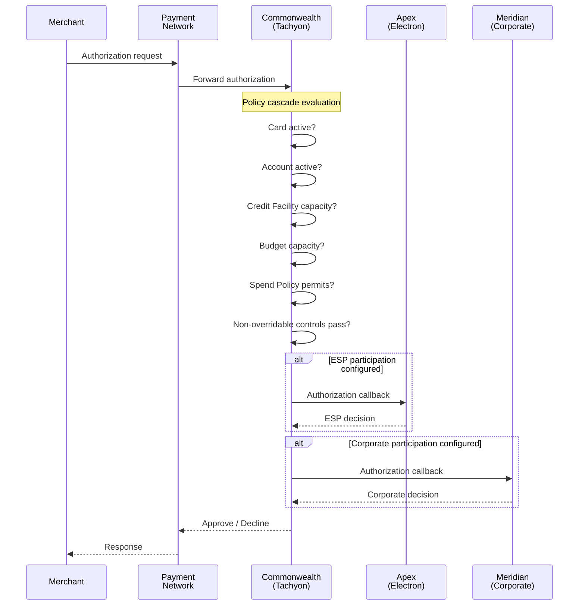
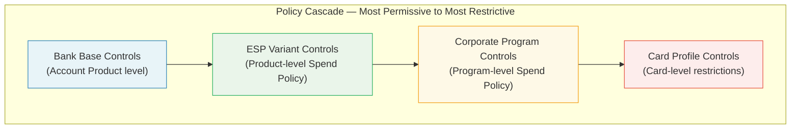
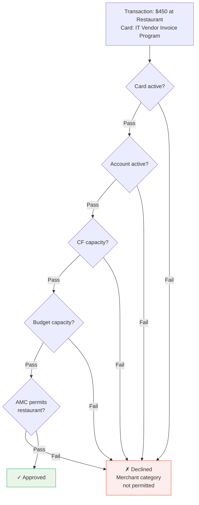

# Chapter 20: Processing, Authorization, and Controls

The bank processes every transaction, enforces every policy, and serves as the single point of authorization in corporate payments. No transaction reaches a corporate's account without passing through the bank's evaluation. No policy — whether defined by the ESP at the Product level or by the corporate at the Program level — is enforced elsewhere. The bank is the enforcement point.

---

## Authorization Flow

When a virtual card is presented for payment at a merchant, the transaction follows a defined path from merchant to bank and back. The bank receives the authorization request from the payment network, evaluates it against all applicable policies, and returns an approval or decline.

The bank processes the full policy stack in a single evaluation pass. The response to the network — approve or decline — comes from the bank alone. Even when the ESP or corporate participates, the bank aggregates all decisions and sends the final response.

---

## The Policy Cascade

Authorization evaluation follows a cascading model. Policies are defined at four levels, each progressively narrower. A transaction must satisfy all levels to be approved.

### Level 1: Bank base controls (Account Product)

The bank's Account Product defines the outermost boundary. These controls are non-negotiable and apply to every account created under the product. They include Credit Facility limits, delinquency-triggered blocks, and regulatory restrictions. No downstream policy can relax these constraints.

### Level 2: ESP Variant controls (Product-level Spend Policy)

The ESP defines a baseline Spend Policy at the Corporate Payment Product level. This policy establishes the maximum control envelope available to corporates — which merchant categories are eligible, what transaction limits apply, which currencies and geographies are permitted. The ESP's policy can only narrow what the bank's base controls allow, never widen.

### Level 3: Corporate Program controls (Program-level Spend Policy)

The corporate configures Spend Policies at the Program level. These policies further restrict within the ESP's envelope — tighter merchant category lists, lower transaction limits, additional velocity controls, time-of-day restrictions. A corporate cannot enable a merchant category that the ESP's Product-level policy excluded.

### Level 4: Card Profile controls

Individual card-level restrictions apply last. These may include per-transaction amount limits, specific merchant exclusions, geographic restrictions, or validity windows. Card Profile controls are the most granular and most restrictive layer.

The cascade is strictly narrowing. Each level can only restrict — never expand — what the level above permits.

---

## Authorization Evaluation — Step by Step

The bank evaluates each authorization request through a defined sequence of checks. If any check fails, the transaction is declined immediately; subsequent checks are not evaluated.

1. **Card active?** — Is the virtual card in an active state? Cards that are suspended, expired, cancelled, or not yet activated are declined.

2. **Account active?** — Is the account associated with the card in good standing? Accounts frozen due to delinquency, fraud holds, or administrative action cause an immediate decline.

3. **Credit Facility capacity?** — Does the Credit Facility backing the account have sufficient available capacity for the requested amount? If the facility is fully utilized or the transaction would breach the limit, the request is declined.

4. **Budget capacity?** — Does the Budget assigned to the Program (and its ancestor Budgets in the hierarchy) have sufficient available allocation? All ancestor Budgets are consulted — if any ancestor is fully utilized, the transaction is declined.

5. **Spend Policy permits?** — The bank evaluates the full policy cascade:
   - **Merchant category** — Is the merchant's category code (MCC) within the Allowed Merchant Category (AMC) list configured at the Product, Program, and Card levels?
   - **Transaction amount** — Does the amount fall within the per-transaction limits defined at each level?
   - **Currency** — Is the transaction currency permitted?
   - **Geography** — Is the merchant's country within the permitted geographies?
   - **Velocity** — Does the transaction violate any velocity controls (transactions per day, per week, per month; cumulative amount per period)?

6. **Non-overridable controls pass?** — Bank-level controls that cannot be configured or suppressed by any downstream actor (detailed below).

---

## Optional ESP and Corporate Participation

The bank can route the authorization request to the ESP and/or the corporate for additional evaluation before responding to the network. This participation is optional — the bank can approve or decline on its own based on configured policies.

### When participation is used

ESP or corporate participation is configured when the bank's standard policy cascade is insufficient to meet the participant's control requirements. Examples:

- An ESP that applies dynamic pricing or real-time risk scoring beyond what static Spend Policies express
- A corporate that requires approval from a budget owner or manager for transactions above a threshold
- A corporate that cross-references the transaction against an internal purchase order system before approval

### Participation mechanics

The bank sends an authorization callback to the ESP's or corporate's configured endpoint. The participant evaluates the transaction against its own logic and returns a decision (approve, decline, or no-opinion). The bank aggregates all decisions:

- If the bank's policy cascade approves and all participants approve (or return no-opinion), the transaction is approved.
- If any participant declines, the transaction is declined.
- If a participant's endpoint is unavailable or times out, the bank applies a configured fallback (typically: proceed with the bank's own decision).

Participation adds latency. The bank enforces strict timeout limits on participant responses to ensure authorization completes within network-mandated timeframes.

---

## Rewards and Rebates Computation

Rewards and rebates operate at two distinct levels, computed by two different systems.

### Account-level rewards and rebates (Tachyon)

The bank's platform (Tachyon) computes account-level rewards and rebates based on the programs configured in the ESP Account Variant. These include:

- Spend-based rewards (points or cashback per transaction)
- Volume-tier rebates (rebate percentages that increase with cumulative spend)
- Category-specific incentives (enhanced rewards for specific MCCs)

This is the mechanism the ESP relies on for product-level rewards and rebates. The ESP defines the reward and rebate rules through its Account Variant programs; Tachyon executes the computation at the account level.

### Relationship-level rewards and rebates (Electron)

The ESP's platform (Electron) computes relationship-level rewards and rebates separately. These may include:

- Cross-product incentives (rewards that span multiple Corporate Payment Products)
- Loyalty tiers based on the corporate's overall relationship with the ESP
- Growth incentives tied to year-over-year volume increases

Relationship-level rewards are determined by the ESP's commercial terms with the corporate, not by the bank. The bank has no visibility into or control over relationship-level computation.

### Rebate flow to the corporate

The rebate a corporate receives is determined by the ESP's commercial terms (defined in the Client Contract), not by the bank's computation. The bank computes the raw reward/rebate amounts per the Account Variant configuration. The ESP determines what portion flows to the corporate versus what the ESP retains as margin. This is a commercial arrangement between ESP and corporate — outside the bank's scope.

---

## Non-Overridable Bank Controls

Beyond the configurable Spend Policy cascade, the bank enforces a set of controls at the Account Product level that no ESP configuration or corporate policy can override. These are the bank's regulatory, risk, and compliance obligations.

| Control | Description |
|---|---|
| **AML screening** | Real-time transaction screening against anti-money-laundering rules. Suspicious patterns trigger holds or declines. |
| **Sanctions checks** | Transaction-level screening against OFAC, EU, UN, and other applicable sanctions lists. Matches result in immediate decline and regulatory reporting. |
| **Fraud signals** | Bank-defined fraud detection models — velocity anomalies, geographic impossibility, device fingerprinting, behavioral patterns. |
| **Regulatory holds** | Jurisdiction-specific holds mandated by law enforcement or regulatory orders. |
| **Delinquency-triggered blocks** | Accounts past due beyond the grace period defined in the Account Product are blocked from new authorizations. |
| **NPA restrictions** | Accounts classified as Non-Performing Assets under the bank's provisioning rules are restricted from new activity. |
| **Credit Facility breaches** | Transactions that would cause the Credit Facility to exceed its sanctioned limit are declined, regardless of Budget availability. |
| **Customer servicing compliance** | Regulatory requirements related to customer communication, dispute handling windows, and disclosure obligations. |

These controls execute before and alongside the configurable policy cascade. An ESP cannot suppress AML screening by configuring a permissive Spend Policy. A corporate cannot override a delinquency block by adjusting its Program configuration.

---

## Notification Boundary

Notifications in corporate payments originate from two sources, with different suppression rules.

### Bank-originated notifications (non-suppressible)

The bank issues notifications for regulatory, compliance, and fraud events. These cannot be suppressed by the ESP or the corporate:

- Regulatory disclosures (billing statements, fee change notices, terms and conditions updates)
- Fraud alerts (suspected unauthorized transactions, card compromise notifications)
- Delinquency notices (past-due warnings, NPA communications)
- Sanctions-related notifications (account restrictions, investigation notices)

The ESP cannot suppress these notifications but can suggest templates — branding, language, and formatting. All template changes require review and approval by bank executives.

### ESP-customizable notifications

Everything else — transaction alerts, authorization declines, card expiry reminders, billing alerts, credit utilization thresholds, statement availability — is customizable through the ESP's Notification Programs within the Account Variant and Virtual Card Variant.

The ESP controls:
- **Templates** — branding, language, content, and formatting
- **Channels** — email, SMS, push notification, webhook/API callback
- **Thresholds** — at what utilization percentage or amount to trigger alerts
- **Recipients** — Program Admins for account-level notifications, cardholders (per Cardholder Profile) for card-level notifications

The corporate can further customize notifications at the Program or card level, within the boundaries the ESP's Variant defines.

Credit Facility-related notifications (utilization approaching limit, facility review notices) are delivered to the configured contacts for the Legal Entity, in addition to Program-level contacts.

---

## Commonwealth, Apex, and Meridian — Authorization in Practice

Two transactions illustrate the authorization flow and policy cascade.

### Transaction 1: Approved — employee purchase at electronics store

A Meridian Industries employee uses a virtual card issued under the "Engineering Department Spend" Program to make a $3,000 purchase at an electronics retailer.

Commonwealth evaluates:

| Check | Result | Detail |
|---|---|---|
| Card active? | Pass | Card is in active state, not expired |
| Account active? | Pass | Account is current, no delinquency holds |
| CF capacity? | Pass | CF-MER-USD has $42M available of $50M limit |
| Budget capacity? | Pass | Engineering Operations Budget has $180K remaining |
| AMC check | Pass | AMC-Electronics is in the allowed category list at Product, Program, and Card levels |
| Amount check | Pass | $3,000 is within the per-transaction limit of $5,000 on this card |
| Velocity check | Pass | This is the second transaction this month; within the 10-per-month limit |
| Non-overridable controls | Pass | No AML, sanctions, or fraud signals triggered |

**Result: Approved.** Commonwealth sends the approval to the network. The merchant completes the sale.

### Transaction 2: Declined — supplier card at restaurant

A virtual card issued under Meridian's "IT Vendor Invoice Payments" Program is presented at a restaurant for a $450 charge.

Commonwealth evaluates:

| Check | Result | Detail |
|---|---|---|
| Card active? | Pass | Card is in active state |
| Account active? | Pass | Account is current |
| CF capacity? | Pass | Sufficient capacity |
| Budget capacity? | Pass | Sufficient allocation |
| AMC check | **Fail** | AMC-Restaurants is not in the allowed category list for this Program's Spend Policy. The supplier payments program permits only AMC-IT-Services, AMC-Cloud, and AMC-SaaS. |

**Result: Declined.** Commonwealth declines the transaction at the AMC check. The remaining checks (amount, velocity, non-overridable controls) are not evaluated. The network receives the decline with a reason code indicating merchant category restriction.

---

## Transaction Posting

After an authorized transaction clears through the network, the bank posts it to the account. Posting updates:

- Account balance (the transaction amount is applied to the account)
- Credit Facility utilization (the facility's available capacity decreases)
- Budget utilization (the Budget's remaining allocation decreases)
- Rewards accrual (if applicable per the Account Variant's reward programs)

All posting honors the same entity associations established at account creation: the account maps to a Credit Facility, which maps to a Legal Entity, which maps to a jurisdiction. The bank's statement generation, billing, and settlement processes operate on posted transactions.

---

## The Bank as the Single Enforcement Point

The bank's role in processing and authorization is not delegable. The ESP defines policies through Variants. The corporate refines policies through Programs. But enforcement — the act of evaluating a live transaction against those policies and returning a decision to the network — is the bank's responsibility.

This centralization exists for three reasons:

1. **Regulatory accountability.** The bank is the issuer of record. Regulatory bodies hold the bank accountable for every transaction authorized under its BIN. The bank cannot delegate this accountability to an ESP or corporate.

2. **Network obligations.** Payment networks (Visa, Mastercard, RuPay) contract with the bank as the issuer. Authorization response times, dispute handling, and chargeback processing are obligations the bank holds directly with the network.

3. **Credit risk ownership.** The bank underwrites the Credit Facility. Every approved transaction increases the bank's credit exposure. The bank must retain the ability to decline transactions that would breach its risk parameters, regardless of what the ESP or corporate has configured.

The ESP and corporate participate in the authorization decision only when explicitly configured and only as advisory inputs. The bank retains final authority.
