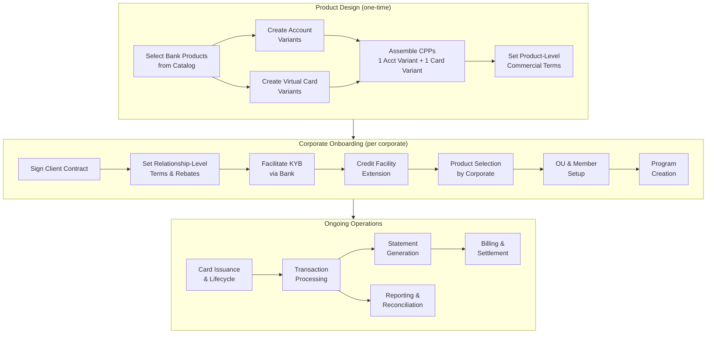

# Chapter 21: ESP-Wide Concerns

An ESP operates as an independent business entity between the bank and the corporate. Its platform — Electron — maintains its own entity model, product catalog, commercial terms, and operational workflows. Before an ESP designs products for any specific Spend Archetype, a set of cross-cutting concerns must be addressed. These concerns apply to every corporate relationship and every Corporate Payment Product the ESP offers. They form the operational backbone on which archetype-specific products are built.

---

## Client Contract

**A Client Contract is an entity in the ESP domain that represents the commercial relationship between the ESP and a real-world corporate.**

The Client Contract is the origin point. A corporate comes into existence within Electron only through a Client Contract. The contract is signed by one or more Legal Entities corresponding to that corporate. A single corporate — such as a multinational with operations across multiple jurisdictions — may have several Legal Entities sign the same Client Contract.

The Client Contract establishes:

- **Legal provenance** — which Legal Entities are party to the relationship
- **Relationship scope** — which Spend Archetypes the ESP will serve for this corporate
- **Relationship-level commercial terms** — rebates, incentives, volume commitments, SLA credits, and migration incentives that apply across all products the corporate uses (distinct from product-level terms on individual Corporate Payment Products)
- **Duration and renewal** — contract term, extension provisions, termination conditions

Commercial terms on the Client Contract are negotiated per corporate. Large corporates negotiate custom pricing, volume-based rebate tiers, waivers, and SLA credits. These relationship-level terms are distinguished from product-level terms — which are defined on each Corporate Payment Product and apply uniformly to every corporate using that product.

> Apex signs a Client Contract with Meridian Industries. Three Legal Entities execute the contract: Meridian Industries Inc. (US), Meridian UK Ltd, and Meridian India Pvt Ltd. The contract specifies that Apex will provide Corporate Payment Products across all four Spend Archetypes. The relationship-level terms include a 50 bps rebate on aggregate spend exceeding $10M per quarter across all products and entities.

If an ESP is replaced while the corporate stays with the same bank, the Client Contract terminates. Credit Facilities survive — they are bank-scoped entities tied to the Legal Entity and the bank's underwriting relationship. Programs do not survive — they are ESP-scoped and must be recreated under the new ESP.

---

## Variant Creation

**An ESP Account Variant is an ESP-defined configuration that customizes a bank Account Product. An ESP Virtual Card Variant is an ESP-defined configuration that customizes a bank Virtual Card Product.**

The bank (on Tachyon) makes redistributable Account Products and Virtual Card Products available to ESPs. These are catalog items — a single Account Product or Virtual Card Product can serve multiple ESPs. The ESP browses the bank's catalog and selects the base products that match its requirements. The ESP may also request custom products from the bank for specialized needs.

### Account Variant

An ESP Account Variant layers ESP-specific configuration on top of a bank Account Product. The bank's base programs serve as fallback for any parameter the ESP does not override. The ESP can reduce fees and charges but cannot override the bank's credit risk, AML, or compliance parameters — those remain exclusively bank-managed.

An Account Variant is composed of:

| Program | Purpose |
|---------|---------|
| Fee Programs | Override base fees — reduce or waive account-level charges |
| Interest Programs | Configure interest terms within bank-permitted ranges |
| Statement Program | Customize statement format, delivery schedule, branding |
| Reward Programs | Define account-level reward structures (points, cashback) |
| Rebate Programs | Define account-level rebate computations |
| Notification Program | Configure account-level alerts — billing, credit utilization, delinquency, statement availability |

Notification recipients at the account level are typically the Corporate Users configured as Program Admins for the Corporate Payment Program to which the account is mapped. Credit Facility notifications are delivered to the Legal Entity's configured contacts, over and above program-level contacts.

### Virtual Card Variant

An ESP Virtual Card Variant layers ESP-specific configuration on top of a bank Virtual Card Product. The same override model applies: all commercial and operational parameters are available to the ESP, while compliance and fraud risk parameters remain bank-managed. The bank provides limited User-Managed-Risk parameters to the ESP and cardholder.

A Virtual Card Variant is composed of:

| Program | Purpose |
|---------|---------|
| Embossing Program | Card design, name rendering, branding elements |
| Spend Program (Payment Usage) | Baseline spend controls — velocity limits, AMC rules, amount caps |
| Authentication Program | Authentication requirements — ACS, second-factor configuration |
| Tokenisation Program | Mobile wallet provisioning, token lifecycle |
| 3DS Program | 3D Secure enrollment and challenge configuration |
| Card Fee Programs | Per-card fee structures — issuance, annual, replacement |
| Notification Program | Card-level alerts — transaction notifications, decline alerts, expiry reminders, OTP delivery |

Card-level notifications are delivered based on the Cardholder Profile information (email, phone). The ESP can customize notification templates per Variant — branding, language, content — and the corporate can further customize at the Program or card level. All notification template changes go through review from bank executives. Bank-originated notifications (regulatory disclosures, fraud alerts) cannot be suppressed by the ESP, though the ESP can suggest templates.

### Variant Selection Strategy

How does an ESP decide which bank products to start with?

- **Currency requirements** — Account Product currency must match Credit Facility currency. If the ESP serves corporates with multi-currency Credit Facilities, it needs Account Variants built on Account Products in each relevant currency.
- **Network preferences** — The bank's Virtual Card Product defines which card schemes (Visa, Mastercard, private label) are available. The ESP selects based on merchant acceptance needs in its target Spend Archetypes.
- **Billing cycle suitability** — Different Spend Archetypes have different settlement rhythms. Supplier payments may need 30-day cycles matching standard payment terms. Travel payments may align with agency billing cycles.
- **Control capabilities** — The Spend Program on the Virtual Card Variant must support the control model required by the archetype: single-use enforcement for supplier payments, multi-use with velocity limits for employee spend.

### Reuse vs. Dedication

Variants can be reused across multiple Corporate Payment Products. An ESP serving forty corporates does not need forty Account Variants — a shared variant handles the common case. However, large customers often require dedicated variants for custom branding, custom fee structures, or regulatory-specific configurations.

> Apex selects two Commonwealth Account Products: one denominated in USD, one in GBP. Apex creates three Account Variants: a standard 30-day billing variant (USD), a standard 30-day billing variant (GBP), and a dedicated variant for Meridian with custom statement branding and a reduced fee schedule. Apex selects one Commonwealth Virtual Card Product supporting Visa and Mastercard. Apex creates four Virtual Card Variants — one per Spend Archetype — each configured with archetype-appropriate spend controls, card fee structures, and notification templates.

---

## Corporate Payment Product Assembly

**A Corporate Payment Product (CPP) references exactly one ESP Account Variant and exactly one ESP Virtual Card Variant.**

Assembly is the act of combining one Account Variant and one Virtual Card Variant into a product that an ESP offers to corporates. Multiple CPPs can share the same Variant. This is the core reuse mechanism — a single Account Variant might serve both the Supplier Payments Product and the Central Recurring Product if their billing and fee requirements are identical.

Each CPP is tagged to exactly one Spend Archetype. This is a 1:1 relationship — a CPP serves one archetype. The Spend Archetype classification determines the operational pattern the product supports: control model, card lifecycle, enrollment model, and reconciliation approach.

A CPP defines:

- **Baseline Spend Policy** — the maximum envelope of permitted spend for this product. Corporate programs can only tighten this policy, never loosen it.
- **Card Profile template** — the default card configuration (tag schema, cardholder profile requirements, spend controls) for cards issued under this product
- **Settlement mechanics** — billing cycle, statement structure, settlement collection approach
- **Product-level commercial terms** — fees, rebates, and rewards that apply to every corporate using this product. Distinct from relationship-level terms negotiated per corporate on the Client Contract.

Commercial terms are per Corporate Payment Product, not per Program. A Program represents an operational requirement in the corporate realm — it is not a commercial contract between ESP and corporate.

> Apex assembles four CPPs for its product catalog:
>
> | CPP | Spend Archetype | Account Variant | Virtual Card Variant |
> |-----|-----------------|-----------------|---------------------|
> | Apex Supplier Pay | Supplier Payments | Standard USD 30-day | Supplier — single-use, Visa |
> | Apex Employee Spend | Employee & Department Spend | Standard USD 30-day | Employee — multi-use, Visa/MC |
> | Apex Travel Pay | Travel & Booking Payments | Standard USD 30-day | Travel — trip-scoped, Visa/MC |
> | Apex Subscription Manager | Central Recurring Merchant Payments | Standard USD 30-day | Recurring — persistent, Visa |

---

## Branding

The ESP brands the payment product. Card design, statement format, notification templates, and portal experience all carry the ESP's identity. The bank's brand may or may not be visible to end-user cardholders — this depends on the ESP's branding strategy and any co-branding requirements in the bank-ESP arrangement.

Branding is configured through the Variant programs:

- **Embossing Program** on the Virtual Card Variant controls card design and name rendering
- **Statement Program** on the Account Variant controls statement format and delivery branding
- **Notification Programs** on both Variants control the look and language of alerts

> Apex brands all Meridian-facing products under the "Apex Pay" identity. Meridian's employees see Apex Pay on their card notifications and expense portal. Commonwealth's brand appears on regulatory disclosures and fraud alerts — bank-originated notifications that Apex cannot suppress.

---

## Relationship-Level Commercial Terms

The ESP operates two distinct layers of commercial terms:

1. **Product-level terms** — defined on each CPP, applied uniformly to every corporate using that product. Computed by Tachyon through the Reward and Rebate Programs in the ESP Account Variant.
2. **Relationship-level terms** — negotiated per corporate on the Client Contract, computed by Electron. These are incentives that span across products: aggregate spend rebates, cross-product volume bonuses, SLA credits, migration incentives.

The bank provides account-level Rewards and Rebate computations based on the programs configured in the ESP Account Variant. This is the mechanism the ESP relies on for product-level rewards and rebates. Electron provides its own computation mechanism for relationship-level rewards and rebates — these operate at the Client Contract scope, aggregating across all products and programs the corporate uses.

> Apex configures product-level terms on the Supplier Pay CPP: 1.5% rebate on interchange collected from supplier transactions. Separately, the Meridian Client Contract includes a relationship-level rebate: 50 bps on aggregate quarterly spend exceeding $10M across all four products. The product-level rebate is computed by Tachyon at the account level. The relationship-level rebate is computed by Electron across all Meridian accounts.

---

## Corporate Onboarding

Corporate onboarding follows a defined sequence. The ESP drives the process, with the bank handling regulatory and credit functions.

**Step 1: Client Contract execution.** The ESP and the corporate's Legal Entities sign the Client Contract. This creates the Corporate entity in Electron.

**Step 2: Legal Entity registration and KYB.** The ESP facilitates Legal Entity registration with the bank. KYB (Know Your Business) is performed by the bank through Tachyon. Each Legal Entity undergoes the bank's due diligence process independently.

**Step 3: Credit Facility extension.** The bank underwrites and extends Credit Facilities to each Legal Entity. Credit Facility currency determines the Account Product currency. A single corporate with three Legal Entities may receive three Credit Facilities — one per entity, each in the relevant local currency.

**Step 4: Product configuration.** The ESP makes its CPP catalog available to the corporate. The corporate selects which products to use.

**Step 5: OU hierarchy and Member population.** The corporate configures its Organizational Unit hierarchy in Electron — by function, geography, Legal Entity, or a combination. Members (Employees, Suppliers, Contractors, Clients) are populated into OUs.

**Step 6: User provisioning.** Corporate Users are provisioned with authorization controls scoped to specific programs, products, budgets, and OUs. Users administer programs. Members participate in programs. A person can hold both roles — these are separate entity instances in separate domains.

**Step 7: Program setup.** The corporate creates Corporate Payment Programs under its selected CPPs. Each program is owned by an OU, selects a Budget from the owning OU's available Budgets, configures its Spend Policy (tightening the ESP baseline), and defines eligibility rules for member enrollment.

> Apex onboards Meridian: signs the Client Contract with three Legal Entities → Commonwealth performs KYB on each entity → Commonwealth extends three Credit Facilities (USD, GBP, INR) → Apex presents its four-product catalog → Meridian selects all four → Meridian configures its OU hierarchy (by function and geography) → Meridian's treasury team is provisioned as Users → Meridian creates programs under each product, one per Legal Entity per archetype where needed.

---

## Billing

**Billing is ESP-performed, account-level, with the Legal Entity as payer.**

The ESP generates and delivers billing statements to the corporate. Billing operates at the account level — each account produces a statement. For programs with multiple accounts (such as employee-spend programs with one account per employee), a master statement is compiled by Electron, aggregating the individual account-level statements received from the bank.

Billing configuration parameters:

| Parameter | Description |
|-----------|-------------|
| Billing cycle | Frequency and period (e.g., 30-day cycle) |
| Payment due date | Number of days after statement close |
| Interest-free period | Grace period before interest accrual |
| Penalties | Late payment charges, delinquency escalation |
| Statement format | Level of detail, grouping (department, supplier, cost center) |
| Delivery method | Data extract format (CSV, PDF), delivery channel (portal, email, API) |

Settlement is performed by the corporate against the bills received from the ESP. The Settlement Profile in the Corporate Payment Program defines how invoices are settled — including auto-pay configuration and payment-date settings. The system supports one Settlement Account per Settlement Profile per Program. Invoices are paid using the settlement account configured in the Settlement Profile of the Program to which the account belongs.

> Apex configures billing for Meridian's US programs on a 30-day cycle with a 15-day payment window after statement close. The Supplier Pay program produces a single consolidated statement (one account per program). The Employee Spend program produces a master statement aggregating 200+ individual employee account statements. Meridian's treasury settles each statement via the Settlement Account configured in each program's Settlement Profile.

---

## ESP Operational Flow

---

## Apex's Meridian Setup — Summary

| Concern | Decision |
|---------|----------|
| Client Contract | Signed by three Legal Entities (US, UK, India) |
| Relationship-level rebate | 50 bps on aggregate spend above $10M/quarter |
| Bank products selected | Commonwealth USD Account Product, GBP Account Product, Visa/MC Virtual Card Product |
| Account Variants created | Standard 30-day (USD), Standard 30-day (GBP), Meridian-dedicated (USD, custom branding) |
| Virtual Card Variants created | Four — one per Spend Archetype, each with archetype-specific controls |
| CPPs assembled | Apex Supplier Pay, Apex Employee Spend, Apex Travel Pay, Apex Subscription Manager |
| Branding | Apex Pay branding on cards, statements, notifications; Commonwealth on regulatory disclosures |
| Billing | 30-day cycle, 15-day payment window, master statements for multi-account programs |
| KYB | Commonwealth performs independently for each Legal Entity |
| Credit Facilities | Three — USD (Meridian Inc.), GBP (Meridian UK), INR (Meridian India) |

The chapters that follow detail the product design decisions for each Spend Archetype — starting with Supplier Payments, then Employee & Department Spend, Travel & Booking Payments, and Central Recurring Merchant Payments.
