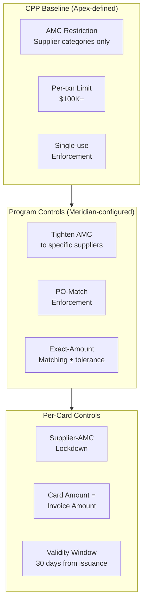
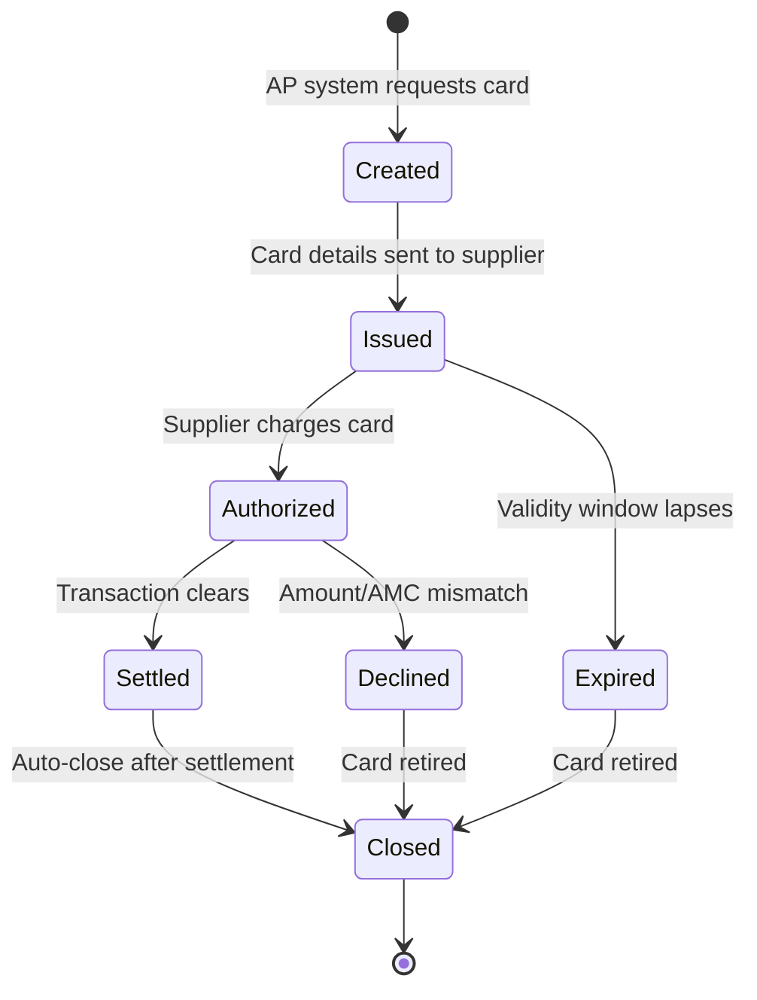
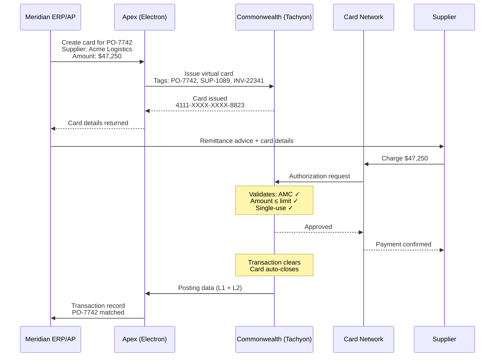

# Chapter 22: Designing the Supplier Payments Product

The Supplier Payments archetype exists to modernize the procure-to-pay workflow. The corporate's AP organization, procurement team, or treasury issues a virtual card per invoice or purchase order, pays the supplier electronically, and reconciles the transaction back to the originating obligation. The card replaces checks, ACH, and wire transfers with a controlled, auditable, and interchange-generating payment instrument.

Every design choice — from AMC restrictions to settlement mechanics — flows from the operational reality of how corporates pay suppliers.

---

## The Archetype's Operational Pattern

Supplier payments follow a centralized, AP-driven workflow. No individual employee carries a card. The AP system or procurement platform generates a virtual card for each payment obligation, transmits the card details to the supplier, and the supplier charges the card as settlement of the invoice. The card is purpose-built for a single obligation and typically expires after use.

Key characteristics of the Supplier Payments archetype:

- **Centralized issuance** — cards are created programmatically by the AP system, not requested by individual employees
- **One card per obligation** — each invoice or purchase order maps to one virtual card number
- **Supplier as payee** — the card is payable to the supplier; the cardholder is the Program Admin or a designated AP operator, not the supplier itself
- **Interchange as commercial model** — the corporate earns interchange-based rebates on supplier payments, extending days payable outstanding (DPO) while generating revenue
- **Reconciliation by design** — card tags carry PO number, supplier ID, and invoice number, enabling straight-through reconciliation against the ERP AP ledger

---

## Design Decision Summary

| Dimension | Design Choice |
|-----------|---------------|
| **Baseline Spend Policy** | AMC restricted to supplier-relevant categories (AMC-Logistics, AMC-Manufacturing, AMC-Cloud, AMC-Professional-Services). Per-transaction limit: $100K+. No time-of-day restrictions. No geographic restrictions (suppliers may be anywhere). |
| **Card Profile template** | Single-use virtual cards. Tags mandatory: PO number, supplier ID, invoice number. No cardholder profile for the supplier — the Program Admin is the cardholder of record. Supplier information is carried as card-level tags. |
| **Fees** | Interchange-driven model. Processing fee per card issuance. No annual card fee (cards are ephemeral — created, used once, closed). Supplier enablement fee for onboarding new suppliers. ERP/AP connector fee for system integration. Exception handling fee for failed or disputed payments. |
| **Settlement** | Statement billing on a 30-day cycle, matching standard supplier payment terms. DPO extension is the core value proposition — the corporate pays the statement on day 30 while the supplier receives payment immediately via the card. Single account per program. |
| **Control capabilities** | PO-match enforcement (card amount = invoice amount ± tolerance). Supplier-AMC lockdown (card valid only at merchants within the supplier's AMC). Single-use enforcement (card auto-closes after one successful authorization). Exact-amount matching configurable per card. |
| **Data/reporting** | L2 data expected on most transactions (PO number, invoice number, tax amount). L3 line-item data available from suppliers with enhanced data capabilities. Reconciliation against ERP AP ledger using card tags + posting data. |

---

## Baseline Spend Policy

The Spend Policy on the Supplier Payments CPP defines the maximum envelope. Corporate programs can tighten these controls but cannot expand them.

**AMC restrictions.** The baseline policy restricts transactions to AMCs relevant to supplier payments. Apex defines AMCs for its common supplier categories:

- **AMC-Logistics** — freight, shipping, warehousing, transportation services
- **AMC-Manufacturing** — raw materials, components, contract manufacturing
- **AMC-Cloud** — cloud infrastructure, hosting, data services
- **AMC-Professional-Services** — consulting, legal, audit, staffing services

AMCs are defined using merchant identifiers, MCCs, names, locations, or pattern-based rules. ESPs and corporates may request custom AMCs from the bank. A corporate using the Supplier Payments product for a category not covered by Apex's predefined AMCs (e.g., laboratory equipment suppliers) can request a custom AMC through Apex.

**Transaction limits.** Per-transaction limits are set high — $100,000 or more — reflecting the reality that supplier invoices frequently reach six figures. No daily or monthly velocity limits at the product level; the single-use card model inherently limits exposure to one transaction per card.

**No time-of-day or geographic restrictions.** Suppliers operate across time zones. A US-headquartered corporate paying a logistics provider in Singapore should not have the transaction blocked by a time-zone-based control. Geographic restrictions are absent at the product level — corporate programs may add them if needed.

---

## Card Profile Template

**Single-use virtual cards.** Each card is created for a specific invoice or purchase order. After one successful authorization and settlement, the card auto-closes. This eliminates the risk of card reuse, simplifies reconciliation, and produces a 1:1 mapping between cards and payable obligations.

**Tags.** The card's tag structure carries the corporate domain context that makes reconciliation possible:

| Tag | Purpose |
|-----|---------|
| PO Number | Links card to the originating purchase order |
| Supplier ID | Corporate's internal identifier for the supplier |
| Invoice Number | Specific invoice being paid |
| GL Code | General ledger account for posting |
| Cost Center | Organizational cost attribution |

Tag data can be referenced in Payment Usage Policy rules — enabling controls such as "card valid only if PO number is populated" or "amount must match the invoice amount recorded in the PO tag."

**Cardholder profile.** The Program Admin is the cardholder of record. Supplier information is carried as card-level tags, not in the Cardholder Profile. If the card is enabled for ACS and second-factor authentication, an authorized user from the supplier must be designated as the cardholder to respond to authentication challenges. In either case, the supplier identity is tagged to the card regardless of what appears in the Cardholder Profile.

---

## Fee Structure

The commercial model for supplier payments is interchange-driven. The corporate earns a rebate on interchange collected from supplier transactions. The ESP's revenue comes from a combination of interchange share and platform fees.

| Fee | Description |
|-----|-------------|
| Processing fee per card | Charged per virtual card issuance. Covers the cost of card creation, delivery to supplier, and lifecycle management. |
| Supplier enablement fee | One-time fee for onboarding a new supplier into the program — validating acceptance, configuring payment delivery. |
| ERP/AP connector fee | Platform fee for API integration between the corporate's ERP/AP system and Electron. |
| Remittance delivery fee | Fee for transmitting remittance advice to the supplier alongside card details. |
| Exception handling fee | Fee for managing payment exceptions — declined transactions, disputes, manual interventions. |

No annual card fee applies. Cards are ephemeral — created for a single payment, settled, and closed. Charging an annual fee on a card that exists for 48 hours is not meaningful.

---

## Settlement Mechanics

Statement billing on a 30-day cycle. The corporate receives a consolidated statement for the supplier payments program — one account, one statement, all cards aggregated. The statement includes PO-level detail: each line item maps to a card, a supplier, a PO number, and an invoice.

DPO extension is the central value proposition. The corporate pays its suppliers immediately via virtual card (the supplier receives funds at point of sale or within the network settlement window). The corporate's obligation to pay the statement does not arise until the billing cycle closes — typically 30 days later. For a corporate with significant AP volume, this extension of days payable outstanding has material working capital impact.

Settlement is performed by the corporate against the statement, using the Settlement Account configured in the Settlement Profile. The single-account-per-program structure keeps settlement straightforward — one account, one statement, one payment.

---

## Control Model

The control architecture for supplier payments is built around PO-match enforcement and supplier-AMC lockdown.

The cascading restriction model applies: Apex defines the baseline envelope at the CPP level. Meridian tightens controls at the program level — restricting AMCs further, enabling PO-match enforcement, setting exact-amount tolerances. Per-card controls lock each card to a specific supplier AMC, a specific amount, and a validity window.

**PO-match enforcement.** The card amount is set to match the invoice amount, with a configurable tolerance (e.g., ±2% to accommodate currency fluctuations or minor adjustments). If the supplier attempts to charge more than the card's limit, the authorization is declined.

**Supplier-AMC lockdown.** Each card is restricted to merchants within the supplier's AMC. A card issued for a logistics supplier cannot be used at a cloud services merchant, even if both categories are permitted at the program level.

**Single-use enforcement.** After one successful authorization and settlement, the card closes automatically. No second transaction is possible.

---

## Card Lifecycle

The card lifecycle for supplier payments is deliberately short. A card is created when the AP system generates a payment obligation. Card details (number, expiry, CVV) are transmitted to the supplier — via email, supplier portal, or direct integration with the supplier's payment gateway. The supplier charges the card. The transaction clears. The card closes.

If the supplier does not charge the card within the validity window (typically 30 days from issuance), the card expires and closes. No follow-up action is needed — the AP system can generate a new card for the same obligation if the payment is still required.

---

## Supplier Payment Flow

---

## Data and Reporting

**L1 data** is present on every transaction: amount, MCC, date/time, merchant name, currency. This is the baseline.

**L2 data** is expected on most supplier transactions: PO number, invoice number, tax amount, tax indicator, customer code. L2 data is the minimum for straight-through reconciliation.

**L3 data** (line-item detail) is available from suppliers with enhanced data capabilities. L3 is particularly relevant for tax compliance and detailed cost analysis — it provides item-level quantities, descriptions, unit prices, and commodity codes.

Reconciliation against the ERP AP ledger uses two data sources:

1. **Card tags** — PO number, supplier ID, invoice number set at card creation
2. **Posting data** — L1 and L2 data from the merchant at clearing time

When card tags and posting data align, reconciliation is automatic. Exception handling is required only when data mismatches occur — a supplier charges a different amount than expected, or L2 data is missing.

---

## Account Variant Choices

Apex configures the Account Variant for its Supplier Payments product with the following programs:

| Program | Configuration |
|---------|---------------|
| Fee Programs | Processing fee per card issuance; no annual account fee |
| Interest Programs | Standard terms — interest accrues after the interest-free period if the corporate does not settle by the due date |
| Statement Program | 30-day cycle; PO-level detail on each statement line; CSV and PDF delivery |
| Reward Programs | Not enabled — interchange economics are the commercial model, not points-based rewards |
| Rebate Programs | Interchange-based rebate computed at account level; percentage of interchange collected |
| Notification Program | Billing alerts, statement availability, delinquency warnings delivered to Program Admin |

---

## Virtual Card Variant Choices

| Program | Configuration |
|---------|---------------|
| Embossing Program | Apex Pay branding; no physical card embossing (digital-only issuance) |
| Spend Program | Single-use enforcement; high per-transaction limits ($100K+); AMC-restricted to supplier categories; exact-amount matching available |
| Authentication Program | ACS disabled by default (supplier charges card without cardholder present challenge). Enabled when supplier requires 3DS. |
| Tokenisation Program | Not enabled — single-use cards do not benefit from tokenisation |
| 3DS Program | Optional enrollment; configured per-card when supplier's payment gateway requires 3DS |
| Card Fee Programs | Per-issuance processing fee; no annual fee |
| Notification Program | Card creation confirmation to Program Admin; transaction alert to Program Admin; decline notification with reason code |

**Network selection.** Visa is selected as the primary network for broadest supplier acceptance globally. Mastercard is available as an alternative where supplier acceptance dictates. The bank's Virtual Card Product supports multi-network issuance — the network is selected at card creation based on the supplier's acceptance profile.

---

## Apex Supplier Pay — Meridian Configuration

Apex builds the Supplier Payments CPP and Meridian configures programs under it for each Legal Entity. The following summarizes the end-to-end configuration:

| Layer | Entity | Configuration |
|-------|--------|---------------|
| CPP | Apex Supplier Pay | AMC: Logistics, Manufacturing, Cloud, Professional-Services. Single-use. $100K per-txn limit. 30-day billing. Interchange rebate. |
| Program (US) | Meridian US Supplier Program | Budget from Meridian Inc. OU. PO-match enabled. Exact-amount ±2%. Credit Facility: USD. |
| Program (UK) | Meridian UK Supplier Program | Budget from Meridian UK OU. AMC tightened to Logistics + Manufacturing only. Credit Facility: GBP. |
| Card | Per invoice | Tags: PO, supplier ID, invoice number, GL code. Validity: 30 days. Amount: matches invoice. |

Meridian's US program covers all four supplier AMCs — the US operation procures across logistics, manufacturing, cloud, and professional services. The UK program tightens the AMC set to logistics and manufacturing only, reflecting the UK entity's narrower procurement scope. Both programs inherit the CPP's baseline controls and can only restrict further, never expand.
