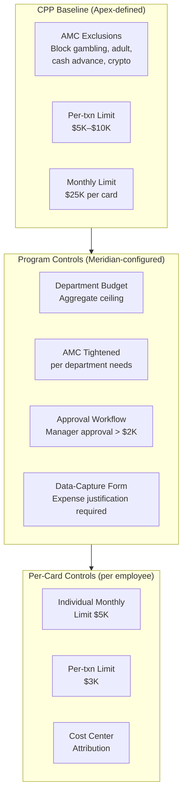
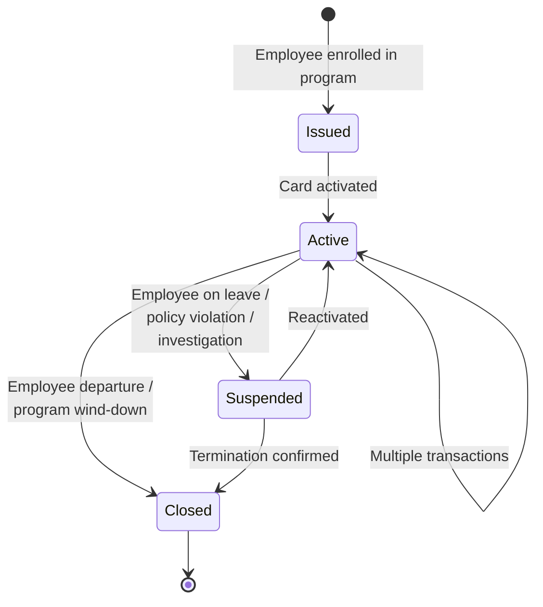

# Chapter 23: Designing the Employee & Department Spend Product

The Employee & Department Spend archetype governs decentralized business purchasing. Employees, teams, and department budget owners receive controlled virtual cards for business expenditures — office supplies, software licenses, client entertainment, project-specific purchases, and ad-hoc operational needs. The corporate retains real-time visibility and control without routing every purchase through a centralized procurement function.

This archetype differs fundamentally from Supplier Payments (covered in *Designing the Supplier Payments Product*). Supplier payments are centralized, AP-driven, single-use. Employee spend is distributed, individual-driven, multi-use. The control model shifts from PO-match enforcement to velocity limits, AMC governance, and approval workflows. The reconciliation model shifts from ERP AP ledger matching to expense categorization and cost-center attribution.

---

## The Archetype's Operational Pattern

Employee spend follows a distributed, cardholder-driven workflow. Each employee receives a multi-use virtual card tied to their identity, their department, and their cost center. The employee makes purchases within the controls configured on the card — AMC restrictions, per-transaction limits, daily and monthly velocity caps. The corporate's finance team monitors spend in real time, reviews transactions against policy, and reconciles against budgets.

Key characteristics:

- **Individual card assignment** — one card per employee, tied to a full Cardholder Profile (name, identity, contact information)
- **Multi-use cards** — cards persist for the employee's tenure; transactions accumulate over time
- **AMC-based governance** — broad category permissions with specific exclusions (block gambling, adult entertainment, other high-risk categories)
- **Layered velocity limits** — per-transaction caps, daily limits, monthly limits, quarterly budgets
- **Approval workflows** — optional manager approval for transactions exceeding a threshold
- **Cost-center attribution** — every transaction maps to a cost center and optionally a project code
- **Rewards** — the corporate earns points or cashback on qualifying employee spend

---

## Design Decision Summary

| Dimension | Design Choice |
|-----------|---------------|
| **Baseline Spend Policy** | Broad AMC set — most merchant categories allowed. Explicit exclusions: gambling (AMC-Gambling), adult entertainment (AMC-Adult), cash advances, money orders. Per-transaction limit: $5,000–$10,000. Daily limit: $10,000. Monthly limit per card: $25,000. |
| **Card Profile template** | Multi-use virtual cards, one per employee. Tags mandatory: cost center, department. Tags optional: project code, expense category. Full Cardholder Profile required: employee name, address, email, phone. CorporateMemberType = Employee. CorporateMemberID = corporate employee ID. |
| **Fees** | Monthly card fee per active card. Low per-transaction processing fee. Platform/portal fee for corporate access to spend management tools. Reporting fee for enhanced analytics. |
| **Settlement** | 30-day billing cycle. Per-employee account billing. Master statement aggregation across all employee accounts in a program. Corporate settles the consolidated statement. |
| **Control capabilities** | Real-time budget tracking. Department-level aggregate limits. Manager approval for above-threshold transactions. AMC allow/block lists. Data-capture form for per-transaction metadata. |
| **Data/reporting** | L1 + L2 standard on all transactions. L3 line-item data when the merchant provides it. Employee-provided data (expense justification, project code) captured via data-capture forms. Approval status recorded in posting. Expense categorization. |

---

## Baseline Spend Policy

The Employee Spend CPP defines a broad permission envelope. Unlike Supplier Payments — where AMCs are tightly restricted to supplier categories — Employee Spend permits most merchant categories. The controls focus on what to exclude rather than what to allow.

**AMC exclusions.** The baseline policy blocks high-risk categories:

| Excluded AMC | Rationale |
|-------------|-----------|
| AMC-Gambling | Regulatory risk, policy violation |
| AMC-Adult | Policy violation |
| AMC-Cash-Advance | Cash extraction defeats card controls |
| AMC-Money-Orders | Cash-equivalent, defeats audit trail |
| AMC-Crypto | Speculative, unrecoverable |

All other merchant categories are permitted at the product level. Corporate programs can tighten further — a marketing department program might restrict to AMC-Advertising, AMC-Events, and AMC-Travel only.

**Velocity limits.** The layered limit structure prevents runaway spend:

| Limit Type | Product Baseline |
|------------|-----------------|
| Per-transaction | $5,000–$10,000 (configurable within this range) |
| Daily | $10,000 |
| Monthly per card | $25,000 |
| Quarterly per card | $60,000 |

These are tumbling-window limits — they reset at the boundary of each period. Life-to-date limits are not set at the product level but can be configured at the program or card level.

**No time-of-day restrictions.** Employees may incur legitimate business expenses outside standard business hours — a dinner with a client, a late-night taxi. Time-based controls are available for corporate programs to configure if needed.

---

## Card Profile Template

**Multi-use virtual cards.** Each employee receives a persistent card that remains active for the duration of their employment or program enrollment. The card accumulates transactions over its lifetime. Cards can be suspended and reactivated — an employee on leave has their card suspended; it reactivates upon return.

**Cardholder Profile.** A full Cardholder Profile is mandatory. Unlike Supplier Payments — where the Program Admin is the cardholder of record — Employee Spend cards carry the employee's identity:

| Field | Value |
|-------|-------|
| Name on card | Employee's legal name |
| Address | Employee's business address |
| Email | Employee's corporate email (used for OTP, notifications) |
| Phone | Employee's mobile number (used for SMS OTP, push notifications) |
| CorporateMemberType | Employee |
| CorporateMemberID | Corporate's employee ID |

**Tags.** The card's tag structure supports cost attribution and reconciliation:

| Tag | Requirement | Purpose |
|-----|------------|---------|
| Cost Center | Mandatory | Primary cost attribution. Maps to corporate GL structure. |
| Department | Mandatory | Organizational attribution. Maps to OU hierarchy. |
| Project Code | Optional | Project-level cost tracking. Populated when the employee is assigned to a specific project. |
| Expense Category | Optional | Pre-classification of expected spend type. |

**Data-capture form.** Electron supports configurable data-capture forms at the program level. When an employee makes a transaction, the system can prompt for additional information — expense justification, receipt upload, meal attendees, business purpose. The form schema is defined at program setup. The captured data flows into the Booking Profile rules for cost-center attribution and into the posting record for reporting.

> "Form" is a metaphor. The actual UI can be Electron's default interface, a mobile app, or a third-party expense management tool using Electron APIs. The data-capture schema is platform-agnostic.

---

## Fee Structure

Employee Spend operates on a subscription-plus-usage model. The corporate pays for the card infrastructure and per-transaction processing.

| Fee | Description |
|-----|-------------|
| Monthly card fee | Per active card, per month. Covers card lifecycle management, notifications, portal access. |
| Per-transaction processing fee | Low per-transaction fee. Covers authorization, clearing, posting. |
| Platform/portal fee | Monthly or annual fee for the corporate's access to Electron's spend management dashboard. |
| Reporting fee | Fee for enhanced analytics — department-level spend analysis, trend reporting, budget vs. actual dashboards. |

Rewards are a revenue-sharing mechanism, not a fee. The corporate earns points or cashback on qualifying spend. The Reward Program in the Account Variant defines the reward structure — earn rate, qualifying categories, redemption options.

---

## Settlement Mechanics

**Per-employee account billing.** Each enrolled employee has an individual account. Transactions post to the employee's account. Statements are generated per account on a 30-day cycle.

**Master statement aggregation.** A program with 200 employees generates 200 individual statements. Electron compiles these into a master statement for the program — aggregated by department, cost center, or custom grouping as configured in the Statement Program. The master statement provides the corporate's finance team with a single view of all employee spend in the program.

**Corporate settlement.** The corporate settles the master statement — not individual employee statements. Settlement is performed via the Settlement Account configured in the Settlement Profile. One payment covers the entire program's spend for the billing period.

**Department-level subtotals.** The statement includes subtotals by department and cost center. This supports internal cost allocation without requiring separate settlement per department.

---

## Control Model

The control architecture for employee spend is layered: department budgets constrain aggregate spend, individual card limits constrain per-employee spend, per-transaction limits constrain individual purchases, and AMC filters govern where the card can be used.

The cascading restriction model operates at every layer. Apex sets the product baseline. Meridian tightens at the program level — setting department budgets, enabling approval workflows, defining data-capture requirements. Per-card controls tighten further — an individual employee's monthly limit might be $5,000 against the product's $25,000 ceiling.

**Approval workflows.** Electron provides an in-platform approval workflow engine. At program setup, Meridian configures:

- **Approval threshold** — transactions above a specified amount require manager approval before the card is authorized
- **Approving authority** — defined per employee at enrollment; typically the employee's direct manager
- **Approval group** — a nominated group of users (e.g., department heads, finance controllers) who can approve in the manager's absence
- **Escalation rules** — time-based escalation if approval is not granted within a configured window

**Real-time budget tracking.** Department-level budgets are tracked in real time. When aggregate department spend approaches the budget ceiling, Electron generates alerts. When the budget is exhausted, new authorizations for cards in that department are declined until the budget is replenished or increased.

---

## Card Lifecycle

The employee card lifecycle is long-lived compared to supplier payment cards. A card is issued when an employee is enrolled in the program. It remains active for the duration of the employee's participation — potentially years. The card accumulates transactions, resets its velocity limits each period, and persists through multiple billing cycles.

**Suspension** is a temporary state. An employee on parental leave, under investigation, or temporarily reassigned has their card suspended. No new authorizations are processed. Pending transactions clear normally. The card reactivates when the suspension reason is resolved.

**Closure** is permanent. An employee departing the company or being removed from the program has their card closed. Outstanding transactions settle. The card cannot be reactivated.

**Multiple enrollments.** A Member can have multiple enrollments in the same program. This supports scenarios where an employee needs a short-lived card for a specific project alongside their permanent card — each enrollment produces a separate card with its own controls and tags.

---

## Data and Reporting

Employee spend generates richer data than supplier payments because two sources contribute to each transaction record:

1. **System-captured data** — L1 (amount, MCC, merchant name, date) and L2 (tax amount, customer reference) from the network and merchant
2. **Employee-provided data** — expense justification, receipt image, meal attendees, project code, captured via the data-capture form

The combination produces a complete expense record without requiring a separate expense report submission. If the program requires the employee to provide an expense code, that code is used for cost attribution. If the program is configured for a single cost center and expense code, that information is available at the program level — no per-transaction input is needed.

**Approval status in posting.** Each posting record carries the approval status: approved, pending approval, auto-approved (below threshold), or exception-flagged. This enables reporting on approval compliance rates and exception patterns.

**Expense categorization.** Transactions are categorized using a combination of MCC-to-category mapping (system-defined) and employee-provided categorization (form data). The corporate can define custom category mappings at the program level.

---

## Account Variant Choices

| Program | Configuration |
|---------|---------------|
| Fee Programs | Monthly card fee per active card; low per-transaction fee |
| Interest Programs | Standard terms — interest accrues after grace period on unpaid balances |
| Statement Program | 30-day cycle; department-level subtotals; cost-center grouping; master statement compilation; CSV + PDF delivery |
| Reward Programs | Enabled — cashback on qualifying spend. Earn rate: 1% on standard categories, 2% on preferred categories (office supplies, SaaS, business travel). |
| Rebate Programs | Volume-based rebate at account level for programs exceeding monthly spend thresholds |
| Notification Program | Billing alerts to Program Admin; credit utilization warnings; delinquency notifications; statement availability |

---

## Virtual Card Variant Choices

| Program | Configuration |
|---------|---------------|
| Embossing Program | Apex Pay branding. Employee name on card. Digital and physical form factor supported. |
| Spend Program | Multi-use enforcement. Per-transaction limits ($5K–$10K). Daily, monthly, quarterly velocity limits. AMC exclusion list (gambling, adult, cash advance, crypto). |
| Authentication Program | ACS enabled for online purchases. Second-factor authentication via SMS or email OTP delivered to the employee's registered contact information. |
| Tokenisation Program | Enabled — supports mobile wallet provisioning (Apple Pay, Google Pay). Token lifecycle managed per card. |
| 3DS Program | Enrolled — 3D Secure challenges presented for e-commerce transactions. Frictionless flow for low-risk transactions. |
| Card Fee Programs | Monthly card fee; no per-issuance fee (cards are long-lived) |
| Notification Program | Transaction alerts to cardholder (employee). Authorization decline alerts with reason. Card expiry reminders. |

**Network selection.** Both Visa and Mastercard are supported. Where the corporate or employee has a preference, the network is selected at card issuance. Commonwealth's Virtual Card Product supports multi-network issuance — the choice is made per card, not per product.

**Physical card option.** A virtual card can be converted to a physical card. An employee who needs a physical card for in-person purchases at merchants without contactless acceptance can request one. The physical card is linked to the same account and inherits all controls.

---

## Apex Employee Spend — Meridian Configuration

Meridian configures its Employee & Department Spend programs to serve three operational scenarios: general employee purchasing, department-specific budgets, and project-based spend.

| Layer | Entity | Configuration |
|-------|--------|---------------|
| CPP | Apex Employee Spend | AMC: all except gambling, adult, cash advance, crypto. Per-txn $10K. Monthly $25K. Multi-use. Rewards enabled. |
| Program (Engineering) | Meridian Engineering Spend | Budget: $500K/quarter from Engineering OU. AMC tightened: add AMC-SaaS, AMC-Cloud, AMC-Office as preferred. Approval threshold: $2,000. Data-capture: project code mandatory. |
| Program (Sales) | Meridian Sales Spend | Budget: $300K/quarter from Sales OU. AMC tightened: add AMC-Travel, AMC-Dining, AMC-Entertainment as permitted. Approval threshold: $5,000. Data-capture: client name, business purpose. |
| Program (All — US) | Meridian US General Spend | Budget: $1M/quarter from Americas OU. Default AMC exclusions only. Approval threshold: $3,000. |
| Card (Employee) | Per employee | Tags: cost center, department, employee ID. Monthly limit: $5K (junior), $15K (senior), $25K (executive). |

**Department-level budget enforcement.** Meridian's Engineering program has a quarterly budget of $500,000. When aggregate engineering spend reaches $475,000, Electron alerts the Engineering budget owner and the Program Admin. At $500,000, new authorizations for engineering cards are declined until the budget is replenished.

**Approval workflow.** The Engineering program requires manager approval for any transaction above $2,000. The Sales program — where client entertainment expenses routinely exceed $2,000 — sets the threshold at $5,000. Each employee's approving authority is configured at enrollment. The finance controller team serves as the backup approval group across all programs.

**Rewards.** Meridian earns 1% cashback on standard spend categories and 2% on preferred categories (SaaS subscriptions, office supplies). The Reward Program is computed by Tachyon at the account level based on the ESP Account Variant configuration. The relationship-level rebate (50 bps on aggregate spend above $10M/quarter, configured on the Client Contract) is computed separately by Electron, as described in *ESP-Wide Concerns*.
