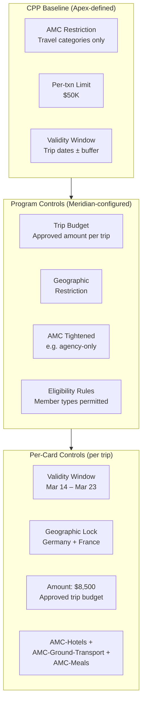
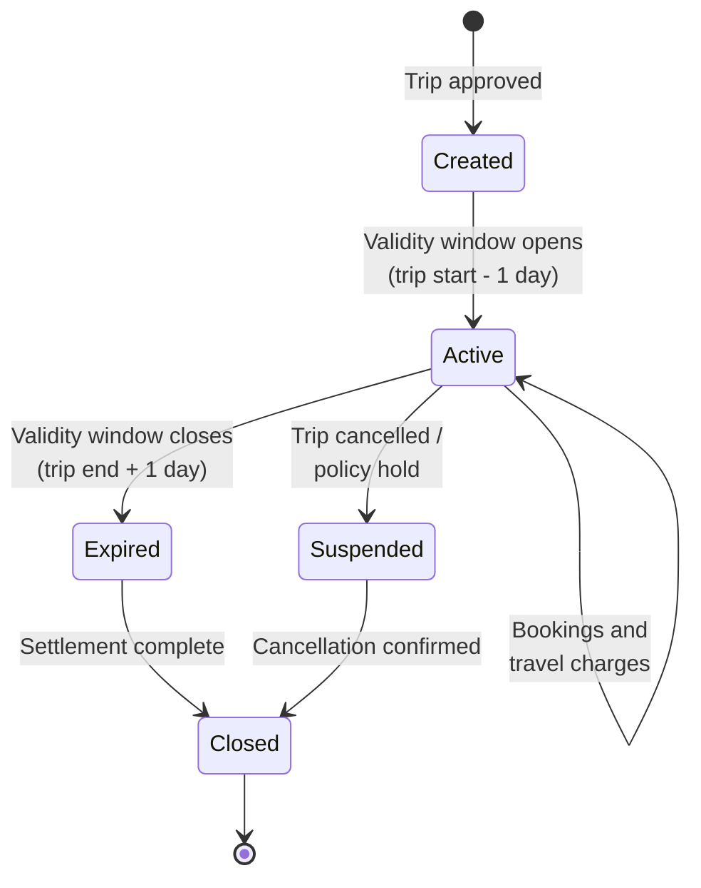

# Chapter 24: Designing the Travel & Booking Payments Product

The Travel & Booking Payments archetype centralizes payment for corporate travel — flights, hotels, ground transport, meals during travel, and agency bookings. The corporate separates the traveler's experience from the settlement mechanics. The traveler books. The card pays. Finance reconciles against the itinerary. No traveler handles reimbursements or uses a personal card for company travel.

This archetype straddles two operational models. In one, a travel management company (TMC) or online travel agency (OTA) books centrally and charges a lodge-style persistent card. In the other, individual travelers receive trip-specific virtual cards for direct bookings. Both models coexist within the same CPP — the difference is in the card lifecycle and enrollment model, not in the product architecture.

---

## The Archetype's Operational Pattern

Travel payments are event-driven. A trip is approved. A card is created — scoped to that trip's dates, destinations, and budget. The traveler or agency books against the card. The card expires when the trip ends. Reconciliation matches each transaction against the itinerary.

Key characteristics:

- **Trip-scoped cards** — cards exist for the duration of a trip or a specific booking. Validity windows align with travel dates.
- **Mixed card lifecycle** — single-use cards for individual bookings; persistent lodge cards for agency relationships
- **Broad eligibility** — travelers may be Employees, Contractors, or Clients (non-employees traveling for corporate business)
- **Geographic controls** — cards can be restricted to destination countries, preventing use outside the trip's geography
- **Travel-specific AMCs** — AMC-Travel-Agencies, AMC-Airlines, AMC-Hotels, AMC-Ground-Transport, AMC-Meals
- **High per-booking limits** — group travel bookings can reach $50,000+ for conference blocks or team travel
- **Itinerary-based reconciliation** — transactions matched against booking references and traveler identity in L2 data

---

## Design Decision Summary

| Dimension | Design Choice |
|-----------|---------------|
| **Baseline Spend Policy** | AMC restricted to travel-relevant categories: AMC-Travel-Agencies, AMC-Airlines, AMC-Hotels, AMC-Ground-Transport, AMC-Meals. Per-transaction limit: $50,000 (accommodates group travel bookings). Time-based validity: card active only during the travel window. |
| **Card Profile template** | Trip-specific virtual cards (single-use per booking or trip-duration card). Tags: trip ID, traveler name, cost center, project code. Cardholder Profile: traveler identity — may be Employee, Contractor, or Client member type. |
| **Fees** | Per-booking fee or per-card issuance fee. No monthly fee (cards are trip-scoped and ephemeral). TMC integration fee for agency-connected programs. Travel data/reconciliation fee for enhanced itinerary matching. |
| **Settlement** | May align with travel agency billing cycles. Master invoice for agency bookings. Standard 30-day cycle for direct-booking programs. Lodge-style persistent accounts for agency relationships. |
| **Control capabilities** | Trip-date validity windows. Geographic restrictions (card valid only in destination countries). Booking-amount match. Travel-AMC filters. |
| **Data/reporting** | L2 data with itinerary reference, booking ID, traveler name. Reconciliation against travel management system. Per-trip cost analysis. |

---

## Baseline Spend Policy

The Travel Payments CPP restricts transactions to travel-relevant merchant categories and introduces time-based and geographic controls that are unique to this archetype.

**AMC restrictions.** The baseline permits only travel-related categories:

| AMC | Scope |
|-----|-------|
| AMC-Travel-Agencies | TMCs, OTAs, corporate travel booking platforms |
| AMC-Airlines | Commercial airlines, charter services |
| AMC-Hotels | Hotels, serviced apartments, corporate housing |
| AMC-Ground-Transport | Taxis, ride-share, car rental, rail |
| AMC-Meals | Restaurants, catering (during travel) |

Corporate programs can tighten further. A program for agency-only bookings might restrict to AMC-Travel-Agencies alone. A program for individual traveler bookings might include all five categories.

**Per-transaction limits.** Set at $50,000 to accommodate group travel scenarios — a conference hotel block for 30 attendees, a team flight booking, a multi-leg international itinerary. Individual traveler programs typically tighten this to $5,000–$10,000 at the program level.

**Time-based validity.** Cards carry a validity window aligned with travel dates. A card for a trip from March 15 to March 22 activates on March 14 (to allow for pre-trip charges like airport parking) and expires on March 23 (to allow for post-trip charges like hotel checkout). Outside this window, the card declines all transactions.

**Geographic restrictions.** Cards can be restricted to specific countries or regions matching the trip destination. A card for travel to Germany and France is valid at merchants in those countries but declines a transaction attempted in Brazil. Geographic controls are optional at the product level — available for corporate programs to configure per trip.

---

## Card Profile Template

Travel payments use two card patterns, both supported within the same CPP:

### Trip-Specific Cards (Single-Use or Trip-Duration)

A trip-specific card is created for each approved trip. It lives for the duration of the trip and expires afterward.

| Field | Value |
|-------|-------|
| Name on card | Traveler's name |
| Cardholder email | Traveler's email (for OTP, notifications, booking confirmations) |
| Cardholder phone | Traveler's mobile (for SMS OTP, push notifications) |
| CorporateMemberType | Employee, Contractor, or Client |
| CorporateMemberID | Corporate identifier for the traveler |

**Tags on trip-specific cards:**

| Tag | Requirement | Purpose |
|-----|------------|---------|
| Trip ID | Mandatory | Links card to the approved trip in the travel management system |
| Traveler Name | Mandatory | Identifies the traveler for reconciliation and audit |
| Cost Center | Mandatory | Budget attribution for the trip |
| Project Code | Optional | Project-level cost tracking (e.g., client implementation travel) |
| Destination | Optional | Travel destination for geographic control reference |

### Lodge Cards (Persistent, Agency-Linked)

A lodge card is a persistent virtual card assigned to a travel agency or TMC. The agency charges the card for all bookings made on behalf of the corporate. The card persists across many trips and many travelers.

Lodge cards do not carry a traveler's Cardholder Profile — they are centrally managed. The Program Admin or travel desk manager is the cardholder of record. Individual traveler identity and trip details are carried in L2 data provided by the agency at transaction time.

**Tags on lodge cards:**

| Tag | Requirement | Purpose |
|-----|------------|---------|
| Agency ID | Mandatory | Identifies the travel agency |
| Booking Channel | Mandatory | Online, phone, or direct — the channel through which bookings are made |
| Contract Reference | Optional | TMC contract identifier for commercial terms tracking |

---

## Eligibility

Travel programs extend eligibility beyond employees. Contractors traveling to client sites, clients visiting corporate offices, and candidates interviewing in person may all need travel paid by the corporate.

The eligibility model uses Member Types:

| Member Type | Travel Scenario |
|-------------|----------------|
| Employee | Standard business travel — sales visits, conferences, internal meetings |
| Contractor | Travel to client sites, project-based travel |
| Client | Client visits to corporate facilities, joint project travel |

The corporate defines eligibility rules per program. An "Employee Travel" program might restrict enrollment to Employees only. A "Project Travel" program might include Employees, Contractors, and Clients traveling for a specific project.

Each enrollment produces a card. A Contractor traveling for two separate projects might receive two trip-specific cards — one per project — each tagged with the relevant project code and cost center.

---

## Fee Structure

| Fee | Description |
|-----|-------------|
| Per-booking fee | Charged per virtual card issuance for trip-specific cards. Covers card creation, validity-window management, and auto-expiry. |
| Per-card issuance fee | Alternative to per-booking: a flat fee per card issued, regardless of the number of transactions. |
| TMC integration fee | Platform fee for API integration between the TMC/OTA and Electron. Covers booking-triggered card issuance, itinerary data ingestion. |
| Travel data/reconciliation fee | Fee for matching transaction data against itinerary records. Covers L2 data processing and exception flagging. |

No monthly card fee for trip-specific cards — they are ephemeral. Lodge cards may carry a minimal maintenance fee for ongoing card management.

---

## Settlement Mechanics

Settlement for travel payments has two modes, corresponding to the two card patterns:

**Trip-specific cards: standard billing.** Transactions post to the program account. The corporate receives a 30-day billing cycle statement with per-trip detail. Settlement follows the standard process — the corporate pays the statement via the configured Settlement Account.

**Lodge cards: agency-aligned billing.** The billing cycle may be aligned with the TMC's invoicing schedule. If the agency invoices weekly, the statement cycle can match. The master invoice for agency bookings aggregates all charges by booking reference, traveler, and itinerary.

In both modes, billing is ESP-performed and account-level. The Legal Entity is the payer.

---

## Control Model

The control architecture for travel payments layers trip-level governance on top of the standard cascading restriction model.

**Trip-date validity windows.** Each trip-specific card carries a validity window. The card activates one day before the trip start date (to accommodate pre-trip charges) and expires one day after the trip end date (to accommodate post-trip charges like hotel checkout). Outside this window, all authorizations are declined.

**Geographic restrictions.** Configured per card based on the trip itinerary. A card for travel to Singapore and Japan accepts transactions from merchants in those countries. A charge attempted at a merchant in Australia is declined. This control reduces fraud exposure and enforces policy compliance for international travel.

**Booking-amount match.** The card amount is set to the approved trip budget. If the total charges exceed the approved amount, the excess authorization is declined. The travel manager can increase the card limit if the trip scope changes — within the program-level ceiling.

---

## Card Lifecycle

### Trip-Specific Card

A trip-specific card is created when the travel request is approved. It activates at the start of the validity window and accepts transactions throughout the trip. When the validity window closes, no further authorizations are processed. After settlement of all pending transactions, the card closes permanently.

If a trip is cancelled, the card is suspended immediately. Pending authorizations are reversed where possible. The card transitions to Closed after cancellation is confirmed.

### Lodge Card

Lodge cards follow a different lifecycle — they are persistent. A lodge card for a TMC is created when the agency relationship is established and remains active until the relationship ends or the program is wound down. The card does not expire on a per-trip basis. Instead, its controls are managed through AMC restrictions, amount limits, and agency-level spending caps.

---

## Data and Reporting

Travel transactions carry itinerary context that other archetypes do not:

**L2 data from travel merchants.** Airlines, hotels, and agencies provide enhanced data including:

| Field | Source |
|-------|--------|
| Booking reference / PNR | Airline, agency |
| Itinerary segments | Agency, OTA |
| Traveler name | Agency booking record |
| Check-in / check-out dates | Hotel |
| Flight segments | Airline |

**Card tags.** Trip ID, traveler name, cost center, and project code are set at card creation and persist in every transaction record.

**Reconciliation against travel management system.** The primary reconciliation flow matches card transactions (via trip ID and booking reference in L2 data) against the approved trip record in the corporate's travel management system. When the trip ID on the card matches the booking reference in L2 data, reconciliation is automatic. Exceptions are flagged for manual review — a charge from an unlisted hotel, a ground transport charge without a matching itinerary segment.

**Per-trip cost analysis.** Each trip produces a complete cost profile: flights, hotels, ground transport, meals — all tagged to the same trip ID. The corporate can analyze travel costs by traveler, destination, project, and department.

---

## Account Variant Choices

| Program | Configuration |
|---------|---------------|
| Fee Programs | Per-card issuance fee for trip-specific cards; minimal maintenance fee for lodge cards |
| Interest Programs | Standard terms — matching agency settlement cycles where applicable |
| Statement Program | Billing cycle aligned with agency settlement terms for lodge programs; standard 30-day for direct-booking programs. Per-trip detail on statements. |
| Reward Programs | Optional — some corporates earn rewards on travel spend; others decline rewards in favor of lower interchange rates with agency agreements |
| Rebate Programs | Volume-based rebate on aggregate travel spend |
| Notification Program | Travel alerts — card activation (trip start), expiry reminder (2 days before trip end), budget threshold warnings. Billing and delinquency alerts to Program Admin. |

---

## Virtual Card Variant Choices

| Program | Configuration |
|---------|---------------|
| Embossing Program | Apex Pay branding. Traveler name on trip-specific cards. Agency name on lodge cards. |
| Spend Program | Trip-duration validity windows. Per-transaction limit $50K (group bookings). Geographic controls available per card. AMC restricted to travel categories. Single-use option for per-booking cards; multi-use for trip-duration and lodge cards. |
| Authentication Program | ACS enabled for online booking platforms. OTP delivered to traveler's registered contact for trip-specific cards; to travel desk for lodge cards. |
| Tokenisation Program | Enabled for trip-duration cards — supports mobile wallet provisioning for tap-to-pay during travel (transit, meals, transport). Not applicable for lodge cards. |
| 3DS Program | Enrolled for online booking platforms. Frictionless flow for trusted agency portals. |
| Card Fee Programs | Per-issuance fee for trip cards. No monthly fee. Lodge card maintenance fee. |
| Notification Program | Transaction alerts to traveler (trip-specific) or travel desk (lodge). Decline alerts with reason code. Expiry reminders. |

**Network selection.** The choice depends on network acceptance in the corporate's primary travel destinations and any travel-specific partnership programs offered by the network. The bank's Virtual Card Product supports multi-network issuance; the network is selected per card at creation time.

---

## Apex Travel Pay — Meridian Configuration

Meridian's travel operations span three scenarios: managed agency travel, individual direct bookings, and project-based travel for non-employees.

| Layer | Entity | Configuration |
|-------|--------|---------------|
| CPP | Apex Travel Pay | AMC: Travel-Agencies, Airlines, Hotels, Ground-Transport, Meals. Per-txn $50K. Trip-scoped validity. Geographic controls available. |
| Program (Agency) | Meridian Agency Travel | Lodge card to GlobalTravel TMC. Agency-level billing aligned with TMC's weekly invoice cycle. AMC: AMC-Travel-Agencies only. No geographic restriction (agency books globally). |
| Program (Direct) | Meridian Direct Booking | Trip-specific cards for employees booking directly. Budget per trip: $10K default, $25K with VP approval. AMC: all five travel categories. Geographic restriction per trip. |
| Program (Project) | Meridian Project Travel | Trip-specific cards for Employees, Contractors, and Clients. Tags: project code mandatory, client reference mandatory. Budget per trip: approved by project manager. |
| Card (Trip) | Per trip | Tags: trip ID, traveler name, cost center, project code, destination. Validity: trip dates ± 1 day. Amount: approved trip budget. |
| Card (Lodge) | Per agency | Tags: agency ID, booking channel, contract reference. Persistent. Monthly spend cap: $200K. |

**Agency program.** Meridian's primary TMC — GlobalTravel — receives a lodge card. All agency-booked travel charges the lodge card. Billing aligns with GlobalTravel's weekly invoicing cycle. Reconciliation uses the booking reference (PNR) in L2 data matched against the trip approval in Meridian's travel management system.

**Direct booking program.** Meridian employees booking travel directly (without the agency) receive trip-specific cards. Each card carries a validity window matching the trip dates, a geographic restriction matching the destination, and an amount matching the approved trip budget. The default budget ceiling is $10,000; trips exceeding this require VP-level approval before the card is issued.

**Project travel program.** Meridian's client implementation teams travel frequently with Contractors and client personnel. The Project Travel program extends eligibility to Contractors and Clients. Each card carries the project code and client reference as mandatory tags — enabling cost attribution to the specific project and client engagement.
