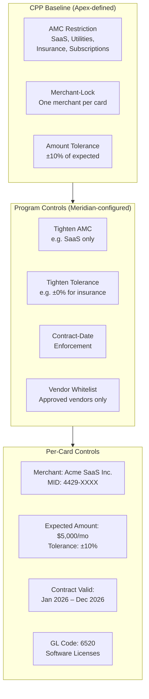
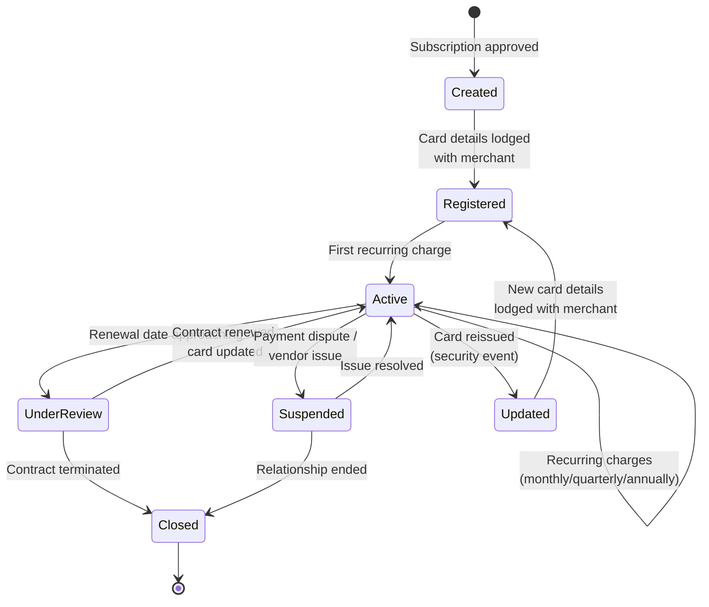

# Chapter 25: Designing the Central Recurring Merchant Payments Product

The Central Recurring Merchant Payments archetype governs persistent, centrally managed payments to known merchants — SaaS subscriptions, utility bills, insurance premiums, recurring professional services, and any vendor relationship where the corporate pays on a predictable schedule. Finance or treasury owns these payments. No individual employee manages them. The card is lodged with the merchant and charged on a recurring basis.

This archetype is the most mechanically distinct of the four. Supplier Payments (covered in *Designing the Supplier Payments Product*) creates ephemeral single-use cards for discrete obligations. Employee Spend (covered in *Designing the Employee & Department Spend Product*) distributes multi-use cards to individuals. Travel Payments (covered in *Designing the Travel & Booking Payments Product*) creates trip-scoped cards with validity windows. Central Recurring creates persistent cards — each locked to a single merchant, charged repeatedly, and managed as a portfolio of ongoing vendor obligations.

---

## The Archetype's Operational Pattern

Central recurring payments follow a treasury-managed, subscription-oriented workflow. The corporate's finance or IT procurement team identifies a recurring vendor obligation — a SaaS subscription, a utility account, an insurance policy. A persistent virtual card is created and registered with that merchant. The merchant charges the card on a recurring basis — monthly, quarterly, or annually. The card remains active for the life of the vendor contract.

Key characteristics:

- **One card per merchant-subscription pair** — each card is dedicated to a single vendor and a single subscription or contract
- **Merchant-lock** — the card is valid only at the specific merchant it is registered with; charges from any other merchant are declined
- **Persistent lifecycle** — cards live for months or years, matching the vendor contract duration
- **No individual cardholder** — these are central treasury operations; no named employee carries the card
- **Recurring amount tolerance** — subscription prices change (annual price increases, tier upgrades); the card allows a configurable variance (e.g., ±10%) from the expected recurring amount
- **Contract-aligned management** — card renewal dates, amount adjustments, and closures align with vendor contract milestones

---

## Design Decision Summary

| Dimension | Design Choice |
|-----------|---------------|
| **Baseline Spend Policy** | AMC restricted to recurring service categories: AMC-SaaS, AMC-Utilities, AMC-Insurance, AMC-Subscriptions. Exact-merchant lock (card valid only at the registered merchant). Recurring amount tolerance: ±10% of the expected charge. No per-transaction velocity limits (frequency governed by the merchant's billing cycle). |
| **Card Profile template** | Persistent virtual cards (lodge/ghost cards), one per merchant-subscription pair. Tags mandatory: vendor name, contract ID, GL code, renewal date. No Cardholder Profile (central treasury operation — Program Admin is cardholder of record). |
| **Fees** | Minimal per-card fee (long-lived cards with predictable usage). Per-billing-cycle transaction fee. No issuance fee for initial card creation. Card maintenance fee for ongoing management. |
| **Settlement** | Aligned with corporate AP cycles. 30-day billing. Consolidated billing for all recurring subscriptions in the program. Per-vendor detail on statements. |
| **Control capabilities** | Merchant-lock (card works only at one merchant). Recurring amount validation (expected amount ± tolerance). Auto-renewal management. Subscription lifecycle tracking. Whitelist/blacklist merchant controls at program level. |
| **Data/reporting** | L1 + L2 with contract reference. Subscription ID and invoice period in L2 data. Reconciliation against vendor contract management system. |

---

## Baseline Spend Policy

The Spend Policy for Central Recurring Payments introduces two controls not present in other archetypes: merchant-lock and recurring amount tolerance.

**AMC restrictions.** The baseline permits only recurring service categories:

| AMC | Scope |
|-----|-------|
| AMC-SaaS | Software-as-a-service subscriptions — productivity tools, development platforms, analytics services |
| AMC-Utilities | Power, water, telecommunications, internet services |
| AMC-Insurance | Business insurance premiums — liability, property, cyber, professional indemnity |
| AMC-Subscriptions | General recurring services — data subscriptions, market data feeds, professional memberships |

Corporate programs can tighten further. An IT-focused program might restrict to AMC-SaaS only. A facilities management program might include AMC-Utilities and AMC-Insurance.

**Merchant-lock.** Each card is locked to a single merchant at registration time. The merchant is identified by merchant ID (MID), terminal ID (TID), or a pattern-based rule. A card registered with a SaaS vendor accepts charges only from that vendor's payment terminal. Charges from any other merchant — even within the same AMC — are declined.

Merchant-lock is the defining control of this archetype. It transforms a general-purpose payment instrument into a dedicated channel for a specific vendor relationship.

**Recurring amount tolerance.** Subscription prices change. An annual SaaS renewal might increase by 5%. A utility bill fluctuates month to month. The baseline policy allows a configurable tolerance — ±10% of the expected recurring amount. If the expected monthly charge is $5,000, charges between $4,500 and $5,500 are authorized. A charge of $6,000 is declined, flagged as an exception, and routed to the treasury team for review.

Corporate programs can tighten the tolerance. A program managing insurance premiums — where amounts are contractually fixed — might set tolerance to ±0% (exact match only). A program managing utility payments — where amounts vary seasonally — might set tolerance to ±20%.

**No velocity limits.** Per-transaction velocity limits are not meaningful for recurring payments. The merchant charges on its billing cycle — typically once per month. The card does not need daily or weekly limits. Life-to-date limits can be set at the card level based on the total contract value.

---

## Card Profile Template

**Persistent virtual cards.** Each card is created for a specific merchant-subscription pair and remains active for the contract duration. These are lodge or ghost cards — they are registered with the merchant's payment system and charged automatically. The card number does not change for the life of the subscription (unless a security event forces reissuance).

**No Cardholder Profile.** Central recurring payments are treasury operations. No named employee uses the card for personal purchases. The Program Admin — typically a treasury analyst or AP manager — is the cardholder of record. If the merchant's payment gateway requires cardholder information for authentication, the Program Admin's details are used.

**Tags.** The card's tag structure carries vendor and contract context:

| Tag | Requirement | Purpose |
|-----|------------|---------|
| Vendor Name | Mandatory | Human-readable vendor identification |
| Contract ID | Mandatory | Links card to the vendor contract in the corporate's contract management system |
| GL Code | Mandatory | General ledger account for posting — ensures each subscription maps to the correct expense account |
| Renewal Date | Mandatory | Contract renewal date — triggers review and potential card update |
| Subscription ID | Optional | Vendor's subscription identifier for reconciliation |
| Cost Center | Optional | Organizational cost attribution (when the subscription is tied to a specific department) |

Tag data can be referenced in Payment Usage Policy rules. For example, a rule can enforce that the card declines all charges after the renewal date unless the contract has been confirmed as renewed.

---

## Fee Structure

The commercial model for recurring payments is low-friction, predictable, and maintenance-oriented. Cards are long-lived. Transaction frequency is low (typically once per billing cycle). The fee structure reflects this:

| Fee | Description |
|-----|-------------|
| Card maintenance fee | Annual or monthly fee per active card. Covers ongoing card management, merchant-lock enforcement, renewal tracking. |
| Per-billing-cycle transaction fee | Fee per recurring charge processed. Low fee reflecting the predictability and low risk of recurring merchant-locked transactions. |
| Platform fee | Monthly or annual fee for the corporate's access to subscription management tools — card portfolio dashboard, renewal calendar, vendor analytics. |

No issuance fee for card creation. The value is in the ongoing relationship, not in the initial setup. No annual card fee beyond the maintenance fee — the card and its maintenance fee are the same concern.

---

## Settlement Mechanics

**Aligned with corporate AP cycles.** Recurring payments are managed alongside other AP obligations. The billing cycle is 30 days, matching the corporate's standard AP cadence. This keeps settlement predictable and integrates with the corporate's existing payment workflows.

**Consolidated billing.** All recurring subscription cards in a program are billed together. The corporate receives a single statement for the program — each line item represents one vendor, one subscription, one charge for the period.

**Per-vendor detail.** The statement includes vendor-level detail:

| Statement Field | Source |
|-----------------|--------|
| Vendor name | Card tag |
| Contract ID | Card tag |
| GL code | Card tag |
| Charge amount | Transaction posting |
| Expected amount | Card configuration |
| Variance | Computed (charge vs. expected) |
| Invoice period | L2 data from merchant |

This structure enables the corporate's finance team to verify each subscription charge against the vendor contract without manual lookup — the contract ID tag links the charge to the contract record, and the variance column highlights any deviations from the expected amount.

---

## Control Model

The control architecture for recurring payments is built around merchant-lock and amount validation — two controls that are unique to this archetype.

**Merchant-lock enforcement.** Every authorization is checked against the card's registered merchant. If the merchant ID on the authorization request does not match the card's locked merchant, the transaction is declined. This prevents the card from being used anywhere other than the intended vendor — even if the card number is compromised.

**Recurring amount validation.** Each card carries an expected recurring amount. The authorization is checked against this expected amount with the configured tolerance. Charges within tolerance are authorized. Charges outside tolerance are declined and flagged for treasury review.

**Contract-date enforcement.** Cards can carry a contract validity window. After the contract end date (renewal date), the card declines new charges unless the contract has been renewed and the card updated. This prevents unauthorized charges from auto-renewing subscriptions that the corporate has decided to terminate.

**Vendor whitelist.** At the program level, the corporate can maintain a whitelist of approved vendors. New cards can only be created for vendors on the whitelist. This prevents ad-hoc subscription sign-ups from bypassing the vendor approval process.

---

## Card Lifecycle

The recurring card lifecycle is the longest of any archetype. A card may exist for years — the duration of the vendor contract. The lifecycle includes states unique to this archetype:

**Registered.** After creation, the card details are provided to the merchant and registered with their payment system. This is a setup step — the merchant stores the card number for recurring billing. Until the first charge posts, the card is in Registered state.

**Under Review.** As the contract renewal date approaches (configurable — e.g., 30 days before renewal), the card transitions to Under Review. This triggers a notification to the treasury team and the Program Admin. The team reviews the vendor contract and decides whether to renew. If renewed, the card is updated with the new contract terms (updated expected amount, new renewal date) and returns to Active. If not renewed, the card is closed.

**Updated.** If a security event requires card reissuance (card number compromised, routine security rotation), a new card is issued and the old one is closed. The new card must be re-registered with the merchant. This is the primary operational burden of the recurring archetype — updating card details with vendors after reissuance.

---

## Data and Reporting

Recurring payments generate predictable, contract-aligned data:

**L1 data.** Standard on every transaction: amount, MCC, date/time, merchant name, currency.

**L2 data.** Enhanced data from recurring merchants typically includes:

| Field | Source |
|-------|--------|
| Subscription ID | Merchant billing system |
| Invoice period | Merchant (e.g., "March 2026") |
| Customer reference | Merchant (corporate's account number with the vendor) |

**Card tags.** Vendor name, contract ID, GL code, and renewal date are set at card creation and persist across all transactions.

**Reconciliation against vendor contract management system.** The primary reconciliation flow matches card transactions (via contract ID tag and subscription ID in L2 data) against the vendor contract record. The expected fields are:

1. **Contract ID** (card tag) matches the vendor contract
2. **Amount** matches the contracted price (within tolerance)
3. **Invoice period** (L2) matches the expected billing cycle
4. **GL code** (card tag) ensures correct ledger posting

When all four align, reconciliation is automatic. Exceptions — amount outside tolerance, unexpected invoice period, missing L2 data — are flagged for treasury review.

**Subscription portfolio analytics.** The program-level view provides a portfolio of all active subscriptions: vendor, annual cost, renewal date, GL code, and utilization. This enables the corporate to identify:

- Subscriptions approaching renewal (proactive contract renegotiation)
- Duplicate subscriptions (two departments paying for the same SaaS tool)
- Underutilized subscriptions (vendor charges continue but usage has dropped)
- Total subscription spend by category (SaaS vs. utilities vs. insurance)

---

## Account Variant Choices

| Program | Configuration |
|---------|---------------|
| Fee Programs | Card maintenance fee (annual, per card); per-billing-cycle transaction fee; no issuance fee |
| Interest Programs | Standard terms — interest accrues after grace period on unpaid balances |
| Statement Program | 30-day cycle; per-vendor detail; variance column (charge vs. expected); GL code on each line; CSV + PDF delivery |
| Reward Programs | Not enabled — recurring merchant-locked payments do not benefit from rewards programs. The commercial value is in cost control and operational efficiency, not in earn rates. |
| Rebate Programs | Not enabled at the product level — relationship-level rebates (configured on the Client Contract) apply if aggregate corporate spend qualifies |
| Notification Program | Renewal date alerts (30 days before renewal). Billing alerts. Amount variance warnings (charge outside tolerance). Statement availability. Delinquency warnings. |

---

## Virtual Card Variant Choices

| Program | Configuration |
|---------|---------------|
| Embossing Program | Apex Pay branding. No cardholder name (central treasury operation). Corporate name on card. |
| Spend Program | Persistent multi-use. Merchant-lock enforcement. Recurring amount tolerance ±10% (configurable). No velocity limits. Life-to-date limit set per card based on contract value. |
| Authentication Program | ACS disabled by default — recurring charges are merchant-initiated and do not typically require cardholder authentication. Enabled when the merchant's billing system requires initial registration authentication. |
| Tokenisation Program | Enabled — supports token-based recurring billing where the merchant's payment gateway supports network tokenisation. Token lifecycle managed per card. When a card is reissued, the token is updated automatically if the merchant supports network token updates, reducing the operational burden of re-registration. |
| 3DS Program | Not enrolled — recurring merchant-initiated charges bypass 3DS. Initial registration may use 3DS if the merchant requires it. |
| Card Fee Programs | Card maintenance fee (annual). Per-billing-cycle transaction fee. No issuance or monthly card fee. |
| Notification Program | Transaction alert to Program Admin for each recurring charge. Amount variance alert when charge exceeds tolerance. Decline notification with reason code. Renewal date reminder. |

**Network selection.** The network is selected based on recurring payment support. Visa's Account Updater service and Mastercard's Automatic Billing Updater both support automatic card-on-file updates when a card is reissued — reducing the operational burden of re-registering cards with merchants. The network with better updater coverage for the corporate's vendor portfolio is preferred.

**Tokenisation and card-on-file updates.** Network tokenisation is a significant operational consideration for this archetype. When a card is reissued (security rotation, compromise), the new card number must be registered with every merchant that has the old number on file. Network tokenisation — where the merchant stores a token rather than the card number — can automate this update. Apex enables tokenisation on the Virtual Card Variant to reduce the operational friction of card reissuance across a portfolio of recurring vendors.

---

## Apex Subscription Manager — Meridian Configuration

Meridian's central recurring payment operations cover SaaS subscriptions for engineering tools, utility payments for facilities, and insurance premiums. Each category has different control requirements.

| Layer | Entity | Configuration |
|-------|--------|---------------|
| CPP | Apex Subscription Manager | AMC: SaaS, Utilities, Insurance, Subscriptions. Merchant-lock. Amount tolerance ±10%. Persistent cards. No velocity limits. |
| Program (SaaS) | Meridian SaaS Subscriptions | AMC tightened: AMC-SaaS only. Vendor whitelist: 45 approved SaaS vendors. Tolerance: ±10% (subscription price changes expected). Budget from IT OU. GL codes: 6520 (software licenses). |
| Program (Utilities) | Meridian Facilities Payments | AMC tightened: AMC-Utilities only. Tolerance: ±20% (utility bills vary seasonally). Budget from Operations OU. GL codes: 6300 (utilities). |
| Program (Insurance) | Meridian Insurance Premiums | AMC tightened: AMC-Insurance only. Tolerance: ±0% (premiums are contractually fixed). Budget from Finance OU. GL codes: 6400 (insurance). |
| Card | Per vendor-subscription | Tags: vendor name, contract ID, GL code, renewal date. Merchant-lock to specific MID. Expected amount set per card. |

**SaaS program.** Meridian's IT organization manages 45 SaaS subscriptions — development tools, CI/CD platforms, monitoring services, collaboration suites. Each subscription gets a dedicated card locked to the vendor's MID. The ±10% tolerance accommodates annual price increases and tier changes. The vendor whitelist prevents teams from signing up for unapproved SaaS tools on the corporate card.

When a subscription approaches its renewal date, Electron generates a notification to the IT procurement team and the Program Admin. The team reviews the subscription's utilization, renegotiates terms if needed, and either renews the card (updating the expected amount and renewal date) or closes it.

**Utilities program.** Meridian's facilities team manages utility payments for 12 office locations across the US, UK, and India. Utility amounts vary seasonally — summer electricity costs in Texas differ from winter costs in London. The ±20% tolerance accommodates this variance. Charges that exceed the tolerance (e.g., an unusually high water bill) are declined and flagged for facilities management review.

**Insurance program.** Insurance premiums are contractually fixed for the policy period. The ±0% tolerance enforces exact-amount matching — the card accepts only the contracted premium amount. Any deviation triggers an automatic decline and an alert to the risk management team. This prevents billing errors from the insurer from going undetected.

---

## Cross-Archetype Comparison

The following table summarizes how the four Spend Archetypes differ across key product design dimensions, providing a reference for the choices made in *Designing the Supplier Payments Product*, *Designing the Employee & Department Spend Product*, *Designing the Travel & Booking Payments Product*, and this chapter.

| Dimension | Supplier Payments | Employee Spend | Travel Payments | Central Recurring |
|-----------|------------------|---------------|----------------|-------------------|
| Card lifecycle | Single-use | Persistent, multi-use | Trip-scoped | Persistent, merchant-locked |
| Cardholder | Program Admin | Employee | Traveler | Program Admin |
| Issuance trigger | Invoice / PO | Employee enrollment | Trip approval | Vendor contract |
| Primary control | PO-match, AMC-lock | Velocity limits, AMC exclusions | Validity window, geographic lock | Merchant-lock, amount tolerance |
| Transaction volume per card | 1 | Many | Few (per trip) | Regular (per billing cycle) |
| Reconciliation source | ERP AP ledger | Expense management | Travel management system | Contract management system |
| Rewards | Not applicable | Enabled | Optional | Not applicable |
| Settlement | Single account, consolidated | Per-employee accounts, master statement | Per-trip or per-agency | Single account, per-vendor detail |
