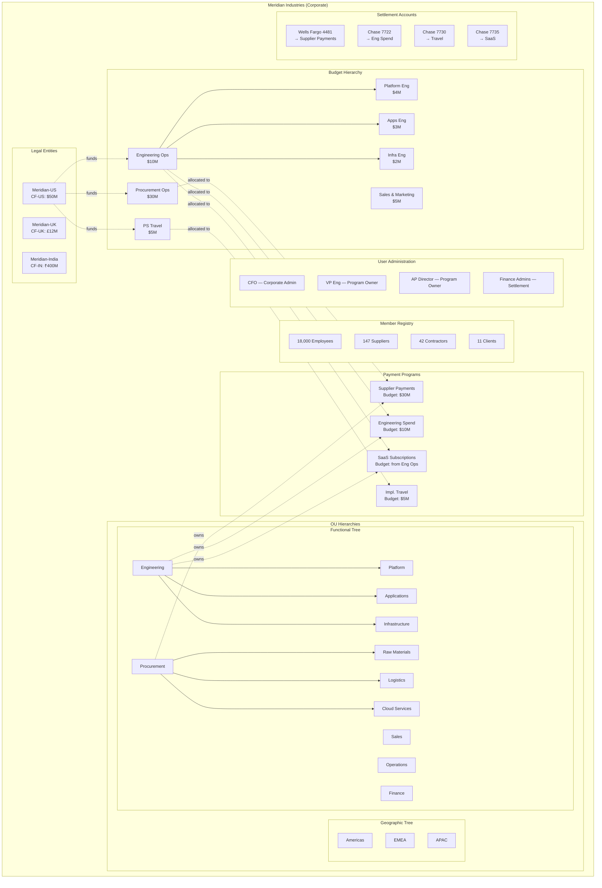

# Chapter 26: Corporate-Wide Concerns

Before a single card is issued or a single transaction authorized, the corporate must build the administrative foundation that spans every program it operates. Seven administration domains cut across all Spend Archetypes: organizational unit management, budget allocation, settlement account setup, member management, user administration, notification customization, and settlement operations. These are corporate-wide concerns — independent of whether the payment flows through the Supplier Payments archetype, the Employee & Department Spend archetype, or any other.

---

## Organizational Unit Hierarchy Management

**An Organizational Unit (OU) is a logical grouping within the corporate that organizes members, scopes budgets, and anchors program ownership.**

The corporate creates and maintains OU hierarchies. The ESP may assist or create OUs on the corporate's behalf, but ownership of the organizational structure rests with the corporate.

A corporate can maintain multiple independent OU trees simultaneously. Each tree serves a different organizational lens:

- **Functional tree**: Engineering, Sales, Operations, Finance, Procurement, Marketing
- **Geographic tree**: Americas, EMEA, APAC
- **Legal Entity tree**: one flat OU per Legal Entity (created by default)
- **Project tree**: project-based groupings that span functions and geographies

OUs can span multiple Legal Entities. A "Global Engineering" OU may contain employees affiliated with Meridian Industries Inc. (US), Meridian UK Ltd (United Kingdom), and Meridian India Pvt Ltd (India). The OU is an organizational grouping — it does not determine legal ownership, which is always anchored to Legal Entity through Credit Facility.

### Meridian's OU Structure

Meridian Industries maintains three OU trees under its Corporate entity:

| OU Tree | Top-Level OUs | Purpose |
|---------|---------------|---------|
| Functional | Engineering, Sales, Operations, Finance, Procurement | Department-based budgeting and program ownership |
| Geographic | Americas, EMEA, APAC | Regional reporting and travel program scoping |
| Legal Entity | Meridian-US, Meridian-UK, Meridian-India | Default; one OU per Legal Entity for regulatory alignment |

The Functional tree carries the most depth. Engineering contains sub-OUs for Platform, Applications, Infrastructure, and QA. Procurement contains sub-OUs for Raw Materials, Logistics, Cloud Services, and Professional Services. Each sub-OU can own programs and hold budget allocations.

### Restructuring Impact

When a corporate restructures — merging departments, splitting divisions, or creating new business units — the downstream impact follows specific rules:

- **Credit Facilities**: unchanged. Credit Facilities are tied to Legal Entities, not OUs. A restructuring does not move a Credit Facility across Legal Entities.
- **Budgets**: can change. Budget-OU associations can be reassigned. A Budget previously associated with "Engineering" can be reassigned to "Product & Engineering" after a merger.
- **Programs**: the owning OU can change. The Program's Credit Facility remains anchored to its Legal Entity.
- **Cards**: unaffected. Cards are associated with a Program, which in turn carries the OU association. Card-level controls, tags, and policies persist through restructuring.
- **Subsequent transactions**: governed by the new Budget and reported to the new OU as applicable.

---

## Budget Management

**A Budget is the corporate's purposeful allocation of a Credit Facility to a specific business need, owned by an OU and governed by the corporate's own policies.**

Budget management is the most consequential corporate-wide activity. Every program draws its financial capacity from a Budget. Every authorization checks Budget availability through the full ancestor hierarchy. Misallocation at the Budget level cascades into every downstream transaction.

### Hierarchical Budgets

Budgets are hierarchical. A top-level Budget can have sub-Budgets, and sub-Budgets can have their own sub-Budgets. This allows the corporate to model nested allocation structures that mirror its organizational and operational reality.

**Over-allocation is permitted.** The sum of sub-Budget allocations may exceed the parent Budget's total. This is intentional — it reflects the common corporate practice of optimistic allocation with the understanding that not all sub-Budgets will be fully consumed simultaneously. Enforcement happens at authorization time: all ancestors in the Budget hierarchy are consulted, and overuse of any ancestor is denied.

### Meridian's Budget Architecture

Meridian's CFO oversees credit capacity across three Credit Facilities — one per Legal Entity, each denominated in local currency:

| Credit Facility | Legal Entity | Currency | Total |
|----------------|--------------|----------|-------|
| CF-US-001 | Meridian Industries Inc. | USD | $50M |
| CF-UK-001 | Meridian UK Ltd | GBP | £12M |
| CF-IN-001 | Meridian India Pvt Ltd | INR | ₹400M |

From the US Credit Facility alone, Meridian carves the following top-level Budgets:

| Budget | Owning OU | Allocation | Programs Funded |
|--------|-----------|------------|-----------------|
| Procurement Operations | Procurement | $30M | Supplier Payments Program |
| Engineering Operations | Engineering | $10M | Employee Spend Program, SaaS Subscriptions Program |
| Professional Services Travel | Professional Services | $5M | Implementation Travel Program |
| Sales & Marketing | Sales | $5M | Sales Travel Program, Event Spend Program |

The Engineering Operations Budget is further divided:

- Platform Engineering: $4M
- Applications Engineering: $3M
- Infrastructure Engineering: $2M
- QA Engineering: $1M

Over-allocation is visible: the four sub-Budgets sum to $10M, matching the parent. If Infrastructure Engineering receives an increase to $2.5M without adjusting the parent, the sub-Budget total ($10.5M) exceeds the parent ($10M). This is valid — enforcement occurs at authorization time through hierarchy traversal.

### Cross-Program Budget Sharing

A Budget can be shared across Programs. Meridian's Engineering Operations Budget funds both the Employee Spend Program and the SaaS Subscriptions Program. Collectively, the two programs cannot exceed the Budget.

Budget sharing is constrained by OU association. Because Budgets are associated with OUs and Programs are owned by OUs, a Budget is visible only to Programs owned by the OU to which the Budget belongs. The Engineering Operations Budget, associated with the Engineering OU, is visible to programs owned by Engineering and its sub-OUs — but not to programs owned by Procurement or Sales.

---

## Settlement Account Management

**A Settlement Account is the bank account from which the corporate settles invoices received from the ESP for a given Program.**

The system enforces one Settlement Account per Settlement Profile per Program. This is a structural constraint, not an oversight. If a corporate needs different settlement accounts — by region, by Legal Entity, or by business unit — it creates separate Programs.

Meridian maintains four settlement accounts mapped to its active programs:

| Program | Settlement Account | Bank | Currency |
|---------|--------------------|------|----------|
| Meridian US Supplier Payments | Wells Fargo Acct 4481 | Wells Fargo | USD |
| Meridian Engineering Spend | Chase Operating Acct 7722 | JPMorgan Chase | USD |
| Meridian Implementation Travel | Chase Travel Acct 7730 | JPMorgan Chase | USD |
| Meridian SaaS Subscriptions | Chase IT Acct 7735 | JPMorgan Chase | USD |

The settlement account currency need not match the account base currency or the Credit Facility currency. Meridian UK Ltd could settle its GBP-denominated program from a USD operating account if its treasury policy dictates centralized settlement. This is a corporate-administered choice, not a bank enforcement.

As good practice, the corporate uses a bank account associated with the same Legal Entity to which the program's Credit Facility belongs. This alignment simplifies treasury operations and avoids inter-entity fund transfers, but the system does not enforce it.

---

## Member Management

**A Member is a first-class entity of a Corporate, affiliated with zero or more OUs, representing any party that participates in corporate payment programs.**

Members are the population from which programs draw their eligible participants. The member registry is the corporate's master list of individuals and entities that may interact with its payment programs.

### Member Types

Four default member types exist:

| Type | Description | Typical Programs |
|------|-------------|------------------|
| Employee | Staff of the corporate, affiliated by employment | Employee Spend, Travel |
| Supplier | External vendors providing goods or services | Supplier Payments |
| Contractor | External individuals providing professional services | Travel, Employee Spend |
| Client | Customers or client representatives traveling for joint initiatives | Travel |

The corporate can define custom attributes for each member type. An Employee member might carry attributes for employee ID, department code, cost center, and manager. A Supplier member might carry vendor code, payment terms reference, and ERP vendor ID. These custom attributes enable mapping between the corporate's payment programs and its enterprise systems (ERP, HRIS, procurement).

### Meridian's Member Registry

Meridian maintains approximately 18,200 members across its three Legal Entities:

| Member Type | Count | Primary OU Affiliations |
|-------------|-------|-------------------------|
| Employee | 18,000 | Functional OUs (Engineering, Sales, etc.) and Geographic OUs |
| Supplier | 147 | Procurement sub-OUs (Raw Materials, Logistics, Cloud Services) |
| Contractor | 42 | Professional Services, Engineering |
| Client | 11 | Professional Services (client representatives for implementation travel) |

### Member Lifecycle

The member lifecycle follows a progression independent of any specific program:

1. **Creation**: a member record is created in the corporate, with type, attributes, and initial OU affiliation(s). The corporate loads members using UI, file uploads, or API integrations with enterprise systems.
2. **OU affiliation**: the member is affiliated with one or more OUs. An employee may be affiliated with both the Engineering OU (functional) and the Americas OU (geographic). A supplier may be affiliated with the Logistics sub-OU under Procurement.
3. **Eligibility**: the member becomes eligible for enrollment into specific programs based on program-level eligibility rules. Eligibility is derived — it depends on the member's type, OU affiliations, and attributes matched against the program's eligibility criteria.
4. **Enrollment**: an eligible member is explicitly enrolled into a program by a Program Admin. Enrollment always results in a card. A member can have multiple enrollments in the same program — each enrollment produces a new card (enabling single-use card patterns within the same program).
5. **Affiliation changes**: the member's OU affiliations may change — transfer to a new department, assignment to a new project. The member's existing enrollments persist; subsequent transactions are governed by the updated OU context.
6. **Deactivation**: the member is deactivated when they leave the corporate or are no longer relevant. Active cards associated with the member's enrollments follow the program's deactivation policy.

---

## User Administration

**A User is a person entitled to create and operate Payment Programs in the Corporate, with authorization controls scoping their access to specific programs, products, budgets, and OUs.**

Users and Members are entities in different domains. The User entity is relevant for administration and operational use cases. The Member entity represents participants in programs. A single person can hold both roles — a department head who administers a program (User) and is enrolled as a spender in another program (Member). These are separate entity instances in separate domains.

### Role Scoping

User roles are scoped along four dimensions:

| Scope Dimension | Example |
|----------------|---------|
| OU | User can administer programs owned by the Engineering OU and its sub-OUs |
| Program | User can operate the Supplier Payments Program but not the Travel Program |
| Product | User can create programs using the Employee Spend Product only |
| Budget | User can allocate from the Engineering Operations Budget and its sub-Budgets |

Meridian's user administration includes the following key roles:

| User | Role | Scope |
|------|------|-------|
| CFO | Corporate Admin | All OUs, all Budgets, all Programs |
| VP Engineering | Program Owner | Engineering OU, Engineering Operations Budget |
| AP Director | Program Owner | Procurement OU, Procurement Operations Budget |
| Travel Desk Manager | Program Owner | Professional Services OU, PS Travel Budget |
| IT Director | Program Owner | IT OU (sub-OU of Engineering), IT Subscriptions sub-Budget |
| AP Clerk (×3) | Program Operator | Supplier Payments Program only |
| Finance Admin (×2) | Settlement Reviewer | All Programs — settlement review and approval |

---

## Notification Customization

**Notifications are alerts and communications delivered to users, members, and external contacts in response to program-level and card-level events.**

Notification configuration operates at multiple levels, each subject to the constraints set by the level above:

1. **ESP level** (in the ESP Account Variant and Virtual Card Variant): the ESP defines notification templates, channels, and delivery rules. These establish the outer boundary.
2. **Corporate level** (in the Program): the corporate customizes notifications within the ESP's boundaries — selecting which notifications reach which roles, adjusting template content where permitted, and configuring recipient lists for program-level events.
3. **Card level**: card-level notifications (transaction alerts, authorization declines, ACS challenges) are delivered based on the Cardholder Profile — email and phone number as configured at enrollment.

### Notification Categories

| Category | Examples | Typical Recipients |
|----------|----------|-------------------|
| Transaction alerts | Authorization approved, authorization declined, transaction posted | Cardholder (card-level) |
| Program events | Budget utilization threshold reached, enrollment completed, card deactivated | Program Admin (program-level) |
| Settlement events | Statement available, payment due, payment processed, payment failed | Finance Admin, Program Admin |
| Credit Facility events | Facility utilization warning, facility limit change, covenant notification | Legal Entity contacts, CFO |
| Security events | ACS OTP delivery, fraud alert, card compromise notification | Cardholder, Program Admin |

### Non-Suppressible Notifications

Bank-originated notifications — regulatory disclosures, fraud alerts, compliance communications — cannot be suppressed by the ESP or the corporate. The ESP can suggest templates for these notifications, but the bank retains final approval. All notification template changes undergo review by bank executives.

Meridian configures its notification stack as follows:

- **Transaction alerts**: delivered to cardholders via email for all transactions above $500; SMS for all declined transactions
- **Budget utilization**: delivered to Program Admins at 75% and 90% thresholds
- **Settlement**: delivered to Finance Admins upon statement availability and 5 days before payment due date
- **Declined transactions**: copied to Program Admin in addition to cardholder

---

## Settlement Operations

**Settlement is the process by which the corporate pays invoices received from the ESP for transactions posted to its programs.**

Settlement operates per Program, governed by the Settlement Profile configured during program setup. Each Settlement Profile specifies a single settlement account, auto-pay preferences, and payment timing.

### The Settlement Cycle

The settlement cycle follows a consistent pattern across all programs:

1. **Billing**: the ESP (Apex) generates account-level statements at the end of each billing cycle. For programs with multiple accounts (such as Employee Spend with one account per employee), a master statement consolidates individual account statements.
2. **Statement delivery**: statements are delivered to the corporate in the configured format — typically CSV data extracts alongside formatted statement documents.
3. **Review**: Finance Admins review the statement. For some programs, review is a formality (Supplier Payments with pre-matched POs). For others, review involves line-by-line examination (Employee Spend with flagged exceptions).
4. **Approval**: where configured, a Finance Admin or designated approver approves the statement for payment. Some programs are configured for auto-approval.
5. **Payment**: the settlement account is debited. Auto-pay programs sweep on the configured date. Manual-pay programs require explicit payment initiation.
6. **Confirmation**: the ESP confirms receipt of payment. The settlement cycle closes for that billing period.

### Settlement Across Meridian's Programs

| Program | Settlement Mode | Review Process | Settlement Timing |
|---------|----------------|----------------|-------------------|
| Supplier Payments | Auto-sweep | Automated reconciliation against PO matches; exceptions flagged | On due date |
| Engineering Spend | Manual approval | Finance Admin reviews consolidated statement; manager-flagged exceptions reviewed | Within 5 days of statement |
| Implementation Travel | Monthly settlement | Travel Desk Manager reviews against trip records; Finance Admin approves | Aligned with travel agency billing cycle |
| SaaS Subscriptions | Auto-sweep | IT Admin reviews variance notifications; Finance Admin spot-checks | Monthly on the 15th |

### Disputes and Refunds

Disputes are settled by the bank against the Account associated with the Program. Reversals and credits are attributed to the original postings, enabling unambiguous reconciliation and adjustment.

Refunds inherit the Booking Profile and Settlement Profile of the original transaction. Because the Settlement Profile is scoped to the account, unmatched refunds do not create settlement ambiguity. The Booking Profile may define a default allocation for unmatched credits — for example, routing orphaned refunds to a general suspense cost center until manually resolved.

---

## Corporate Administration Landscape

---

## Cross-References

- OU hierarchy and its relationship to Legal Entities: *Corporate, Legal Entity, and Organizational Units*
- Credit Facility and Budget as dual-perspective constructs: *Credit Facility and Budget*
- Member eligibility and enrollment mechanics: per-archetype chapters (*Operating the Supplier Payments Program*, *Operating the Employee & Department Spend Program*, *Operating the Travel & Booking Payments Program*, *Operating the Central Recurring Merchant Payments Program*)
- Spend Policy cascading restriction model (ESP → Program → Card): *Spend Policy and Controls*
- Booking Profile and Settlement Profile definitions: *Booking Profile, Settlement Profile, and Reconciliation*
- User vs. Member domain distinction: *Roles in a Corporate Payment Program*
