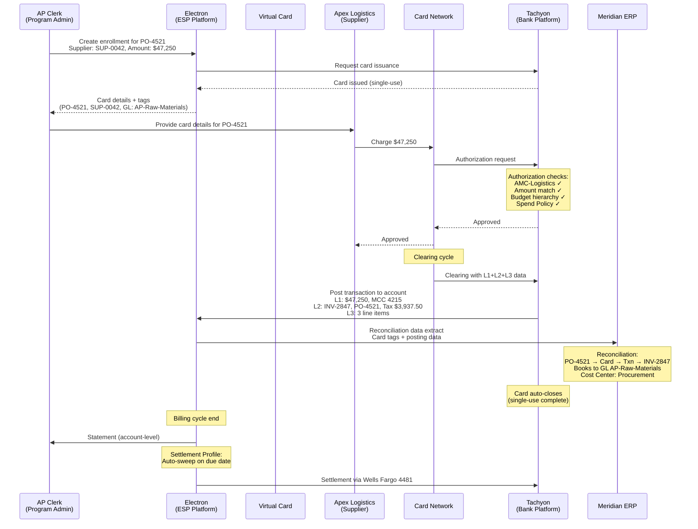

# Chapter 27: Operating the Supplier Payments Program

The Supplier Payments archetype governs the procure-to-pay workflow through virtual cards, matching each card to a specific purchase order or invoice for deterministic reconciliation.

---

## Reference: Supplier Payments Program Profile

| Dimension | Specification |
|-----------|---------------|
| **Control Archetype** | Tight, deterministic — every card matches a specific PO or invoice. Single-use card per invoice; multi-use card if PO-based. Single account per program. |
| **Eligibility Model** | Supplier-based — verified suppliers enrolled by the AP team. Eligibility defined by Payee (which suppliers are authorized to receive card payments). |
| **Cardholder** | Not applicable in the traditional sense. The Program Admin is the cardholder of record. Card Profile carries supplier-specific tags (supplier ID, PO reference, invoice reference) irrespective of what the Cardholder Profile contains. If ACS second-factor authentication is enabled for transactions, an authorized user from the supplier serves as cardholder to respond to challenges. |
| **Account Structure** | Single account per program. All cards issued under the program share one account, tied to one Credit Facility and one Budget. |
| **Reconciliation Pattern** | PO-match — card tags (PO number, supplier ID) matched against the ERP AP ledger. L2 data (invoice number, PO number, tax amount, customer code) and L3 line-item data (item descriptions, quantities, unit prices, commodity codes) provide the reconciliation bridge. |
| **Booking Profile** | Rule-based. Default GL code for AP raw spend; dynamic override by PO project tag, supplier category, or cost center mapped from card tags. Default allocation defined for unmatched credits (refunds routed to AP suspense). |
| **Settlement Profile** | Single settlement account. Typically auto-sweep on the invoice due date. Settlement currency matches the Credit Facility currency. |

---

## Program Journey

### Step 1: Program Creation

Meridian's AP Director creates the "Meridian US Supplier Payments Program" in the Electron portal. The program is created under the Procurement OU, which owns the program throughout its lifecycle.

### Step 2: Product and Credit Facility Binding

The AP Director selects Apex's Supplier Payments Product as the product for this program and binds it to Meridian's US Credit Facility (CF-US-001, $50M, denominated in USD, tied to Meridian Industries Inc.). The product selection determines the control archetype — tight, deterministic, single-use-per-invoice — and the applicable Spend Policy envelope defined by Apex at the product level.

### Step 3: Budget Allocation

The AP Director allocates a $30M Budget from the US Credit Facility, scoped to the Procurement OU. This Budget, "Procurement Operations," is visible to this program because the program's owning OU (Procurement) is the same OU to which the Budget is associated. The $30M allocation represents Meridian's planned annual supplier payment volume through virtual cards.

### Step 4: Spend Policy Configuration

The AP Director configures the program-level Spend Policy, further restricting Apex's product-level policy:

| Policy Dimension | Configuration |
|-----------------|---------------|
| Allowed AMCs | AMC-Logistics, AMC-Manufacturing, AMC-Cloud |
| Blocked AMCs | All others (implicit deny) |
| Per-transaction limit | $100,000 |
| Exact-amount matching | Enabled — authorization amount must match card-issued amount within tolerance |
| Geographic restrictions | None (suppliers may be domestic or international) |

This policy can only tighten Apex's product-level restrictions — it cannot expand them. If Apex's product excludes AMC-Entertainment, the program cannot re-enable it.

### Step 5: Booking Profile Configuration

The AP Director configures the Booking Profile with rules for cost center and GL attribution:

| Rule | GL Code | Cost Center |
|------|---------|-------------|
| Default (all supplier transactions) | AP-Raw-Materials | Procurement |
| PO project tag = "CLOUD-INFRA" | AP-Cloud-Services | Engineering-Infrastructure |
| PO project tag = "MFG-LINE-3" | AP-Manufacturing | Operations-Line3 |
| Unmatched credits (refunds) | AP-Suspense | Procurement |

The Booking Profile is a template with runtime resolution: the default applies unless a more specific rule matches based on card tags or posting data.

### Step 6: Settlement Profile Configuration

The AP Director configures the Settlement Profile:

| Settlement Parameter | Configuration |
|---------------------|---------------|
| Settlement account | Wells Fargo Account 4481 (USD) |
| Settlement mode | Auto-sweep on due date |
| Payment timing | Due date as defined by Apex's billing cycle |
| Auto-pay | Enabled |

### Step 7: Eligibility Definition

The AP Director defines eligibility rules: all Members of type "Supplier" affiliated with the AMC-Logistics and AMC-Cloud sub-OUs under Procurement are eligible for enrollment. This means Meridian's 87 logistics suppliers and 34 cloud service providers can be enrolled. Suppliers in AMC-Manufacturing are also eligible — a total of 121 suppliers across the three categories.

### Step 8: Supplier Enrollment

The AP Clerk enrolls Apex Logistics (a supplier member in the Logistics sub-OU). Enrollment is explicit — no supplier is enrolled automatically.

Enrollment details for Apex Logistics:

| Enrollment Field | Value |
|-----------------|-------|
| Supplier member | Apex Logistics (Member ID: SUP-0042) |
| KYC requirement | Minimal — verified by Meridian AP team against existing vendor master |
| Card type | Single-use virtual card |
| Cardholder of record | AP Clerk (Program Admin) |
| Card tags | Supplier: "Apex Logistics" (SUP-0042), PO: "PO-4521", GL: "AP-Raw-Materials" |

Each enrollment produces one card. If the AP team needs to pay Apex Logistics against three separate invoices, three enrollments occur — each producing a distinct single-use card tagged to its respective PO or invoice.

### Step 9: Card Issuance and Transaction

The AP Clerk issues a single-use virtual card for PO-4521, loaded with $47,250. The card carries the following tags:

- PO number: PO-4521
- Supplier: Apex Logistics (SUP-0042)
- GL override: AP-Raw-Materials
- Invoice reference: INV-2847

Apex Logistics charges $47,250 against the card. Authorization processing evaluates:

| Check | Result |
|-------|--------|
| AMC validation | AMC-Logistics ✓ — Apex Logistics is a merchant in the allowed AMC |
| Amount match | $47,250 = card-issued amount ✓ — exact-amount matching passes |
| Budget capacity | $30M Budget, current utilization $12.4M, remaining $17.6M ✓ — all ancestors in the Budget hierarchy are consulted |
| Per-transaction limit | $47,250 < $100,000 ✓ |
| Spend Policy | No blocked attributes ✓ |

Authorization is approved. The Budget is utilized by $47,250 at authorization time.

### Step 10: Transaction Posting

The transaction clears through the card network and posts to the program's single account. The posting carries three layers of data:

**L1 Data** (always present):
- Transaction amount: $47,250.00
- MCC: 4215 (Courier Services)
- Date: 2026-03-15
- Merchant: Apex Logistics Inc.
- Currency: USD

**L2 Data** (provided by Apex Logistics):
- Invoice number: INV-2847
- PO number: PO-4521
- Tax amount: $3,937.50
- Tax rate: 8.33%
- Customer code: MERID-PROC-001

**L3 Data** (line-item detail provided by Apex Logistics):

| Line | Description | Quantity | Unit Price | Amount |
|------|-------------|----------|------------|--------|
| 1 | Industrial pallets (standard) | 500 | $45.00 | $22,500.00 |
| 2 | Shipping containers (40ft) | 15 | $1,200.00 | $18,000.00 |
| 3 | Customs handling and documentation | 1 | $6,750.00 | $6,750.00 |
| | **Total** | | | **$47,250.00** |

### Step 11: Reconciliation

The reconciliation engine matches across four data sources:

```
PO-4521 → Card (tagged PO-4521, SUP-0042) → Transaction ($47,250) → Invoice INV-2847 → 3 line items
```

The system verifies:

| Match Point | Source | Target | Result |
|-------------|--------|--------|--------|
| PO number | Card tag (PO-4521) | ERP Purchase Order PO-4521 | ✓ Match |
| Supplier identity | Card tag (SUP-0042) | ERP Vendor Master (Apex Logistics) | ✓ Match |
| Invoice amount | Transaction posting ($47,250) | ERP AP Invoice INV-2847 ($47,250) | ✓ Match |
| Line items | L3 posting data (3 items) | ERP PO line items (3 items) | ✓ Match |
| Tax amount | L2 posting data ($3,937.50) | ERP invoice tax ($3,937.50) | ✓ Match |

Booking Profile rules route the transaction:
- GL: AP-Raw-Materials (from card tag — no PO project tag override applicable)
- Cost Center: Procurement
- OU: Procurement → Logistics

The card auto-closes after the single-use transaction clears. No further charges are possible.

### Step 12: Settlement

At the end of the billing cycle, Apex generates a statement for the program's account. The statement includes the Apex Logistics transaction alongside all other supplier payment transactions for the period. Meridian's Settlement Profile triggers auto-sweep from Wells Fargo Account 4481 on the due date. The billing cycle closes.

---

## Sequence Diagram: Supplier Payment Transaction Lifecycle



---

## Reconciliation Detail

### Why Supplier Payments Reconciliation Is Deterministic

Supplier Payments achieves the highest reconciliation certainty of any archetype because every data point is known before the transaction occurs:

1. **Pre-transaction knowledge**: the PO number, supplier identity, expected amount, and GL code are all set at card issuance time. Nothing depends on post-transaction input from a cardholder.
2. **Card tags as the anchor**: the card carries PO number, supplier ID, and GL code as structured tags. These tags persist through authorization, clearing, and posting — providing an unbroken chain from intent to accounting.
3. **L2/L3 as confirmation**: the merchant-provided L2 and L3 data (invoice number, tax, line items) confirm what the corporate already knows from the PO. Discrepancies between card tags and merchant-provided data are flagged for exception review.
4. **Single-use closure**: the card closes after one transaction. There is no ambiguity about which PO or invoice a charge belongs to. No manual expense coding is required.

### Exception Handling

Not every transaction reconciles cleanly. Common exceptions in the Supplier Payments archetype:

| Exception | Cause | Resolution |
|-----------|-------|------------|
| Amount mismatch | Supplier charges $47,500 against a $47,250 card | Authorization declined (exact-amount matching); AP Clerk issues new card at correct amount or adjusts card amount |
| Missing L2 data | Supplier's acquirer does not pass invoice number | AP Clerk manually matches using card tags (PO, supplier ID) and transaction amount |
| Partial shipment | Supplier delivers 400 of 500 pallets, charges $22,500 of $47,250 | If multi-use (PO-based) card: partial charge clears, remaining capacity stays. If single-use: card adjustment required |
| PO cancellation | PO-4521 cancelled after card issuance | AP Clerk deactivates the card. If the card was already charged, a refund or dispute follows standard procedures |

### Data Flow for ERP Integration

The following data is available per transaction for ERP integration:

| Data Source | Fields | Available When |
|-------------|--------|----------------|
| Card tags | PO number, supplier ID, GL code, program ID | At card issuance |
| L1 posting | Amount, MCC, merchant name, date, currency | At clearing |
| L2 posting | Invoice number, PO number, tax amount, customer code | At clearing (merchant-dependent) |
| L3 posting | Line-item detail (description, qty, unit price, tax) | At clearing (merchant-dependent) |
| Booking Profile resolution | Resolved GL, cost center, OU attribution | At posting |

The combination of pre-set card tags and post-transaction merchant data gives the ERP integration layer everything it needs for straight-through processing. The Booking Profile resolves the final GL and cost center at posting time based on the rules configured in *Step 5*.

---

## Operational Considerations

### Volume and Scale

Meridian's Supplier Payments Program processes approximately 2,400 supplier payments per month across 121 enrolled suppliers. Each payment requires an enrollment (card issuance), a transaction, and a reconciliation event. The vast majority — over 95% — reconcile automatically through the PO-match pattern. The remaining 5% enter exception queues for manual review by the AP team.

### Card Lifecycle

In the single-use-per-invoice model, every card has a brief lifecycle:

1. **Issuance**: card created with tags and amount, valid for a defined period (typically 30–90 days)
2. **Authorization**: supplier charges the card
3. **Clearing**: transaction clears through the network
4. **Closure**: card auto-closes after the transaction posts

In the multi-use-per-PO model, the card remains active until the PO is fully fulfilled or manually closed by the AP Clerk. Multiple charges may post against the same card — one per shipment or milestone delivery.

### Supplier Perspective

From the supplier's perspective, the experience is straightforward: the supplier receives card details (typically card number, expiration, and CVV) from Meridian's AP team and processes the payment through its normal merchant acquiring channel. The supplier does not interact with Electron, Tachyon, or any corporate payment platform. The supplier is a merchant in the bank's domain and a member in the corporate's domain — these two representations are reconciled through card tags and posting data, not through a direct entity mapping.

---

## Cross-References

- Corporate-wide administration (OU, Budget, Member, User management): *Corporate-Wide Concerns*
- Control archetype and Spend Policy cascading model: *Spend Policy and Controls*
- Supplier/Merchant duality and why they are not directly mappable: *The Merchant and the Supplier*
- L1, L2, L3 data definitions: *Transaction Posting and Data*
- Credit Facility and Budget hierarchy enforcement: *Credit Facility and Budget*
- Settlement Profile constraints (one account per program): *Booking Profile, Settlement Profile, and Reconciliation*
