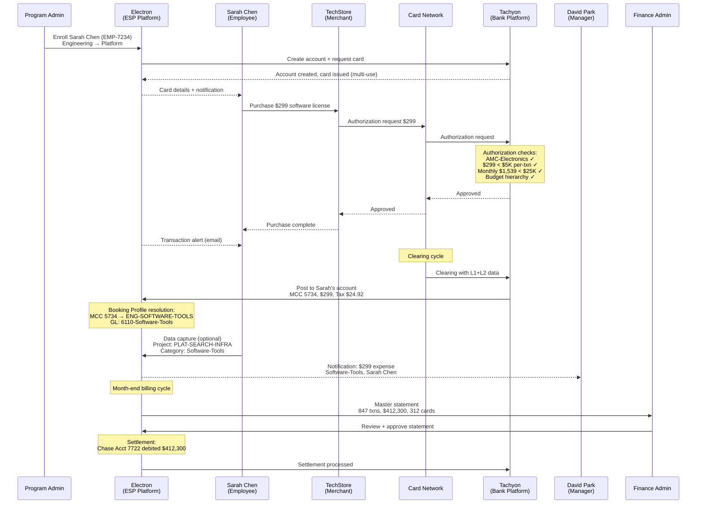

# Chapter 28: Operating the Employee & Department Spend Program

The Employee & Department Spend archetype governs decentralized business spend. Unlike the Supplier Payments archetype, where every card is pre-matched to a known invoice, Employee Spend operates on governed autonomy — employees spend within guardrails, and the system captures, categorizes, and attributes each transaction after the fact. The operational challenge shifts from pre-matching to post-classification: ensuring that 847 transactions across 312 cards land in the correct cost centers without manual intervention on each one.

---

## Reference: Employee & Department Spend Program Profile

| Dimension | Specification |
|-----------|---------------|
| **Control Archetype** | Governed autonomy — employees spend within guardrails defined by AMC restrictions, velocity limits, and per-transaction caps. The corporate sets the boundaries; the employee makes purchasing decisions within them. |
| **Eligibility Model** | Employee-based — HR-verified employees by OU. Eligibility defined by Payer (which employees are authorized to spend). |
| **Cardholder** | Named employee. Full Cardholder Profile: name on card, address, email, phone number (for ACS second-factor authentication and notification delivery). Custom attributes map the cardholder to the corporate domain (CorporateMemberType: Employee, CorporateMemberID). |
| **Account Structure** | One account per employee. Each enrolled employee receives a dedicated account tied to the program's Credit Facility and Budget. This per-employee account structure enables individual-level billing, spend tracking, and statement generation. |
| **Reconciliation Pattern** | Expense categorization — periodic review, cost center attribution via Booking Profile rules, manager approval for flagged items. If the program requires employee-provided expense codes, those feed into Booking Profile resolution. If the program serves a single cost head, cost center information is available at the program level — no per-transaction input needed. |
| **Booking Profile** | Rule-based with runtime resolution. Default cost center from the program; dynamic override by department sub-OU tag, employee-provided project code, or MCC-based categorization rules. Optional data-capture form enables employees to add context (project code, purpose, client code) after each transaction. |
| **Settlement Profile** | Single settlement account. Typically requires manual approval by Finance before settlement. Master statement consolidates individual account statements across all enrolled employees. |

---

## Program Journey

### Step 1: Program Creation

Meridian's Engineering VP creates the "Meridian Engineering Spend Program" in the Electron portal. The program is created under the Engineering OU, which owns the program and determines which Budgets are visible during setup.

### Step 2: Product and Credit Facility Binding

The Engineering VP selects Apex's Employee Spend Product as the product for this program and binds it to Meridian's US Credit Facility (CF-US-001, $50M, USD). The product selection establishes the control archetype — governed autonomy with MCC restrictions, velocity controls, and per-employee account structure.

### Step 3: Budget Allocation

The Engineering VP allocates a $10M Budget from the US Credit Facility, scoped to the Engineering OU. This Budget, "Engineering Operations," is a top-level Budget with sub-Budgets for Platform ($4M), Applications ($3M), Infrastructure ($2M), and QA ($1M). The program draws from the parent Budget; sub-Budget allocation affects authorization checks through the hierarchy — all ancestor Budgets are consulted at authorization time.

### Step 4: Spend Policy Configuration

The Engineering VP configures the program-level Spend Policy:

| Policy Dimension | Configuration |
|-----------------|---------------|
| Allowed AMCs | Broad set — AMC-Electronics, AMC-Software, AMC-Office-Supplies, AMC-Professional-Services, AMC-Restaurants, AMC-Fuel, AMC-Telecommunications |
| Blocked AMCs | AMC-Gambling, AMC-Adult, AMC-Jewelry, AMC-Liquor-Stores |
| Per-transaction limit | $5,000 |
| Daily limit (per card) | $10,000 |
| Monthly limit (per card) | $25,000 |
| Life-to-date limit | None (governed by Budget) |

These limits use tumbling windows — daily resets at midnight, monthly resets on the 1st. The per-transaction limit of $5,000 is tighter than Apex's product-level limit, consistent with the cascading restriction model: each level can only tighten, never loosen.

### Step 5: Booking Profile Configuration

The Engineering VP configures the Booking Profile with rules for cost center attribution:

| Rule | Cost Center | GL Code |
|------|-------------|---------|
| Default (all employee transactions) | ENG-GENERAL | 6100-Employee-Spend |
| Employee sub-OU = Platform | ENG-PLATFORM | 6100-Employee-Spend |
| Employee sub-OU = Applications | ENG-APPLICATIONS | 6100-Employee-Spend |
| Employee sub-OU = Infrastructure | ENG-INFRASTRUCTURE | 6100-Employee-Spend |
| Employee-provided project code present | Dynamic — resolved from project code lookup | 6100-Employee-Spend |
| MCC = 5734 (Computer Software Stores) | Override to ENG-SOFTWARE-TOOLS | 6110-Software-Tools |
| Unmatched credits (refunds) | ENG-GENERAL | 6100-Employee-Spend |

The data-capture form is configured at program setup. After each transaction, the employee can optionally provide a project code and expense category through Electron's UI or via API. This data feeds into the Booking Profile rules for more precise cost center attribution. If the employee provides nothing, the default rule based on their sub-OU affiliation applies.

### Step 6: Settlement Profile Configuration

The Engineering VP configures the Settlement Profile:

| Settlement Parameter | Configuration |
|---------------------|---------------|
| Settlement account | Chase Operating Account 7722 (USD) |
| Settlement mode | Manual approval by Finance Admin |
| Payment timing | Within 5 business days of statement availability |
| Auto-pay | Disabled — Finance reviews consolidated statement before payment |

### Step 7: Eligibility Definition

The Engineering VP defines eligibility rules: all Members of type "Employee" affiliated with the Engineering OU and its sub-OUs (Platform, Applications, Infrastructure, QA) are eligible for enrollment. This captures 312 engineers across the four sub-departments.

### Step 8: Employee Enrollment

The Program Admin enrolls Sarah Chen, a Senior Engineer in the Platform sub-OU. Enrollment is explicit — HR-verified employees become eligible automatically, but enrollment requires an administrative action.

Enrollment details for Sarah Chen:

| Enrollment Field | Value |
|-----------------|-------|
| Member | Sarah Chen (Member ID: EMP-7234) |
| Member type | Employee |
| OU affiliation | Engineering → Platform |
| KYC requirement | Standard — verified against HR records |
| Card type | Multi-use virtual card |
| Cardholder Profile | Name: Sarah Chen, Email: sarah.chen@meridian.com, Phone: +1-555-0142 |
| Card tags | Employee: EMP-7234, Department: Platform, Program: ENG-SPEND-001 |
| Approval workflow | Manager: David Park (EMP-6891), Engineering Platform Lead |

Each enrollment produces one card and one account. Sarah's account is tied to the Engineering Operations Budget and the US Credit Facility. Her card carries her employee identity and department affiliation as structured tags.

### Step 9: Transaction — Software License Purchase

Sarah purchases a $299 software license at TechStore (an online electronics retailer). Authorization processing evaluates:

| Check | Result |
|-------|--------|
| AMC validation | AMC-Electronics ✓ — TechStore is a merchant in the allowed AMC |
| Per-transaction limit | $299 < $5,000 ✓ |
| Daily limit | $299 (first transaction today) < $10,000 ✓ |
| Monthly spend | $1,240 (current month) + $299 = $1,539 < $25,000 ✓ |
| Budget capacity | Engineering Operations Budget: $10M allocated, $6.2M utilized, $3.8M remaining ✓ |
| Budget hierarchy | Parent Budget and all ancestors consulted — sufficient capacity at every level ✓ |
| Blocked AMCs | AMC-Electronics is not in the blocked list ✓ |

Authorization is approved. The Budget is utilized by $299 at authorization time. Sarah receives a transaction notification via email (her Cardholder Profile email).

### Step 10: Transaction Posting

The transaction clears through the card network and posts to Sarah's individual account. The posting carries:

**L1 Data** (always present):
- Transaction amount: $299.00
- MCC: 5734 (Computer Software Stores)
- Date: 2026-03-18
- Merchant: TechStore Inc.
- Currency: USD

**L2 Data** (provided by TechStore):
- Tax amount: $24.92
- Tax rate: 8.33%
- Order reference: TS-2026-44891
- Customer code: (not provided)

No L3 data is provided — TechStore does not submit line-item detail.

### Step 11: Expense Categorization and Cost Center Attribution

The Booking Profile processes the transaction through its rule chain:

1. **MCC rule match**: MCC 5734 (Computer Software Stores) triggers the software-tools override → cost center ENG-SOFTWARE-TOOLS, GL 6110-Software-Tools.
2. **Sub-OU confirmation**: Sarah's sub-OU (Platform) is consistent with the attribution. If no MCC override existed, the sub-OU rule would attribute to ENG-PLATFORM.
3. **Data capture**: Sarah optionally provides "Project: PLAT-SEARCH-INFRA" and expense category "Software-Tools" through the Electron UI. The project code enriches the posting but does not override the Booking Profile resolution already determined by MCC.

The expense is categorized as "Software-Tools," attributed to cost center ENG-PLATFORM (refined by project code to PLAT-SEARCH-INFRA). David Park, Sarah's manager, receives a notification that a $299 expense has been categorized and is available for review.

### Step 12: Month-End Consolidation

At month-end, the following consolidation occurs:

**Individual account statements**: Electron compiles a statement for each of the 312 enrolled employee accounts. Sarah's statement shows 7 transactions totaling $2,847 across the month.

**Master statement**: Electron generates a master statement for the Meridian Engineering Spend Program, consolidating all 312 individual account statements. The master statement reports:

| Metric | Value |
|--------|-------|
| Total transactions | 847 |
| Total spend | $412,300 |
| Active cards | 312 |
| Cost centers attributed | 14 |
| Flagged for review | 23 transactions (manager escalation or policy-edge cases) |
| Owning OU | Engineering |

The Finance Admin reviews the master statement. The 23 flagged transactions are examined — 19 are approved after manager confirmation, 3 require employee justification, and 1 is disputed. After review, the Finance Admin approves the statement for payment. Chase Operating Account 7722 is debited for $412,300.

Booking Profile rules route all 847 transactions to their resolved cost centers:

| Cost Center | Transactions | Total Spend |
|-------------|-------------|-------------|
| ENG-PLATFORM | 247 | $118,400 |
| ENG-APPLICATIONS | 198 | $97,200 |
| ENG-INFRASTRUCTURE | 156 | $82,100 |
| ENG-QA | 87 | $38,600 |
| ENG-SOFTWARE-TOOLS | 112 | $54,300 |
| ENG-GENERAL | 47 | $21,700 |

---

## Sequence Diagram: Employee Spend Transaction Lifecycle

---

## Reconciliation Detail

### Why Employee Spend Reconciliation Differs from Supplier Payments

Employee Spend reconciliation is fundamentally different from Supplier Payments. In the Supplier Payments archetype, every transaction is pre-matched to a PO and invoice — reconciliation confirms what was already known. In Employee Spend, the corporate knows who spent and the general boundaries (AMC, limits), but the specific merchant, amount, and purpose are discovered at transaction time.

The reconciliation challenge is attribution, not matching. The question is not "does this transaction match a known obligation?" but "which cost center, project, and GL code should absorb this expense?"

### Three Attribution Sources

Employee Spend attribution draws from three sources, evaluated in priority order by the Booking Profile:

1. **Employee-provided data**: if the program's data-capture form is configured and the employee submits a project code or expense category, this takes highest priority for cost center resolution. The data-capture form is a configurable construct defined at program setup — the "form" is a metaphor for any data input mechanism, including Electron's default UI and API-based integrations with corporate expense systems.

2. **Card and posting data**: the card carries employee identity (member ID, department tag) and the posting carries MCC, merchant name, and amount. Booking Profile rules can use MCC to categorize transactions — MCC 5734 routes to Software-Tools, MCC 5812 routes to Meals-Entertainment.

3. **Program-level defaults**: if no specific rule matches and no employee data is provided, the program's default cost center applies. For single-purpose programs (a program that exists solely for one cost head), the program-level default handles all transactions without per-transaction input.

### Approval Workflow

The approval workflow is an optional but common feature in Employee Spend programs. Configured at program setup, it defines:

- **Per-employee approver**: typically the employee's direct manager, specified at enrollment time. David Park approves Sarah Chen's transactions.
- **Nominated approval group**: a set of users designated by the Program Admin who can serve as secondary or backup approvers. Useful for vacation coverage or escalation.

The approval workflow triggers when:
- A transaction exceeds a configured threshold (e.g., any single transaction above $2,000)
- A transaction falls in a flagged MCC category (e.g., AMC-Restaurants above $500)
- The employee submits expense data that requires manager validation

Approval is not an authorization-time event — it occurs after the transaction posts and before the booking finalizes. Transactions that remain unapproved past a deadline are escalated to the Program Admin.

### Manager Review vs. Finance Review

Two distinct review processes operate in Employee Spend:

| Review Type | Who | When | Scope | Purpose |
|-------------|-----|------|-------|---------|
| Manager review | Employee's manager | Per-transaction (flagged items) or periodic | Individual employee's transactions | Validate business purpose, approve expense categorization |
| Finance review | Finance Admin | Month-end (statement cycle) | Entire program — master statement | Verify totals, review exceptions, approve settlement |

Manager review is operational — it ensures individual transactions are appropriate and correctly categorized. Finance review is fiduciary — it ensures the program's total spend is accounted for before settlement.

---

## Operational Considerations

### Scale and Volume

Meridian's Engineering Spend Program supports 312 enrolled employees across four sub-departments. Monthly transaction volume averages 847 transactions totaling $412,300. Each employee's account generates an individual statement; the master statement aggregates all 312.

### Card Lifecycle

Employee Spend cards are multi-use and persist for the employee's enrollment duration. The typical lifecycle:

1. **Issuance**: card created at enrollment with employee Cardholder Profile, department tags, and Spend Policy limits
2. **Active use**: the employee uses the card for recurring business purchases. Velocity limits (daily, monthly) reset on schedule.
3. **Renewal**: cards are renewed on expiration. The employee's account, Budget allocation, and Booking Profile rules persist.
4. **Deactivation**: when an employee transfers out of the Engineering OU or leaves the corporate, the card is deactivated. Outstanding transactions clear normally; the account settles and closes.

### Data-Capture Form Integration

The data-capture form — configured at program setup — enables the corporate to collect structured data from employees after each transaction. Common fields include:

| Field | Required/Optional | Purpose |
|-------|-------------------|---------|
| Project code | Optional | Routes expense to specific project Budget or cost center |
| Expense category | Optional | Overrides MCC-based categorization |
| Client code | Optional | Attributes expense to a client for chargeback |
| Business purpose | Optional | Audit trail for compliance |

The form can be presented through Electron's default UI, through the corporate's expense management system (via API integration), or through any custom interface that calls Electron's posting enrichment API. The key constraint: the data must map to the Booking Profile's rule inputs for cost center and GL resolution.

---

## Cross-References

- Corporate-wide administration (OU, Budget, Member, User management): *Corporate-Wide Concerns*
- Control archetype and Spend Policy cascading model: *Spend Policy and Controls*
- Booking Profile as a template with runtime resolution: *Booking Profile, Settlement Profile, and Reconciliation*
- Account structure (one account per employee) and its relationship to Credit Facility: *Account as the Bridging Entity*
- Master statement consolidation across per-employee accounts: *Transaction Posting and Data*
- Approval engine configuration at program setup: *Roles in a Corporate Payment Program*
