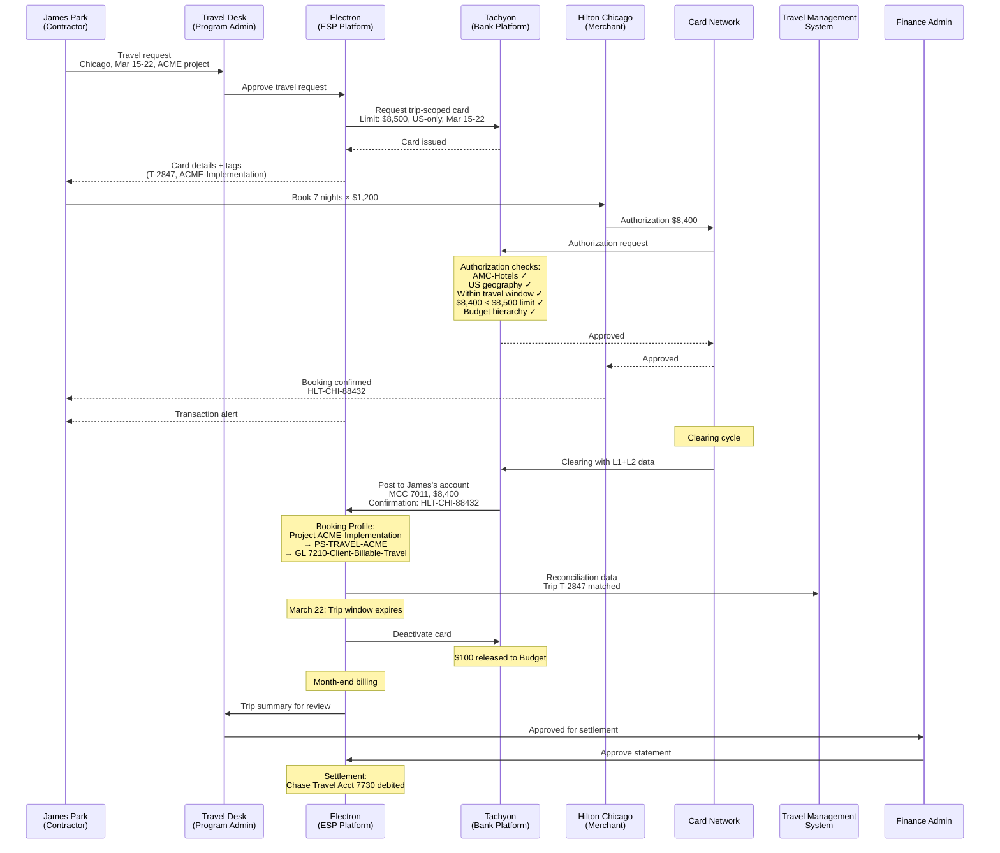

# Chapter 29: Operating the Travel & Booking Payments Program

The Travel & Booking Payments archetype governs corporate travel spend where the payment instrument is scoped to a specific trip, traveler, and travel window. Unlike Employee Spend, where a multi-use card persists indefinitely, Travel Payments issues cards that are born with a destination, a date range, and a purpose — and die when the trip ends. The operational complexity lies in managing a population that includes not just employees, but contractors and client representatives, each traveling under different cost attribution rules.

---

## Reference: Travel & Booking Payments Program Profile

| Dimension | Specification |
|-----------|---------------|
| **Control Archetype** | Trip-scoped — card validity tied to a travel window and destination. Both single-use per booking and lodge-style persistent per agency are supported. The trip-scoped single-use model dominates for individual traveler cards. |
| **Eligibility Model** | Traveler-based — employees, contractors, and client representatives traveling for corporate business. Eligibility defined by Payer (which travelers are authorized) for per-booking cards; by Payee (which agencies are enrolled) for lodge-style persistent cards. |
| **Cardholder** | Traveler. May be an employee, contractor, or client member type. Full Cardholder Profile with ACS-capable contact information. For lodge-style cards, the agency serves as cardholder. |
| **Account Structure** | One account per traveler (per-booking model) or one account per agency (lodge model). Meridian's Implementation Travel Program uses the per-traveler model for individual trip cards. |
| **Reconciliation Pattern** | Itinerary-match — card tags (trip ID, traveler name, project code) matched against the travel management system records. L2 data from hotels, airlines, and ground transport provides confirmation data (confirmation numbers, guest names, dates, booking references). |
| **Booking Profile** | Rule-based. Default cost center for travel; dynamic override by project tag. Client-billable travel is attributed to the client project code carried on the card tag. |
| **Settlement Profile** | Single settlement account. Monthly settlement aligned with travel agency billing cycles. |

---

## Program Journey

### Step 1: Program Creation

Meridian's Travel Desk Manager creates the "Meridian Implementation Travel Program" in the Electron portal. The program is created under the Professional Services OU, reflecting that this travel program serves the implementation consulting team — the group that travels to client sites for system rollouts.

### Step 2: Product and Credit Facility Binding

The Travel Desk Manager selects Apex's Travel Payments Product and binds it to Meridian's US Credit Facility (CF-US-001, $50M, USD). The product selection establishes the control archetype — trip-scoped cards with geographic restrictions, travel-window validity, and AMC constraints limited to travel-related categories.

### Step 3: Budget Allocation

The Travel Desk Manager allocates a $5M Budget from the US Credit Facility, scoped to the Professional Services OU. This Budget, "PS Travel," funds all implementation travel for the fiscal year. The Professional Services OU owns the Budget, and the program is owned by the same OU — the Budget is visible during program setup.

### Step 4: Spend Policy Configuration

The Travel Desk Manager configures the program-level Spend Policy:

| Policy Dimension | Configuration |
|-----------------|---------------|
| Allowed AMCs | AMC-Travel-Agencies, AMC-Airlines, AMC-Hotels, AMC-Ground-Transport, AMC-Meals |
| Blocked AMCs | All others (implicit deny) |
| Per-booking limit | $50,000 (accommodates group travel bookings) |
| Per-transaction limit | $15,000 |
| Geographic restriction | Approved destination countries only (US, Canada, UK, Germany, India, Japan, Australia) |
| Travel-window enforcement | Card valid only within the issued travel date range |

The geographic restriction is a card-level control that references the transaction's country of origin. If a traveler attempts a purchase in a non-approved country, authorization is declined regardless of AMC or amount.

### Step 5: Booking Profile Configuration

The Travel Desk Manager configures the Booking Profile:

| Rule | Cost Center | GL Code |
|------|-------------|---------|
| Default (all travel transactions) | PS-TRAVEL | 7200-Travel-Expense |
| Project tag present | Dynamic — resolved from project code | 7200-Travel-Expense |
| Project tag = "ACME-Implementation" | PS-TRAVEL-ACME | 7210-Client-Billable-Travel |
| Project tag = "GLOBEX-Migration" | PS-TRAVEL-GLOBEX | 7210-Client-Billable-Travel |
| Unmatched credits (refunds) | PS-TRAVEL | 7200-Travel-Expense |

Client-billable travel is a critical distinction. When a consultant travels for a client implementation, the cost is attributed to the client project code — enabling Meridian to recover travel costs from the client. The project tag on the card drives this routing.

### Step 6: Settlement Profile Configuration

The Travel Desk Manager configures the Settlement Profile:

| Settlement Parameter | Configuration |
|---------------------|---------------|
| Settlement account | Chase Travel Account 7730 (USD) |
| Settlement mode | Monthly settlement |
| Payment timing | Aligned with Apex's monthly billing cycle, settled within 10 business days |
| Auto-pay | Disabled — Travel Desk Manager reviews trip-level charges before Finance Admin approves |

### Step 7: Eligibility Definition

The Travel Desk Manager defines eligibility rules with a broader member population than typical programs:

| Member Type | Eligibility Criteria | Count |
|-------------|---------------------|-------|
| Employee | All employees in Professional Services OU and sub-OUs | 84 |
| Contractor | Approved contractors affiliated with Professional Services OU | 12 |
| Client | Client representatives approved for joint implementation travel | 6 |

Total eligible population: 102 members across three member types. This cross-type eligibility is distinctive to the Travel archetype — no other archetype routinely includes clients as eligible participants.

### Step 8: Travel Request and Approval

James Park, a consultant and contractor member affiliated with the Professional Services OU, submits a travel request for a Chicago implementation trip for the ACME project. The travel request is approved through Electron's approval workflow:

| Approval Field | Value |
|---------------|-------|
| Traveler | James Park (Member ID: CON-0118, type: Contractor) |
| Destination | Chicago, IL (US) |
| Travel dates | March 15–22, 2026 |
| Purpose | ACME bank implementation — phase 2 UAT support |
| Project code | ACME-Implementation |
| Estimated budget | $8,500 |
| Approver | Professional Services Director |

### Step 9: Trip-Scoped Card Issuance

Upon approval, the Travel Desk issues a trip-scoped virtual card for James Park:

| Card Parameter | Value |
|---------------|-------|
| Cardholder | James Park |
| Card type | Single-use, trip-scoped virtual card |
| Valid from | March 15, 2026 |
| Valid to | March 22, 2026 |
| Card limit | $8,500 |
| Geographic restriction | US only |
| Allowed AMCs | AMC-Hotels, AMC-Airlines, AMC-Ground-Transport, AMC-Meals |
| Card tags | Trip: T-2847, Traveler: "James Park" (CON-0118), Project: "ACME-Implementation", Cost Center: PS-TRAVEL-ACME |

The card's validity window, geographic restriction, and AMC constraints form a three-dimensional control envelope. The card cannot be used before March 15, after March 22, outside the US, or at merchants outside the travel AMC categories.

### Step 10: Transaction — Hotel Booking

James books the Hilton Chicago for 7 nights at $1,200 per night. Authorization processing evaluates:

| Check | Result |
|-------|--------|
| AMC validation | AMC-Hotels ✓ — Hilton Chicago is a merchant in the allowed AMC |
| Geographic restriction | US ✓ — Chicago, IL is within the approved country list |
| Travel window | March 15, 2026 ✓ — within the March 15–22 validity period |
| Amount | $8,400 < $8,500 card limit ✓ |
| Per-transaction limit | $8,400 < $15,000 ✓ |
| Budget capacity | PS Travel Budget: $5M allocated, $2.1M utilized, $2.9M remaining ✓ |

Authorization is approved. The Budget is utilized by $8,400 at authorization time. James receives a transaction alert via email.

### Step 11: Transaction Posting and Itinerary Matching

The hotel transaction clears and posts to James's travel account. The posting carries:

**L1 Data** (always present):
- Transaction amount: $8,400.00
- MCC: 7011 (Hotels/Motels)
- Date: 2026-03-15
- Merchant: Hilton Hotels — Chicago
- Currency: USD

**L2 Data** (provided by Hilton):
- Hotel confirmation: HLT-CHI-88432
- Guest name: James Park
- Check-in: 2026-03-15
- Check-out: 2026-03-22
- Nightly rate: $1,200.00
- Room nights: 7
- Tax: $700.00 (included in total)

The itinerary-match reconciliation connects the posting to the trip record:

```
Trip T-2847 → Card (tagged T-2847, CON-0118) → Transaction ($8,400) → Hilton confirmation HLT-CHI-88432
```

Booking Profile rules process the transaction:
- Project tag "ACME-Implementation" is present on the card → cost center PS-TRAVEL-ACME, GL 7210-Client-Billable-Travel
- This attribution enables Meridian to invoice ACME for the travel cost

### Step 12: Trip Close and Budget Release

March 22 arrives. The trip window expires. The card auto-deactivates — no further charges are possible, regardless of remaining capacity.

| Trip Close Action | Detail |
|-------------------|--------|
| Card deactivation | Automatic on March 22, 2026 |
| Remaining capacity | $100 ($8,500 limit − $8,400 charge) released back to PS Travel Budget |
| Budget adjustment | PS Travel Budget available capacity increases by $100 |
| Trip record | Trip T-2847 marked as closed. All charges matched against travel management system itinerary. |

The Booking Profile routes the hotel charge to cost center PS-TRAVEL-ACME under project ACME-Implementation. The Travel Desk Manager reviews the trip charges against the travel management system itinerary, confirming the Hilton stay aligns with the approved travel request. The charge is cleared for inclusion in the monthly consolidated statement.

At month-end, Finance Admin reviews the program's consolidated statement — covering all trips that closed during the billing period — and approves settlement from Chase Travel Account 7730.

---

## Sequence Diagram: Travel Payment Transaction Lifecycle



---

## Reconciliation Detail

### Why Travel Reconciliation Is Itinerary-Driven

Travel Payments reconciliation operates on a different axis than Supplier Payments or Employee Spend. The primary reconciliation anchor is not a PO (as in Supplier Payments) or a cost center (as in Employee Spend), but the trip itself — a time-bounded, destination-specific, purpose-defined travel event.

The trip record in the travel management system contains:
- Traveler identity
- Destination and dates
- Purpose and project code
- Approved budget
- Itinerary components (flights, hotels, ground transport, meals)

Each card is tagged with the trip ID. Every transaction posts with L2 data that includes booking confirmations, guest names, and dates. The reconciliation process matches card-level trip tags against posting-level confirmation data against travel management system itinerary records.

### Multi-Charge Trips

A single trip typically generates multiple charges across different AMC categories:

| Charge | Merchant | AMC | Amount | L2 Data |
|--------|----------|-----|--------|---------|
| Hotel | Hilton Chicago | AMC-Hotels | $8,400 | Confirmation HLT-CHI-88432, 7 nights |
| Ground transport | Chicago Taxi Co. | AMC-Ground-Transport | $45 | Trip receipt CT-20260315-442 |
| Meals (day 1) | Chicago Steakhouse | AMC-Meals | $62 | Check #4421, 1 guest |

All charges carry the same trip tag (T-2847) and traveler tag (CON-0118). The travel management system consolidates all charges under the trip record, providing a single view of trip-level spend.

If the card's remaining capacity ($8,500 − cumulative charges) is insufficient for a late-arriving charge, the authorization is declined. The Travel Desk can increase the card limit if the additional expense is justified, or issue a supplementary card for the same trip.

### Contractor and Client Travel

Contractor and client travel introduces attribution complexity absent from employee travel:

| Traveler Type | Cost Attribution | Billing |
|---------------|-----------------|---------|
| Employee | Department cost center, internal budget | Internal — no external billing |
| Contractor | Project cost center, client-billable if on client work | May be billed to client or absorbed internally |
| Client representative | Client project cost center | Billed to client or covered by Meridian as part of engagement terms |

The Booking Profile handles this variation through the project tag. A contractor traveling for ACME is tagged with project "ACME-Implementation" — the Booking Profile routes the cost to PS-TRAVEL-ACME (GL 7210-Client-Billable-Travel). An employee traveling for an internal initiative is tagged with an internal project code — the Booking Profile routes to PS-TRAVEL (GL 7200-Travel-Expense).

---

## Operational Considerations

### Card Lifecycle in Travel

Travel cards have the shortest lifecycle of any archetype. The typical lifecycle:

1. **Travel request approved**: triggers card issuance workflow
2. **Card issued**: valid from trip start date. The card is inert before the travel window opens.
3. **Active travel window**: the traveler uses the card for hotel, transport, and meal purchases during the trip
4. **Trip end**: the card auto-deactivates on the window close date. Unspent capacity is released to the Budget.
5. **Clearing**: outstanding authorizations clear over the following days. Late-arriving charges (e.g., hotel minibar posted 48 hours after checkout) require the card to honor pending authorizations even after the travel window closes.
6. **Reconciliation**: the Travel Desk matches charges against the travel management system itinerary. Discrepancies are flagged for review.

### Geographic Controls

Geographic restrictions on travel cards operate at authorization time. The card's allowed geography (US-only for James Park's trip) is checked against the transaction's originating country. A US-only card cannot authorize a purchase at a London hotel, even if AMC-Hotels is allowed.

For multi-country trips, the Travel Desk issues a card with an expanded geographic restriction list (e.g., US + UK for a London-then-New-York itinerary). The list of approved destination countries is maintained at the program level; the card-level restriction is set per trip.

### Travel Agency Lodge Model

The per-traveler model described above is one of two patterns. The lodge model — where a persistent card is issued to a travel agency — is an alternative:

| Dimension | Per-Traveler Model | Lodge Model |
|-----------|-------------------|-------------|
| Card persistence | Trip-scoped, auto-closes | Persistent, long-lived |
| Cardholder | Individual traveler | Travel agency |
| Account structure | One account per traveler | One account per agency |
| Reconciliation anchor | Trip ID on card | Booking reference in L2 data from agency |
| Typical use | Individual trip bookings | Centralized booking through preferred agency |

Meridian's Implementation Travel Program uses the per-traveler model. Meridian's Sales Travel Program (not detailed in this chapter) uses the lodge model with a persistent card issued to its preferred travel agency.

---

## Cross-References

- Corporate-wide administration (OU, Budget, Member, User management): *Corporate-Wide Concerns*
- Contractor and Client as member types with OU affiliation: *Members and Member Types*
- Geographic restrictions and AMC-based Spend Policy rules: *Spend Policy and Controls*
- Trip-scoped card controls (validity window, geographic lock): *Card Profile and Card Controls*
- Per-traveler vs. lodge model as dual control archetypes: *Spend Archetypes*
- L2 data from hotels and airlines (confirmation numbers, guest names, dates): *Transaction Posting and Data*
- Client-billable travel and project-code-driven Booking Profile rules: *Booking Profile, Settlement Profile, and Reconciliation*
