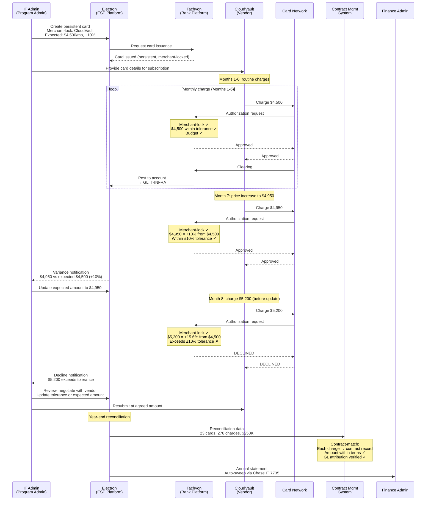

# Chapter 30: Operating the Central Recurring Merchant Payments Program

The Central Recurring Merchant Payments archetype governs persistent, merchant-locked payments managed centrally by the corporate — typically SaaS subscriptions, recurring vendor charges, and ongoing service contracts. No cardholder walks into a store. No employee submits an expense report. A card is created for a vendor, locked to that vendor, loaded with an expected recurring amount, and left in place for months or years. The operational challenge is not authorization control (that is tight by design) but variance detection: knowing when a $4,500 monthly charge becomes $5,200 and deciding whether that change is acceptable.

---

## Reference: Central Recurring Merchant Payments Program Profile

| Dimension | Specification |
|-----------|---------------|
| **Control Archetype** | Merchant-locked — each card works only at the registered merchant. Persistent cards with recurring amount tolerance enforcement. One card per vendor or per cost head, with whitelist-based AMC restrictions. |
| **Eligibility Model** | Not applicable — this is a centralized treasury operation. No member enrollment occurs. Cards are issued by the IT Admin or Program Admin directly, without associating them to individual members. |
| **Cardholder** | Not applicable in the traditional sense. Cards are lodge/ghost cards — centrally managed, with no named cardholder carrying the card for personal use. The Program Admin serves as cardholder of record for administrative purposes. |
| **Account Structure** | Single account per program. All subscription cards share one account, tied to one Credit Facility and one Budget. |
| **Reconciliation Pattern** | Contract-match — card tags (vendor name, contract ID) matched against the vendor contract management system. Recurring amount validation confirms each charge falls within the expected tolerance band. |
| **Booking Profile** | Rule-based with vendor-level GL mapping. Default GL for IT subscriptions; dynamic override by vendor tag mapping to specific GL codes. Each vendor's charges route to a dedicated GL line. |
| **Settlement Profile** | Single settlement account. Auto-sweep monthly. No per-transaction review — variance notifications are the primary control lever. |

---

## Program Journey

### Step 1: Program Creation

Meridian's IT Director creates the "Meridian SaaS Subscriptions Program" in the Electron portal. The program is created under the IT OU (a sub-OU of Engineering), reflecting that SaaS subscription management is an IT operations function at Meridian.

### Step 2: Product and Credit Facility Binding

The IT Director selects Apex's Central Recurring Product and binds it to Meridian's US Credit Facility (CF-US-001, $50M, USD). The product selection establishes the control archetype — merchant-locked persistent cards with recurring amount tolerance enforcement and AMC restrictions limited to subscription and SaaS categories.

### Step 3: Budget Allocation

The IT Director allocates a $5M Budget from the US Credit Facility, scoped to the IT OU. This Budget, "IT Subscriptions," is a sub-Budget of the Engineering Operations Budget ($10M). Authorization checks traverse the full Budget hierarchy — a charge against IT Subscriptions also checks the Engineering Operations parent and the Credit Facility ancestor.

### Step 4: Spend Policy Configuration

The IT Director configures the program-level Spend Policy:

| Policy Dimension | Configuration |
|-----------------|---------------|
| Allowed AMCs | AMC-SaaS, AMC-Subscriptions |
| Blocked AMCs | All others (implicit deny) |
| Merchant-lock | Enabled per card — each card is locked to a specific merchant |
| Recurring amount tolerance | ±10% from the registered expected amount |
| Per-transaction limit | $50,000 (accommodates annual pre-payment options) |
| Velocity | Monthly — one expected charge per card per billing cycle |

The merchant-lock is the defining control. A card created for CloudVault will authorize only transactions from CloudVault's merchant identifier. A charge from any other merchant — even one in the allowed AMC-SaaS category — is declined.

The recurring amount tolerance is the second critical control. If a card is registered with an expected amount of $4,500/month, any charge between $4,050 and $4,950 (±10%) is authorized. Charges outside this band are declined, forcing the IT Admin to review and update the card configuration.

### Step 5: Booking Profile Configuration

The IT Director configures the Booking Profile with vendor-level GL mapping:

| Rule | GL Code | Cost Center |
|------|---------|-------------|
| Default (all subscription transactions) | IT-SUBSCRIPTIONS | IT-Operations |
| Vendor tag = "CloudVault" | IT-INFRA | IT-Infrastructure |
| Vendor tag = "DataStream" | IT-ANALYTICS | IT-Analytics |
| Vendor tag = "DevForge" | IT-DEVTOOLS | IT-Development |
| Vendor tag = "SecureNet" | IT-SECURITY | IT-Security |
| Vendor tag = "CommHub" | IT-COMMS | IT-Communications |
| Unmatched credits (refunds) | IT-SUBSCRIPTIONS | IT-Operations |

Each vendor maps to a specific GL code. This mapping is static per vendor — unlike Employee Spend, where attribution varies by transaction. The Booking Profile resolves at posting time using the vendor tag on the card, not data from the posting itself.

### Step 6: Settlement Profile Configuration

The IT Director configures the Settlement Profile:

| Settlement Parameter | Configuration |
|---------------------|---------------|
| Settlement account | Chase IT Account 7735 (USD) |
| Settlement mode | Auto-sweep monthly |
| Payment timing | 15th of each month |
| Auto-pay | Enabled |

Auto-sweep is appropriate for this archetype because charges are predictable and pre-approved at the contract level. The IT Director monitors variance notifications rather than reviewing individual transactions before settlement.

### Step 7: No Member Enrollment

This is a centralized treasury operation. No member enrollment occurs. The IT Admin creates cards directly, without associating them to members in the corporate's member registry. The absence of member enrollment is the distinguishing operational characteristic of this archetype — every other archetype (Supplier Payments, Employee Spend, Travel) enrolls members before issuing cards.

### Step 8: Card Creation for CloudVault

The IT Admin creates a persistent virtual card for CloudVault's annual subscription:

| Card Parameter | Value |
|---------------|-------|
| Card type | Persistent virtual card (lodge/ghost) |
| Merchant-lock | CloudVault Inc. (Merchant ID: MID-CV-88421) |
| Expected amount | $4,500/month |
| Recurring tolerance | ±10% ($4,050–$4,950) |
| Card limit | $60,000 (annual capacity: $4,500 × 12 + buffer) |
| Cardholder of record | IT Admin (Program Admin) |
| Card tags | Vendor: "CloudVault", Contract: "CV-2024-001", GL: "IT-INFRA", Cost Center: "IT-Infrastructure" |
| Allowed AMCs | AMC-SaaS |

The card is locked to CloudVault's merchant identifier. Only transactions originating from CloudVault's acquiring setup will authorize. The expected amount and tolerance band establish the recurring amount control.

### Step 9: Routine Monthly Charge

CloudVault charges $4,500 on the 1st of each month for its cloud infrastructure service. Authorization processing evaluates:

| Check | Result |
|-------|--------|
| Merchant-lock | CloudVault Inc. (MID-CV-88421) ✓ — matches the card's locked merchant |
| AMC validation | AMC-SaaS ✓ |
| Recurring amount | $4,500 = expected amount ✓ (within ±10% tolerance) |
| Per-transaction limit | $4,500 < $50,000 ✓ |
| Budget capacity | IT Subscriptions Budget: $5M allocated, $1.8M utilized, $3.2M remaining ✓ |
| Budget hierarchy | IT Subscriptions → Engineering Operations → CF-US-001 — all ancestors checked ✓ |

Authorization is approved. The transaction posts with L1 data (amount, MCC, merchant name) and available L2 data (subscription ID, invoice period). The Booking Profile routes the charge to GL IT-INFRA, cost center IT-Infrastructure, using the vendor tag on the card.

This cycle repeats identically for months 1 through 6. Each charge is $4,500. Each authorization passes. Each posting routes to the same GL and cost center. The IT Admin monitors the program dashboard but takes no per-transaction action.

### Step 10: Price Increase Within Tolerance

In month 7, CloudVault implements a price increase. The monthly charge rises from $4,500 to $4,950 — a 10% increase.

| Check | Result |
|-------|--------|
| Merchant-lock | CloudVault Inc. ✓ |
| Recurring amount | $4,950 vs. expected $4,500 — delta +10.0% — within ±10% tolerance ✓ |
| Budget capacity | ✓ |

Authorization is approved. The IT Admin receives a variance notification: "CloudVault charge $4,950 exceeds registered amount $4,500 by 10.0%." The IT Admin reviews the notification, confirms the price increase aligns with CloudVault's communicated rate change, and updates the card's expected amount to $4,950 going forward.

### Step 11: Price Increase Exceeding Tolerance

In month 8, CloudVault attempts to charge $5,200 — a 15.6% increase from the original $4,500 expected amount (or 5.1% from the updated $4,950, depending on when the IT Admin updated the expected amount).

**Scenario A** — IT Admin has not yet updated the expected amount (still $4,500):

| Check | Result |
|-------|--------|
| Merchant-lock | CloudVault Inc. ✓ |
| Recurring amount | $5,200 vs. expected $4,500 — delta +15.6% — exceeds ±10% tolerance ✗ |

Authorization is **declined**. CloudVault's charge fails. The IT Admin receives a decline notification: "CloudVault charge $5,200 declined — exceeds recurring amount tolerance (expected $4,500 ±10%, max $4,950)."

The IT Admin investigates. Two outcomes are possible:

1. **Legitimate increase**: CloudVault has raised prices. The IT Admin negotiates with CloudVault, confirms the new rate, and updates the card's expected amount to $5,200 with an adjusted tolerance band. CloudVault resubmits the charge successfully.
2. **Billing error**: CloudVault charged incorrectly. The IT Admin contacts CloudVault to resolve. CloudVault resubmits at the correct amount.

**Scenario B** — IT Admin updated the expected amount to $4,950 after month 7:

| Check | Result |
|-------|--------|
| Recurring amount | $5,200 vs. expected $4,950 — delta +5.1% — within ±10% tolerance ✓ |

Authorization is approved. The variance notification alerts the IT Admin, who reviews but takes no blocking action.

The scenario illustrates how tolerance enforcement works as a control lever: the IT Admin's decision of when and whether to update the expected amount determines the authorization outcome for subsequent charges.

### Step 12: Year-End Reconciliation and Contract Renewal

At year-end, the IT Admin reconciles the full SaaS subscription portfolio:

| Vendor | Contract ID | Cards | Charges (12 months) | Annual Spend | GL Code |
|--------|-------------|-------|---------------------|-------------|---------|
| CloudVault | CV-2024-001 | 1 | 12 | $54,000 | IT-INFRA |
| DataStream | DS-2024-003 | 1 | 12 | $36,000 | IT-ANALYTICS |
| DevForge | DF-2024-007 | 3 | 36 | $28,800 | IT-DEVTOOLS |
| SecureNet | SN-2024-002 | 1 | 12 | $18,000 | IT-SECURITY |
| CommHub | CH-2024-005 | 2 | 24 | $14,400 | IT-COMMS |
| 15 other vendors | Various | 15 | 180 | $98,800 | Various |
| **Total** | | **23** | **276** | **$250,000** | |

Reconciliation matches each charge against the vendor contract management system:

| Match Point | Source | Target | Result |
|-------------|--------|--------|--------|
| Vendor identity | Card tag (vendor name) | Contract management system vendor record | ✓ Match |
| Contract ID | Card tag (contract ID) | Contract management system contract record | ✓ Match |
| Monthly amount | Transaction posting | Contract terms (expected amount ± tolerance) | ✓ Match (with noted price changes) |
| GL attribution | Booking Profile resolution (vendor tag → GL) | Finance GL master | ✓ Match |

**Contract renewals**: for vendors with expiring contracts, the IT Admin refreshes the card configuration:
- Updated expected amounts reflecting new contract terms
- Adjusted tolerance bands if negotiated differently
- New contract IDs tagged to the card
- Card limit adjusted for the new contract period

The card itself persists — the same card number continues in use. The vendor does not need to update its payment records. Only the card's control parameters and tags change.

---

## Sequence Diagram: Recurring Payment Lifecycle with Variance

---

## Reconciliation Detail

### Why Central Recurring Reconciliation Is Contract-Driven

Central Recurring reconciliation differs from all other archetypes in a fundamental way: the expected state is known in advance and changes infrequently. A Supplier Payments card matches a specific PO that varies per transaction. An Employee Spend card produces unpredictable charges that require post-hoc categorization. A Central Recurring card charges the same amount from the same vendor every month — the reconciliation question is not "what is this charge?" but "is this charge what the contract says it should be?"

The reconciliation process validates three properties:

1. **Vendor identity**: the merchant that charged the card matches the vendor in the contract management system. The card's merchant-lock ensures this at authorization time — reconciliation confirms it at posting time.
2. **Amount conformance**: the charged amount falls within the expected range defined by the contract terms. Deviations trigger variance notifications and may trigger authorization declines if they exceed tolerance.
3. **Periodicity**: the charge arrives at the expected frequency (monthly, quarterly, annually). Missing charges — a vendor that fails to bill — are as significant as unexpected charges and require follow-up.

### Variance as the Primary Control

In other archetypes, the primary control is authorization policy (AMC restrictions, limits, geographic controls). In Central Recurring, the primary control is variance detection. The recurring amount tolerance band (±10% in Meridian's case) is the operational equivalent of the per-transaction limit in Employee Spend: it defines the boundary of acceptable behavior.

The IT Admin's workflow centers on variance management:

| Variance Type | Detection | Action |
|---------------|-----------|--------|
| Amount within tolerance | Authorized automatically | No action; routine posting |
| Amount outside tolerance | Authorization declined | IT Admin reviews, updates card config or escalates to vendor |
| Missing charge | No transaction in expected billing cycle | IT Admin contacts vendor — service disruption? Billing system issue? |
| Unexpected charge | Additional charge outside normal cycle | IT Admin reviews — prorated adjustment? Double-billing? |
| Merchant identity mismatch | Authorization declined (merchant-lock) | IT Admin investigates — vendor changed acquirer? Subsidiary billing? |

### Multi-Card Vendor Arrangements

Some vendors require multiple cards. DevForge, Meridian's development tooling provider, has three separate subscription tiers:

| Card | Subscription | Expected Amount | GL Code |
|------|-------------|-----------------|---------|
| Card 1 | DevForge Professional (100 seats) | $1,200/month | IT-DEVTOOLS |
| Card 2 | DevForge Enterprise CI/CD | $800/month | IT-DEVTOOLS |
| Card 3 | DevForge Cloud IDE (50 seats) | $400/month | IT-DEVTOOLS |

Each card is separately merchant-locked to DevForge, carries a distinct expected amount, and tags a different contract ID. All three route to the same GL code (IT-DEVTOOLS) but could be differentiated further if Meridian's finance team requires per-tool cost visibility.

---

## Operational Considerations

### Volume and Scale

Meridian's SaaS Subscriptions Program manages 23 persistent cards across 18 distinct vendors. Monthly transaction volume is low — approximately 23 charges per month (one per card). Annual spend totals $250,000 across 276 recurring charges. The low volume and high predictability make this the least operationally intensive archetype on a per-transaction basis, but the highest in terms of per-card configuration precision.

### Card Lifecycle

Central Recurring cards have the longest lifecycle of any archetype:

1. **Creation**: card issued with merchant-lock, expected amount, tolerance band, vendor tags, and contract reference. Card limit set to accommodate the full contract period (annual amount + buffer for price adjustments).
2. **Steady state**: the card processes recurring charges month after month. No cardholder interaction. No expense coding. The card operates autonomously within its configured parameters.
3. **Variance events**: price changes, service tier adjustments, or billing errors trigger variance notifications. The IT Admin reviews and adjusts the card configuration.
4. **Contract renewal**: when the vendor contract renews, the IT Admin updates the card's tags (new contract ID), expected amount, and tolerance band. The card number persists — no disruption to the vendor's billing setup.
5. **Contract termination**: when a subscription is cancelled, the IT Admin deactivates the card. Outstanding charges clear; the card closes. The Budget capacity consumed by the card's limit is released.

### Ghost Cards and Lodge Cards

Central Recurring cards are functionally ghost cards (also called lodge cards in the travel context). No physical card is printed. No individual carries the card. The card exists as a persistent payment credential stored in the vendor's billing system. The vendor charges the card on its billing cycle; the corporate monitors through variance notifications and periodic reconciliation.

This model eliminates the dependency on individual cardholders — a SaaS subscription does not break when an employee leaves the company. The card is tied to the program and the vendor, not to a person.

### Budget Impact of Persistent Cards

Persistent cards consume Budget capacity differently from single-use or trip-scoped cards. A card with a $60,000 annual limit holds that capacity against the Budget for the card's entire lifecycle. If all 23 cards hold similar capacity, the Budget impact is the sum of all card limits, not the sum of actual charges.

Budget utilization at authorization time deducts the transaction amount — not the card limit — from the available capacity. The card limit establishes the theoretical ceiling; the Budget hierarchy enforces the actual spend ceiling at each authorization event.

---

## Cross-References

- Corporate-wide administration (OU, Budget, Settlement operations): *Corporate-Wide Concerns*
- Merchant-lock as a card-level control and AMC-based restrictions: *Spend Policy and Controls*
- Ghost/lodge card model and the absence of member enrollment: *Roles in a Corporate Payment Program*
- Vendor as a corporate-domain entity distinct from the bank's Merchant: *The Merchant and the Supplier*
- Booking Profile with vendor-level GL mapping: *Booking Profile, Settlement Profile, and Reconciliation*
- Auto-sweep settlement and single settlement account constraint: *Corporate-Wide Concerns*
- Credit Facility and Budget hierarchy enforcement at authorization: *Credit Facility and Budget*
