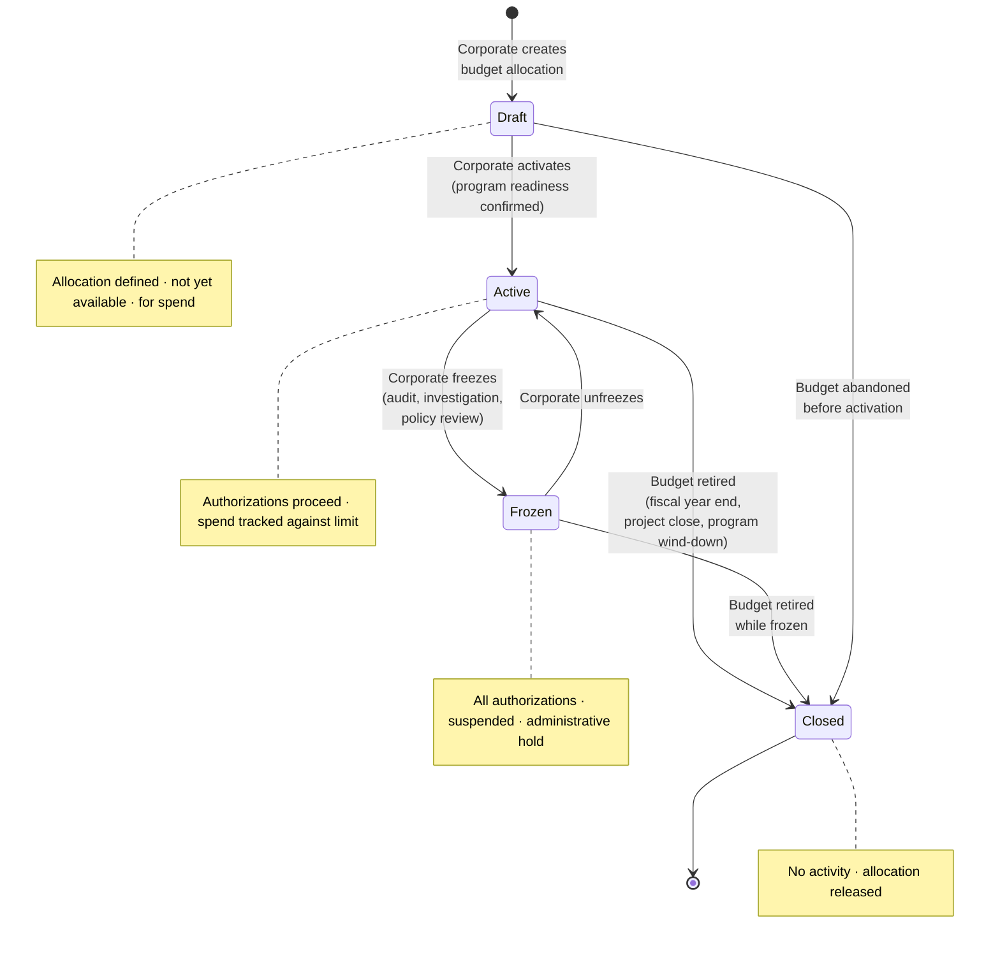

# Appendix: State Models

Account Product and Virtual Card Product state models are bank-internal concerns governed by the bank's own product-management processes; they do not interact with the corporate-facing entities modeled here.

---

## Credit Facility

A Credit Facility is the bank's credit exposure against a single legal entity. Its state governs whether accounts can be opened, budgets allocated, and transactions authorized under the facility.

```mermaid
stateDiagram-v2
    [*] --> PendingApproval : Legal entity submits<br/>credit application
    PendingApproval --> Active : Bank underwrites<br/>and approves facility
    Active --> UnderReview : Bank triggers review<br/>(covenant breach, credit event,<br/>periodic reassessment)
    UnderReview --> Active : Review cleared;<br/>facility reinstated
    UnderReview --> Suspended : Bank suspends<br/>pending resolution
    Suspended --> Active : Issue resolved;<br/>bank reinstates
    Suspended --> Closed : Bank terminates<br/>facility
    Active --> Closed : Facility matured or<br/>bank/corporate terminates
    UnderReview --> Closed : Bank terminates<br/>during review
    Closed --> [*]

    note right of PendingApproval
        Application received · underwriting in progress · no accounts or budgets yet
    end note
    note right of Active
        Accounts can be opened · budgets allocated · transactions authorized
    end note
    note right of UnderReview
        New accounts may be blocked · existing transactions continue · new allocations may be restricted
    end note
    note right of Suspended
        No new transactions · no new accounts · existing balances remain
    end note
    note right of Closed
        No activity · outstanding balances · settle per terms
    end note
```



### Transition Table

| From | Event / Trigger | To | Notes |
|---|---|---|---|
| — | Legal entity submits credit application | Pending Approval | Bank receives application; underwriting begins |
| Pending Approval | Bank completes underwriting and approves | Active | Facility limit, currency, and covenants established |
| Active | Bank triggers periodic review or credit event occurs | Under Review | Covenant breach, material adverse change, or scheduled reassessment |
| Under Review | Review completed; no issues found | Active | Full facility access restored |
| Under Review | Bank determines interim suspension necessary | Suspended | Pending further investigation or corporate remediation |
| Under Review | Bank terminates facility during review | Closed | Facility wound down; outstanding balances settle per terms |
| Suspended | Corporate resolves the issue; bank reinstates | Active | All downstream entities resume normal operation |
| Suspended | Bank terminates the facility | Closed | Relationship ended; accounts closed per terms |
| Active | Facility matured or bank/corporate terminates relationship | Closed | Normal end-of-life or voluntary termination |

### Cascade Effects

- **Suspended**: New account creation is blocked. New budget allocations against the facility are blocked. Existing accounts continue to settle outstanding transactions but do not authorize new spend. Other Credit Facilities held by the same corporate (under different legal entities) are unaffected.
- **Closed**: All accounts under the facility move to Closed. All cards under those accounts are cancelled. Outstanding balances settle per the facility's repayment terms.

### Example

Commonwealth National Bank triggers a periodic review of Meridian's US Credit Facility (US $50M) due to a covenant threshold breach. The facility moves to Under Review. During review, existing transactions under all Meridian US programs continue to clear and settle. New account creation is blocked. Commonwealth determines the breach is curable — Meridian provides updated financials, and Commonwealth reinstates the facility to Active. Had Commonwealth instead determined the breach was material, it could have moved the facility to Suspended while Meridian remediated, or directly to Closed to terminate the relationship.

---

## Budget

A Budget is the corporate's hierarchical allocation of Credit Facility capacity into governed, purposeful subdivisions. Its state governs whether authorizations can proceed against the allocation.



### Transition Table

| From | Event / Trigger | To | Notes |
|---|---|---|---|
| — | Corporate creates a budget allocation under a Credit Facility | Draft | Allocation amount, owning OU, and hierarchy position defined |
| Draft | Corporate activates the budget; associated program is ready | Active | Budget available for spend; authorizations can proceed |
| Draft | Corporate abandons the budget before activation | Closed | No spend occurred; allocation released |
| Active | Corporate freezes for audit, investigation, or policy review | Frozen | All authorizations against this budget declined; existing authorized transactions settle normally |
| Frozen | Corporate lifts the freeze | Active | Authorizations resume |
| Active | Fiscal year end, project completion, or program wind-down | Closed | Budget retired; remaining allocation released |
| Frozen | Budget retired while still frozen | Closed | No reactivation; allocation released |

### Cascade Effects

- **Frozen**: Authorizations against this specific budget are declined. The Credit Facility itself is unaffected — other budgets under the same facility remain active. Programs sharing this budget cannot authorize new spend until the freeze is lifted. Cards associated with accounts drawing from this budget receive authorization declines at the budget-enforcement step.
- **Closed**: Programs drawing exclusively from this budget can no longer authorize transactions. If a program's sole budget is closed, the program must be reassigned to a different budget or itself closed.

### Independence from Credit Facility State

A budget freeze does not propagate upward to the Credit Facility. Conversely, a Credit Facility suspension propagates downward: all budgets under a suspended facility are effectively inoperable (authorizations fail at the facility-enforcement step), even if their own state remains Active.

### Example

Meridian's internal audit team flags unusual spend patterns in the Engineering Department sub-Budget ($4M under the Employee Spend Budget). The corporate freezes the Engineering Department sub-Budget. Authorizations for engineers enrolled in the Engineering Spend Program are declined. The parent Employee Spend Budget ($10M) remains active — the Sales and Marketing sub-Budgets continue operating normally. After the audit completes, Meridian unfreezes the Engineering sub-Budget and authorizations resume.

---

## Account

An Account is the financial container that bridges the Credit Facility (bank concern) and the Budget (corporate concern), always specific to one Corporate Payment Program. Its state governs card issuance and transaction authorization.

```mermaid
stateDiagram-v2
    [*] --> Pending : Account created<br/>under a Program
    Pending --> Active : Program goes live;<br/>account activated
    Active --> Suspended : Program Admin suspends<br/>or compliance/delinquency trigger
    Suspended --> Active : Reinstated after<br/>issue resolved
    Active --> Closed : Program wound down<br/>or account retired
    Suspended --> Closed : Account retired<br/>while suspended
    Closed --> [*]

    note right of Pending
        Account provisioned · no cards issued · no transactions
    end note
    note right of Active
        Cards can be issued · transactions authorized · postings accepted
    end note
    note right of Suspended
        No new authorizations · no new cards · existing transactions settle
    end note
    note right of Closed
        No activity · outstanding balances · settle per terms
    end note
```



### Transition Table

| From | Event / Trigger | To | Notes |
|---|---|---|---|
| — | Account created as part of Program setup | Pending | Account provisioned in the system; awaiting program activation |
| Pending | Program goes live; account activated | Active | Cards can be issued; authorizations accepted |
| Active | Program Admin suspends, or compliance/delinquency trigger fires | Suspended | All cards under this account are suspended. No new authorizations. Existing authorized-but-uncleared transactions settle normally. |
| Suspended | Issue resolved; Program Admin or system reinstates | Active | All cards under this account are reinstated to their prior state |
| Active | Program wound down or account retired | Closed | All cards cancelled; outstanding balances settle per Credit Facility terms |
| Suspended | Account retired without reinstatement | Closed | All cards cancelled; balances settle |

### Cascade Effects

- **Suspended**: All cards under the account are suspended. No new cards can be issued. No new authorizations are processed. Existing authorized-but-uncleared transactions continue through clearing and settlement. The Budget and Credit Facility remain unaffected — other accounts drawing from the same budget or facility continue operating.
- **Closed**: All cards under the account move to Closed. Outstanding balances settle per the Credit Facility's repayment terms.

### Example

Meridian's Engineering Spend Program has 200 accounts — one per enrolled engineer. Commonwealth's delinquency system flags one engineer's account for non-compliance (missing expense documentation exceeding the grace period). That single account moves to Suspended; the engineer's card is suspended. The remaining 199 accounts continue operating. After the engineer submits the required documentation, the Program Admin reinstates the account and card.

---

## Card

A Card is the payment instrument associated with exactly one Account. Card lifecycle differs by usage pattern: single-use cards follow a streamlined lifecycle; multi-use cards follow the full lifecycle.

### Multi-Use Card

Multi-use cards persist across multiple transactions. They are the standard pattern for Employee & Department Spend, Travel (lodge-style), and Central Recurring Merchant Payments archetypes.

```mermaid
stateDiagram-v2
    [*] --> Created : Card provisioned<br/>under an Account
    Created --> Active : Activation completed<br/>(KYC verified, card delivered)
    Active --> Suspended : Policy violation, fraud report,<br/>or account suspension
    Suspended --> Active : Issue resolved;<br/>card reinstated
    Active --> Closed : Demand closure,<br/>program close, or<br/>account closure
    Suspended --> Closed : Card retired<br/>while suspended
    Active --> Expired : Validity period ends
    Expired --> [*]
    Closed --> [*]

    note right of Created
        Card number assigned · not yet usable · for transactions
    end note
    note right of Active
        Transactions authorized · full card functionality
    end note
    note right of Suspended
        No new authorizations · existing authorized · transactions settle
    end note
    note right of Closed
        Permanently deactivated · no further use
    end note
    note right of Expired
        Validity ended · replacement card may · be issued under same Account
    end note
```



### Multi-Use Card Transition Table

| From | Event / Trigger | To | Notes |
|---|---|---|---|
| — | Card provisioned under an Account | Created | Card number generated; cardholder profile and spend policy applied |
| Created | Activation completed (KYC verified if required, card delivered) | Active | Card usable for transactions |
| Active | Policy violation detected, fraud reported, or parent Account suspended | Suspended | No new authorizations; existing authorized transactions settle |
| Suspended | Issue resolved; card reinstated by Program Admin or system | Active | Full functionality restored |
| Active | Cardholder or Program Admin requests closure, or parent program/account closes | Closed | Card permanently deactivated |
| Suspended | Card retired without reinstatement | Closed | Card permanently deactivated |
| Active | Card reaches validity expiry date | Expired | Replacement may be issued under the same Account |

### Single-Use Card

Single-use cards are provisioned for a single authorization-and-settlement cycle. They are the standard pattern for Supplier Payments (one card per invoice) and Travel (per-booking cards). After the transaction settles, the card auto-closes.

```mermaid
stateDiagram-v2
    [*] --> Created : Card provisioned<br/>for single use
    Created --> Active : Card activated
    Active --> Used : Authorization received<br/>and approved
    Used --> Closed : Transaction settled;<br/>card auto-closed
    Active --> Suspended : Policy violation or<br/>account suspension
    Suspended --> Active : Issue resolved
    Active --> Closed : Card cancelled<br/>before use
    Suspended --> Closed : Card retired<br/>while suspended
    Active --> Expired : Validity period ends<br/>without use
    Expired --> [*]
    Closed --> [*]

    note right of Created
        Card provisioned · not yet usable
    end note
    note right of Active
        Awaiting single · authorization
    end note
    note right of Used
        Authorization received · awaiting settlement
    end note
    note right of Closed
        Settlement complete · or card cancelled
    end note
    note right of Expired
        Unused; validity ended
    end note
```

### Single-Use Card Transition Table

| From | Event / Trigger | To | Notes |
|---|---|---|---|
| — | Card provisioned for a single transaction (e.g., one invoice, one booking) | Created | Card number generated with supplier/vendor tags in Card Profile |
| Created | Card activated | Active | Card awaiting its single authorization |
| Active | Authorization received and approved | Used | Transaction authorized; card no longer accepts new authorizations; awaiting clearing and settlement |
| Used | Transaction clears and settles | Closed | Card auto-closed after settlement completes |
| Active | Policy violation or parent account suspended | Suspended | Card blocked; may be reinstated if issue resolves before expiry |
| Suspended | Issue resolved | Active | Card available for its single authorization |
| Active | Cancelled before use (by Program Admin or system) | Closed | Card deactivated without any transaction |
| Suspended | Card retired while suspended | Closed | Card deactivated |
| Active | Validity period ends without any authorization | Expired | Unused card; no transaction occurred |

### Cascade Effects

- When an Account is suspended, all cards under it — both single-use and multi-use — move to Suspended regardless of their current state (Active or, for single-use cards, Used).
- When an Account is closed, all cards under it move to Closed.
- When a Program is closed, all accounts close, which cascades to all cards.
- A card suspension does not affect other cards under the same Account.

### Example

Meridian's Supplier Payments Program issues a single-use card for a $120,000 invoice to a logistics supplier. The card is Created with the supplier's vendor ID and invoice number tagged in the Card Profile. The Program Admin activates the card and shares credentials with the supplier. The supplier processes the charge — the card moves to Used. After the transaction clears through the network and settles, the card auto-closes. If the supplier had not processed the charge within the card's 30-day validity window, the card would have moved to Expired.

Meanwhile, an engineer's multi-use card under the Engineering Spend Program is flagged for a policy violation (transaction at a restricted merchant category). The card moves to Suspended. The engineer's other transactions — already authorized but uncleared — settle normally. After the compliance review, the Program Admin reinstates the card.

---

## Corporate Payment Program

A Corporate Payment Program is the corporate-configured operating construct that puts a Corporate Payment Product to use for a specific spend workflow. Its state governs enrollment, card issuance, and transaction authorization across all accounts and cards within the program.

```mermaid
stateDiagram-v2
    [*] --> Draft : Corporate initiates<br/>program setup
    Draft --> Active : Configuration complete;<br/>all bindings validated
    Active --> Suspended : Corporate suspends<br/>(compliance hold, budget freeze,<br/>corporate request)
    Suspended --> Active : Corporate reactivates;<br/>bindings revalidated
    Active --> Closed : Corporate winds down<br/>program
    Suspended --> Closed : Program retired<br/>while suspended
    Draft --> Closed : Setup abandoned
    Closed --> [*]

    note right of Draft
        Product and CF bound · Budget assigned · policies configured · no cards issued
    end note
    note right of Active
        Members enrolled · cards issued · transactions authorized · spend tracked
    end note
    note right of Suspended
        No new enrollments · no new authorizations · existing transactions settle
    end note
    note right of Closed
        All cards cancelled · outstanding balances · settle per terms
    end note
```



### Transition Table

| From | Event / Trigger | To | Notes |
|---|---|---|---|
| — | Corporate initiates program setup | Draft | Product binding, Credit Facility binding, Budget assignment, Spend Policy, Booking Profile, Settlement Profile, and eligibility rules are configured |
| Draft | Configuration complete; all bindings validated by the system | Active | Members can be enrolled; cards can be issued; authorizations proceed |
| Draft | Corporate abandons setup before activation | Closed | No accounts or cards were created |
| Active | Corporate suspends — compliance investigation, budget freeze, organizational restructuring, or voluntary hold | Suspended | All accounts under the program are suspended; all cards under those accounts are suspended |
| Suspended | Corporate lifts suspension; all bindings revalidated | Active | Accounts and cards reinstated to prior states |
| Active | Corporate winds down — fiscal year change, project completion, product migration | Closed | All accounts closed; all cards cancelled; outstanding balances settle |
| Suspended | Program retired without reactivation | Closed | All accounts closed; all cards cancelled |

### Cascade Effects — Program Suspension

Program suspension triggers a downward cascade:

1. **Program → Accounts**: All accounts under the program move to Suspended.
2. **Accounts → Cards**: All cards under those accounts move to Suspended.

The cascade is atomic from the cardholder's perspective — once the program is suspended, no card under it can authorize new transactions. Existing authorized-but-uncleared transactions continue through clearing and settlement.

The cascade does not propagate upward or sideways:
- The Credit Facility is unaffected. Other programs drawing from the same facility continue operating.
- The Budget is unaffected (its state remains Active). Other programs sharing the same budget continue operating.
- Other programs under the same corporate are unaffected.

### Cascade Effects — Program Closure

Program closure triggers a terminal cascade:

1. **Program → Accounts**: All accounts move to Closed.
2. **Accounts → Cards**: All cards are cancelled.
3. Outstanding balances settle per the Credit Facility's repayment terms.

### Example

Meridian's compliance team discovers a regulatory concern affecting the US Supplier Payments Program. The corporate suspends the program. Immediately, the program's single account moves to Suspended, and all supplier-issued cards under it are suspended. Suppliers cannot process new charges. Transactions already in the clearing pipeline settle normally through Commonwealth's systems.

After the compliance review concludes with no findings, Meridian reactivates the program. The account and all cards are reinstated. Supplier payment operations resume.

Meridian's other programs — Engineering Spend, Client Travel, SaaS Subscriptions — are unaffected throughout. They draw from the same Credit Facility but operate as independent programs.

---

## ESP Account Variant

An ESP Account Variant is an Electron entity that customizes a bank's Account Product through component programs — layering the ESP's commercial and operational choices on top of the bank's base parameters. Its state governs whether the variant is available for use in Corporate Payment Product assembly.

```mermaid
stateDiagram-v2
    [*] --> Draft : ESP creates variant;<br/>configures component programs
    Draft --> Active : Configuration complete;<br/>variant published
    Active --> Deprecated : ESP creates replacement<br/>variant; existing CPPs<br/>continue using this variant
    Deprecated --> Retired : All CPPs migrated<br/>off this variant
    Active --> Retired : No CPPs use this variant;<br/>direct retirement
    Retired --> [*]

    note right of Draft
        Component programs · being configured · not available for · CPP assembly
    end note
    note right of Active
        Available for new · CPP assembly · in use by existing CPPs
    end note
    note right of Deprecated
        Not available for · new CPP assembly · existing CPPs continue
    end note
    note right of Retired
        No CPPs reference · this variant · fully decommissioned
    end note
```



### Transition Table

| From | Event / Trigger | To | Notes |
|---|---|---|---|
| — | ESP creates a new variant and begins configuring component programs (Fee, Interest, Statement, Reward, Rebate, Notification) | Draft | Variant exists in Electron but is not published or usable |
| Draft | ESP completes configuration and publishes the variant | Active | Variant available for inclusion in new Corporate Payment Products |
| Active | ESP creates a newer variant to replace this one | Deprecated | Existing Corporate Payment Products referencing this variant continue operating unchanged. New CPPs cannot select this variant. |
| Deprecated | All Corporate Payment Products have been migrated to the replacement variant | Retired | Variant fully decommissioned; no references remain |
| Active | No Corporate Payment Products reference this variant; ESP retires directly | Retired | Shortcut for variants that were published but never adopted or whose CPPs have already been reassigned |

### Cascade Effects

- **Deprecated**: No impact on existing Corporate Payment Products or their downstream programs, accounts, and cards. The variant continues to govern billing, fees, interest, statements, rewards, and rebates for all programs operating under CPPs that reference it. The only effect is exclusion from new CPP assembly.
- **Retired**: Precondition is that no CPPs reference the variant. There are no cascade effects — all references have been cleared before retirement.

### Example

Apex Payments creates "Apex Account Variant v2" with an updated fee schedule and a new rebate tier structure. Apex marks "Apex Account Variant v1" as Deprecated. Meridian's existing programs — built on CPPs that reference v1 — continue operating with v1's fee and rebate rules. When Apex and Meridian agree to migrate, Meridian's CPPs are updated to reference v2. Once all CPPs across all of Apex's corporates have migrated, Apex retires v1.

---

## ESP Virtual Card Variant

An ESP Virtual Card Variant is an Electron entity that customizes a bank's Virtual Card Product through component programs — layering the ESP's card-level operational, commercial, and cardholder-experience choices on top of the bank's base parameters. Its lifecycle mirrors that of the ESP Account Variant.


### Transition Table

| From | Event / Trigger | To | Notes |
|---|---|---|---|
| — | ESP creates a new variant and begins configuring component programs (Embossing, Spend, Authentication, Tokenisation, 3DS, Card Fee, Notification) | Draft | Variant exists in Electron but is not published or usable |
| Draft | ESP completes configuration and publishes the variant | Active | Variant available for inclusion in new Corporate Payment Products |
| Active | ESP creates a newer variant to replace this one | Deprecated | Existing CPPs referencing this variant continue operating unchanged. Cards already issued under those CPPs retain their current spend, authentication, and notification configurations. New CPPs cannot select this variant. |
| Deprecated | All CPPs have been migrated to the replacement variant | Retired | Variant fully decommissioned |
| Active | No CPPs reference this variant; ESP retires directly | Retired | Direct retirement when no adoption exists |

### Cascade Effects

- **Deprecated**: Identical to the Account Variant pattern. Existing CPPs and their programs, accounts, and cards operate unchanged. Cards already issued continue using the deprecated variant's spend policy, authentication, tokenisation, and notification configurations.
- **Retired**: No cascade effects — all CPP references have been cleared as a precondition.

### Example

Apex Payments releases "Apex Virtual Card Variant v3" with enhanced 3DS authentication and updated embossing branding. "Apex Virtual Card Variant v2" is marked Deprecated. Cards already issued under CPPs referencing v2 retain their v2 configurations — authentication rules, embossing, and spend policies remain unchanged. As Apex migrates CPPs to v3, newly issued cards under those CPPs pick up v3's configurations. After the final CPP migration, Apex retires v2.

---

## Cascade Summary

State changes propagate downward, never upward or laterally.

| Trigger Entity | State Change | Affected Entity | Effect |
|---|---|---|---|
| Credit Facility | → Suspended | Budget | Budgets remain in their own state but are operationally inert — authorizations fail at the facility-enforcement step |
| Credit Facility | → Suspended | Account | New accounts blocked; existing accounts cannot authorize new spend |
| Credit Facility | → Closed | Account | All accounts move to Closed |
| Credit Facility | → Closed | Card | All cards cancelled (via account closure) |
| Budget | → Frozen | Account | Accounts drawing from this budget cannot authorize new spend; accounts drawing from other budgets are unaffected |
| Budget | → Frozen | Credit Facility | No effect — freeze does not propagate upward |
| Program | → Suspended | Account | All accounts under the program move to Suspended |
| Program | → Suspended | Card | All cards under those accounts move to Suspended |
| Program | → Closed | Account | All accounts under the program move to Closed |
| Program | → Closed | Card | All cards cancelled (via account closure) |
| Account | → Suspended | Card | All cards under the account move to Suspended |
| Account | → Closed | Card | All cards under the account move to Closed |
| Card | → Suspended | Account | No effect — card suspension does not propagate upward |
| ESP Account Variant | → Deprecated | Corporate Payment Product | Existing CPPs continue operating; variant excluded from new CPP assembly only |
| ESP Virtual Card Variant | → Deprecated | Corporate Payment Product | Existing CPPs continue operating; variant excluded from new CPP assembly only |

### Propagation Rules

1. **Downward propagation**: Credit Facility → Budget (operational effect) → Account → Card. State changes at higher levels affect lower levels.
2. **No upward propagation**: A card suspension does not suspend the account. A budget freeze does not affect the Credit Facility. A program suspension does not affect the Credit Facility or Budget state.
3. **No lateral propagation**: Suspending one program does not affect other programs under the same Credit Facility or Budget.
4. **Existing transactions settle**: In all suspension and closure scenarios, transactions already authorized but not yet cleared continue through clearing and settlement. Suspension and closure block *new* authorizations only.

---

## Cross-References

- *Credit Facility, Budget, and Account* — entity definitions, dual-role model, budget hierarchy and over-allocation rules, account patterns per Spend Archetype
- *Corporate Payment Program* — program composition, state model context, program-level Spend Policy, Booking Profile, and Settlement Profile
- *ESP Variants and Corporate Payment Product* — variant composition, component programs, override model, and reusability
- *Spend Archetypes* — single-use vs. multi-use card patterns per archetype, account cardinality
- *Spend Policy and Controls* — cascading restriction model from Product to Program to Card
