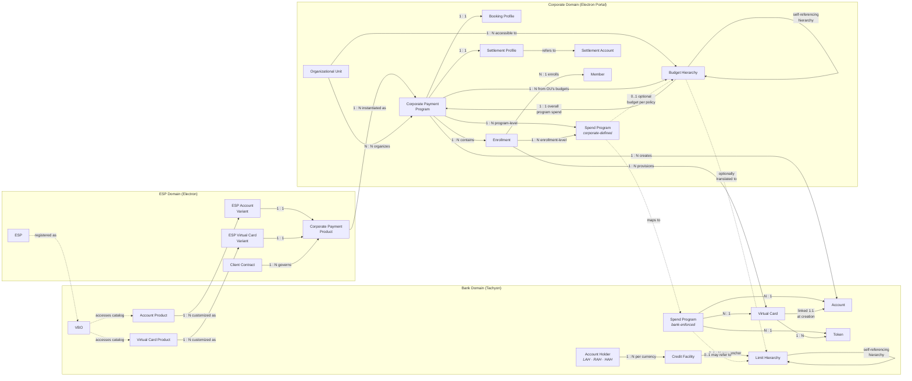
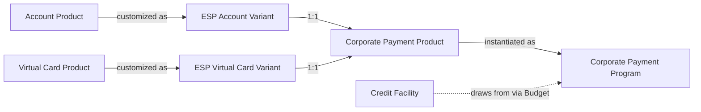

# Corporate Payments by Design — Presentation Outline

**Subtitle:** The first-principles design to solve for corporate concerns  
**Platform:** Tachyon + Electron  
**Audience:** Bank prospects evaluating the platform for corporate payments  
**Tone:** Consultative, domain-authoritative — show how it works and how it translates into data  

---

## Act 1 — The Gap

### Slide 0: Title

**Corporate Payments by Design**

- The first-principles design to solve for Corporate concerns

---

### Slide 1: Possibilities vs Needs

**Banks describe possibilities with virtual cards — and they are genuinely promising. Corporates hear those possibilities and imagine answers to their real questions: budget, authority, attribution, reconciliation. The gap between the promise and the imagined answer is the required evolution.**

---

### Slide 2: The Platform Reality

**The vision of corporate payments is compelling. The platform wasn’t built for it.**

---

### Slide 3: The Semantic Dissonance

**When corporates ask questions and banks answer with card capabilities, both sides are speaking accurately — from different frames.**

| Corporate's Question | Bank's Answer |
|---|---|
| "Our policy is to encourage local procurement. How can I specify my suppliers?" | "Please provide the MID and TID of all your suppliers." |
| "Our policy requires maker and checker for high-value department spends. How can we specify that?" | "You can issue a card for every transaction, after checking whatever needs to be checked." |
| "Every ticket purchased is subject to the project budget, the employee’s location, and their career level." | "You can set limits per card." |
| "Our marketing budget is shared across three regions operating with different currencies. Each region can spend up to their allocation, but the total must not exceed the consolidated budget." | "You can set credit sub-limits per account." |

- The pattern: the corporate asks about business rules, organizational context, and operational workflows. The bank answers with card-level primitives — limits, identifiers, individual cards.
- Neither side is wrong. They are organizing around different concerns.

---

### Slide 4: Five Dimensions of Corporate Need

**The semantic dissonance reveals a pattern. Corporate payment needs span five dimensions — and today's card products answer only the first.**

| Dimension | What the corporate needs | What card products typically provide |
|---|---|---|
| **Payment Execution** | Authorize, clear, settle reliably | Well-answered: networks, schemes, real-time auth |
| **Financial Architecture** | Credit facilities allocated as budgets, tied to organizational purpose, with hierarchical enforcement | Partially answered: credit limits and sub-limits exist, but without budget semantics or OU-awareness |
| **Control Architecture** | Policy cascades, eligibility rules, enrollment workflows, lifecycle governance across programs | Primitively answered: per-card controls exist, but no program-level policy, no inheritance, no lifecycle orchestration |
| **Accounting & Attribution** | Every transaction attributed to GL, cost center, project, client — structured, validated, pushed to ERP | Not answered: reference fields exist but lack structure, validation, and ERP integration |
| **Reconciliation & Settlement** | Automated matching against PO/invoice/booking/contract; consolidated settlement by program | Not answered: transaction data is available but matching, consolidation, and settlement management are left to the corporate |

- The first dimension is table stakes. The other four are where corporate payment programs succeed or fail.
- No corporate CFO evaluates a card program on authorization speed. They evaluate on reconciliation labor, policy leakage, and attribution accuracy.

---

### Slide 5: The Counterparty Multiplier

**The five dimensions do not present uniformly. They vary by the type of counterparty the corporate pays — and the AP landscape has at least seven distinct shapes.**

| Counterparty Type | Payment Pattern | Data Needs | Compliance | Card Acceptance |
|---|---|---|---|---|
| Goods suppliers | PO/invoice-driven, deterministic | L2/L3, three-way match | Trade compliance, tax | Generally high |
| Service providers | Milestone or deliverable-based | SOW reference, project attribution | Contract compliance | Variable |
| Employees | Reimbursable expenses or pre-approved budget-based spend; the actual merchant is not a direct party to the transaction | Receipt, expense category, project/cost center | Expense policy, delegation of authority | High — employee transacts at merchant |
| Contractors | Time/expense-based, recurring | Timesheet linkage, project codes | Labor compliance, 1099 | Low — often ACH preferred |
| SaaS / software vendors | Subscription, renewal-driven | Contract ID, license count | Procurement policy | High — most accept cards |
| Intermediaries / agencies | Pass-through, consolidated | Booking reference, itinerary | Agency agreements, duty of care | High — travel, logistics |
| Government / regulatory | Fee schedules, non-negotiable | Mandate reference, filing ID | Regulatory deadlines | Low — often requires wire/ACH; May move to RTP, FedNow rails |

- Today's card products abstract all of these as "merchants" — a single MCC-classified entity. The corporate sees seven fundamentally different relationships, each with distinct governance requirements. For employees, the merchant isn't even the counterparty — the governance is between the corporate and its employee, not the corporate and the merchant.
- This diversity multiplies the five dimensions: financial architecture for a goods supplier (PO-locked budget) looks nothing like financial architecture for a SaaS vendor (contract-locked renewal budget).
- The archetype discussion (next act) addresses this directly. For now: the problem is not just multi-dimensional — it is multi-dimensional per counterparty type.

---

### Slide 6: The Two-Lens Gap — Hierarchy Is Not the Answer

**The bank's control model is a hierarchy of limits — credit facility, account, card, evaluated along a single path. The corporate's is a coordinate system of concurrent dimensions — budget, policy, authority, attribution, purpose, validity — all evaluated simultaneously. Both are sound.**

**A hierarchy forces a fixed nesting: does Department contain Project, or Project contain Department? Every corporate answers differently — and the answer changes when they restructure. The dimensions cannot be nested. They must remain independent.**

**Hierarchy is not the answer.**

- Bank's organizing principle: credit facility → account → card → MCC/amount/velocity controls → interchange → lifecycle
- Corporate's organizing principle: department → project → cost center → budget/policy/approval → GL/project/client codes → reconciliation → DPO
- The structural mismatches: org structure ≠ account structure; budget ≠ credit limit; GL fields ≠ transaction data; workflow ≠ card controls; reconciliation ≠ data availability
- This is not a criticism. Banks optimize for what they must: credit risk, regulatory compliance, network settlement, and treasury income (float, interchange, facility interest). Corporates optimize for what they must: operational governance, financial attribution, audit readiness, and payment cost and process efficiency. The hierarchy is sound for credit risk. It is not the answer for corporate governance.
- Why hierarchy fails structurally:
  - A hierarchy requires a fixed ordering of dimensions. Corporate governance dimensions are enterprise-specific — Company A organizes by region → business unit → project; Company B by department → client → cost center. No universal ordering exists.
  - The dimensions are not static. Enterprises restructure, add regulatory dimensions, shift from project-based to product-based models. Each change would require rebuilding the hierarchy — not reconfiguring it.
  - Different governance questions within the same enterprise require different traversal orders simultaneously. "What did Department X spend across all projects?" and "What did Project Alpha cost across all departments?" need different primary axes. A hierarchy answers one efficiently. A coordinate system answers all — because the dimensions are independent.
- The gap is architectural — not a missing feature, not a configuration oversight. It requires a design that keeps the bank's hierarchy for credit risk and supports the corporate's coordinate system for governance — without collapsing one into the other.

---

### Slide 7: The Promise Is Captive to the Platform

**The compelling possibility of automated corporate payments is captive to the platform that delivers it:**

| Constraint | What It Means |
|---|---|
| **Batch-native** | Real-time authorization events, lifecycle notifications, and cooperative callbacks require middleware the platform wasn’t designed for |
| **Rigid hierarchies** | The platform evaluates a hierarchy of limits along a single path; it cannot evaluate the corporate's coordinate system of concurrent dimensions — no multi-segment budgets, no category-dependent policy cascade, no concurrent dimensional enforcement at authorization |
| **Limiting data structures** | Rigid data fields that cannot carry corporate context through the transaction lifecycle; refunds and credits not attributed back to original booking profile |
| **Closed authorization** | The processor decides alone; no hook for ESP or corporate participation within network timeouts; no posting enrichment at clearing |
| **Lack of token awareness** | Token lifecycle not coordinated with card lifecycle across renewals and replacements; authentication limited across CNP/CP scenarios; PIN delivery confined to legacy channels; FRM has credential lifecycle blind spots |
| **Throughput constraints** | Not designed for high-frequency, API-triggered, single-use issuance at scale; card lifecycle operations designed for call-center workflows, not programmatic bulk operations |
| **Inaccessible for extension** | No event subscriptions, no webhook-driven integration, no API-driven lifecycle customization; the platform is closed to the ecosystem that needs to build on it |

---

### Slide 8: The Foundation and The Bridge

**This is what we set out to solve. The foundation: a processing platform purpose-built for corporate spend governance, designed for the possibilities of this decade. The bridge: an architecture that answers the corporate's actual questions across all five dimensions, across all counterparty types, while preserving the bank's risk and compliance model.**

- The foundation requires a platform that is event-native, hierarchy-aware, contextually rich, on-demand, cooperatively authorized, token-aware, throughput-ready, and extensible — the inverse of every constraint we just identified
- It must also be architected for the evolving payment landscape: credentials beyond cards, authentication beyond static mechanisms, rails and clearing beyond card networks, and digital currencies — without re-platforming for each
- The bridge requires three things: (1) a product model that encodes corporate governance patterns, not just payment capabilities; (2) a clean separation between the bank's domain (risk, credit, compliance, treasury income) and the corporate's domain (governance, attribution, reconciliation); (3) an intermediary that translates between them without blurring boundaries
- That is the three-domain model — Bank, ESP, Corporate, each owning what it understands best — running on a processing platform designed from the ground up for these requirements
- What follows: the foundation — the payment platform, its capabilities, and how it resolves the constraints we identified. Then the bridge — the three-domain architecture, Spend Archetypes that organize the counterparty diversity into actionable product patterns, a Spend Mandate framework that captures all five dimensions, and the entity architecture that connects them

---

## Act 2 — The Framework

### Slide 9: Spend Archetypes

**Corporate payments organize into Spend Archetypes — each with a distinct control model, card lifecycle, enrollment pattern, and reconciliation approach.**

| Dimension | Supplier Payments | Employee & Dept Spend | Travel & Booking | Central Recurring |
|---|---|---|---|---|
| Control model | Tight, deterministic, PO/invoice match | Policy-bounded, discretionary within limits | Booking-locked or agency-managed | Contract-aligned, merchant-locked |
| Card lifecycle | Single-use per invoice | Persistent, renewable | Per-booking or lodge (long-lived) | Long-lived, merchant-locked |
| Enrollment | Payee (supplier) | Payer (employee) | Traveler or travel desk | Central administrator |
| Reconciliation | PO/invoice match (L2/L3) | Expense report, receipt matching | Itinerary/booking match | Contract/subscription match |

- Archetypes are not product names — they are the organizing principle for how corporates govern spend. Each defines a distinct pattern of control, lifecycle, enrollment, and reconciliation.
- Supplier: single-use card issued per approved invoice/PO, locked to exact amount and merchant, closed after clearing; ERP triggers issuance; L2/L3 data critical for three-way match
- Employee: persistent card per employee, MCC allowlists, per-transaction and monthly velocity limits; self-enrollment or manager-initiated; expense reports drive reconciliation
- Travel: lodge card to travel agency (long-lived, shared) or per-booking virtual card; booking system triggers issuance; itinerary data for reconciliation
- Central Recurring: one card per merchant/contract, merchant-locked, renewal-aligned lifecycle; centrally administered; contract terms drive reconciliation
- "Embedded" (API-triggered issuance) is a delivery mechanism, not an archetype — it can serve any of the four

---

### Slide 10: Spend Mandates — The Authorization Envelope

**Every corporate payment must answer a chain of questions: Why was this allowed? Who authorized it? Whose budget? Which rules? How is it booked? Who is accountable? The Spend Mandate is the framework that holds those answers.**

| Component | What it governs | Example (Meridian) |
|---|---|---|
| Purpose | Why this spend exists | "Client Implementation Travel" for Bank X |
| Authority | Who may authorize | Engineering VP for department spend |
| Budget Source | Which budget funds it | Procurement Operations — $30M |
| Policy Scope | What categories are allowed | AMC-Logistics, AMC-Cloud only |
| Limits | Per-transaction, velocity, aggregate | $5,000 per booking, $35,000/quarter |
| Attribution | How spend is booked | Project BNK-X-2026, GL 6200-Travel |
| Validity | When the mandate is active | Apr–Jun 2026 |
| Exceptions | What happens outside bounds | Escalation to CFO, manual review |

- No single system entity called "Spend Mandate" — it is realized across Budget, Spend Policy, Booking Profile, Card Profile, and Program configuration

---

### Slide 11: Governance: Constraints and Decisions

**Governance is not enforcement alone. It requires constraints that the platform enforces automatically, and decisions — structured and unstructured.**

- **Constraints** — evaluated at authorization in real time:
  - Budget capacity (hierarchy-aware)
  - Spend Policy (MCC/AMC, amount, currency, geography, velocity)
  - Limits (per-transaction, daily, monthly, lifetime)
  - The bank evaluates these on every transaction — no exception

- **Structured Decisions** — resolved before or after authorization through rules and configuration:
  - Purpose: which program the card belongs to
  - Participants: who is eligible, who is enrolled, who holds the credential
  - Attribution: booking profile rules determine GL/cost center/project assignment
  - Validity: program and card validity windows

- **Unstructured Decisions** — require human deliberation; the platform provides deliberation control:
  - Authority: who approved the enrollment and card issuance; escalation when authority is contested or delegated
  - Exceptions: escalation workflows, approval chains, post-facto justification

- The design challenge: enforce constraints automatically, enforce structured decision rules through configuration, and provide deliberation control for unstructured decisions

---

### Slide 12: The Three Domains

**The bank organizes around risk and treasury income. The corporate organizes around governance and payment cost reduction. Neither can collapse into the other. The ESP exists to translate between them.**

- **Bank**: underwrites risk, authorizes transactions, enforces compliance, settles with networks
- **ESP**: translates bank capabilities into corporate solutions — product design, onboarding, billing, operating layer
- **Corporate**: configures programs, defines budgets and policies, enrolls members, operates day-to-day governance

- The architecture enforces clean separation:
  - **Own vocabulary** — each domain operates in its native semantics
  - **Own control** — each domain governs its own decisions
  - **Own pace** — each domain evolves independently
  - **Own scope** — banking stays within the regulatory perimeter; corporate stays outside it

- Separation does not mean isolation. The full control matrix is present at every authorization — through structured entities, anti-corruption translation, and cooperative authorization. Designing the mechanisms that achieve this under the constraints of network speed, security, and regulation is the platform's core architectural value.

---

### Slide 13: The Economics of Separation

**The framework enables a partnership model. The bank provides BaaS. The ESP owns product design and corporate engagement. The corporate — their shared client — contributes and captures value within this model.**

- A bank can play the ESP role. But each spend archetype, for each segment of corporate clients, demands distinct engagement expertise — product design, onboarding, support, billing. What a bank cannot or chooses not to focus on, a partner can own. The bank provides Banking-as-a-Service; the partner operates as the ESP (Enterprise Service Provider). The corporate operates programs and drives the economics for both.

| Stakeholder | Value Added | Value Realized |
|---|---|---|
| **Bank** | Credit Facilities, payment authorization, compliance enforcement, network settlement | Float income, customer retention, network incentives, network interchange, account/card fees, regulatory compliance |
| **ESP** | Product design per archetype, corporate onboarding, billing, operational layer, Client Support & Servicing | Revenue share from bank (float, interchange, fees), fees and charges from corporate, portfolio scale across 40+ corporates |
| **Corporate** | Payment volume, payer-side ecosystem expansion, program configuration, budget and policy definition, member enrollment, day-to-day governance | Spend governance and policy enforcement, AP process automation, rebates, rewards, DPO extension, reconciliation labor reduction |
| **Members** | Payee-side ecosystem expansion, transaction volume, sales/invoice data | Cashflow improvement, negotiated MDRs (supplier), accelerated receivables (supplier), expense simplification (employee), travel convenience |

- The economics work because the separation works. The bank earns from infrastructure. The ESP earns from engagement depth. The corporate gains governance capabilities neither could deliver alone.

---

## Act 3 — The System Design

### Slide 14: Systems and Bounded Contexts

**Each domain operates through purpose-built systems. Understanding what runs where is essential to understanding the architecture.**

**Tachyon (Bank) — 14 subsystems of relevance:**
- Customer Lifecycle Management — HAH (Headless Account Holder: quasi-customer, no KYB/KYC), LAH (Legal Account Holder: legal person, KYB), RAH (Real Account Holder: real person, KYC)
- Product Lifecycle Management — Account Product Families, Virtual Card Product Families; catalog creation, versioning, redistributability
- BaaS Management — manages Virtual Banking Operators (VBOs); ESP onboarding, catalog access grants, partner agreements
- Credit Management — Credit Facilities, Limit Hierarchy, Revolving and Non-revolving Credit Accounts, Secured Credit Accounts
- Accounting System — Accounting, Fees, Interest, Billing, Statements (account-level financial operations)
- Payments Switch — real-time authorization routing, network connectivity, scheme message processing
- Payments Hub — clearing, settlement, posting; end-to-end payment lifecycle orchestration
- Rewards System — Reward Programs, Rebate Programs at Account and Statement level (product-level rewards)
- FRM (Fraud and Risk Management) — real-time fraud scoring, transaction monitoring, risk decisioning
- Disputes Management — chargeback processing, representment, dispute case lifecycle
- Consumer IAM — cardholder/member authentication, credential management
- Enterprise IAM — bank staff, ESP staff, corporate admin authentication and access control
- Notification — bank-originated notifications (regulatory, fraud, lifecycle events); non-suppressible alerts
- Operations Hub — bank operations console for monitoring, exception handling, servicing
- Data Mart — bank-side analytical data store for reporting, risk analytics, regulatory reporting

**Electron (ESP) — 7 subsystems of relevance:**
- Client Contract Management — Corporate and Contract lifecycle; relationship-level terms, scope, duration, renewal
- Payment Product Management System — Account Variants, Virtual Card Variants, CPP assembly; component programs (fees, interest, rewards, rebates, notifications, spend, auth, tokenization, 3DS, card fees)
- Payment Program Management System — Program configuration, Spend Policy, Booking/Settlement Profiles, eligibility rules, enrollment workflows, member and card management
- Billing and Collections System — Consolidated Invoices, Relationship-level Rebates, Rewards, Volume Commitments, Auto Debit
- Bank Gateway — Anti-corruption and Translation layer between Electron and Tachyon; maps ESP domain concepts to bank domain entities and vice versa
- Corporate Data Mart — comprehensive data regarding all programs, invoices, transactions, members; Data Extracts and Reports for corporates
- ESP Data Mart — analytics on Contracts, Products, and Programs for the ESP's own portfolio management

**Corporate Domain** — spans multiple system types interacting with the Electron Corporate Portal:
- Electron Corporate Portal — Organization Management (OU hierarchy, legal entities), Program Administration (Programs, Spend Policy, Booking/Settlement Profiles), Member & Enrollment Management (members, eligibility, card issuance), Financial Control (budgets, settlement accounts), Operations (reconciliation, disputes)
- AP Systems (e.g., SAP Ariba, Oracle AP, Coupa) — supplier payment automation, PO/invoice matching, card issuance triggers
- AR Systems — receivables matching, payment application, customer payment tracking
- Expense Management Systems (e.g., Concur, Navan, Brex) — employee spend capture, receipt matching, policy compliance
- Travel Booking Systems (e.g., Amex GBT, CWT, Navan) — lodge card integration, booking-linked card issuance
- ERP / GL Systems (e.g., SAP, Oracle, NetSuite) — GL posting, cost center attribution, financial consolidation
- Treasury Systems (e.g., Kyriba, FIS) — settlement account management, cash positioning, FX management
- IAM / Directory Services (e.g., Okta, Azure AD, Ping) — member and user provisioning, role assignment, authentication for ESP and bank portal access, SSO and MFA enforcement
- LoB Applications — department-specific or vertical-specific applications that consume card data or trigger spend events

---

### Slide 15: Context Boundaries and Integration Points

**The systems communicate across well-defined boundaries. No domain reaches into another's internals.**

- **Bank ↔ ESP** (mediated through the Bank Gateway — Electron's anti-corruption and translation layer)
  - Product redistribution: bank product catalog (Product Lifecycle Management) → ESP variants (Payment Product Management)
  - Authorization callbacks: Payments Switch → Bank Gateway → ESP/Corporate participation
  - Rewards/rebate split: Rewards System (account/statement level, Tachyon) vs Billing and Collections (relationship-level rebates, Electron)
  - Data flow: Tachyon Data Mart → Bank Gateway → Corporate Data Mart / ESP Data Mart

- **ESP ↔ Corporate Portal**
  - Program provisioning: ESP creates products, corporate configures programs
  - Enrollment workflows: eligibility rules, member enrollment, card issuance
  - Billing and master statements: ESP-generated, per legal entity
  - Notification customization: ESP templates, corporate overrides, card-level preferences

- **Bank ↔ Corporate (indirect, mediated through ESP)**
  - CF utilization and budget enforcement at authorization
  - Posting data flow: L1/L2/L3 transaction data
  - Regulatory and fraud notifications: non-suppressible, bank-originated
  - Standing repayment instructions: auto-debit from designated settlement accounts
  - Settlement account registration and management

- **Corporate Portal ↔ Corporate Systems**
  - Card issuance triggered from PO/invoice (AP systems)
  - Posting data pushed to GL (ERP)
  - Reconciliation matching (AP/AR systems)
  - Expense report integration (Expense Management)
  - Booking-linked issuance (Travel Booking systems)
  - Settlement positioning (Treasury)
  - Member/user provisioning and authentication (IAM/Directory)
  - Spend event triggers (LoB Applications)

---

### Slide 16: Entity Model Across Domains

**The entities across all three domains and how they relate.**

- Budget Hierarchy in Corporate Domain optionally translates to Limit Hierarchy in Bank Domain; a Limit Hierarchy need not originate from a Credit Facility
- Spend Policy cascade: program-level applies to all enrollments; enrollment-level translates to per-Virtual Card (and per-Token) Spend Policies in Bank Domain
- Budgets are made accessible to OUs; a Program can only draw from budgets of the OU it is associated with

---

### Slide 17: The Derivation Chain

**How bank products become ESP variants become corporate programs — the derivation chain.**

- Bank retains: credit/AML/sanctions/compliance, delinquency, base fees, scheme obligations
- ESP adds: branding, component programs (fees, rewards, notifications), commercial terms, onboarding
- Corporate configures: budget allocation, spend policy tightening, booking rules, eligibility, enrollment, settlement

---

### Slide 18: Hierarchies — Corporate's and ESP's View

**The corporate sees multiple interlocking hierarchies. The ESP correlates them.**

- **Credit hierarchy:** Corporate → LAH → Credit Facility → Budget/Limit Hierarchy → Program → Account → Cards
- **Organizational hierarchy:** Corporate → OU → Program → Account → Cards
- **Settlement hierarchy:** Corporate → Settlement Accounts → Programs → Account → Cards

Each hierarchy answers a different question:
- Credit: "How much can we spend?" (risk-anchored, bank-enforced)
- Organizational: "Who owns this spend?" (governance-anchored, corporate-defined)
- Settlement: "How do we pay for it?" (treasury-anchored, corporate-operated)

Entity system-of-residence: Credit Facility in Tachyon, Budget in Electron, OU in Electron, Settlement Account external — correlated at the Program level

---

### Slide 19: Hierarchies — Bank's View

**The bank sees a simpler, risk-anchored hierarchy.**

- LAH → Credit Facility → Limit Hierarchy → Account → Cards

The bank does not see:
- Departments, cost centers, or project codes
- Budget allocations or OU trees
- Settlement account preferences
- Member roles or enrollment logic

The bank enforces:
- Credit Facility capacity
- Budget hierarchy (utilization at authorization, all ancestors checked)
- Spend Policy (as defined by the effective policy cascade)
- Non-overridable controls (AML, sanctions, fraud, delinquency, NPA)

This separation is by design — the bank focuses on risk and compliance; the corporate focuses on governance and operations

---

## Act 4 — Program Lifecycle and Extensibility

### Slide 20: Large-Scale Virtual Card Program Lifecycle — Overview

**The lifecycle spans contracting, corporate account configuration, program setup, operations, and financial management — each phase involves distinct actors and system interactions.**

**Contracting & Onboarding** (ESP-driven)

1. ESP initiates a Client Contract for a Corporate
2. ESP identifies and adds Legal Entities that will utilize corporate payment services under this contract
3. ESP collects underwriting information required by bank's credit team
4. Credit Facility applications submitted per LAH — each LAH may apply for multiple CFs with distinct underwriting document sets
5. Bank completes underwriting, issues Credit Facilities against the applications
6. Bank notifies the LAH billing contacts about the underwriting decision
7. ESP assigns Corporate Payment Products across Spend Archetypes per Corporate's requirements in the Client Contract
8. ESP configures relationship-level commercial terms — Rebates and Volume Commitments — against the Client Contract
9. ESP provisions access credentials to corporate users as per the contract for the Corporate Portal

**Corporate Account Configuration** (Corporate Admin-driven, via Electron Portal)

10. Corporate admins configure the corporate account — add users, set up OUs reflecting policy enforcement needs
11. Member provisioning configured through system integrations — Active Directory for employees, SAP for vendors/suppliers, SCIM for identity provisioning, SFTP for bulk import from non-integrated systems, Member Management API for programmatic access
12. Budgets created against Credit Facilities and distributed across OUs; ERP-defined budgets imported through integration — budget hierarchy can reside independent of the CF hierarchy
13. Payable Accounts configured — multiple accounts at various banks registered for receiving invoices and making repayments; each payable account maps to a GL in ERP
14. Ongoing maintenance of OU, Budget, Member, and Payable Account master data performed through API or SFTP integrations

**Program Setup** (Corporate Admin-driven, via Electron Portal)

15. Admin initiates a Program for a specific Spend Archetype, selecting one of the Corporate Payment Products offered by ESP for that archetype; links to Credit Facility, assigns to OU
16. Spend Programs configured under the Corporate Payment Program — program-level Spend Programs define default controls (AMC, amount, currency, geography, velocity); enrollment-level Spend Programs allow further tightening per member or member group
17. Booking Profile configured — GL account, cost center, project/client code, capex/opex classification; static defaults or dynamic rules based on transaction attributes
18. Settlement Profile configured — linked to a registered Payable Account, billing entity, repayment method and timing
19. Eligibility rules defined (member type, OU affiliation, approval requirements)
20. Members enrolled — depending on Spend Archetype, the member may be a recognized party to the corporate (employee, supplier, contractor, client) or the corporate itself (central recurring payments); enrollment performed through API (integrated into ERP or enterprise applications) or SFTP
21. Enrollment triggers virtual card issuance; depending on archetype, the card may be returned immediately (API response), dispatched digitally (secured email/portal), or dispatched physically; card carries tags set at enrollment (PO number, invoice number, cost center, project code)
22. Enrollment-level Spend Programs configured where member-specific controls differ from program defaults — e.g., for supplier payments, the enrollment-time Spend Program specifies the exact amount the card can be used for
23. Card dispatch notification includes relevant context for the member — e.g., for supplier payments: PO number, invoice number, authorized amount in the secured email to the supplier

**Operations** (transaction-driven, concurrent)

24. Transactions authorized — interceptor callbacks for ESP/corporate participation
25. Corporate Portal reflects all transactions (authorized and cleared) against virtual card and program in near-real-time
26. Notifications delivered — authorizations, clearances, card expiry, closure
27. Fraud notifications received (bank-originated, non-suppressible)
28. Card lifecycle management — suspend, reactivate, close, replace, modify limits

**Financial** (cycle-driven)

29. Bank generates program statement per billing cycle — includes rebates and rewards computation; invoices net value
30. Statement received in corporate's Payable Account; auto-debited via ACH or intra-bank rails
31. ESP invoices corporate for its services per Client Contract billing date — computes relationship-level rewards, rebates, and volume commitments; invoices net; ESP has access to all program postings and bank statements; ESP and bank billing cycles are structurally independent
32. Reconciliation: cleared postings available to corporate systems in near-real-time (step 25); bank provides rich data extract with each statement; ESP provides data through a data mart; corporate uses any combination for reconciliation
33. Disputes: corporate can raise a dispute against any posting at any time from the Corporate Portal
34. Single-use cards deemed closed after use and grace period; card status visible in Corporate Portal

---

### Slide 21: Contracting, Onboarding, and Corporate Account Configuration

**From Client Contract to a fully configured corporate account ready for program creation.**

**Contracting & Onboarding** (ESP-driven, steps 1-9)
- ESP initiates Client Contract → identifies Legal Entities → collects underwriting information
- CF applications submitted per LAH (each LAH may apply for multiple CFs with distinct underwriting document sets)
- Bank completes underwriting, issues CFs, notifies LAH billing contacts
- ESP assigns Corporate Payment Products across Spend Archetypes per corporate's requirements
- ESP configures relationship-level commercial terms (Rebates, Volume Commitments) against the Client Contract
- ESP provisions corporate portal access credentials

**Corporate Account Configuration** (Corporate Admin-driven, steps 10-14)
- Admins set up OUs reflecting policy enforcement needs, add users
- Member provisioning through system integrations: Active Directory (employees), SAP (vendors/suppliers), SCIM (identity provisioning), SFTP (bulk import), Member Management API
- Budgets created against Credit Facilities and distributed across OUs; ERP-defined budgets imported — budget hierarchy independent of CF hierarchy
- Payable Accounts configured: multiple accounts at various banks for receiving invoices and making repayments; each maps to a GL in ERP
- Ongoing maintenance of OU, Budget, Member, and Payable Account master data through API or SFTP

---

### Slide 22: Program Setup and Enrollment

**From program creation to first card in a member's hands.**

**Program Creation** (steps 15-18)
- Admin initiates a Program for a specific Spend Archetype, selecting a Corporate Payment Product offered by ESP; links to Credit Facility, assigns to OU
- Spend Programs configured using Purchase Categories — program-level Spend Programs define default controls; each Spend Program must reference a CF-derived Budget (bank credit risk protection) and may additionally reference Spend Program Budgets or static limits for corporate policy enforcement
- For Spend Programs tied to ERP-imported Budgets, the Spend Program can designate that budget as the booking destination (booking-limit); highest-precedence booking-limit Spend Program determines posting attribution; non-booking Spend Programs are concurrent usage gates
- Booking Profile configured: GL account, cost center, project/client code, capex/opex; static defaults or dynamic rules
- Settlement Profile configured: linked to a registered Payable Account, billing entity, repayment method and timing

**Enrollment** (steps 19-23)
- Eligibility rules define who may be enrolled (member type, OU affiliation, approval requirements)
- Members enrolled via API (ERP/enterprise integration) or SFTP — member may be a recognized party (employee, supplier, contractor, client) or the corporate itself (central recurring)
- Enrollment triggers virtual card issuance — card returned immediately (API response), dispatched digitally (secured email/portal), or dispatched physically depending on archetype and ESP card variant configuration
- Card carries tags set at enrollment: PO number, invoice number, cost center, project code
- Enrollment-level Spend Programs configured where member-specific controls differ from program defaults — e.g., for supplier payments, the enrollment-time Spend Program specifies the exact authorized amount
- Card dispatch notification includes relevant context — e.g., supplier receives PO number, invoice number, authorized amount in the secured email

---

### Slide 23: Operations

**Day-to-day transaction processing, monitoring, and cooperative authorization.**

**Authorization and Cooperative Authorization** (steps 24-25)
- Transactions authorized through bank's check cascade: card active, account active, CF capacity, budget capacity (ancestor chain), Posting Category → Spend Program controls, non-overridable controls (AML, sanctions, fraud, regulatory holds)
- Corporate can configure a cooperative authorization endpoint per payment program — bank routes callback to corporate's system during authorization
- Supplier payment example: supplier presents card with L2 data including invoice number → corporate's endpoint verifies invoice is approved in AP system, amount matches approved value → positive response adds approval data to authorization message, posting continues through remaining checks → negative response captures reason, authorization declined
- Bank retains final authority — even after positive cooperative authorization response, non-overridable controls still apply
- Posting Enrichment: at clearing, corporate systems can enrich posting data with updated attribution (project codes, GL overrides, cost center reassignment) before final booking

**Visibility and Monitoring** (steps 25-27)
- Corporate Portal reflects all transactions (authorized and cleared) against virtual card and program in near-real-time
- Notifications delivered: authorization approvals/declines, clearance confirmations, card expiry, closure
- Fraud notifications: bank-originated, non-suppressible; corporate receives alerts for member communication
- Budget monitoring: threshold-based alerts (e.g., 75%, 90% utilization) at budget and program level

**Card Lifecycle Management** (step 28)
- Suspend, reactivate, close, replace, modify limits — within program policy bounds
- Card replacement preserves enrollment, Spend Programs, and tags; new card inherits same controls
- Single-use cards automatically closed after use and grace period

---

### Slide 24: Financial Phase

**Billing, settlement, reconciliation, and dispute resolution.**

**Bank Billing** (steps 29-30)
- Bank generates program statement per billing cycle (configured in Settlement Profile) — includes computation of rebates and rewards; invoices the net value
- Statement received in corporate's registered Payable Account; auto-debited via ACH or intra-bank rails as applicable
- For multi-account programs (e.g., employee spend with 200+ accounts), bank generates a consolidated master statement

**ESP Billing** (step 31)
- ESP invoices corporate for its services per Client Contract billing date — separate from bank's program billing cycle
- ESP computes relationship-level rewards, rebates, and volume commitments; invoices the net
- ESP has access to all program postings and bank statements sent to the corporate
- When bank and ESP are the same entity, cycles can align — but corporates may configure different billing cycles per program, causing divergence

**Reconciliation** (step 32)
- Cleared postings available to corporate systems in near-real-time (step 25) — corporate systems may already be updated before statement arrives
- Bank provides a rich data extract with each statement containing all fields to support reconciliation
- ESP provides the same data through a data mart
- Corporate can use any combination: real-time postings, bank statement data extract, or ESP data mart
- Reconciliation targets vary by archetype: PO/invoice match (supplier), expense reports (employee), itineraries (travel), contracts (recurring)

**Disputes and Card Closure** (steps 33-34)
- Corporate can raise a dispute against any posting at any time from the Corporate Portal; credits follow original booking attribution
- Single-use cards deemed closed after use and grace period; all card statuses visible in Corporate Portal

---

---

## Appendix — Entity Reference Tables

*These tables support the ER diagram in Slide 16. Use as handout or reference material during deep dives.*

### Bank Domain Entities (Tachyon)

| Entity | Context | Description |
|---|---|---|
| Account Holder — HAH | CLM | Headless Account Holder; quasi-customer, no KYB/KYC required |
| Account Holder — LAH | CLM | Legal Account Holder; legal person subject to KYB |
| Account Holder — RAH | CLM | Real Account Holder; real person subject to KYC |
| Credit Facility | Credit & Risk | Per legal entity, per currency; bank's risk exposure; one facility per LAH per currency |
| Limit Hierarchy | Credit & Risk | Hierarchical limit structure; may be anchored to a Credit Facility but need not be |
| Account Product | Product Catalog | Billing cycle, delinquency controls, base fees, single currency; organized as Product Family → Product |
| Virtual Card Product | Product Catalog | Scheme, BIN ranges, settlement/dispute rules; organized as Product Family → Product |
| VBO | Partner Management | Virtual Bank Officer; partner authorized to resell/distribute bank products; every ESP is a VBO of the bank |
| Account | Account Management | Instantiation of an Account Product; linked to Credit Facility |
| Virtual Card | Card Management | Linked to an Account at creation; may have multiple Tokens |
| Token | Card Management | Tokenized representation of a Virtual Card; Spend Policies can be associated per Token |
| Spend Policy | Authorization | Bank-enforced; associated with Account, Virtual Card, or Token; may refer to Limit Hierarchy |

### ESP Domain Entities (Electron)

| Entity | Context | Description |
|---|---|---|
| ESP | Partner Identity | The Enterprise Service Provider; registered as a VBO in the Bank Domain |
| ESP Account Variant | Product Design | Customizes a bank Account Product with component programs: fees, interest, statement, rewards, rebates, notifications |
| ESP Virtual Card Variant | Product Design | Customizes a bank Virtual Card Product with component programs: embossing, spend policy, auth rules, tokenization, 3DS, card fees, notifications |
| Corporate Payment Product | Product Design | Exactly one Account Variant + one Virtual Card Variant = one CPP; tagged to one Spend Archetype; carries baseline spend policy, card profile template, product-level commercial terms |
| Client Contract | Client Management | ESP–corporate relationship: legal provenance, archetype scope, relationship-level commercial terms, duration/renewal |

### Corporate Domain Entities (Electron Portal)

| Entity | Context | Description |
|---|---|---|
| Organizational Unit (OU) | Organization Management | Hierarchical trees: Legal Entities, Business Units, Geographic Units, Functional Units, Customer Segments |
| Corporate Payment Program | Program Administration | Operational instance of a CPP: authority, audience, governance, spend profile, booking profile, settlement profile |
| Budget Hierarchy | Financial Control | Hierarchical; made accessible to OUs; programs draw from OU's budgets; optionally translated to Limit Hierarchy in Bank Domain |
| Spend Policy | Governance | Corporate-defined; program-level and enrollment-level; maps to bank-enforced Spend Policy; may have optional budget |
| Booking Profile | Attribution | GL, cost center, project, client attribution rules |
| Settlement Profile | Financial Control | Refers to Settlement Account; defines auto-sweep or manual settlement |
| Settlement Account | Financial Control | External bank account for corporate settlement |
| Member | Member & Enrollment | Participant in a program: Employee, Supplier, Contractor, Client |
| Enrollment | Member & Enrollment | Association of member to program + card provisioning; enrollment-level Spend Policies translate to per-Virtual Card policies in Bank Domain |
